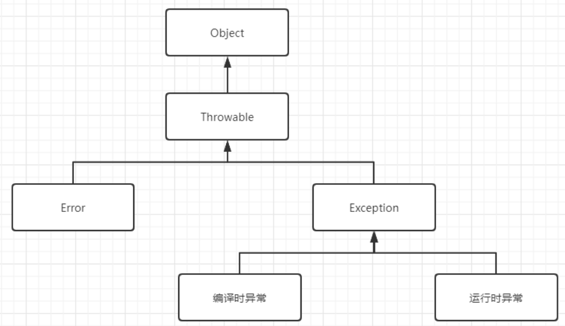
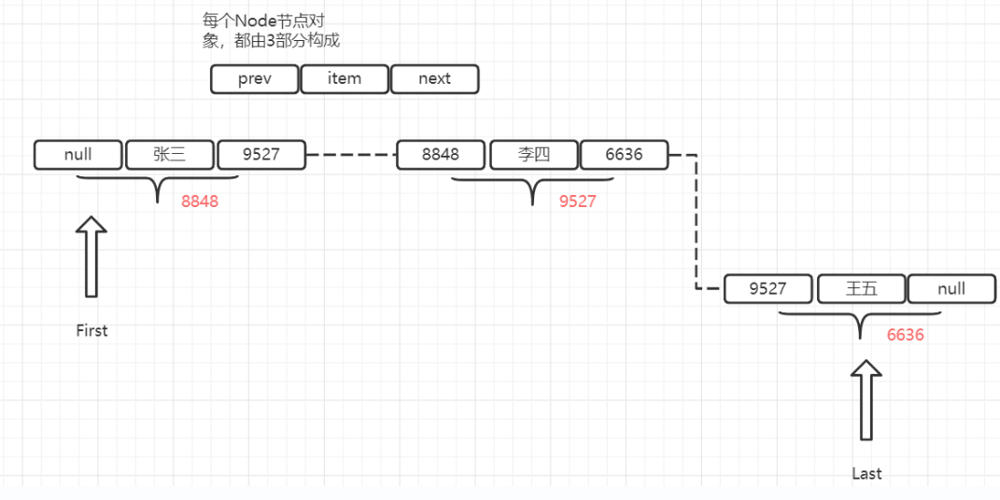

所有的类都是引用类型

一个对象可以有多个引用, 当对象不存在引用时, 会被GC(垃圾回收器)回收销毁其内存空间

将一个数组变量指向另一个数组变量时, 需要两个数组的类型相兼容

Java中没有从底层实现真正的多维数组, 

例如:在Java里面的二维数组本质还是一维数组, 其数组元素储存引用变量, 引用变量指向另外的一维数组

如何定义多维数组: 

```java
type[][] arrName;
```

初始化

```java
arrName = new type[length][]
```

上述语句实际上相当于初始化了一个一维数组, 该一维数组的长度为length, 其数组元素为引用类型, 被系统自动初始化赋值为null


> 注意上图中定义了一个元素为对象的数组, 其数值在内存的存储方式如图所示

```java
a = new int[4][];
```


> 上图中该二维数组进行了(一维)初始化, 其堆内存存储方式跟一维数组非常类似


> 上图显示了二维数组对其数组元素进行了(二维)初始化

```java
b = new int[3][4];
```


> Java里面的三维数组也是一维数组, 其数组元素是二维数组, 二维数组里面的数组元素是一维数组, 所以Java多维数组的本质都是一维数组


# Array(数组)

在Array类里面的static修饰的方法可以直接调用来操作数组

例如:

```java
int binarySearch(type[] a, type key) 
```

可以用二分法在a数组中查找key, 返回其出现过的索引值 由于二分法的要求,a数组中的元素必须是从小到大排序才能正确查找 如果不包含则返回一个负数

```java
int binarySearch(type[] a, int formIndex, int toIndex, type key)
```

与前一个方法类似, 但是搜索范围限制在 formIndex到toIndex里面

```java
type[] copyOf(type[] originalArray, int length)
```

将originalArray数组复制为length长度的新数组

```java
type[] copyOfRange(type[]originalArryay, int form, int to)
```

与前方法类似, 但是将复制范围限制在form到to的索引范围内

```java
boolean equals(type[] a,type[] a2)
```

如果两个数组的长度和数组元素一一对应相同,则返回true 否则返回false

```java
void fill(type[] a,type value)
```

将a数组中的元素都赋值为value(注意这里的value需要是type类型的具体值)

```java
void fill(type[] a,int formIndex,int toIndex,type value)
```

与上一方法类似, 但是仅仅将索引范围内的元素赋值为value

```java
void sort(type[] a)
```

对a数组中的数组元素进行排序

```java
void sort(type[] a, int formIndex, int toIndex)
```

与上一方法类似,但是仅对范围内的元素进行操作

```java
String toString(type[] a)
```

将数组的元素按顺序拼接为字符串并返回, 每个元素中间用逗号和空格进行分割


在Java8中, 对Array类的功能进行了增强, 添加了新的工具方法(这些方法支持利用CPU的并发处理性能)

```java
void parallelSort(type[] a)
```

与sort方法类似, 但是增加了对并发运算的支持

> 用parallel开头的方法都表示该方法增加了对并行计算的支持

# 类(class)

类是一种特殊的数据类型, 在Java里面使用类定义的变量都是引用变量(全局变量)

类用于描述具有相同特征(相似属性)的某一类对象

对象是类的实例

在Java中对象是通过调用对应类的构造器类创建的

> 面向对象三大特征: 封装 继承 多态

Java提供了三种访问控制修饰符来实现封装

private protected public

extends关键字来实现继承

通过继承, 子类可以继承父类中的成员变量(类中方法外的变量)和方法

访问控制允许的情况下, 子类实例(对象)可以直接调用父类中方法

> 继承是实现类复用的重要手段, 类的复用也可以通过组合关系来实现 

```java
Father ft = new Child();
```

上述代码将子类的对象赋值给了父类变量, 使得该变量具有了多态性

> 如果是用组合关系来实现复用, 无法这样子来实现多态
>
> 灵活性差

Java中通过构造器来对类的实例进行初始化, 构造器支持重载

如果多个重载的构造器包含相同的代码, 可以考虑将代码块放入类的初始化代码块中

> 类的初始化代码块的执行会早于构造器

**当一个子类被初始化时, 系统会自动初始化它的所有父类**


# 类和对象

在Java中, 类是一种引用变量

面向对象程序设计的重要概念: 类 对象

> 对象是类的实例 类是对象的抽象

类的修饰符有 public final abstract, 也可以不加修饰符

类包含三种最常见的成员: 构造器 成员变量 方法

如果一个类不包含任何成员, 则其为空类

static修饰的成员不能访问非static成员, 只能访问其他用static修饰的成员

Java中通过new 关键字来调用对应类的构造器, 构造器会返回该类的一个实例

构造器是类创建对象的默认途径

没有构造器的类通常无法创建实例

如果没有自定义的构造器, 系统会自动为类生成一个构造器

# 成员变量

成员变量的修饰符有public, protected, private, static, final

(public protected private)三个修饰符只能出现其中之一

> Java中的方法组成成分: 修饰符 方法名 形参列表
>
> 代码块 返回值

static修饰的成员代表它属于类本身, 不属于单个实例.

所以static修饰的方法和成员变量也称为类方法 类变量

没有static修饰的方法 成员变量只能在类的单个实例里面调用(对象), 也叫做实例方法 实例变量

> 在大部分中文资料里面将static修饰的成员称为静态成员 (静态方法 静态变量), 但实际上特性跟动态没有相反的意思

静态成员无法直接访问非静态成员

# 构造器(构造方法)

构造器是一个特殊的方法(构造方法)

构造器不能声明返回值的类型, 也不能用void关键字来修饰

构造器执行步骤:

1. 申请整个对象的空间

2. 分配属性空间

3. 给属性赋值(自动赋值或者显示赋值)

   > 注意自动赋值是给数值型赋0或0.0, boolean赋false, 引用型赋null

4. 执行构造器中除了赋值的代码

> 实例初始化块在第二步之后,第三步之前执行
>
> 任何显式赋值都会导致自动赋值取消
>
> 自动赋值只会对对未赋值的属性进行操作

因为一旦用类型关键字来声明后, Java不会将其当作构造方法来执行, 而是作为普通方法来执行

构造方法的语法结构包括: 修饰符 构造方法名 形参列表

> 系统默认提供的构造方法是不带形参的

Java中的类可以用来:

定义变量

创建对象

调用类方法或者访问类变量

> 无符号右移>>> 

栈内存: 存储局部变量

堆内存: 储存全局变量(类变量)

Java里面的引用相当于C语言中的指针

> 指针: 储存了内存的地址值, 可以通过该地址值访问实际的对象

但是Java的引用对指针操作进行了封装, 减少了烦琐操作, 提高了编程效率

> 当一个对象没有任何引用变量指向它时, 该对象将被GC回收, 释放它占用的内存空间
>
> 将一个对象的所有引用变量都赋值为null时, 将导致没有任何引用变量指向该对象

**this**关键字总是指向调用该方法的对象

在构造器中this会引用该构造器正在初始化的对象

在方法中this会引用调用该方法的对象

this关键字主要用于在类中的一个方法里面访问该类的其他方法或类变量(避免需要重复创建对象来调用其他方法)

在Java中一个类的类成员可以直接调用其他成员, 相当于省略了this前缀(和加上this的效果是完全一样的)

**注意在static修饰的方法中是不允许使用this关键字的**

> 遵循了类成员(static 静态)无法访问非类成员(非static 非静态)的语法规定(静态成员无法访问非静态成员)

当一个类中的方法里有局部变量和全局变量同名, 会导致全局变量被覆盖掉, 这时必须使用this关键字才能访问全局变量

从功能上来看, 面向对象中的方法类似于结构化程序里面的函数, 但是Java里面的方法不能独立于对象, 必须定义在类里面

被static修饰的方法属于该类, 没有static修饰的方法属于该类的实例(对象)

Java中方法的特点:

1. 不能独立于类, 只能在类里面定义
2. 只能属于类或者属于类的实例
3. 不能独立执行, 只能被类或对象调用


调用方法传给方法的参数值为实参

方法中负责接收的变量(参数)也被称为形参

Java中只有一种参数传递方式: 值传递

> 值传递实际上将实参的数值赋值给了形参, 对形参做的操作不会对实参产生影响


> 上图表示了从main方法中将a, b参数传递给swap方法中的a, b参数时, 内存空间中值的储存方式
>
> 注意每个方法在执行时, 都会创建属于该方法的栈(stack)内存

但是如果传入的值是引用变量时, 虽然实参跟形参实际上还是两个不同的引用变量, 但是它们都指向同一个对象(内存地址)

所以对形参进行操作时, 实际上会访问该形参指向的对象进行操作, 导致访问实参时候也会发现该对象在操作后会发生的改变

> 要注意的时, 如果是将形参重新指向其他对象或者直接置为null, 不会对形参的指向产生影响

在Java1.5中, 增加了新功能: 允许定义形参个数不定(可变)的方法,在形参类型后加... 表达该形参可以接受多个参数值, 并且多个参数值会作为数组传入

> 注意类型必须指定, 个数可以不定
>
> 并且一个方法只能有一个个数可变的形参

```java
public static void test1(int a, String... books);
public static void test2(int a, String[] books);
```

上述两行代码定义的方法对于编译器来说参数相同, 不可以能进行方法重载

两个方法里都可以把books作为数组处理. 但是调用它们时候必须用不同的方式

```java
test1(5,"哈利波特","简爱");
test2(5,new String[]{"哈利波特","简爱"});
```

> 写代码时候最好选用一种默认的风格
>
> 比如循环尽量用for循环去写
>
> for循环里面的条件语句尽量使用<>大于小于号而不是大于等于小于等于<= >=号

# 递归

递归就是在一个方法里面调用方法它本身

> 递归一定要向已知方向递归, 防止出现死循环

# 方法重载

Java允许同一个类里有多个重名的方法, 但是要求重名的方法对应的形参列表不能相同

如果一个类中包含多个方法名相同, 但是形参列表不同的方法, 就称为方法重载

(返回值不同不能作为方法重载的条件)

在Java中确定一个方法需要**三要素**

1. 调用者 方法的所属者, 可以是类或对象
2. 方法名 方法对应标识符
3. 形参列表 调用方法时候, 实参的值将被赋值给形参

形参个数可变的方法也可以被重载

```java
public void test(String... args){}
public void test(String args){}
//public void test(String[] args){}
```

第二行代码传入参数只有一个, 可以作为test方法的方法重载

但是第三行代码不行

> 不建议重载形参个数可变的方法, 因为会导致程序可读性的下降

# 变量

Java中变量分为局部变量和成员变量

局部变量有形参 方法内定义的局部变量 (代码块内定义的代码)

成员变量有 实例变量 static类变量(都是在方法外定义的变量)

> 注意: static类变量的生存周期和其所属的类相同
>
> 但是非static变量的生命周期是和其所属的实例相同的

>类的生命周期: 类加载, 类验证, 类准备, 类解析, 类初始化.....

类变量: 类成员变量

实例变量: 实例成员变量

两者统称成员变量

> 当一个实例修改非static变量时候不会影响到同一个类的其他实例
>
> 但是当其修改static变量时候, 由于修改的是类成员变量, 会导致该类的其他实例读取该变量时候也会发现被修改了

**成员变量会被系统自动初始化, 初始化的默认赋值与数组动态初始化的赋值规则完全相同**

> Java中可以通过实例来修改static修饰的成员变量, 但是这种做法会导致代码的可读性, 明确性都受到影响
>
> 建议使用通过类来修改static变量的做法替换

> 尽量避免在编程时候出现局部变量与成员变量同名的情况, 提高代码的可读性

局部变量的生命周期:

1. 形参的作用域为整个方法
2. 方法内定义的变量的作用域为从定义它的那段代码开始, 到方法结束
3. 代码块的局部变量 作用域: 从定义它的代码开始到代码块结束

局部变量除了形参, 都必须显式初始化后才能使用

成员变量不需要显式初始化, 系统提供的构造器会自动将其初始化

两个成员变量的标识符不允许相同


上图展示了类成员变量和实例成员变量在内存空间中的储存差别

引用变量里面保存的是对应实例的内存地址

> 栈内存里面的变量一般不需要GC进行内存回收, 因为它的内存空间会随着方法或代码块的运行结束而销毁

局部变量只能保存基本类型数值或者实例的引用

所以局部变量所需的内存空间很小

无脑使用成员变量不符合软件开发规范将导致

1. 成员变量的作用域过大, 程序的内聚性降低
2. 成员变量的生存时间过长, 导致内存开销变大

需要用到成员变量的常见情形:

1. 多个方法都需要用到该变量值
2. 该变量用于描述一个类的固有信息

良好的软件开发规范应该是尽可能的缩小一个变量的作用域, 不占用多余的内存时间

**引用类型的数组初始化时将每个数组元素赋值null**

使用前需要遍历一遍数组, 将每个引用遍历都new 一个对象

# 隐藏和封装

Java中的类和实例的成员变量可以进行封装来向外界隐藏对象的内部信息

面向对象三大基本特征: 封装(Encapsulation) 继承(implement) 多态(polymorphism)

封装: 将对象的内部进行隐藏, 不允许外部程序直接访问成员变量, 在类的内部提供对应的方法来实现对成员变量的操作

封装可以实现:

1. 对类外面隐藏类的实现细节
2. 提供方法来操作成员变量, 在方法里面可以加入安全限制逻辑
3. 保证成员变量的完整性
4. 提高代码的可维护性

封装在Java里面通过访问控制修饰符来实现

Java里面有3种访问控制符: private protected public

还有一种情况是不加任何访问控制符的默认级别

访问控制级别从小到大

private -> default -> protected -> public

访问控制级别表

| 范围             | private | default | protected | public |
| ---------------- | ------- | ------- | --------- | ------ |
| 同一个类         | 1       | 1       | 1         | 1      |
| 同一个包         |         | 1       | 1         | 1      |
| 子类中           |         |         | 1         | 1      |
| 代码中任何类里面 |         |         |           | 1      |

```java
class Outer{
    class Inner{}
}
```

上述代码定义了一个Outer外部类和Inner内部类

访问控制符中, private和protected不能用于修饰外部类

> 访问控制符可以用于控制类的成员能否被其他类访问

> 访问控制符可以用于修饰类成员和类本身

> 对于外部类, 只有一种访问修饰符可以用public
>
> 两种状态: 默认 public

一份Java源代码文件中, 如果所有类都没有用public修饰, 则源代码文件名可以取任意的.

一个Java源代码中只能有一个public修饰的类, 且文件名必须与public修饰的类名相同

JavaBean规范: Java类的每个成员变量都用private修饰符修饰, 并且每个成员变量都需要提供对应的setter getter方法(必须是用public修饰的)

模块化程序设计特点:

1. 高内聚 (尽量将模块的内部数据, 功能实现向外界隐藏, 避免受到外界干扰)
2. 低耦合 (提供封装好的方法给外部使用)

访问控制符使用建议:

1. 大部分的成员变量都用private修饰, 仅当成员变量被static修饰时或者作为全局变量使用时才考虑用public修饰
2. 如果一个类中的方法是提供给其子类重写用的, 应该用protected修饰
3. 类的构造器应该用public修饰, 来运行其他类创建该类的实例, 大部分外部类也应该用public修饰

# package

package(包)提供了类的多层命名空间, 用于解决类文件管理问题, 命名冲突

将一组功能相关的类放在同一个package下, 就组成了逻辑上的类库单元

```java
package packageName;
```

上述代码应该放在源代码的第一行, 意味着该源代码中定义的所有类都属于这个包

一个源文件只能对应一个包

>当源文件没有显式指定对应包名时, 则该源文件属于默认包

> 同一个包中的类文件不需要放在同一目录下(只需要它们都在CLASSPATH包含的目录下即可)
>
> 不同包的类文件不能放在同一目录下, 避免类名冲突

> javac -d . Hello.java
>
> 使用-d选项编译时, 会自动建立包结构对应的文件目录结构
>
> 这样子避免了同名类文件的冲突, 同名类文件无法在同一目录下存放

Array常用方法:

```java
import java.util.Arrays;
System.out.println(Arrays.toString(arrayName));
java.util.Arrays.toString(arrayNmae);
```


> 标准Java项目文件夹结构

按照行业标准, 包名应该只由小写字母组成, 并且应该由有意义的单词组成

> 调用另一个包包含的类时, 需要在类名前加上包前缀来调用
>
> 类全名: 包名+类名
>
> 当两个类处于同一个包中时,可以省略包名

使用包名时必须写全名, 不可省略任何部分

一个源代码只能包含一个package语句

import语句应出现在package语句之后, 类定义语句之前

impoer语句可以用*来导入该包下面的所有类, 但是子包不会被导入

> 在Java中, 父包与子包之间没有任何关系
>
> 仅仅作为认知
>
> 在Java中包名是一个整体, 不可进行缩写, 只能整个省略

在Java中会默认导入java.lang中的所有的包

因此在java.lang下面的所有类如 String System都不需要显示导入就可以直接使用

> 当import的包里面含有重名的类时候, 必须使用包名+类名来导入类

java1.5中增加了静态导入的方法

```java
import static java.lang.System.*;
import static java.util.Arrays.toString;
```


静态导入只能用于导入指定类中的静态成员

静态导入在源代码文件中应该于普通导入处于同一位置

> 使用静态导入可以省略包名以及类名, 直接使用导入的静态成员

> 接口和枚举都是一种特殊类

**Java常用类库包**

java.lang 包含了java的核心类如String Math System Thread 默认被所有的Java源代码文件导入

java.util 包含了大量工具类 集合框架类 如: Arrays List Set

java.net 包含网络编程相关类

java.io 包含IO(输入/输出)编程相关类

java.text 包含格式化相关的类

java.sql 包含数据库编程相关的类

java.awt 包含可视化窗口相关的类

java.swing 包含Swing GUI编程相关的类

# 构造器

> 一个类可以有多个构造器(构造器重载:类似于方法重载)

自动初始化:

将整数型赋0 浮点数型赋0.0

布尔型 false 引用类型赋 null


Java程序创建对象的流程:

new 关键字调用构造器

系统分配对象的内存空间, 进行默认初始化

> 疑问: 这里是默认构造器的本质吗?

执行自定义构造器

返回对象的地址(相当于返回一个引用变量)

**当自定义构造器提供时, 系统将不会提供默认构造器(无参数构造器)**

用权限修饰符修饰构造器可以控制类的对象创建权限

protected使得只有子类可以调用该类的构造器

private可以阻止其他类调用该类的构造器


构造器重载: 一个类中包含多个构造器, 构造器的形参列表互不相同

构造器重载使得Java的同一个类可以包含多个初始化逻辑, 有多种方式来初始化对象

> 构造器必须与类名相同

```java
public class Test{
    public Test(){}
    public Test(int num){}
    public Test(int num,int num02){
        this(2);
        //this();
    }
}
```

在上述代码中, 构造器用this关键字调用了其他构造器

注意一个构造器里面仅可调用一次

> 之所以提供构造器重载的特性是为了实现代码的可复用性
>
> 避免出现重复的代码段 降低代码维护成本

# 继承

> 面向对象三大特征: 继承 封装 多态

继承是实现代码复用的重要手段

Java中的继承为单继承, 一个子类只能有一个父类

> Java舍弃了C++中复杂的多继承特性

> 但是也可以通过父类继承间接父类, 来使得子类间接继承多个(间接)父类

**在Java中如果一个类没有显示指定一个类作为直接父类, 则会默认指定java.lang.Object类为其直接父类**

**java.lang.Object是Java中所有类的直接/间接父类**

```java
public class SubClass extends SuperClass{}
```

上述代码中通过extends关键字, SubClass类继承了父类SuperClass

> extends原意为扩展, 所以也可以说子类是对父类的扩展

> 注意Java中子类无法继承父类的构造器

derive(派生) 父类派生了子类

extends(继承) 子类继承了父类

derive extends都是描述同一动作, 但是角度/方向不同

子类大部分情况下都是在父类的基础上增加新的成员变量和方法

但是存在例外情况: 方法重写(覆盖) (Override)

方法重写(override)与方法重载(overload)是完全不同的概念

方法重写:

子类中存在于父类同名的方法称为方法重写

方法重写规则: 两同两小一大

两同: 方法名 形参列表必须相同 (是否被static修饰符修饰也需要保持一致)

两小: 子类中的方法返回值**类型**必须小于或等于父类方法的返回值类型

子类方法抛出的异常类也应该比父类方法更小或相等

一大: 子类方法的访问权限应该比父类方法的更大或相等

> 注意父类中用private修饰的方法对于子类来说是不存在的(隐藏) 这时候在子类中定义同名的方法不是方法重写

super关键字用于在子类中调用被覆盖的父类方法

> super关键字不能出现在static修饰的方法中
>
> 但是可以调用被static修饰的方法

super关键字也可以用于在子类中调用被隐藏的父类变量

> 当子类中定义了与父类重名的变量时会导致父类变量被隐藏, 子类可以通过super关键字调用被隐藏的父类变量

程序查找变量的顺序(优先级)为:

1. 找该方法中的局部变量
2. 找该类中的成员变量
3. 找父类中的成员变量
4. 按结构遍历所有间接父类的成员变量直至最终的java.lang.Object
5. 最终仍无法找到变量将出现编译错误

找到同名变量后不会再执行后续步骤


```java
Son s=new Son();
//int num=s.tag;
int num =((Parent)s).tag
```

上述代码显示了在创建子类对象后, 用(Parent)来调用父类中被隐藏的变量

**子类可以用super关键字来调用父类的构造器**

> 使用this或super关键字调用构造器必须出现在构造器执行体第一行, 因此不能同时出现

**子类构造器一定会调用父类构造器一次**

三种情况:

1. 用super关键字调用父类构造器
2. 用this关键字调用本类中另一个构造器, 另一个构造器调用父类构造器
3. 以上两种情况都没有发生时, 系统默认调用父类无参数构造器

**创建一个对象时, 一定是从对应类所在的继承树最顶层类的构造器开始依次向下执行, 因此最开始一定会执行java.lang.Object类的构造体, 最后才会执行本类的构造器**

# 多态

Java中的引用变量同时有两个类型: 编译时类型 运行时类型

编译时类型由声明时使用的类型决定

运行时类型由该变量指向的对象决定

当编译时类型与运行时类型不同时, 就可能出现多态

多态是什么:将父类类型变量指向其子类对象

多态的特征: 同类型的变量, 调用同一方法时出现不同的行为

```java
FatherClass polymophicVar=new SonClass();
```

它的编译类型为FatherClass 运行类型是SonClass

当使用polymophicVar调用子类中覆盖了父类的方法时, 会出现多态

注意: ploymophicVar只能调用父类中的存在方法, 调用方法时会表现出子类中覆盖方法的行为 

> 可以通过反射来执行子类中的方法

> 由于子类实质上是特殊的父类, 因此子类对象可以直接赋值给父类引用变量, 这时不会发生任何类型转换, 系统会自动完成 向上转型(upcasting)

> 注意实例变量没有多态性, 用ploymophicVar只能调用父类中的实例变量, 不能调用子类中的实例变量

> 本质是引用变量只能调用其编译时类型具有的方法, 但是在运行方法时会优先执行它运行时类型里面的方法

```java
int a=1;
(double)a;
```

上述代码使用了强制类型转换符将a变量从int类型转换为double类型

使用强制类型转换时注意:

基本数据类型只能在整数型 字符型 浮点型之间进行相互转换, 布尔类型无法转换

引用类型的转换只能在具有继承关系的两个类型间进行

>将父类类型实例强制转换成子类类型时, 其运行时类型必须是子类类型, 否则会发生ClassCastException错误

# 强制转换符

(type)

强制转换符可以用于基本数据类型之间(除了boolean)

强制转换符用于对象时, 要求两个类型必须为继承关系

# instanceof运算符

```java
Father f1=new Father();
Son s1=(Son)f1;
//上述代码会抛出java.lang.ClassCastException错误
Son s2=new Son();
Father fs=(Father)s2;
//正确的多态实现
```

```java
Father f1 = new Father();
if (f1 instanceof Son) {
    Son s1 = (Son) f1;
}
//可以用instanceof运算符来判断是否可以成功转换, 避免抛出ClassCastException错误
//上述if判断将为false, 不会执行代码块里面的内容
```

instanceof运算符: 当前面的操作数是后面操作数的同一个类 子类 实现类的实例则返回true, 否则返回false

要求前面的操作数为实例/对象, 后面的操作数为类

instanceof运算符一般与(type)强制转换符配合使用, 先用instanceof判断是否可以进行强制转换, 再用强制类型转换符进行转换, 保证代码的健壮性

# 组合

在Java中继承和组合都能实现类的复用, 但是继承破坏了封装, 组合能实现更好的封装

在继承关系中, 子类可以直接访问父类的内部成员变量和方法 造成严重耦合 

为了保证封装性, 在设计父类时应该

1. 将所有成员变量用private修饰, 向子类隐藏, 避免子类可以直接访问父类成员变量
2. 父类的内部方法应该使用private修饰, 如果需要被外部调用应该用public修饰, 不希望被子类重写的话需要使用final修饰符. 希望被重写但不希望被外部类访问可以用protected
3. 避免在父类构造器中调用会被子类重写的方法

用final修饰符修饰的类无法被其他类继承

也可以通过用private修饰类中所有的构造器, 保证无法被继承

一般需要用到子类的情形:

需要增加子类特有的属性或方法

> 继承与组合所需要的系统开销本质上没有区别

```java
class Animal{
    private void beat(){}
    public void breath(){
        beat();
    }
}
class Bird extends Animal{
    public void fly(){}
}
class Test{
    public static void main(String[] args){
        Bird b=new Bird();
        b.breath;
    }
}
```

> 继承代码示例

```java
class Animal{
    private void beat(){}
    public void breath(){
        beat();
    }
}
class Bird{
    //将父类手动组合到子类中, 实际上它们没有继承动作
    private Animal a;
    public Bird(Animal a){
        this.a=a;
    }
    public void breath(){
        a.breath();
    }
}
class Test{
    public static void main(String[] args){
        Animal a=new Animal();
        Bird b=new Bird(a);
        //由于自定义了构造器, 此时必须将Animal类型对象传入才可以创建Bird对象
//        Bird b=new Bird();
        b.breath();
    }
}
```

> 上述代码中Bird类和Animal类是组合关系

虽然继承和组合可以实现相同的功能, 但是实质上它们表达了不同的概念

> 继承:is a(子类是一种特殊的父类)
>
> 组成:has a(部分组成整体)

# 初始化块

类的四种组成成员: 成员变量 方法 构造器 初始化块

(都可以有多个, 也可以没有)

一个类中的多个初始化块会按照先后顺序执行

初始化块里面可以包含任何执行语句

初始化块如果被static修饰, 则称为静态初始化块

初始化块不能有标识符来标记,因此初始化块无法被调用, 对于类外界来说是隐形的

初始化块在创建对象时会隐式执行, 并且在构造器之前执行

```java
public class Person{
    static{}
    {}
}
```

上述代码的Person类包含两个初始化块

一个静态初始化块和一个非静态初始化块

**在Java中创建一个对象时, 系统会首先为该对象的所有实例变量(非成员变量)分配内存

接着开始执行初始化

Java中对象初始化步骤执行顺序是:

1. 声明实例变量时指定的初始化值进行赋值或者执行初始化块 由于它们是相同的优先级, 所以执行顺序要看在代码中的先后顺序
2. 最后再执行构造器

```java
class Girl{
    //第一步执行
    int age=18;
    {
        //第二步执行 同优先级看先后顺序
        age=19;
    }
    Girl(){
        //第三步执行
        age=20;
    }
}
```

**初始化块与构造器的不同之处:**

1. 执行顺序的不同
2. 初始化块可以有多个,每次创建对象都必须执行所有的构造器
3. 构造器可以有多个, 但是创建对象时候只会执行被调用的构造器

可以将多个构造器中的相同代码提取到初始化块中,

可以有效提高代码复用性, 程序的维护性

> 普通初始化块会按照继承关系, 从Java.lang.Object类开始从上到下执行,
>
> 从上到下执行时, 会执行java.lang.Object的普通初始化块和构造器, 再到下一个间接父类的初始化块和构造器

> 初始化块在经过编译后会加到每个构造器的执行块代码前面, 所以本质上初始化块是构造器的补充

# 静态初始化块

static修饰的初始化块称为静态初始化块

静态初始化块在类初始化时就会执行, 通常用于对类变量进行初始化, 不能对实例变量进行初始化处理

static初始化块属于类的静态成员, 类的静态成员不能访问非静态成员

> 注意构造器是不能被静态修饰符修饰的, 因此静态初始化块可以在类初始化时执行, 但是构造器不能

只有类初始化完成后, 程序才能开始使用这个类

> 疑问: 当父类中自定义了构造器, 不提供无参构造器时, 子类会如何调用父类的构造器
>
> 会报错, 必须提供无参构造器才能被子类继承

**类的初始化**

仅当对象第一次被创建时候, 会执行类的初始化(执行静态初始化块)

当类初始化过一次后, 该类会一直保留在jvm中直到程序结束, 所以后面再次创建对象时无须再对该类进行初始化

> 继承和组合都是属于Java提供的类复用机制

# 包装类

Java中的8个基本类型都有对应的包装类

> 8种基本数据类型: byte short char int long float double boolean

包装类可以将基本数据类型的值转换成对象使用

并且JDK1.5提供了自动装箱和自动拆箱的功能

允许同类型的包装类对象和基本类型变量间可以直接赋值

**final关键字类似于C++中的const, 被final修饰符修饰的变量 方法 类 将不允许再发生修改**

通过final关键字可以实现不可变类, 使系统安全性加强

abstract用于定义抽象类

interface用于定义接口

抽象类主要是用作多个类的模板

接口用于定义多个类应该遵循的规范

java8更新了Lambda表达式

enum关键字用于创建枚举类

枚举类是一种不能自由创建对象的类, 适合用于实例有限并且已经确定的类 如: 行星 季节

| 基本数据类型 | 包装类    |
| ------------ | --------- |
| byte         | Byte      |
| short        | Short     |
| char         | Character |
| int          | Integer   |
| long         | Long      |
| float        | Float     |
| double       | Double    |
| boolean      | Boolean   |

除了int和char的对应包装类为其单词全写外, 其他包装类都是首字母大小即可

在Java1.5提供自动装箱(Autoboxing)和自动拆箱(AutoUnboxing)之前必须使用包装类中的valueOf()和xxxValue()方法来实现基本数据类型和包装类对象的相互转换

如图:


在包装类中, 还提供了将字符串和其他基本类型进行相互转换的方法

1. parseXxx(String s) :除了Character类的所有包装类都提供该方法
2. valueOf(String s)

将基本类型变量与""空字符串进行拼接操作, 会自动将基本类型变量转换为字符串, 更方便

> 包装类作为引用变量可以直接与基本类型变量进行比较(发生了自动拆箱)
>
> 两个包装类对象引用变量进行比较时, 只有两个引用变量是指向同一个对象时才会返回true

JDK1.5后的自动装箱有缓存机制, -128~127之间的整数装箱成Integer实例后将存储到一个cache数组中, 第二次使用时将直接从cache数组中取出不再重复创建

所以-128~127自动装箱创建的实例进行相等比较将返回true

> byte范围-128~127

**为什么byte的范围是-128~127**

0000 0000

byte

00000000

符号位占一位 存储数值的位有7位

2^(8-1)-1

128-1=127

> Java使用二进制补码来存储负数


正数和负数在计算机底层均以补码的形式存储

2*(9-1)-1=255

255=128+127

> -128以8位2进制表示: 1000 0000
>
> 1000 0000补码
>
> 0111 1111 +1
>
> 1000 0000
>
> 负数补码计算方式
>
> 正数的补码是其本身

Java7中提供了包装类对象的比较方法

```java
Integer.compare(Integer val1, Integer vla2)

Integer.compare(2,1);
//输出1
Integer.compare(1,2);
//输出-1
Integer.compare(1,1);
//输出0
```

Java7中还为Character包装类增加了大量工具方法, 用于对字符进行判断

Java8为整数包装类提供了无符号运算方法

如:

static String toUnsignedString(int/long i):

将int/long整数转换为无符号整数对应的字符串

>这些方法好像有字符串拼接, 强制转换等替代方法可以实现相同的功能

> 注意将负数转换成无符号整数时, 不会是直接取其绝对值, 而是将其补码的符号位1作为数值位, 作为原码计算出对应的无符号整数 

如8位byte存储的-3

原码: 1000 0011

补码: 1111 1100+1

1111 1101

其无符号整数为253

# Object类

Object类是所有类的父类, 所以Object类中提供的方法会被所有类继承

Object类中提供了toString() 实例方法, 其返回值为"类名+@+hashCode"

在自定义类中可以重写toString()方法来实现自定义功能

> 数组类重写了toString()方法, 可以将数组元素作为字符串输出

**当==运算符的操作数包含引用变量时, 必须是两个有父子关系的对象才能进行比较, 或者是相同类的对象**

> 这里的父子关系不可以是间接父子关系, 必须是直接父子关系

```java
String s1="her";
//直接量 直接使用常量池管理, 将常量池中的对象给s1引用变量
String s2=new String("he");
//先使用常量池管理对象, 再调用String类构造器创建新的String对象给s2引用变量
//new String("he")会产生两个对象
```

上述代码使用了两种方式赋值给字符串变量

> 常量池 (constant pool): 用于管理编译时已经创建并保存在类文件(.class)中的数据, 通常包括 常量(类 方法 接口中) 字符串常量

用new String("")创建的字符串对象将保存在堆内存(运行时内存区), 但是常量池中的对象将在编译时就确定并保存, 不需要在运行时候再创建

```java
System.out.println(1==1.0);
//输出ture
System.out.println(65=='A');
//输出true
```

Object类提供了equals()实例方法用于将两个对象进行比较 注意equals()方法的判断逻辑和要求与使用==运算符进行两个对象的比较时是完全相同的

> 实际上Object类提供的equals()仅仅对两个引用变量指向的对象内存地址进行比较, 地址相同就返回true

> String类已经重写了equals()方法, 只要两个字符串的内容是相同的, 就返回true

> instanceof运算符与equals方法不同, instanceof运算符的操作数为前面实例 后面类
>
> equals为两个对象的比较

equals方法重写一般要遵循下面的原则:

自反性: x.equals(x)一定返回true

对称性: 如果x.equals(y)为true, 则y.equals(x)一定为true

传递性: 对于x, y, z, 如果x.equals(y)为true, x.equals(z)为true, 则y.equals(z)为true

一致性:对于x ,y, 如果用于对比的信息没有改变, 那么x.equals(y)的结果不会发生改变

如果x不为null, x.equals(null)一定为false

# 类成员

用static修饰的成员叫做类成员

Java中类有5种成员: 成员变量  方法 构造器 初始化块 内部类

内部类包括接口 枚举 

用static修饰的类成员属于整个类

非static成员属于单个实例/对象, 为实例/对象成员

**类成员变量存储在元空间中**

**实例成员变量存储在堆内存(运行时内存)中**

> 在大部分的语言中都不允许通过对象来访问类变量, Java虽然可以通过对象来访问类变量, 但是不建议使用这个特性

> 规范的编程应该是只通过对象来访问实例成员
>
> 访问类成员只通过类来访问

> 在Java中null对象可以正常访问其所属的类成员
>
> 但是试图访问null对象的实例成员时, 将引发NullPointerException错误, 表示null对象实际上是不存在的

# 单例类(Singleton)

一个始终只能创建一个实例的类就是单例类

单例类通常的设计:

1. 将类的构造器都用private修饰起来, 防止被其他类调用
2. 提供一个用public static修饰的类方法来创建对象
3. 使用一个用private static修饰的成员变量来缓存上述方法创建的对象, 保证只有一个实例能够被创建

```java
class Singleton{
    private static Singleton instance;
    //隐藏构造器
    private Singleton(){}
    提供类方法创建并缓存对象
    public static Singleton getInstance(){
        if(instance==null){
            instance=new Singleton();
        }
        return instance;
    }
    
}
```

上述代码实现了一个单例类

# final

final关键字可用于修饰类 变量 方法

当变量用final修饰时, 该变量一旦被赋予了初始值, 则不能再被重新赋值

成员变量被final修饰时, 该变量不会被系统自动初始化赋值, 必须在特定位置进行显式指定初始值

```java
class TestClass{
    final static int num1=1;
    //类变量可以在声明时赋值
    final static int num2;
    static{
        num2=1;
    }
    //类变量可以在静态初始化块赋值
    final int num5=1;
    //实例变量可以在声明时赋值
    final int num3;
    {
        num3=1;
    }
    //实例变量可以在非静态初始化块赋值
    final int num4;
    TestClass(){
        num4=1;
    }
    //实例变量还可以在构造器中进行初始化赋值
}
```

上述代码展示了final类变量的两个赋值地点, final实例变量的三个赋值地点

```java
class TestClass{
    final int num5;
    {
//    System.out.println(num5);
        test();
        num5=6;
    }

    private void test(){
        System.out.println(num5);
    }
    public static void main(String[] args){
        new TestClass();
        //将输出0
    }
}
```

上述代码显示了final成员变量可以在初始化被方法访问, 并且输出0, 这是Java的设计缺陷

**final局部变量**

final局部变量只能进行一次赋值

final局部变量作为形参时, 会在值传递时被系统赋值, 不能再次赋值

**final基本类型变量和final引用变量的区别**

final基本类型变量只能进行一次赋值

final修饰引用变量时, 该引用变量所指向的对象地址无法再次改变, 也就是说无法重新指向其他的对象. 

但是注意引用变量指向的对象本身是不受final修饰符影响, 可以正常修改

当一个变量满足三个条件时, 其相当于一个直接量, 成为宏变量

1. 被final修饰
2. 声明时指定了初始值
3. 初始值在编译时就被确定

宏变量在代码中出现的地方会被编译器直接替换成对应的值

```java
class Outer {
    class Inner {
    }
    static class Inner2 {
    }
}

class Test43 {
    public static void main(String[] args) {
        Outer out = new Outer();
        Outer.Inner inner= new Outer().new Inner() ;
        Outer.Inner inner0= out.new Inner() ;
        Outer.Inner2 inner2 =new Outer.Inner2();
    }
}
```

**final方法**

当父类中的方法用final修饰时, 子类不能重写该方法

与private的隐藏不同, final修饰的方法如果被子类重写将造成编译错误

但是如果方法同时被final 和 private修饰时, 方法对于子类来说将是隐藏状态, 不再是方法重写而是定义了新的方法, 可以正常运行

final不会影响方法重载

**final类**

final修饰的类将不可被继承

# 不可变类(immutable)

Java的八种基本数据类型对应的包装类和java.lang.String类都属于不可变类

不可变类的实例创建后不能改变其实例变量

自定义不可变类应该遵循下列规则:

1. 成员变量用private 和 final修饰

2. 提供带参构造器来根据参数初始化成员变量

3. 提供getter方法, 不提供setter方法, 因为final成员变量不能二次修改

4. 必要时需要重写hashCode()和equals()方法

   > java.lang.String类已经重写了hashCode()和equals()方法

JavaBean是可变类的代表, 可变类的实例变量都是可变的

**可以使用数组来实现缓存实例的不可变类**


使用数组来实现实例的缓存池, 当缓存池满时, 采用先进先出的队列规则来移出旧对象

缓存实例的不可变类通常会提供valueOf()方法来获取缓存池中的实例

> java.lang.Integer类也提供valueOf()方法来从缓存池中获取实例

# 抽象类

为什么需要设计抽象类：因为多态实现的父类类型 引用变量虽然是指向子类对象， 但是无法通过该引用变量调用父类中没有， 但是子类中有的方法。 抽象类可以设计出无方法体， 仅有方法名的类模板可以解决该方法

抽象类提供了子类的通用方法，并将方法执行体留给子类实现 

抽象类是模板模式的一种实现

抽象方法和抽象类必须使用abstract修饰

一个类中含有抽象方法, 则该类必须为抽象类

但是用abstract修饰的抽象类可以不含抽象方法

**抽象类不能实例化，只能被子类继承**

抽象方法和抽象类的规则:

1. 抽象方法和抽象类必须使用abstract修饰, 抽象方法不能有方法体(具体代码块)

2. 抽象类不能被实例化, 意味着它的构造器无法被new 关键字调用来创建实例

3. 抽象类可以包含普通类中的五种成分: 成员变量 方法 构造器 初始化块 内部类(接口, 枚举)

   > 抽象类的构造器不能创建实例, 但是可以被子类调用(在子类创建实例时, 会按照继承树的顺序调用父类和间接父类中的构造器和初始化块)

4. **含有抽象方法的类必须被abstract修饰**

```java
abstract class Shape{
    public abstract getType();
}
```

> abstract和static不能修饰同一个方法， 但是可以修饰同一个内部类
>
> abstract和private也不能修饰同一个方法

# 接口（interface)

接口是一种特殊的抽象类

Java9允许在接口中自定义默认方法、类方法、私有方法

接口不提供任何实现的方法，只定义行为规范（一组公用的方法）

体现了规范与实现分离的设计规则

采用接口可以让程序有更好的扩展性和可维护性

接口使用interface代替class声明

**接口是一种特殊的抽象类， 所以接口本质是一种特殊的类**

1. 接口可以用的修饰符跟外部类一样，只能用public或者省略为默认权限
2. 接口的命名与类名遵循相同的规则
3. **接口可以有多个直接父接口， 但是接口与类之间不能有继承关系**

接口里面只有三种成员： 成员变量（只有静态常量final static) 方法（抽象实例方法、类方法、默认方法、私有方法） 内部类（内部接口、枚举）

不能含有构造器、初始化块

> 注意普通的类可以包含内部接口

接口的成员都只能用public权限， 可以省略public修饰符（除了私有方法）

> Java9中增加了私有方法的支持， 使用private修饰符可以声明私有方法，private static声明私有类方法 

> 私有方法通常作为工具方法被接口中的其他方法调用

接口中的变量只有公开静态常量, 所以可以省略 public static final修饰符

接口中的普通方法不能有方法体实现， 但是类方法 默认方法 私有方法都必须有方法体实现

**Java8增加了支持接口定义默认方法和类方法**

> Java8支持接口定义默认方法, 默认方法可以有多个, 默认方法必须用default修饰, default不可省略
>
> 并且总是被public修饰, public可以省略
>
> 不可被static修饰

**注意public default修饰符不可以在class类中修饰方法, 只可以用于接口中的默认方法**

默认方法为实例方法, 所以只能通过子类的对象来调用

类方法必须用static修饰, 并且默认被public修饰, 可以直接使用接口来调用类方法

接口中的抽象方法不允许有方法体(花括号), 但是默认方法 类方法 私有方法(Java9中添加)都必须有方法体(花括号)

**接口是一种特殊的类, 因此接口类不可以与普通类同名, Java源代码文件名必须与public接口同名**

**接口支持多继承, Java中的普通类只支持单继承**

意味着一个接口可以有多个直接父接口

接口继承时, 将会获得子接口中的所有抽象方法 类方法 默认方法 

```java
interface InterfaceC extends InterfaceA, InterfaceB{}
```

上述代码的InterfaceC同时继承了InterfaceA和InterfaceB

接口可以作为多态中的父类类型

接口主要用于:

1. 定义变量
2. 调用其他接口中的常量
3. 被其他类实现

普通类继承接口必须使用implements(实现)

```java
class Son extends Father implements InterfaceA, InterfaceB
```

一个类只能有一个父类, 但是可以同时实现多个接口

> 被称为Java的模拟多继承

**注意当类implements接口时. 需要实现接口中的所有抽象方法, 如果有抽象方法未实现时, 该类必须为抽象类**

**接口相当于一个彻底抽象的抽象类(只有抽象方法, 私有方法对子类隐藏)**

> 由于接口可以被继承的方法都是public, 所以子类实现接口方法时也只能用public修饰符
>
> public修饰符是权限最大的修饰符

Object类是接口类的唯一间接父类

可以用向上转型将接口类型引用变量赋予Object类型引用变量

# 接口和抽象类的区别

接口和抽象类的相同特征:

1. 都不能被实例化, 只能被实现或继承
2. 都可以包含抽象方法, 普通类不能含有抽象方法, 必须将继承的抽象方法实现

接口和抽象类的设计目的差别巨大:

1. 接口体现规范标准, 接口的改变将可能导致实现该接口的类都需要重写
2. 抽象类体现模板式设计, 抽象类只是一个中间产品, 需要进一步完善实现

接口和抽象类的用法有差异:

1. 抽象类可以有普通方法(包含方法体), 但是接口不能有

2. 接口只能有static final变量 (类常量), 抽象类可以定义普通成员变量

3. 接口不能有构造器和初始化块, 抽象类可以有构造器和初始化块 

   > 抽象类中的构造器和初始化块是提供给子类调用的

4. 普通类继承抽象类为单继承, 但是可以实现implement多个接口(模拟多继承)

# 面向接口编程

接口是一种规范与实现分离的设计

> 利用接口可以降低程序模块间的耦合性,提高系统可扩展性和可维护性

> 简单工厂(Factory)模式和命令模式都是遵循了面向接口编程思想的设计模式

# 内部类

内部类也被称为嵌套类, 它放在另一个类内部

```java
class Outer{
    class Inner{}
    //定义了一个非static内部类Inner
    static class StaticInner{}
    //定义了一个static内部类
}
```

内部类特点:

1. 内部类可以提供更好的封装
2. 内部类可以访问外部类私有(private)成员, 因为内部类本身被视为private成员的一部分, 但是外部类无法访问内部类的成员
3. 特殊内部类: 匿名内部类适合用于仅需要创建一次类的用途
4. 外部类不能用的修饰符private protected static可以用于内部类
5. 只有static修饰的内部类才能有static成员

> 注意在一个源文件里可以定义多个外部类, 它们都是相互独立的

外部类的上级单元是包

**外部类只有两个不同的作用域: 同一个包内, 任何位置 分别对应default(包权限)和public(任何位置)权限**

> 同一个包内的不同源文件属于同一个作用域

内部类有4个作用域, public(任何位置) protected (父子类) default(同一个包) private(同一个类)


static内部类可以包含非static成员, 但是static成员不能访问非static成员

> 外部类不能被static修饰

> 接口也可以定义内部接口, 但是一般开发中不需要用到内部接口

```java
class Outer {
    class Inner {
    }
    static class Inner2 {
    }
}

class Test43 {
    public static void main(String[] args) {
        Outer out = new Outer();
        Outer.Inner inner= new Outer().new Inner() ;
        //创建外部类对象来创建非static内部类对象
        Outer.Inner inner0= out.new Inner() ;
        //调用已存在外部类对象来创建非static内部类对象
        Outer.Inner2 inner2 =new Outer.Inner2();
        //直接通过外部类来创建static内部类对象
    }
}
```

**内部类的调用必须在前面加上其外部类的前缀**

**创建内部类对象前必须先创建外部类对象**

**非static内部类的构造器必须由外部类对象来调用**

> 意味着
>
> 1. 非static内部类创建对象需要先创建/存在有外部类对象
> 2. 非static内部类被继承的子类创建对象时也需要由外部类对象来调用

> 在方法中定义的类为局部(方法)内部类, 实际开发中很少用到

> 扩展: 局部(方法内)变量

> 由于同一个类中的多个局部内部类可以同名,所以javac会将局部内部类的class文件命名时加上数值
>
> OuterClass$NInnerClass.class

**多态就是指调用相同名字的方法会表现出不同的行为**

Java中有两种类型的多态: 编译时多态(static)(静态和运行时多态(no-static)(动态)

编译时多态: 方法重载

运行时多态: 方法重写

> ? 运算符多态不确定

> Polymorphism is the ability to process objects differently on the basis of their class and data types

面向对象编程(OOP) :Object-oriented programming 

在Java中多态有三种类型的实现方式:

1. 方法重写(override) 子类重写超类的同名方法

2. 方法重载(overload) 同名不同参数列表的方法 

3. 运算符重载 同一种运算符会因为操作数类型不同导致运算方式不同

   > 例如+运算符不仅用于加法运算, 还可以用于字符串拼接 
   >
   > 运算符 & | !可以用于逻辑运算和按位运算

**面向对象的四个基本概念: 封装 继承 多态 抽象**

面向对象的三个基本特征: 封装 继承 多态

encapsulation inheritance polymorphism

继承(inherit)与派生(derive)是同一现象的不同方向

抽象 abstract

# 匿名内部类

匿名内部类没有类名, 直接用花括号声明

```java
abstract class Outer{
    //内部类Inner
    class Inner{}
    {
        //初始化块
    }
    static{
        //静态初始化块
    }
    abstract void hello();
}

class Test01{
    void test(){
        //创建匿名内部类实例
        Outer out=new Outer() {
            //匿名内部类的类体
            @Override
            void hello() {
                System.out.println("hello");
            }
        };
    }
}
```

> 注意不要将初始化块跟匿名内部类弄混

> 抽象类中可以没有抽象方法, 但是有抽象方法的类一定是抽象类

1. 匿名内部类一定是非抽象类
2. 匿名内部类只能用系统默认提供的构造器或者从父类中继承的自定义构造器, 但是可以自定义初始化块

匿名内部类必须在定义时实现一个接口或者继承父类, 而且只能实现或继承一次

**匿名内部类通常用于定义一个一次性使用的类**

匿名内部类只能创建一个对象

> 类似于单例类(Singleton)
>
> 但是单例类可以重复使用, 匿名内部类只能使用一次, 由于没有类名所以无法再次调用匿名内部类

**匿名内部类会继承父类中的有参构造器**

**普通的子类只会调用父类中的无参构造器

**匿名内部类必须实现继承的所有的抽象方法, 也可以重写普通方法**

匿名内部类访问的局部变量必须被final修饰

Java8提供了effectively final功能, 会自动将匿名内部类访问的局部变量用final修饰

> 意味着匿名内部类可以访问没有被显式final修饰的局部变量, 但是一旦访问该局部变量会被系统自动用final修饰

匿名内部类无法访问已经被指定初始值的局部变量, 因为该变量已无法被自动用final修饰

# Lambda(闭包)

**Lambda表达式是Java中的函数式编程特性**

> 函数式编程是指将函数作为基本运算单位, 意味着函数可以作为变量来使用(接收函数, 返回函数)

Lambda是Java8的一个重大更新

Lambda表达式相当于创建了一个匿名方法

Lambda只能用来实现单方法接口的实例化(一个接口中只有一个方法)

lambda表达式的有点:

1. 可以简化匿名内部类的代码, 减少生成内部类文件
2. 将函数作为变量传递, 为Java提供了函数式编程的支持

lambda可以用于替代匿名内部类对象

> 只有一个抽象方法的接口被称为函数式接口

lambda表达式允许将代码块作为实参传给一个方法

Lambda表达式有三部分:

1. 形参列表

2. 箭头(->) 

3. 代码块

   **代码块必须包含return语句)

   > 当lambda表达式的代码块只有一条语句时, 会将该语句返回值自动return

```java
interface Hello{
    void hello(int num);
//    void test();
}
class Test15{
    public static void main(String[] args) {
        Hello h=(num)->{
            System.out.println("hello");
        };
    }
    //省略写法, 也是语法正确的
    Hello h=num -> System.out.println("hello");
    //注意当没有形参时, 不可以省略圆括号
}
```

上述代码用lambda实现了一个接口的实例化

**Lambda表达式所创建的对象的目标类型(target type)为函数式接口( functional interface)**

函数式接口: 一个接口只能有一个抽象方法, 但是可以包含多个默认方法 类方法 私有方法

> Java8中为函数式接口提供了注解@FunctionalInterface
>
> 该注解放在接口声明之前, 用于提示编译器检查该接口必须是函数式接口, 如果不是的话会造成编程报错

Lambda表达式的限制条件:

1. 目标必须是函数式接口类型
2. 一个Lambda表达式只能实现一个方法, 只能为函数式接口创建对象
3. Lambda表达式的形参列表必须与该函数

常见使用场景:

1. 将lambda表达式赋值给函数接口类型的变量

2. 将lambda作为函数式接口类型的参数传给一个方法

3. 将lambda表达式进行强制转换为函数接口类型后再使用

   > 如传给Object类型引用变量

Java8在java.util.function包中提供了大量预定义的函数接口

4类典型的接口:

1. XxxFunction
2. XxxConsumer
3. XxxPredicate
4. XxxSupplier

## 方法引用和构造器引用

lambda表达式有更加简洁的写法

| 种类       | 示例           | 对应的表达式                        | 说明 |
| ---------- | -------------- | ----------------------------------- | ---- |
| 类方法     | 类名::类方法   | () -> class.staticMethod()          |      |
| 实例方法   | 对象::实例方法 | () -> 对象.noStaticMethod()         |      |
|            | 类名::实例方法 | (b,....) -> a.noStaticMethod(b,...) |      |
| 引用构造器 | 类名::new      | () -> new Class()                   |      |

```java
interface Hello {
    void hello(int a, int b);

    static void hello() {}
}

interface Hello2{
    void helloHo(Ho a,int b,int c);
}

class Ho {
    public Ho(int i, int i1) {}

    Ho() {}

    void hello(int a, int b) {}

    static void staticHello(int a, int b) {}
}

class Test16 {
    public static void main(String[] args) {
        Ho ho = new Ho();
        Hello h2 = (a, b) -> Ho.staticHello(a, b);
        Hello h6 = Ho::staticHello;
        //类方法
        Hello h3 = (a, b) -> ho.hello(a, b);
        Hello h7 = ho::hello;
        //特定对象的实例方法
        Hello2 h8=(a,b,c)->a.hello(b,c);
        Hello2 h9=Ho::hello;
        //某类对象的实例方法
        Hello h4 = (a, b) -> new Ho(a, b);
        Hello h5 = Ho::new;
        //引用构造器
    }
}
```

lambda和匿名内部类有相同之处:

1. 两者都可以直接访问接口中默认被final修饰的变量
2. 两者对应的实例都可以调用接口中继承的默认方法

两者的区别:

1. 匿名内部类可以为任何接口 抽象类 普通类创建实例, lambda表达式只能创建函数接口的实例
2. 匿名内部类的代码块可以调用接口的默认方法, lambda表达式的代码块不能调用默认方法

在Arrays类中的有些类方法需要Comparator, XxxOperator, XxxFunction等函数接口的实例, 可以用lambda表达式来实现, 使代码更简洁

# 枚举类

枚举类是指实例固定并且数量有限的类

JDK1.5增加了对枚举类的支持

1.5之前可以手动设计一个类实现枚举

可以按照一下规则来设计枚举类

1. 用private修饰构造器, 使其无法用new关键字调用创建实例
1. 将该类的所有实例都用public static final修饰的类常量来保存
1. 提供static方法来给外部获取匹配实例

由于自定义枚举类的代码量较大, Java5中新增了enum关键字来声明枚举类, 提高开发效率

> enum的地位与class interface相同

**enum枚举类是一种特殊的类**

**一个java源文件只能有一个被public修饰的类或枚举类或接口, 并且源文件名应该与类名或枚举类名或接口名相同**

枚举类和普通类的区别:

1. 枚举类可以实现多个接口, 但是不能继承其他父类

   > 因为枚举类默认继承了Java.lang.Enum类,并非Object类

2. 

# StringBuilder

StringBuilder类是具有缓冲能力的字符串处理类

特点: 长度和内容都是可变的

常用方法:

append

insert

setCharAt

replace

deleteChatAt

delete

capacity

length

reverse

indexOf

lastIndexOf

```java
		StringBuilder sb=new StringBuilder("a1234a");
        //创建一个内容为a1234a的StringBuilder对象
        System.out.println(sb);
        sb.append("a");
        //将另一个字符串,或者基本数据类型加入到原字符串的末尾
        System.out.println(sb);
        sb.insert(1,'b');
        //在index位置插入字符串或基本数据类型数值, 原来位置的字符向后移
        System.out.println(sb);
        sb.setCharAt(2,'c');
        //将index所在位置的字符替换为字符串或基本数据类型
        System.out.println(sb);
        sb.replace(1,3,"d");
        //先删除startIndex到EndIndex-1的内容
        //然后插入子字符串
        System.out.println(sb);
        sb.deleteCharAt(1);
        //删除字符串中index对应字符
        System.out.println(sb);
        sb.delete(1,3);
        //删除startIndex到EndIndex-1的内容
        System.out.println(sb);
        System.out.println(sb.capacity());
        //输出sb底层char[]数组的长度
        System.out.println(sb.length());
        //输出内容字符长度
        System.out.println(sb.reverse());
        //将字符串反转
        System.out.println(sb.indexOf("a"));
        //输出第一个匹配到的字符串的第一个字符所在index
        sb.append('a');
        System.out.println(sb);
        System.out.println(sb.lastIndexOf("aa"));
        //输出第二个匹配到的字符串的第一个字符所在index
```

**注意StringBuffer中也有跟StringBuilder相同功能的同名方法**

**StringBuffer和StringBuilder的方法会操作对象本身, 但是String中的方法不会操作对象, 而是返回一个新的String类对象**

**StringBuffer和StringBuilder两个属性length和capacity, 都是可变的, capacity代表对象的底层存储数组的长度(容量) 通常比length大, 而且该属性由系统自动操作, 程序无须关心**

可以用length()和setLength(int len)方法来获取长度或修改长度

String对象没有capacity属性, 只有length属性

**Java中有三种类来封装字符串: String StringBuffer StringBuilder**

区别: String类是固定的, 一旦创建不可再次改变

StringBuffer和StringBuilder类类似, 两个类都是可变的, 并且两者的方法和构造器基本相同, 但是只有StringBuffer是线程安全

StringBuffer类可以通过toString()方法转换成对应的String对象

StringBuilder的性能较高

创建一个内容可变的字符串对象时, 应该优先考虑使用StringBuilder

>  Java中有CharSequence接口, 该接口被字符串的三种类都实现了, 可以视为Java中的字符串通用接口

Java8中, 三个类都是使用char[]数组来存储字符串, 因此字符串中的每个字符占两个字节大小

Java9改进了三个类, 使用byte[]数组和encoding-flag字段来存储字符, 使得每个字符只占一个字节, 节省了内存空间

但是改进不会影响三个类的功能方法的使用

# String类

String类有大量构造器来创建对象

常用的构造器有:

String() 返回一个0长度的对象

String(String original) 用字符串直接量创建对象

String(StringBuffer buffer) 将StringBuffer类对象转换成String对象

String(StringBuilder bulder) 将StringBuilder类对象转换成String对象

String类的20种方法的使用示例: 

```java
String str="11123";
        String str3="abc";
        String str4="ABC";
//        boolean flag = str3.isEmpty();
//        str.indexOf("23")
        System.out.println(str.indexOf("213"));
        //返回第一个匹配到的字符串的第一个字符所在index
        //不匹配返回-1
        System.out.println(str.charAt(1));
        //返回index对应的字符
        String str2=str.concat("456");
        //进行字符串拼接,等同于+操作
        System.out.println(str2.contains("56"));
        //判断是否包含另一个字符串
        System.out.println(str3.equals(str4));
        //判断字符串内容是否相等
        System.out.println(str3.equalsIgnoreCase(str4));
        //判断字符串内容是否相等, 忽略字母大小写的区别
        System.out.println(str3.startsWith("a"));
        //判断字符串的开头是否是另一个字符串
        //String str3="abc";
        System.out.println(str3.endsWith("a"));
        //判断字符串的末尾是否是另一个字符串
        System.out.println(Arrays.toString(str3.getBytes(StandardCharsets.UTF_8)));
        //以数组形式返回字符串的每个字符在编码集中对应的数值
        System.out.println(Arrays.toString(str3.toCharArray()));
        //返回字符串中的字符对应的char数组
        System.out.println(str3.isEmpty());
        //判断字符串的内容是否为空
        String str5="  aab c   ";
        System.out.println(str5.trim());
        //去除字符串开头和结尾的空格并返回
        //注意不会修改字符串本身, 返回的是另一个新字符串
        System.out.println(Arrays.toString(str5.split(" ")));
        //以参数的字符串为分隔符, 将字符串分割并存储为char类型数组返回
        System.out.println(str5.equals(str5.substring(0)));
        //返回从index开始到结尾的子字符串
        System.out.println(str5.replace("a",""));
        //将字符串中所有的匹配字符串替换为另一个字符串
        System.out.println(str5.lastIndexOf('a'));
        //返回字符串中最后一个匹配的字符所在的index
        str5.toUpperCase(Locale.ROOT);
        //将字符串中的所有小写字母转换为大写
        str5.toLowerCase(Locale.ROOT);
        //将字符串中所有的大写字母转换成小写
        System.out.println(String.valueOf(5));
        //将基本数据类型转换成字符串, 可以用空白字符串+基本数据类型代替
        //注意该方法为类方法, 不是实例方法
        System.out.println(str5.intern());
        //从常量池中取出对应的字符串对象返回, 如果不存在则在常量池中创建
```

```java
String a="1";
String b=a+a+a+a+a+a;
//上述代码将中途产生4个临时对象, 使用StringBuilder或StringBuffer类可以避免产生临时对象
```

# System类

**System代表当前运行的JVM本身, 程序不能创建System对象**

> System提供了类变量和类方法来给外部调用

**Java提供了System类和Runtime类使程序可以与系统交互**

类成员: 

System.in 标准输出

System.out 标准输出

System.error 异常输出

类方法可以访问环境变量和系统属性

> 这里的标准和异常是指系统的信息状态

**Java中如果需要调用C语言来方法操作系统底层硬件设备可以通过以下步骤实现:**

> 1. 声明一个native修饰的方法, 只有方法签名没有方法实现
> 2. 用Javac编译成class文件
> 3. 用Javah编译成.h文件
> 4. 在C语言的源代码中include .h文件并实现native修饰的方法
> 5. 将C语言的源代码文件编译成动态链接库文件
> 6. 在Java中用System.loadLibrary()或Runtime.loadLibrary()加载第五步的动态链接库文件, 该native方法就可以被调用了

```java
Map<String,String> env=System.getenv();
        //将当前系统中的所有环境变量获取名称
        //Map是java.util中的一个类
        for(String name:env.keySet()){
            System.out.println(name+"--"+env.get(name));
        }
        //遍历所有的环境变量的值
        Properties props =System.getProperties();
        //Properties也是java.util中的一个类
        props.store(new FileOutputStream("props.txt"),"System pro");
        //FileOutPutStream是java.io中的类, 用于将信息存储到文件里
        //默认路径为项目所在的根目录
```

上述代码调用System.getenv方法来获取当前系统的环境变量, 并将获取到的数据存储到了文本文件中

System类中常用的方法有:

1. **获取当前的系统环境变量**

getenv() getProperties() getProperty(String name)

2. **获取当前时间**

currentTimeMills() nanoTime()

> 返回的值为当前时间与1970年1月1日0:00的时间差, 
>
> currentTimeMills()以毫秒为单位, nanoTime()以纳秒为单位
>
> 并且不同操作系统的底层时间粒度不同, 所以导致返回值的精确会有差异
>
> 大部分操作系统以几十毫秒为时间测量单位, 所以很少用到nanoTime()

3. System.exit(0)

   > 关闭程序所在的JVM, 会导致JVM和上面运行的所有程序直接结束运行

4. System.gc()

   > 主动调用垃圾回收

5. setIn() setOut() setErr()

   >改变系统的标准输入 标准输出 标准错误输出流

6. arraycopy()

   > 复制的两个数组都必须已经初始化, 如果index超过数组长度将发生数组索引越界错误

```java
		System.out.println(System.currentTimeMillis());
        //输出当前系统时间与1970年1月1日0:00的时间差, 以毫秒为单位
        System.gc();
        //主动调用垃圾回收
        int[] nums=new int[]{1,2,3,4,5,6};
        int[] nums2=new int[6];
        System.arraycopy(nums,2,nums2,2,2);
        System.out.println(Arrays.toString(nums2));
        //必须是对两个已经初始化的数组进行操作
		System.exit(0);
        //导致整个JVM停止运行
```

# Runtime类

每个Java程序都有一个对应的Runtime实例

Runtime提供了实例方法来操作当前程序的运行时环境

> System类的操作会影响到整个JVM上面的程序

常用的方法:

getRuntime() 获取当前程序对应的Runtime对象

gc()

> 与system类中的方法功能类似

runFinalization()

> 与system类中的方法功能类似

freeMemory()

获取空闲内存量

totalMemory()

获取总的内存量

exec("notepad.exe")

> 运行操作系统中指定名称的程序
>
> 在Java9中提供了ProcessHandle接口和ProcessHandle.Info实现类来获取exec运行的进程信息

# Math

Math是Java中的数学运算工具类, 提供了大量数学运算的方法

常见方法:

random()

> 产生一个0.0到1.0范围的浮点数

abs(int i)	pow(int a,int b)	max(int a,int b)	min(int a,int b)	round(double d) 

```java
		System.out.println(Math.abs(-1));
        //绝对值
        System.out.println(Math.pow(3.0, 2.0));
        //求幂
        System.out.println(Math.max(1, 2));
        //返回最大值
        System.out.println(Math.min(1, 2));
        //最小值
        System.out.println(Math.round(15.5));
        //将double小数四舍五入返回一个int数值
```


# Random类

Random中提供了大量的实例方法用于产生随机数值

使用Random中的实例方法一般要先创建Random类的实例

Random类有两个构造器, 无参构造器用默认的种子(当前系统时间) 有参构造器需要传入一个long类型整数作为种子

```java
Random random=new Random();
//调用无参构造器创建对象
Random random2=new Random(100);
//调用有参构造器创建对象, 如果传入的seed相同, 则创建的随机数可以追溯
random.nextInt(100);
//产生一个0-~100的随机数
```

Java7中提供了Random的增强类 ThreadLocalRandom

> 两个类的功能类似, 但是ThreadLocalRandom提供了对多线程 高并发的支持 有更好的线程安全

# UUID类

UUID: Universally Unique Indentifier (通用唯一标识码)

**UUID用于生成36位的随机值, UUID值的重复概率非常低, 因此可以视为具有唯一性**

可以用于高并发的系统中, 作为数据的唯一索引

> UUID是根据当前系统时间, 网卡MAC地址再加上随机数(盐) 作为种子来产生UUID值, 可以视为具有很高的随机性

# BigDecimal

在Java中进行浮点数(float double)运算时会发生精度丢失,计算的结果不准确

> 原因在于浮点数是将十进制小数转换为二进制存储, 转换过程中会发生数据丢失(精度丢失)

**数据丢失的本质是由于部分十进制小数没有对应的二进制浮点数, 只能存储成无限接近的近似值(类似于分数中无限循环小数的概念)**

为了在十进制小数的存储和使用时避免精度丢失, Java提供了BigDecimal来进行十进制小数的存储和运算

> 在BigDecimal中, 十进制浮点数并非直接转换成二进制浮点数进行存储, 所以可以避免产生数据丢失

BigDeciaml提供了大量构造器来将浮点数存储为对象

BigDecimal(double val)

> 不推荐使用该构造器, 推荐使用BigDecimal.valueOf(double val)类方法来创建对象

BigDecimal(type val)

> 将8种基本数据类型(除了Boolean) 转换成对应的BigDeciaml对象 

**推荐使用BigDeciaml(String str)构造器来将小数对应的字符串转换**

常用方法(都是实例方法, 必须通过对象调用): 加减乘除 幂

add()	subtract()	mutiply()	divide()	pow()

```java
BigDecimal bd=new BigDecimal("10");
BigDecimal bd2=BigDecimal.valueOf(2.2222);
bd.add(bd2);
//将BigDecimal对象与另一个对象相加, 不会修改原对象, 直接返回结果对象
bd.subtract(bd2);
//将两个对象相减并返回结果
bd.multiply(bd2);
//将两个对象相乘并返回结果
bd.divide(bd2);
//相除并返回结果
bd.divide(bd2,2,BigDecimalROUND_DOWN)
//相除, 返回只保留两位小数的结果
bd.pow(2);
//计算幂, 注意必须传入参数必须为int整数
```

**收尾模式**

类常量:

ROUND_DOWN	保留小数位,后面都舍弃

ROUND_UP	判断保留小数位的下一位不等于0则进一

ROUND_HALF_UP	四舍五入

```java
BigDecimal bd2=BigDecimal.valueOf(2.1234567);
bd2.setScale(4,BigDecimal.ROUND_HALF_UP);
//只保留4位小数,四舍五入
```

**setScale() 需要输入保留位数和保留模式的参数**

# Date类

> Date中的大部分方法已经被废弃, 因为Date显示的时间为当前系统的所在时区的当地时间, 不支持国际化
>
> 可以使用Calender类来代替Date类

```java
Date d=new Date(System.currentTimeMillis());
//以1970-1-1到某个时间的时间差(毫秒为单位)创建Date对象
Date d2=new Date();
Date d3=new Date();
//创建一个当前时间的Date对象
System.out.println(d);
System.out.println(d2);
//d和d2的输出相同
d.equals(d2);
//true
d3.equals(d2);
//true
```

# Calendar类

需要先创建对象再通过对象调用实例方法

getTime()

> 将Calendar对象转换为Date对象

get()	set()	add()	

> 获取时间 修改时间 在存储的时间基础上加减时间

```java
Calendar cal = Calendar.getInstance();
//注意Calendar对象储存的是创建的时间, 创建后不会变化
Date d1= cal.getTime();
//转换成Date对象
cal.get(Calendar.DAY_OF_YEAR);
//今年的第几天
cal.get(Calendar.DAY_OF_MONTH);
//这个月的第几天
cal.get(Calendar.DAY_OF_WEEK);
//这周的第几天
cal.get(Calendar.YEAR);
//公元第几年
cal.get(Calendar.MONTH);
//今年第几个月
cal.get(Calendar.DATE);
//和Calendar.DAY_OF_MONTH相同
cal.get(Calendar.HOUR_OF_DAY);
//今天的第几个小时
cal.get(Calendar.MINUTE);
//当前小时的第几分钟
cal.get(Calendar.SECOND);
//当前分钟的第几秒
cal.set(1997,6,1);
//将时间修改为1997年6月1日,修改对象本身
cal.add(Calender.YEAR,60);
//将时间修改为60年后, 会修改对象本身
cal.add(Calender.YEAR,-60);
//将时间修改为60年前, 会修改对象本身
```

# SimpleDateFormat

用于将字符串和Date对象按照一定格式进行相互转换

实例方法:

parse(String str)	format(Date d)

```java
public static void main(String[] args) throws ParseException {
String str="2022-05-16 12:00:12";
SimpleDateFormat sdf=
        new SimpleDateFormat("yyyy-MM-dd hh:mm:ss");
//注意月份和分钟分别用大小写的M和m表示
Date date=sdf.parse(str);
//将格式的字符串转换成对应时间的Date对象
System.out.println(date);
Date date1=new Date();
sdf.format(date1);
//将Date对象转换成格式化的字符串
}
```

必须加上throws ParseException捕获异常, 否则编译会报错

> 完整格式参考表格


# LocalDate

**LocalDate按照系统所在语言的格式来输出时区对应的日期**

**注意LocalDate对象储存的是年月日, 不包含小时 分钟 秒**

```java
LocalDate ld=LocalDate.now();
//创建LocalDate对象存储当前时间
System.out.println(ld);
//输出2022-05-16格式的年	月	日
ld.getYear();
//输出年份
ld.getMonth().getValue();
//输出第几个月
//使用ld.getMonth()会输出月份的英文单词
ld.getDayOfMonth();
//输出一个月中的第几天
ld.getDayOfYear();
//输出一年中的第几天
ld.getDayOfWeek();
//输出一周的第几天
LocalDate ld2=LocalDate.of(2022,3,15);
//修改时间
ld2.isLeapYear();
//判断是否是闰年
//输出假
ld2.isAfter(ld);
//判断ld2的时间是否在ld之后
//输出假
String str=ld.format(DateTimeFormatter.ofPattern("yyyy年MM月dd日 HH时-mm分钟-ss秒"));
//上行代码会报16错, 因为LocalDate对象中不存储小时 分钟 秒
String str=ld.format(DateTimeFormatter.ofPattern("yyyy年MM月dd日"));
//将LocalDate对象转换为格式化字符串
String str2= "2022年05月16日";
LocalDate ld3=LocalDate.parse(str2,DateTimeFormatter.ofPattern("yyyy年MM月dd日"));
//将字符串转换为LocalDate对象
LocalDate ld4=ld3.plusDays(10);
//将时间加10天, 返回修改后的时间, 不会修改对象本身
ld4=ld4.plusDays(-10);
//减10天, 不修改原对象
ld4=ld4.plusMonths(5);
//加5个月,不修改原对象
ld4=ld4.plusYears(1);
//加一年, 不修改原对象
```

# LocalTime

跟LocalDate类似, 但是存储的是时分秒

```java
LocalTime lt= LocalTime.now();
lt.getHour();
lt.getMinute();
lt.getSecond();
lt=LocalTime.of(23,12,11);
//修改时间
String str=lt.format(DateTimeFormatter.ofPattern("HH:mm:ss"));
//不能使用hh,这里只能使用HH
//将LocalTime对象转换为字符串
lt=LocalTime.parse("11点45分30秒",DateTimeFormatter.ofPattern("HH点mm分ss秒"));
//不能使用hh,这里只能使用HH
```

# LocalDateTime

存储年月日 时分秒

```java
LocalDateTime ldt=LocalDateTime.now();
ldt.getDayOfYear();
ldt.getDayOfMonth();
ldt.getHour();
ldt=LocalDateTime.of(2022,3,
        4,11,12,13);
String str=ldt.format(DateTimeFormatter
        .ofPattern("yyyy-MM-dd hh:mm:ss"));
//注意HH为24小时制
//hh为12小时制
ldt=LocalDateTime.parse(str,DateTimeFormatter
        .ofPattern("yyyy-MM-dd hh:mm:ss"));
```

# 异常

错误(error): 对程序来说不可预测, 不可避免

> 例如OOM(out of memory) 内存不足导致程序被关闭

异常(exception)分为编译时异常和运行时异常, 都可以通过修改代码处理

编译时异常:	编译器编译时检查出的问题

运行时异常:	程序运行时在JVM抛出的异常



> 异常继承树

**exception可以通过代码来解决, 体现了Java的健壮性**

> 编译时异常的父类是Exception
>
> 运行时异常的父类是RuntimeException

编译时异常有:


运行时异常有:


方法栈中的调用关系

```java
public class MainEnter {
    public static void main(String[] args){
        meth01();
    }
    private static void meth01() {
        meth02();
    }
    private static void meth02() {
        meth03();
    }
    private static void meth03() {
        System.out.println("猜猜我是谁！");
    }
}
```

上述代码中运行的方法栈如图所示


> 当一个方法主动抛出异常时, 将导致该方法被弹出方法栈, 并导致方法栈中在该方法上的方法也被弹出

编译时异常的解决方案:

1. 不捕获异常, 直接向外抛出

   > 异常未被内部处理, 并且会异常方法会被弹出方法栈

   ```java
   public static void main(String[] args) throws ParseException {
       SimpleDateFormat sdf = new SimpleDateFormat("yyyy-MM-dd hh:mm:ss");
       Date date = sdf.parse("wrong input");
   }
   ```

2. 捕获异常, 但不抛出

   > 异常会被内部消化, 方法不会被弹出栈
   >
   > 方法会全部执行完

   ```java
   public static void main(String[] args){
       SimpleDateFormat sdf = new SimpleDateFormat("yyyy-MM-dd hh:mm:ss");
       try {
           Date date = sdf.parse("wrong input");
       } catch (ParseException e) {
           e.printStackTrace();
       }
   }
   ```

3. 捕获异常并向外抛出

   > 异常被内部消化, 并告知调用的方法
   >
   > 导致产生异常的方法被弹出方法栈

   ```java
   public static void main(String[] args) throws ParseException {
       //指定抛出异常的类型
       SimpleDateFormat sdf = new SimpleDateFormat("yyyy-MM-dd hh:mm:ss");
       try {
           Date date = sdf.parse("wrong input");
       } catch (ParseException e) {
           e.printStackTrace();
           throw e;
           //将捕获到的异常抛出给外部
       }
   }
   ```

>总结: 1,3会导致方法被弹出栈结构, 剩余代码不会被执行
>
>2不会弹出, 完整执行完方法的代码
>
>通常编程中使用1,2方案
>
>使用原则: 在栈结构允许的最高处捕获并处理异常, 其他层直接将异常外抛

# 集合

**java中的数组不属于集合**

**数组特点**

1.  数组的长度不可变
2.  数组的元素类型是相同且不可变的
3.  数组不能保存映射关系的数据
4.  数组的元素可以存储基本数据类型和引用数据类型
5.  数组是线性连续结构的存储空间

**集合特点:**

1. 集合是长度是可变的容器
2. 集合的元素类型可以是不同的, 也是可变的
3. 集合可以保存映射关系的数据(关联数组)
4. 集合的元素只能存储引用数据类型

Collection和Map接口是Java集合框架中的根接口

java中的集合类主要由这两个接口派生出

集合中的集合分为四种结构: Set List Queue Map

set: 无序, 元素值不可重复

list: 有序,可以重复, 通过index来访问值

Map: 保存映射关系的集合

Queue: 队列集合

**java中的集合实质为一种特殊的容器, 用于存储多个对象引用**

在Java5中增加了泛型, 使集合具有了存储容器中对象数据类型的能力

> 在java5之前, 集合将容器中所有的对象都视为Object类型


需要访问一种集合中的元素时:

1. Set集合只能通过元素值本身来访问(Set集合不能有重复元素值)
2. List集合可以通过索引(index)来访问
3. Map通过key来访问元素值(value)

> Collection集合体系


> Map集合体系


**其中ArrayList	HashSet和HashMap是重点掌握内容**

注意List, Set和Queue都是Collection的子接口

而Map不属于Collection, 是和Collection相同地位的根接口

List特点: 有序 元素值可以重复 每个元素都有对应的下标来访问[0到length-1]

## ArrayList

ArrayList是List接口的实现类

ArrayList是一个基于数组结构的列表

```java
ArrayList al = new ArrayList();
//无参构造
ArrayList al2=new ArrayList(al);
//可以传入一个Collection集合, 创建一个包含该集合元素的list
ArrayList al3=new ArrayList(1);
//指定初始容量
```

> 三种构造器

与下列代码的数组类似

```java
Object[] objects;
```

实例方法:

| 方法名   | 方法功能                             |
| -------- | ------------------------------------ |
| add      | 添加数据                             |
| get      | 获取对应索引的数据                   |
| contains | 判断list中是否包含对应的元素值       |
| indexOf  | 查找元素值对应的索引(-1代表无法找到) |
| isEmpty  | 判断集合元素是否全部为空, 空返回true |
| clear    | 删除list中全部元素                   |
| remove   | 删除索引位置上的元素                 |
| size     | 获取列表包含的元素个数               |
| set      | 修改对应索引的元素                   |

```java
ArrayList al=new ArrayList();
al.add("1");
//在0索引位置加入数据
al.add(3);
al.add(1,4);
//在索引位置插入数据
al.set(1,5)
Collections.addAll(al,1,2,3,4);
//向集合中添加大量元素
for (int i = 0; i < al.size(); i++) {
    System.out.println(al.get(i));
    //遍历list
}
```

Collections类方法

| 方法名 | 功能                                                         |
| ------ | ------------------------------------------------------------ |
| addAll | 将大量元素添加到对应集合对象中                               |
| sort   | 将集合中的元素进行排序, 字符串也可以排序, 但是如果集合中同时包含字符串和数组类型, 会发生类型转换异常 |

集合有三种遍历方式: for循环, 增强for循环, 迭代器(iterator)

```java
ArrayList al = new ArrayList();
//for循环遍历
for (int i = 0; i < al.size(); i++) {
    System.out.println(al.get(i));
}
//增强for循环遍历
for (Object o :al) {
    System.out.println(o);
}
//迭代器遍历
Iterator it=al.iterator();
//注意迭代器初始位置未指向任何元素
while(it.hasNext()){
    Object oj=it.next();
    //迭代器指向集合中的下一个对象, 并返回下一个对象的地址
    //第一次运行会使迭代器指向集合中的第一个对象
    System.out.println(oj);
    it.remove();
    //删除当前迭代器指向的元素
}
```

**一个类可以通过实现Comparable这个函数接口中的compareTo方法(实例方法), 使Collections.sort可以排序该类的对象元素**

>自然排序: 在被比较对象的类里实现了Comparable函数接口里的compareTo方法

```java
class Cat implements Comparable<Cat>{
    int age;

    public Cat(int age) {
        this.age = age;
    }

    public int compareTo(Cat c){
        return this.age-c.age;
    }

    @Override
    public String toString() {
        return "Cat{" +
                "age=" + age +
                '}';
    }
}

class Test15{
    public static void main(String[] args) {
        Cat c1=new Cat(3);
        Cat c2=new Cat(2);
        ArrayList al=new ArrayList();
        Collections.addAll(al,c1,c2);
        System.out.println(al);
        Collections.sort(al);
        System.out.println(al);
        System.out.println(c1.compareTo(c2));
    }
}
```

> 自定义排序:
>
> 创建了一个CarComparator类实现Comparator函数接口里面的compare方法(实例方法), 可以在Collection.sort方法从传入该比较类对象来进行比较

```java
class CatComparator implements Comparator<Cat>{
    @Override
    public int compare(Cat o1, Cat o2) {
        return o1.age-o2.age;
    }
}
class Test15{
    public static void main(String[] args) {
        Cat c1=new Cat(3);
        Cat c2=new Cat(2);
        ArrayList al=new ArrayList();
        Collections.addAll(al,c1,c2);
        System.out.println(al);
        Collections.sort(al,new CatComparator());
        //自定义
        System.out.println(al);
    }
}
```

**ArrayList的底层是通过数组实现**

> **引用数据类型变量的大小为4个字节**


> ArrayList的初始容量为0
>
> 当添加第一个元素时,容量变成10
>
> 添加第11个元素时, 容量变成15 10+(10>>1)=10*1.5=15
>
> 添加16个元素时, 容量变为15+(15>>1)=15*1.5=22
>
> 当添加元素而ArrayList容量不足时, 容量会自动扩容为原来的1.5倍

# 泛型

**java5中引入参数化类型(parameterized type)的概念,也就是泛型(Generic)**

**泛型允许在创建集合时指定元素的类型**

```java
//声明了一个String泛型的集合al
ArrayList<String> al = new ArrayList<String>();
//java7后可以省略菱形语法
ArrayList<String> al2 = new ArrayList<>();
ArrayList<String> al2 = new ArrayList();f
```

为了实现集合的通用性:可以保存不同类型的对象元素, 集合中的元素都以Object类型来保存(编译类型)

> 防止编译器检查报错

> 注意运行时类型没有变, 依旧为原类型

```java
ArrayList al=new ArrayList();
Collections.addAll(al,"1","2",3);
for (Object o : al) {
    String str =(String)o;
    str.indexOf(0);
    //上述代码运行会报错, 因为列表中包含Integer类型
    //ine类型字面量被自动装箱生成的Integer类型
}
```

泛型可以规范集合的元素类型

> 本质是在编译时进行检查集合中的元素是否为泛型规定的类型

```java
ArrayList<String> al = new ArrayList();
Collections.addAll(al, "1", "2", 3);
//编译时会报错, 因为向String泛型的列表中添加了Integer类型的变量
for (Object o : al) {
    System.out.println((o instanceof Integer));
}
```

> 了解泛型接口和泛型类

```java
//泛型接口
interface MyList<String>{
}
//泛型类
class MyArrayList<String> implements MyList<String>{
}
//调用测试
class TestMain{
    public static void main(String[] args) {
        MyList<String> datas=new MyArrayList<>();
    }
}
```

**泛型通配符**

java只有一个泛型通配符

?  代表不确定的类型

```java
class Test{
    void show(ArrayList<?> dates){}
    //匹配任何类型
    void show1(ArrayList<? extends Number> dates){}
    //设定通配符上限
    //必须是继承自Number类
    void show2(ArrayList<? super  Integer> dates){}
    //设定通配符下限
    //必须是Integer的父类
}
```

**泛型形参**

通常有以下常用的字母用于泛型形参

1. T  代表确定的类型
2. K V分别代表键(Key)值(Value)
3. E  代表Element

> 这里意义是习惯默认的, 并非是强制的

```java
//匹配任意类型
class Test1{
    void show(ArrayList<?> datas){}
//注意在这里只有?是可以使用的
}
//在泛型接口中, 可以用泛型形参
class Test<E>{
    void show(ArrayList<E> datas){}
    //并且泛型形参只能用于实例方法, 不能用于类方法
    //因为需要在创建对象时将类型传给通配符才有实际意义
}
class Son extends Test<String>{}
//将String类型传入形参E
class Son2 extends Test{}
//省略泛型将导致使用原始类型(raw type), T将被编译器视为Object类型处理
```

**泛型擦除**

**泛型擦除指泛型只会在编译时进行检查, 并且所有泛型参数在编译后都会被清除, 不会保留到运行时**

> 泛型的本质是在编译时对代码进行检查, 因此运行时是可以对泛型集合添加任意类型的对象

```java
void Test(ArrayList<String> al){}
void Test(ArrayList<Integer> al){}
//上面两个方法不是方法重载, 由于泛型擦除的特性,所以它们的参数列表是相同的
void Test(){}
```

> ArrayList<String>并非一个新的类, 它与ArrayList是同一个类(实质上等同于ArrayList<Object>)

```java
ArrayList<String> l1=new ArrayList<>();
List<Integer> l2=new ArrayList<>();
System.out.println(l1.getClass());
//l1的类型为ArrayList
System.out.println(l2.getClass());
//l2的类型为ArrayList
//所以l1跟l2的类型相同
```

**泛型形参不能用于类(static)成员**

```java
Integer[] intList =new Integer[5];
Number[] doublesList=intList;
doublesList[0]=1;
doublesList[1]=0.5;
//这行代码不会被编译器检查出错误, 但是在运行时会抛出ArrayStoreException, 因为0.5无法被存储为Integer类型
//这里是java早期的设计缺陷
```

> 优秀的编程语言不仅需要提供强大的功能, 更需要在编译时能提供错误提示, 做到在程序运行前就检查出错误

在泛型设计时, java增强了编译检查的设计,不允许将引用变量指向不同类型的泛型对象

```java
List<Integer> iList=new ArrayList();
List<Number> nList=iList;
//上述代码将导致编译错误, 避免了程序运行时出现ClassCastException
```

# LinkedList

在java中, LinkedList属于List集合的一种, 可以根据索引进行随机访问元素

LinkedList属于数据结构中的双向链表结构

> LinkedList是List和Deque的实现类
>
> 因此LinkedList也可以作为双向队列使用

> 双向队列: 既可以作为栈, 也可以作为队列



>双向链表的每个元素会存储:
>
>上个元素的索引	下一个元素的索引	当前元素值

> 展示了LinkedList各种API的使用, 大部分API与ArrayList相同

```java
LinkedList<String> ll=new LinkedList();
Collections.addAll(ll,"bdd","abc","bcd","小李");
ll.get(0);
ll.size();
ll.set(1,"ll");
ll.contains("小李");
ll.remove(1);
ll.clear();
Collections.addAll(ll,"bdd","abc","bcd","小李");

ll.forEach(new Consumer<String>() {
    @Override
    public void accept(String s) {
        System.out.println("s");
    }
});
Collections.sort(ll);
System.out.println(ll);
```

LinkedList和ArrayList的区别

| LinkedList             | ArrayList              |
| ---------------------- | ---------------------- |
| 底层是数组结构         | 底层是链表结构         |
| 新增, 删除元素的效率低 | 新增, 删除元素的效率高 |
| 查询元素的效率高       | 查询元素的效率低       |

# Set

Set的特点:

1. Set的实现类可以有序也可以无序

2. Set的元素值不允许有重复(相同)的

3. Set没有下标, 不能通过下标去访问元素

   > 通过下标访问元素是List集合的重要特征

# HashSet

HashSet是Set的实现类, 底层使用HashMap的Key键作为元素值

HashSet特点:

1. 元素是无序的
2. 不允许有重复元素
3. 没有下标

```java
List<String> stringList=new ArrayList<>();
Set<String> stringSet1=new HashSet<>();
Collections.addAll(stringList,"zs", "ls", "ww", "tq", "ls", "zl", "ls");
Collections.addAll(stringSet1,"zs", "ls", "ww", "tq", "ls", "zl", "ls");
Set<String> stringSet2=new HashSet<>(stringList);
System.out.println(stringList);
System.out.println(stringSet1);
System.out.println(stringSet2);
//stringSet1和stringSet2的元素内容和顺序是完全相同的
//说明HashSet虽然是无序存储的, 但是如果两个Set的元素内容相同的,则它们的元素存储也是按相同的顺序
```

HashSet实例方法:

| 方法名   | 功能                                         |
| -------- | -------------------------------------------- |
| add      | 添加元素(无序)                               |
| size     | 显示元素个数                                 |
| contains | 是否包含某元素值                             |
| remove   | 删除某个元素值                               |
| forEach  | 迭代方法, 需要实现一个函数接口的元素展示方法 |

```java
Set<String> stringSet1=new HashSet<>();
Collections.addAll(stringSet1,"zs", "ls", "ww", "tq", "ls", "zl", "ls");
stringSet1.add("123");
stringSet1.size();
stringSet1.contains("123");
stringSet1.remove("123");
//通过匿名内部类实现了Consumer函数接口的accept方法
stringSet1.forEach(new Consumer<String>() {
    @Override
    public void accept(String s) {
        System.out.println(s);
    }
});
//通过lambda表达式实现
stringSet1.forEach((str)->{
    System.out.println(str);
});
//for循环遍历set
for (String s : stringSet1) {
    System.out.println(s);
}
//通过迭代器实现遍历
Iterator it=stringSet1.iterator();
while(it.hasNext()){
    System.out.println(it.next());
}
```

> 可以用ArrayList将HashSet中的元素存储为有序的模式

```java
HashSet<String> stringHashSet=new HashSet<>();
Collections.addAll(stringHashSet,"abc","bca","acd","bde");
System.out.println(stringHashSet);
ArrayList<String> stringArrayList=new ArrayList<>(stringHashSet);
System.out.println(stringArrayList);
Collections.sort(stringArrayList);
System.out.println(stringArrayList);
```

**HashSet底层使用HashMap的key来去重元素**


HashSet添加元素的步骤

1. 先使用hashcode()将要添加的元素与集合中的其他元素一一对比, 如果不相等则进入第二步

2. 使用equals()将要添加的元素与集合中的其他元素一一对比, 如果还是不相等则加入集合中

> hashcode() 该方法是Object，底层是C语言编写的，用来获得 对象的地址值（经过一系列的算法）
>
> equals() 该方法是Object，默认比较的地址值

> hashcod()获取到的hash值对于同一对象一定相等,
>
> 对于不同的对象可能会不相等

> (正确性待确认)	HashSet中的元素，一定要重写hashcode() 以及equals()

# 树

树是一种分层结构, 不是线性结构

> 常见线性数据结构: 数组(Arrays) 链表(Linked List) 栈(Stack) 队列(Queue)

根节点(root): 没有父节点的节点(node)(每个树结构只能有一个根节点)(处于二叉树的最顶端)

叶子节点(leave): 没有子节点的节点(处于二叉树的最末端)

```md
      tree
      ----
       j    <-- root
     /   \
    f      k  
  /   \      \
 a     h      z    <-- leaves
```

树结构的特点:

1. 可以存储层次结构信息

2. 访问/搜索元素的速度较快(比链表快, 比数组慢)

3. 插入/删除速度较快(比数组快,无序链表慢)

4. 节点数量可变(无上限)

   > 因为节点使用指针链接到不同节点

树的常见应用场景:

1. 操作层次结构的数据
2. 树遍历可以用于信息的搜索
3. 路由算法
4. 多阶段决策

指向根节点的指针代表整个树, 根节点的值为空时代表整个树为空 

# 二叉树

二叉树是一种树结构, 要求一个节点最多只能有两个子节点(child)也被称为左子节点(left child和右子节点(right child)

拥有同一父节点的两个子节点被称为兄弟(sibling)

二叉树有三种常见的类型

全二叉树(Full Binary Tree) 节点不能只有一个子节点(除了叶子节点外,所有的节点必须有两个子节点)

满二叉树(Perfect Binary Tree) 需要是一个全二叉树, 并且叶子节点都必须在同一级别(level)

平衡二叉树(Balanced Binary Tree): 如果一个二叉树的高度是O(log n)则其为平衡的

> n为该树的节点数

二叉树有两种存储方式: 顺序存储, 链式存储

>  O(log n)的图形表示


# 二叉搜索树

二叉树(Binary Tree)属于一种递归结构, 并且每个节点最多有两个子节点

二叉搜索树(Binary Search Tree)属于一种特殊的二叉树, 要求每个节点都大于或等于左子节点值, 小于等于右子节点

左子节点<=当前节点<=右子节点

> 下图是二叉搜索树示例


# 队列

队列是一种特殊的线性(有序)列表(list)

采用先进先出(FIFO)的顺序来处理元素

先进先出: 只能在list末尾插入元素, 只能在list开头将元素删除

队列在java中是一个接口: java.util.Queue

有两个常用的实现类: LinkedList, PiorityQueue

> 注意两者都不是线程安全的

# 堆

堆是一种完全二叉树, 通过数组来存储数据

> 大多数的树是使用链式结构来存储数据

堆又分为大顶堆和小顶堆

# 栈


计算机中的数据以一种被设计好的结构被存储起来, 这种结构被称为数据结构


# 数组(Array)

> 数组的结构


数组的优点:

1. 数组允许随机访问元素, 意味着可以直接读取在数组中的任意位置的元素, 而无须经过其他的元素
2. 数组具有良好的空间局限性, 可以提供很好的性能
3. 一个数组中的数据类型是相同的

缺点:

1. 由于数组是编译时内存, 一旦声明后无法在运行时更改其内存大小. 

   > 由于数组的元素都是存储在连续的内存位置, 所以对中间元素进行插入, 删除, 移位等操作的

java中数组的特性:

1. 数组都是动态分配的
2. 数组的本质是对象, 可以调用实例属性.length
3. 数组的元素是有序的
4. 数组可以用作静态字段, 方法变量, 方法参数
5. 
