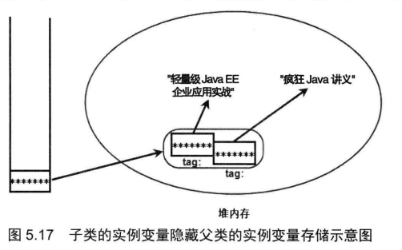

所有的类都是引用类型

一个对象可以有多个引用, 当对象不存在引用时, 会被GC(垃圾回收器)回收销毁其内存空间

将一个数组变量指向另一个数组变量时, 需要两个数组的类型相兼容

Java中没有从底层实现真正的多维数组, 

例如:在Java里面的二维数组本质还是一维数组, 其数组元素储存引用变量, 引用变量指向另外的一维数组

如何定义多维数组: 

```java
type[][] arrName;
```

初始化

```java
arrName = new type[length][]
```

上述语句实际上相当于初始化了一个一维数组, 该一维数组的长度为length, 其数组元素为引用类型, 被系统自动初始化赋值为null


> 注意上图中定义了一个元素为对象的数组, 其数值在内存的存储方式如图所示

```java
a = new int[4][];
```


> 上图中该二维数组进行了(一维)初始化, 其堆内存存储方式跟一维数组非常类似


> 上图显示了二维数组对其数组元素进行了(二维)初始化

```java
b = new int[3][4];
```


> Java里面的三维数组也是一维数组, 其数组元素是二维数组, 二维数组里面的数组元素是一维数组, 所以Java多维数组的本质都是一维数组


# Array(数组)

在Array类里面的static修饰的方法可以直接调用来操作数组

例如:

```java
int binarySearch(type[] a, type key) 
```

可以用二分法在a数组中查找key, 返回其出现过的索引值 由于二分法的要求,a数组中的元素必须是从小到大排序才能正确查找 如果不包含则返回一个负数

```java
int binarySearch(type[] a, int formIndex, int toIndex, type key)
```

与前一个方法类似, 但是搜索范围限制在 formIndex到toIndex里面

```java
type[] copyOf(type[] originalArray, int length)
```

将originalArray数组复制为length长度的新数组

```java
type[] copyOfRange(type[]originalArryay, int form, int to)
```

与前方法类似, 但是将复制范围限制在form到to的索引范围内

```java
boolean equals(type[] a,type[] a2)
```

如果两个数组的长度和数组元素一一对应相同,则返回true 否则返回false

```java
void fill(type[] a,type value)
```

将a数组中的元素都赋值为value(注意这里的value需要是type类型的具体值)

```java
void fill(type[] a,int formIndex,int toIndex,type value)
```

与上一方法类似, 但是仅仅将索引范围内的元素赋值为value

```java
void sort(type[] a)
```

对a数组中的数组元素进行排序

```java
void sort(type[] a, int formIndex, int toIndex)
```

与上一方法类似,但是仅对范围内的元素进行操作

```java
String toString(type[] a)
```

将数组的元素按顺序拼接为字符串并返回, 每个元素中间用逗号和空格进行分割


在Java8中, 对Array类的功能进行了增强, 添加了新的工具方法(这些方法支持利用CPU的并发处理性能)

```java
void parallelSort(type[] a)
```

与sort方法类似, 但是增加了对并发运算的支持

> 用parallel开头的方法都表示该方法增加了对并行计算的支持

# 类(class)

类是一种特殊的数据类型, 在Java里面使用类定义的变量都是引用变量(全局变量)

类用于描述具有相同特征(相似属性)的某一类对象

对象是类的实例

在Java中对象是通过调用对应类的构造器类创建的

> 面向对象三大特征: 封装 继承 多态

Java提供了三种访问控制修饰符来实现封装

private protected public

extends关键字来实现继承

通过继承, 子类可以继承父类中的成员变量(类中方法外的变量)和方法

访问控制允许的情况下, 子类实例(对象)可以直接调用父类中方法

> 继承是实现类复用的重要手段, 类的复用也可以通过组合关系来实现 

```java
Father ft = new Child();
```

上述代码将子类的对象赋值给了父类变量, 使得该变量具有了多态性

> 如果是用组合关系来实现复用, 无法这样子来实现多态
>
> 灵活性差

Java中通过构造器来对类的实例进行初始化, 构造器支持重载

如果多个重载的构造器包含相同的代码, 可以考虑将代码块放入类的初始化代码块中

> 类的初始化代码块的执行会早于构造器

**当一个子类被初始化时, 系统会自动初始化它的所有父类**


# 类和对象

在Java中, 类是一种引用变量

面向对象程序设计的重要概念: 类 对象

> 对象是类的实例 类是对象的抽象

类的修饰符有 public final abstract, 也可以不加修饰符

类包含三种最常见的成员: 构造器 成员变量 方法

如果一个类不包含任何成员, 则其为空类

static修饰的成员不能访问非static成员, 只能访问其他用static修饰的成员

Java中通过new 关键字来调用对应类的构造器, 构造器会返回该类的一个实例

构造器是类创建对象的默认途径

没有构造器的类通常无法创建实例

如果没有自定义的构造器, 系统会自动为类生成一个构造器

# 成员变量

成员变量的修饰符有public, protected, private, static, final

(public protected private)三个修饰符只能出现其中之一

> Java中的方法组成成分: 修饰符 方法名 形参列表
>
> 代码块 返回值

static修饰的成员代表它属于类本身, 不属于单个实例.

所以static修饰的方法和成员变量也称为类方法 类变量

没有static修饰的方法 成员变量只能在类的单个实例里面调用(对象), 也叫做实例方法 实例变量

> 在大部分中文资料里面将static修饰的成员称为静态成员 (静态方法 静态变量), 但实际上特性跟动态没有相反的意思

静态成员无法直接访问非静态成员

# 构造器(构造方法)

构造器是一个特殊的方法(构造方法)

构造器不能声明返回值的类型, 也不能用void关键字来修饰

因为一旦用类型关键字来声明后, Java不会将其当作构造方法来执行, 而是作为普通方法来执行

构造方法的语法结构包括: 修饰符 构造方法名 形参列表

> 系统默认提供的构造方法是不带形参的

Java中的类可以用来:

定义变量

创建对象

调用类方法或者访问类变量

> 无符号右移>>> 

栈内存: 存储局部变量

堆内存: 储存全局变量(类变量)

Java里面的引用相当于C语言中的指针

> 指针: 储存了内存的地址值, 可以通过该地址值访问实际的对象

但是Java的引用对指针操作进行了封装, 减少了烦琐操作, 提高了编程效率

> 当一个对象没有任何引用变量指向它时, 该对象将被GC回收, 释放它占用的内存空间
>
> 将一个对象的所有引用变量都赋值为null时, 将导致没有任何引用变量指向该对象


**this**关键字总是指向调用该方法的对象

在构造器中this会引用该构造器正在初始化的对象

在方法中this会引用调用该方法的对象

this关键字主要用于在类中的一个方法里面访问该类的其他方法或类变量(避免需要重复创建对象来调用其他方法)

在Java中一个类的类成员可以直接调用其他成员, 相当于省略了this前缀(和加上this的效果是完全一样的)

**注意在static修饰的方法中是不允许使用this关键字的**

> 遵循了类成员(static 静态)无法访问非类成员(非static 非静态)的语法规定(静态成员无法访问非静态成员)

当一个类中的方法里有局部变量和全局变量同名, 会导致全局变量被覆盖掉, 这时必须使用this关键字才能访问全局变量

从功能上来看, 面向对象中的方法类似于结构化程序里面的函数, 但是Java里面的方法不能独立于对象, 必须定义在类里面

被static修饰的方法属于该类, 没有static修饰的方法属于该类的实例(对象)

Java中方法的特点:

1. 不能独立于类, 只能在类里面定义
2. 只能属于类或者属于类的实例
3. 不能独立执行, 只能被类或对象调用


调用方法传给方法的参数值为实参

方法中负责接收的变量(参数)也被称为形参

Java中只有一种参数传递方式: 值传递

> 值传递实际上将实参的数值赋值给了形参, 对形参做的操作不会对实参产生影响


> 上图表示了从main方法中将a, b参数传递给swap方法中的a, b参数时, 内存空间中值的储存方式
>
> 注意每个方法在执行时, 都会创建属于该方法的栈(stack)内存

但是如果传入的值是引用变量时, 虽然实参跟形参实际上还是两个不同的引用变量, 但是它们都指向同一个对象(内存地址)

所以对形参进行操作时, 实际上会访问该形参指向的对象进行操作, 导致访问实参时候也会发现该对象在操作后会发生的改变

> 要注意的时, 如果是将形参重新指向其他对象或者直接置为null, 不会对形参的指向产生影响

在Java1.5中, 增加了新功能: 允许定义形参个数不定(可变)的方法,在形参类型后加... 表达该形参可以接受多个参数值, 并且多个参数值会作为数组传入

> 注意类型必须指定, 个数可以不定
>
> 并且一个方法只能有一个个数可变的形参

```java
public static void test1(int a, String... books);
public static void test2(int a, String[] books);
```

上述两行代码定义的方法对于编译器来说参数相同, 不可以能进行方法重载

两个方法里都可以把books作为数组处理. 但是调用它们时候必须用不同的方式

```java
test1(5,"哈利波特","简爱");
test2(5,new String[]{"哈利波特","简爱"});
```

> 写代码时候最好选用一种默认的风格
>
> 比如循环尽量用for循环去写
>
> for循环里面的条件语句尽量使用<>大于小于号而不是大于等于小于等于<= >=号

# 递归

递归就是在一个方法里面调用方法它本身

> 递归一定要向已知方向递归, 防止出现死循环

# 方法重载

Java允许同一个类里有多个重名的方法, 但是要求重名的方法对应的形参列表不能相同

如果一个类中包含多个方法名相同, 但是形参列表不同的方法, 就称为方法重载

(返回值不同不能作为方法重载的条件)

在Java中确定一个方法需要**三要素**

1. 调用者 方法的所属者, 可以是类或对象
2. 方法名 方法对应标识符
3. 形参列表 调用方法时候, 实参的值将被赋值给形参

形参个数可变的方法也可以被重载

```java
public void test(String... args){}
public void test(String args){}
//public void test(String[] args){}
```

第二行代码传入参数只有一个, 可以作为test方法的方法重载

但是第三行代码不行

> 不建议重载形参个数可变的方法, 因为会导致程序可读性的下降

# 变量

Java中变量分为局部变量和成员变量

局部变量有形参 方法内定义的局部变量 (代码块内定义的代码)

成员变量有 实例变量 static类变量(都是在方法外定义的变量)

> 注意: static类变量的生存周期和其所属的类相同
>
> 但是非static变量的生命周期是和其所属的实例相同的

>类的生命周期: 类加载, 类验证, 类准备, 类解析, 类初始化.....

类变量: 类成员变量

实例变量: 实例成员变量

两者统称成员变量

> 当一个实例修改非static变量时候不会影响到同一个类的其他实例
>
> 但是当其修改static变量时候, 由于修改的是类成员变量, 会导致该类的其他实例读取该变量时候也会发现被修改了

**成员变量会被系统自动初始化, 初始化的默认赋值与数组动态初始化的赋值规则完全相同**

> Java中可以通过实例来修改static修饰的成员变量, 但是这种做法会导致代码的可读性, 明确性都受到影响
>
> 建议使用通过类来修改static变量的做法替换

> 尽量避免在编程时候出现局部变量与成员变量同名的情况, 提高代码的可读性

局部变量的生命周期:

1. 形参的作用域为整个方法
2. 方法内定义的变量的作用域为从定义它的那段代码开始, 到方法结束
3. 代码块的局部变量 作用域: 从定义它的代码开始到代码块结束

局部变量除了形参, 都必须显式初始化后才能使用

成员变量不需要显式初始化, 系统提供的构造器会自动将其初始化

两个成员变量的标识符不允许相同


上图展示了类成员变量和实例成员变量在内存空间中的储存差别

引用变量里面保存的是对应实例的内存地址

> 栈内存里面的变量一般不需要GC进行内存回收, 因为它的内存空间会随着方法或代码块的运行结束而销毁

局部变量只能保存基本类型数值或者实例的引用

所以局部变量所需的内存空间很小

无脑使用成员变量不符合软件开发规范将导致

1. 成员变量的作用域过大, 程序的内聚性降低
2. 成员变量的生存时间过长, 导致内存开销变大

需要用到成员变量的常见情形:

1. 多个方法都需要用到该变量值
2. 该变量用于描述一个类的固有信息

良好的软件开发规范应该是尽可能的缩小一个变量的作用域, 不占用多余的内存时间

# 隐藏和封装

Java中的类和实例的成员变量可以进行封装来向外界隐藏对象的内部信息

面向对象三大基本特征: 封装(Encapsulation) 继承(implement) 多态(polymorphism)

封装: 将对象的内部进行隐藏, 不允许外部程序直接访问成员变量, 在类的内部提供对应的方法来实现对成员变量的操作

封装可以实现:

1. 对类外面隐藏类的实现细节
2. 提供方法来操作成员变量, 在方法里面可以加入安全限制逻辑
3. 保证成员变量的完整性
4. 提高代码的可维护性

封装在Java里面通过访问控制修饰符来实现

Java里面有3种访问控制符: private protected public

还有一种情况是不加任何访问控制符的默认级别

访问控制级别从小到大

private -> default -> protected -> public

访问控制级别表

| 范围             | private | default | protected | public |
| ---------------- | ------- | ------- | --------- | ------ |
| 同一个类         | 1       | 1       | 1         | 1      |
| 同一个包         |         | 1       | 1         | 1      |
| 子类中           |         |         | 1         | 1      |
| 代码中任何类里面 |         |         |           | 1      |

```java
class Outer{
    class Inner{}
}
```

上述代码定义了一个Outer外部类和Inner内部类

访问控制符中, private和protected不能用于修饰外部类

> 访问控制符可以用于控制类的成员能否被其他类访问

> 访问控制符可以用于修饰类成员和类本身

> 对于外部类, 只有一种访问修饰符可以用public
>
> 两种状态: 默认 public

一份Java源代码文件中, 如果所有类都没有用public修饰, 则源代码文件名可以取任意的.

一个Java源代码中只能有一个public修饰的类, 且文件名必须与public修饰的类名相同

JavaBean规范: Java类的每个成员变量都用private修饰符修饰, 并且每个成员变量都需要提供对应的setter getter方法(必须是用public修饰的)

模块化程序设计特点:

1. 高内聚 (尽量将模块的内部数据, 功能实现向外界隐藏, 避免受到外界干扰)
2. 低耦合 (提供封装好的方法给外部使用)

访问控制符使用建议:

1. 大部分的成员变量都用private修饰, 仅当成员变量被static修饰时或者作为全局变量使用时才考虑用public修饰
2. 如果一个类中的方法是提供给其子类重写用的, 应该用protected修饰
3. 类的构造器应该用public修饰, 来运行其他类创建该类的实例, 大部分外部类也应该用public修饰

# package

package(包)提供了类的多层命名空间, 用于解决类文件管理问题, 命名冲突

将一组功能相关的类放在同一个package下, 就组成了逻辑上的类库单元

```java
package packageName;
```

上述代码应该放在源代码的第一行, 意味着该源代码中定义的所有类都属于这个包

一个源文件只能对应一个包

>当源文件没有显式指定对应包名时, 则该源文件属于默认包

> 同一个包中的类文件不需要放在同一目录下(只需要它们都在CLASSPATH包含的目录下即可)
>
> 不同包的类文件不能放在同一目录下, 避免类名冲突

> javac -d . Hello.java
>
> 使用-d选项编译时, 会自动建立包结构对应的文件目录结构
>
> 这样子避免了同名类文件的冲突, 同名类文件无法在同一目录下存放

Array常用方法:

```java
import java.util.Arrays;
System.out.println(Arrays.toString(arrayName));
java.util.Arrays.toString(arrayNmae);
```


> 标准Java项目文件夹结构

按照行业标准, 包名应该只由小写字母组成, 并且应该由有意义的单词组成

> 调用另一个包包含的类时, 需要在类名前加上包前缀来调用
>
> 类全名: 包名+类名
>
> 当两个类处于同一个包中时,可以省略包名

使用包名时必须写全名, 不可省略任何部分

一个源代码只能包含一个package语句

import语句应出现在package语句之后, 类定义语句之前

impoer语句可以用*来导入该包下面的所有类, 但是子包不会被导入

> 在Java中, 父包与子包之间没有任何关系
>
> 仅仅作为认知
>
> 在Java中包名是一个整体, 不可进行缩写, 只能整个省略

在Java中会默认导入java.lang中的所有的包

因此在java.lang下面的所有类如 String System都不需要显示导入就可以直接使用

> 当import的包里面含有重名的类时候, 必须使用包名+类名来导入类

java1.5中增加了静态导入的方法

```java
import static java.lang.System.*;
import static java.util.Arrays.toString;
```


静态导入只能用于导入指定类中的静态成员

静态导入在源代码文件中应该于普通导入处于同一位置

> 使用静态导入可以省略包名以及类名, 直接使用导入的静态成员

> 接口和枚举都是一种特殊类

**Java常用类库包**

java.lang 包含了java的核心类如String Math System Thread 默认被所有的Java源代码文件导入

java.util 包含了大量工具类 集合框架类 如: Arrays List Set

java.net 包含网络编程相关类

java.io 包含IO(输入/输出)编程相关类

java.text 包含格式化相关的类

java.sql 包含数据库编程相关的类

java.awt 包含可视化窗口相关的类

java.swing 包含Swing GUI编程相关的类

# 构造器

> 一个类可以有多个构造器(构造器重载:类似于方法重载)

自动初始化:

将整数型赋0 浮点数型赋0.0

布尔型 false 引用类型赋 null


Java程序创建对象的流程:

new 关键字调用构造器

系统分配对象的内存空间, 进行默认初始化

> 疑问: 这里是默认构造器的本质吗?

执行自定义构造器

返回对象的地址(相当于返回一个引用变量)

**当自定义构造器提供时, 系统将不会提供默认构造器(无参数构造器)**

用权限修饰符修饰构造器可以控制类的对象创建权限

protected使得只有子类可以调用该类的构造器

private可以阻止其他类调用该类的构造器


构造器重载: 一个类中包含多个构造器, 构造器的形参列表互不相同

构造器重载使得Java的同一个类可以包含多个初始化逻辑, 有多种方式来初始化对象

> 构造器必须与类名相同

```java
public class Test{
    public Test(){}
    public Test(int num){}
    public Test(int num,int num02){
        this(2);
        //this();
    }
}
```

在上述代码中, 构造器用this关键字调用了其他构造器

注意一个构造器里面仅可调用一次

> 之所以提供构造器重载的特性是为了实现代码的可复用性
>
> 避免出现重复的代码段 降低代码维护成本

# 继承

> 面向对象三大特征: 继承 封装 多态

继承是实现代码复用的重要手段

Java中的继承为单继承, 一个子类只能有一个父类

> Java舍弃了C++中复杂的多继承特性

> 但是也可以通过父类继承间接父类, 来使得子类间接继承多个(间接)父类

**在Java中如果一个类没有显示指定一个类作为直接父类, 则会默认指定java.lang.Object类为其直接父类**

**java.lang.Object是Java中所有类的直接/间接父类**

```java
public class SubClass extends SuperClass{}
```

上述代码中通过extends关键字, SubClass类继承了父类SuperClass

> extends原意为扩展, 所以也可以说子类是对父类的扩展

> 注意Java中子类无法继承父类的构造器

derive(派生) 父类派生了子类

extends(继承) 子类继承了父类

derive extends都是描述同一动作, 但是角度/方向不同

子类大部分情况下都是在父类的基础上增加新的成员变量和方法

但是存在例外情况: 方法重写(覆盖) (Override)

方法重写(override)与方法重载(overload)是完全不同的概念

方法重写:

子类中存在于父类同名的方法称为方法重写

方法重写规则: 两同两小一大

两同: 方法名 形参列表必须相同 (是否被static修饰符修饰也需要保持一致)

两小: 子类中的方法返回值**类型**必须小于或等于父类方法的返回值类型

子类方法抛出的异常类也应该比父类方法更小或相等

一大: 子类方法的访问权限应该比父类方法的更大或相等

> 注意父类中用private修饰的方法对于子类来说是不存在的(隐藏) 这时候在子类中定义同名的方法不是方法重写

super关键字用于在子类中调用被覆盖的父类方法

> super关键字不能出现在static修饰的方法中
>
> 但是可以调用被static修饰的方法

super关键字也可以用于在子类中调用被隐藏的父类变量

> 当子类中定义了与父类重名的变量时会导致父类变量被隐藏, 子类可以通过super关键字调用被隐藏的父类变量

程序查找变量的顺序(优先级)为:

1. 找该方法中的局部变量
2. 找该类中的成员变量
3. 找父类中的成员变量
4. 按结构遍历所有间接父类的成员变量直至最终的java.lang.Object
5. 最终仍无法找到变量将出现编译错误

找到同名变量后不会再执行后续步骤



```java
Son s=new Son();
//int num=s.tag;
int num =((Parent)s).tag
```

上述代码显示了在创建子类对象后, 用(Parent)来调用父类中被隐藏的变量

**子类可以用super关键字来调用父类的构造器**

> 使用this或super关键字调用构造器必须出现在构造器执行体第一行, 因此不能同时出现

**子类构造器一定会调用父类构造器一次**

三种情况:

1. 用super关键字调用父类构造器
2. 用this关键字调用本类中另一个构造器, 另一个构造器调用父类构造器
3. 以上两种情况都没有发生时, 系统默认调用父类无参数构造器

**创建一个对象时, 一定是从对应类所在的继承树最顶层类的构造器开始依次向下执行, 因此最开始一定会执行java.lang.Object类的构造体, 最后才会执行本类的构造器**

# 多态

Java中的引用变量同时有两个类型: 编译时类型 运行时类型

编译时类型由声明时使用的类型决定

运行时类型由该变量指向的对象决定

当编译时类型与运行时类型不同时, 就可能出现多态

多态是什么:将父类类型变量指向其子类对象

多态的特征: 同类型的变量, 调用同一方法时出现不同的行为

```java
FatherClass polymophicVar=new SonClass();
```

它的编译类型为FatherClass 运行类型是SonClass

当使用polymophicVar调用子类中覆盖了父类的方法时, 会出现多态

注意: ploymophicVar只能调用父类中的存在方法, 调用方法时会表现出子类中覆盖方法的行为 

> 可以通过反射来执行子类中的方法

> 由于子类实质上是特殊的父类, 因此子类对象可以直接赋值给父类引用变量, 这时不会发生任何类型转换, 系统会自动完成 向上转型(upcasting)

> 注意实例变量没有多态性, 用ploymophicVar只能调用父类中的实例变量, 不能调用子类中的实例变量

> 本质是引用变量只能调用其编译时类型具有的方法, 但是在运行方法时会优先执行它运行时类型里面的方法

```java
int a=1;
(double)a;
```

上述代码使用了强制类型转换符将a变量从int类型转换为double类型

使用强制类型转换时注意:

基本数据类型只能在整数型 字符型 浮点型之间进行相互转换, 布尔类型无法转换

引用类型的转换只能在具有继承关系的两个类型间进行

>将父类类型实例强制转换成子类类型时, 其运行时类型必须是子类类型, 否则会发生ClassCastException错误

# instanceof运算符

```java
Father f1=new Father();
Son s1=(Son)f1;
//上述代码会抛出java.lang.ClassCastException错误
Son s2=new Son();
Father fs=(Father)s2;
//正确的多态实现
```

```java
Father f1 = new Father();
if (f1 instanceof Son) {
    Son s1 = (Son) f1;
}
//可以用instanceof运算符来判断是否可以成功转换, 避免抛出ClassCastException错误
//上述if判断将为false, 不会执行代码块里面的内容
```

instanceof运算符: 当前面的操作数是后面操作数的同一个类 子类 实现类的实例则返回true, 否则返回false

要求前面的操作数为实例/对象, 后面的操作数为类

instanceof运算符一般与(type)强制转换符配合使用, 先用instanceof判断是否可以进行强制转换, 再用强制类型转换符进行转换, 保证代码的健壮性

# 组合

在Java中继承和组合都能实现类的复用, 但是继承破坏了封装, 组合能实现更好的封装

在继承关系中, 子类可以直接访问父类的内部成员变量和方法 造成严重耦合 

为了保证封装性, 在设计父类时应该

1. 将所有成员变量用private修饰, 向子类隐藏, 避免子类可以直接访问父类成员变量
2. 父类的内部方法应该使用private修饰, 如果需要被外部调用应该用public修饰, 不希望被子类重写的话需要使用final修饰符. 希望被重写但不希望被外部类访问可以用protected
3. 避免在父类构造器中调用会被子类重写的方法

用final修饰符修饰的类无法被其他类继承

也可以通过用private修饰类中所有的构造器, 保证无法被继承

一般需要用到子类的情形:

需要增加子类特有的属性或方法

> 继承与组合所需要的系统开销本质上没有区别

```java
class Animal{
    private void beat(){}
    public void breath(){
        beat();
    }
}
class Bird extends Animal{
    public void fly(){}
}
class Test{
    public static void main(String[] args){
        Bird b=new Bird();
        b.breath;
    }
}
```

> 继承代码示例

```java
class Animal{
    private void beat(){}
    public void breath(){
        beat();
    }
}
class Bird{
    //将父类手动组合到子类中, 实际上它们没有继承动作
    private Animal a;
    public Bird(Animal a){
        this.a=a;
    }
    public void breath(){
        a.breath();
    }
}
class Test{
    public static void main(String[] args){
        Animal a=new Animal();
        Bird b=new Bird(a);
        //由于自定义了构造器, 此时必须将Animal类型对象传入才可以创建Bird对象
//        Bird b=new Bird();
        b.breath();
    }
}
```

> 上述代码中Bird类和Animal类是组合关系

虽然继承和组合可以实现相同的功能, 但是实质上它们表达了不同的概念

> 继承:is a(子类是一种特殊的父类)
>
> 组成:has a(部分组成整体)

# 初始化块

类的四种组成成员: 成员变量 方法 构造器 初始化块

(都可以有多个, 也可以没有)

一个类中的多个初始化块会按照先后顺序执行

初始化块里面可以包含任何执行语句

初始化块如果被static修饰, 则称为静态初始化块

初始化块不能有标识符来标记,因此初始化块无法被调用, 对于类外界来说是隐形的

初始化块在创建对象时会隐式执行, 并且在构造器之前执行

```java
public class Person{
    static{}
    {}
}
```

上述代码的Person类包含两个初始化块

一个静态初始化块和一个非静态初始化块

**在Java中创建一个对象时, 系统会首先为该对象的所有实例变量(非成员变量)分配内存

接着开始执行初始化

Java中对象初始化步骤执行顺序是:

1. 声明实例变量时指定的初始化值进行赋值或者执行初始化块 由于它们是相同的优先级, 所以执行顺序要看在代码中的先后顺序
2. 最后再执行构造器

```java
class Girl{
    //第一步执行
    int age=18;
    {
        //第二步执行 同优先级看先后顺序
        age=19;
    }
    Girl(){
        //第三步执行
        age=20;
    }
}
```

**初始化块与构造器的不同之处:**

1. 执行顺序的不同
2. 初始化块可以有多个,每次创建对象都必须执行所有的构造器
3. 构造器可以有多个, 但是创建对象时候只会执行被调用的构造器

可以将多个构造器中的相同代码提取到初始化块中,

可以有效提高代码复用性, 程序的维护性

> 普通初始化块会按照继承关系, 从Java.lang.Object类开始从上到下执行,
>
> 从上到下执行时, 会执行java.lang.Object的普通初始化块和构造器, 再到下一个间接父类的初始化块和构造器

> 初始化块在经过编译后会加到每个构造器的执行块代码前面, 所以本质上初始化块是构造器的补充

# 静态初始化块

static修饰的初始化块称为静态初始化块

静态初始化块在类初始化时就会执行, 通常用于对类变量进行初始化, 不能对实例变量进行初始化处理

static初始化块属于类的静态成员, 类的静态成员不能访问非静态成员

> 注意构造器是不能被静态修饰符修饰的, 因此静态初始化块可以在类初始化时执行, 但是构造器不能

只有类初始化完成后, 程序才能开始使用这个类

> 疑问: 当父类中自定义了构造器, 不提供无参构造器时, 子类会如何调用父类的构造器
>
> 会报错, 必须提供无参构造器才能被子类继承

**类的初始化**

仅当对象第一次被创建时候, 会执行类的初始化(执行静态初始化块)

当类初始化过一次后, 该类会一直保留在jvm中直到程序结束, 所以后面再次创建对象时无须再对该类进行初始化

> 继承和组合都是属于Java提供的类复用机制

# 包装类

Java中的8个基本类型都有对应的包装类

> 8种基本数据类型: byte short char int long float double boolean

包装类可以将基本数据类型的值转换成对象使用

并且JDK1.5提供了自动装箱和自动拆箱的功能

允许同类型的包装类对象和基本类型变量间可以直接赋值

**final关键字类似于C++中的const, 被final修饰符修饰的变量 方法 类 将不允许再发生修改**

通过final关键字可以实现不可变类, 使系统安全性加强

abstract用于定义抽象类

interface用于定义接口

抽象类主要是用作多个类的模板

接口用于定义多个类应该遵循的规范

java8更新了Lambda表达式

enum关键字用于创建枚举类

枚举类是一种不能自由创建对象的类, 适合用于实例有限并且已经确定的类 如: 行星 季节

| 基本数据类型 | 包装类    |
| ------------ | --------- |
| byte         | Byte      |
| short        | Short     |
| char         | Character |
| int          | Integer   |
| long         | Long      |
| float        | Float     |
| double       | Double    |
| boolean      | Boolean   |

除了int和char的对应包装类为其单词全写外, 其他包装类都是首字母大小即可

在Java1.5提供自动装箱(Autoboxing)和自动拆箱(AutoUnboxing)之前必须使用包装类中的valueOf()和xxxValue()方法来实现基本数据类型和包装类对象的相互转换

如图:


在包装类中, 还提供了将字符串和其他基本类型进行相互转换的方法

1. parseXxx(String s) :除了Character类的所有包装类都提供该方法
2. valueOf(String s)

将基本类型变量与""空字符串进行拼接操作, 会自动将基本类型变量转换为字符串, 更方便

> 包装类作为引用变量可以直接与基本类型变量进行比较(发生了自动拆箱)
>
> 两个包装类对象引用变量进行比较时, 只有两个引用变量是指向同一个对象时才会返回true

JDK1.5后的自动装箱有缓存机制, -128~127之间的整数装箱成Integer实例后将存储到一个cache数组中, 第二次使用时将直接从cache数组中取出不再重复创建

所以-128~127自动装箱创建的实例进行相等比较将返回true

> byte范围-128~127

**为什么byte的范围是-128~127**

0000 0000

byte

00000000

符号位占一位 存储数值的位有7位

2^(8-1)-1

128-1=127

> Java使用二进制补码来存储负数


正数和负数在计算机底层均以补码的形式存储

2*(9-1)-1=255

255=128+127

> -128以8位2进制表示: 1000 0000
>
> 1000 0000补码
>
> 0111 1111 +1
>
> 1000 0000
>
> 负数补码计算方式
>
> 正数的补码是其本身

Java7中提供了包装类对象的比较方法

```java
Integer.compare(Integer val1, Integer vla2)

Integer.compare(2,1);
//输出1
Integer.compare(1,2);
//输出-1
Integer.compare(1,1);
//输出0
```

Java7中还为Character包装类增加了大量工具方法, 用于对字符进行判断

Java8为整数包装类提供了无符号运算方法

如:

static String toUnsignedString(int/long i):

将int/long整数转换为无符号整数对应的字符串

>这些方法好像有字符串拼接, 强制转换等替代方法可以实现相同的功能

> 注意将负数转换成无符号整数时, 不会是直接取其绝对值, 而是将其补码的符号位1作为数值位, 作为原码计算出对应的无符号整数 

如8位byte存储的-3

原码: 1000 0011

补码: 1111 1100+1

1111 1101

其无符号整数为253

# Object类

Object类是所有类的父类, 所以Object类中提供的方法会被所有类继承

Object类中提供了toString() 实例方法, 其返回值为"类名+@+hashCode"

在自定义类中可以重写toString()方法来实现自定义功能

> 数组类重写了toString()方法, 可以将数组元素作为字符串输出

**当==运算符的操作数包含引用变量时, 必须是两个有父子关系的对象才能进行比较, 或者是相同类的对象**

> 这里的父子关系不可以是间接父子关系, 必须是直接父子关系

```java
String s1="her";
//直接量 直接使用常量池管理, 将常量池中的对象给s1引用变量
String s2=new String("he");
//先使用常量池管理对象, 再调用String类构造器创建新的String对象给s2引用变量
//new String("he")会产生两个对象
```

上述代码使用了两种方式赋值给字符串变量

> 常量池 (constant pool): 用于管理编译时已经创建并保存在类文件(.class)中的数据, 通常包括 常量(类 方法 接口中) 字符串常量

用new String("")创建的字符串对象将保存在堆内存(运行时内存区), 但是常量池中的对象将在编译时就确定并保存, 不需要在运行时候再创建

```java
System.out.println(1==1.0);
//输出ture
System.out.println(65=='A');
//输出true
```

Object类提供了equals()实例方法用于将两个对象进行比较 注意equals()方法的判断逻辑和要求与使用==运算符进行两个对象的比较时是完全相同的

> 实际上Object类提供的equals()仅仅对两个引用变量指向的对象内存地址进行比较, 地址相同就返回true

> String类已经重写了equals()方法, 只要两个字符串的内容是相同的, 就返回true

> instanceof运算符与equals方法不同, instanceof运算符的操作数为前面实例 后面类
>
> equals为两个对象的比较

equals方法重写一般要遵循下面的原则:

自反性: x.equals(x)一定返回true

对称性: 如果x.equals(y)为true, 则y.equals(x)一定为true

传递性: 对于x, y, z, 如果x.equals(y)为true, x.equals(z)为true, 则y.equals(z)为true

一致性:对于x ,y, 如果用于对比的信息没有改变, 那么x.equals(y)的结果不会发生改变

如果x不为null, x.equals(null)一定为false

# 类成员

用static修饰的成员叫做类成员

Java中类有5种成员: 成员变量  方法 构造器 初始化块 内部类

内部类包括接口 枚举 

用static修饰的类成员属于整个类

非static成员属于单个实例/对象, 为实例/对象成员

**类成员变量存储在元空间中**

**实例成员变量存储在堆内存(运行时内存)中**

> 在大部分的语言中都不允许通过对象来访问类变量, Java虽然可以通过对象来访问类变量, 但是不建议使用这个特性

> 规范的编程应该是只通过对象来访问实例成员
>
> 访问类成员只通过类来访问

> 在Java中null对象可以正常访问其所属的类成员
>
> 但是试图访问null对象的实例成员时, 将引发NullPointerException错误, 表示null对象实际上是不存在的

# 单例类(Singleton)

一个始终只能创建一个实例的类就是单例类

单例类通常的设计:

1. 将类的构造器都用private修饰起来, 防止被其他类调用
2. 提供一个用public static修饰的类方法来创建对象
3. 使用一个用private static修饰的成员变量来缓存上述方法创建的对象, 保证只有一个实例能够被创建

```java
class Singleton{
    private static Singleton instance;
    //隐藏构造器
    private Singleton(){}
    提供类方法创建并缓存对象
    public static Singleton getInstance(){
        if(instance==null){
            instance=new Singleton();
        }
        return instance;
    }
    
}
```

上述代码实现了一个单例类

# final

final关键字可用于修饰类 变量 方法

当变量用final修饰时, 该变量一旦被赋予了初始值, 则不能再被重新赋值

成员变量被final修饰时, 该变量不会被系统自动初始化赋值, 必须在特定位置进行显式指定初始值

```java
class TestClass{
    final static int num1=1;
    //类变量可以在声明时赋值
    final static int num2;
    static{
        num2=1;
    }
    //类变量可以在静态初始化块赋值
    final int num5=1;
    //实例变量可以在声明时赋值
    final int num3;
    {
        num3=1;
    }
    //实例变量可以在非静态初始化块赋值
    final int num4;
    TestClass(){
        num4=1;
    }
    //实例变量还可以在构造器中进行初始化赋值
}
```

上述代码展示了final类变量的两个赋值地点, final实例变量的三个赋值地点

```java
class TestClass{
    final int num5;
    {
//    System.out.println(num5);
        test();
        num5=6;
    }

    private void test(){
        System.out.println(num5);
    }
    public static void main(String[] args){
        new TestClass();
        //将输出0
    }
}
```

上述代码显示了final成员变量可以在初始化被方法访问, 并且输出0, 这是Java的设计缺陷

**final局部变量**

final局部变量只能进行一次赋值

final局部变量作为形参时, 会在值传递时被系统赋值, 不能再次赋值

**final基本类型变量和final引用变量的区别**

final基本类型变量只能进行一次赋值

final修饰引用变量时, 该引用变量所指向的对象地址无法再次改变, 也就是说无法重新指向其他的对象. 

但是注意引用变量指向的对象本身是不受final修饰符影响, 可以正常修改

当一个变量满足三个条件时, 其相当于一个直接量, 成为宏变量

1. 被final修饰
2. 声明时指定了初始值
3. 初始值在编译时就被确定

宏变量在代码中出现的地方会被编译器直接替换成对应的值

```java
class Test37{
    public static void main(String[] args) {
        final String book1="1"+1;
        final String book2="1"+String.valueOf(1);
        final String book3="11";
        String book5="1"+1;
        System.out.println(book1==book2);
        //输出false, 因为宏变量是在常量池中
        System.out.println(book1==book3);
        //输出ture, 因为两个都是宏变量
        System.out.println(book1==book5);
        //也是true, 代表不需要final修饰也是可以在常量池中
    }
}
```

**final方法**

当父类中的方法用final修饰时, 子类不能重写该方法

与private的隐藏不同, final修饰的方法如果被子类重写将造成编译错误

但是如果方法同时被final 和 private修饰时, 方法对于子类来说将是隐藏状态, 不再是方法重写而是定义了新的方法, 可以正常运行

final不会影响方法重载

**final类**

final修饰的类将不可被继承

# 不可变类(immutable)

Java的八种基本数据类型对应的包装类和java.lang.String类都属于不可变类

不可变类的实例创建后不能改变其实例变量

自定义不可变类应该遵循下列规则:

1. 成员变量用private 和 final修饰

2. 提供带参构造器来根据参数初始化成员变量

3. 提供getter方法, 不提供setter方法, 因为final成员变量不能二次修改

4. 必要时需要重写hashCode()和equals()方法

   > java.lang.String类已经重写了hashCode()和equals()方法

JavaBean是可变类的代表, 可变类的实例变量都是可变的

**可以使用数组来实现缓存实例的不可变类**


使用数组来实现实例的缓存池, 当缓存池满时, 采用先进先出的队列规则来移出旧对象

缓存实例的不可变类通常会提供valueOf()方法来获取缓存池中的实例

> java.lang.Integer类也提供valueOf()方法来从缓存池中获取实例

# 抽象类

为什么需要设计抽象类：因为多态实现的父类类型 引用变量虽然是指向子类对象， 但是无法通过该引用变量调用父类中没有， 但是子类中有的方法。 抽象类可以设计出无方法体， 仅有方法名的类模板可以解决该方法

抽象类提供了子类的通用方法，并将方法执行体留给子类实现 

抽象类是模板模式的一种实现

抽象方法和抽象类必须使用abstract修饰

一个类中含有抽象方法, 则该类必须为抽象类

但是用abstract修饰的抽象类可以不含抽象方法

**抽象类不能实例化，只能被子类继承**

抽象方法和抽象类的规则:

1. 抽象方法和抽象类必须使用abstract修饰, 抽象方法不能有方法体(具体代码块)

2. 抽象类不能被实例化, 意味着它的构造器无法被new 关键字调用来创建实例

3. 抽象类可以包含普通类中的五种成分: 成员变量 方法 构造器 初始化块 内部类(接口, 枚举)

   > 抽象类的构造器不能创建实例, 但是可以被子类调用(在子类创建实例时, 会按照继承树的顺序调用父类和间接父类中的构造器和初始化块)

4. **含有抽象方法的类必须被abstract修饰**

```java
abstract class Shape{
    public abstract getType();
}
```

> abstract和static不能修饰同一个方法， 但是可以修饰同一个内部类
>
> abstract和private也不能修饰同一个方法

# 接口（interface)

接口是一种特殊的抽象类

Java9允许在接口中自定义默认方法、类方法、私有方法

接口不提供任何实现的方法，只定义行为规范（一组公用的方法）

体现了规范与实现分离的设计规则

采用接口可以让程序有更好的扩展性和可维护性

接口使用interface代替class声明

**接口是一种特殊的抽象类， 所以接口本质是一种特殊的类**

1. 接口可以用的修饰符跟外部类一样，只能用public或者省略为默认权限
2. 接口的命名与类名遵循相同的规则
3. **接口可以有多个直接父接口， 但是接口与类之间不能有继承关系**

接口里面只有三种成员： 成员变量（只有静态常量final static) 方法（抽象实例方法、类方法、默认方法、私有方法） 内部类（内部接口、枚举）

不能含有构造器、初始化块

> 注意普通的类可以包含内部接口

接口的成员都只能用public权限， 可以省略public修饰符（除了私有方法）

> Java9中增加了私有方法的支持， 使用private修饰符可以声明私有方法，private static声明私有类方法 

> 私有方法通常作为工具方法被接口中的其他方法调用

接口中的变量只有公开静态常量, 所以可以省略 public static final修饰符

接口中的普通方法不能有方法体实现， 但是类方法 默认方法 私有方法都必须有方法体实现

**Java8增加了支持接口定义默认方法和类方法**

> Java8支持接口定义默认方法, 默认方法可以有多个, 默认方法必须用default修饰, default不可省略
>
> 并且总是被public修饰, public可以省略
>
> 不可被static修饰

**注意public default修饰符不可以在class类中修饰方法, 只可以用于接口中的默认方法**

默认方法为实例方法, 所以只能通过子类的对象来调用

类方法必须用static修饰, 并且默认被public修饰, 可以直接使用接口来调用类方法

接口中的抽象方法不允许有方法体(花括号), 但是默认方法 类方法 私有方法(Java9中添加)都必须有方法体(花括号)

**接口是一种特殊的类, 因此接口类不可以与普通类同名, Java源代码文件名必须与public接口同名**

**接口支持多继承, Java中的普通类只支持单继承**

意味着一个接口可以有多个直接父接口

接口继承时, 将会获得子接口中的所有抽象方法 类方法 默认方法 

```java
interface InterfaceC extends InterfaceA, InterfaceB{}
```

上述代码的InterfaceC同时继承了InterfaceA和InterfaceB

接口可以作为多态中的父类类型

接口主要用于:

1. 定义变量
2. 调用其他接口中的常量
3. 被其他类实现

普通类继承接口必须使用implements(实现)

```java
class Son extends Father implements InterfaceA, InterfaceB
```

一个类只能有一个父类, 但是可以同时实现多个接口

> 被称为Java的模拟多继承

**注意当类implements接口时. 需要实现接口中的所有抽象方法, 如果有抽象方法未实现时, 该类必须为抽象类**

**接口相当于一个彻底抽象的抽象类(只有抽象方法, 私有方法对子类隐藏)**

> 由于接口可以被继承的方法都是public, 所以子类实现接口方法时也只能用public修饰符
>
> public修饰符是权限最大的修饰符

Object类是接口类的唯一间接父类

可以用向上转型将接口类型引用变量赋予Object类型引用变量

# 接口和抽象类的区别

接口和抽象类的相同特征:

1. 都不能被实例化, 只能被实现或继承
2. 都可以包含抽象方法, 普通类不能含有抽象方法, 必须将继承的抽象方法实现

接口和抽象类的设计目的差别巨大:

1. 接口体现规范标准, 接口的改变将可能导致实现该接口的类都需要重写
2. 抽象类体现模板式设计, 抽象类只是一个中间产品, 需要进一步完善实现

接口和抽象类的用法有差异:

1. 抽象类可以有普通方法(包含方法体), 但是接口不能有

2. 接口只能有static final变量 (类常量), 抽象类可以定义普通成员变量

3. 接口不能有构造器和初始化块, 抽象类可以有构造器和初始化块 

   > 抽象类中的构造器和初始化块是提供给子类调用的

4. 普通类继承抽象类为单继承, 但是可以实现implement多个接口(模拟多继承)

# 面向接口编程

接口是一种规范与实现分离的设计

> 利用接口可以降低程序模块间的耦合性,提高系统可扩展性和可维护性

> 简单工厂(Factory)模式和命令模式都是遵循了面向接口编程思想的设计模式

# 内部类

内部类也被称为嵌套类, 它放在另一个类内部

```java
class Outer{
    class Inner{}
    //定义了一个非static内部类Inner
    static class StaticInner{}
    //定义了一个static内部类
}
```

内部类特点:

1. 内部类可以提供更好的封装
2. 内部类可以访问外部类私有(private)成员, 因为内部类本身被视为private成员的一部分, 但是外部类无法访问内部类的成员
3. 特殊内部类: 匿名内部类适合用于仅需要创建一次类的用途
4. 外部类不能用的修饰符private protected static可以用于内部类
5. 只有static修饰的内部类才能有static成员

> 注意在一个源文件里可以定义多个外部类, 它们都是相互独立的

外部类的上级单元是包

**外部类只有两个不同的作用域: 同一个包内, 任何位置 分别对应default(包权限)和public(任何位置)权限**

> 同一个包内的不同源文件属于同一个作用域

内部类有4个作用域, public(任何位置) protected (父子类) default(同一个包) private(同一个类)


static内部类可以包含非static成员, 但是static成员不能访问非static成员

> 外部类不能被static修饰

> 接口也可以定义内部接口, 但是一般开发中不需要用到内部接口
