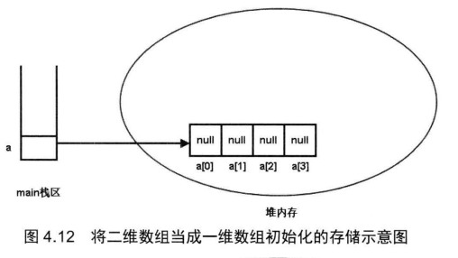

所有的类都是引用类型

一个对象可以有多个引用, 当对象不存在引用时, 会被GC(垃圾回收器)回收销毁其内存空间

将一个数组变量指向另一个数组变量时, 需要两个数组的类型相兼容

Java中没有从底层实现真正的多维数组, 

例如:在Java里面的二维数组本质还是一维数组, 其数组元素储存引用变量, 引用变量指向另外的一维数组

如何定义多维数组: 

```java
type[][] arrName;
```

初始化

```java
arrName = new type[length][]
```

上述语句实际上相当于初始化了一个一维数组, 该一维数组的长度为length, 其数组元素为引用类型, 被系统自动初始化赋值为null


> 注意上图中定义了一个元素为对象的数组, 其数值在内存的存储方式如图所示

```java
a = new int[4][];
```



> 上图中该二维数组进行了(一维)初始化, 其堆内存存储方式跟一维数组非常类似


> 上图显示了二维数组对其数组元素进行了(二维)初始化

```java
b = new int[3][4];
```


> Java里面的三维数组也是一维数组, 其数组元素是二维数组, 二维数组里面的数组元素是一维数组, 所以Java多维数组的本质都是一维数组


# Array(数组)

在Array类里面的static修饰的方法可以直接调用来操作数组

例如:

```java
int binarySearch(type[] a, type key) 
```

可以用二分法在a数组中查找key, 返回其出现过的索引值 由于二分法的要求,a数组中的元素必须是从小到大排序才能正确查找 如果不包含则返回一个负数

```java
int binarySearch(type[] a, int formIndex, int toIndex, type key)
```

与前一个方法类似, 但是搜索范围限制在 formIndex到toIndex里面

```java
type[] copyOf(type[] originalArray, int length)
```

将originalArray数组复制为length长度的新数组

```java
type[] copyOfRange(type[]originalArryay, int form, int to)
```

与前方法类似, 但是将复制范围限制在form到to的索引范围内

```java
boolean equals(type[] a,type[] a2)
```

如果两个数组的长度和数组元素一一对应相同,则返回true 否则返回false

```java
void fill(type[] a,type value)
```

将a数组中的元素都赋值为value(注意这里的value需要是type类型的具体值)

```java
void fill(type[] a,int formIndex,int toIndex,type value)
```

与上一方法类似, 但是仅仅将索引范围内的元素赋值为value

```java
void sort(type[] a)
```

对a数组中的数组元素进行排序

```java
void sort(type[] a, int formIndex, int toIndex)
```

与上一方法类似,但是仅对范围内的元素进行操作

```java
String toString(type[] a)
```

将数组的元素按顺序拼接为字符串并返回, 每个元素中间用逗号和空格进行分割


在Java8中, 对Array类的功能进行了增强, 添加了新的工具方法(这些方法支持利用CPU的并发处理性能)

```java
void parallelSort(type[] a)
```

与sort方法类似, 但是增加了对并发运算的支持

> 用parallel开头的方法都表示该方法增加了对并行计算的支持

# 类(class)

类是一种特殊的数据类型, 在Java里面使用类定义的变量都是引用变量(全局变量)

类用于描述具有相同特征(相似属性)的某一类对象

对象是类的实例

在Java中对象是通过调用对应类的构造器类创建的

> 面向对象三大特征: 封装 继承 多态

在Java中提供了三个访问控制修饰符来实现封装

private protected public

extends关键字来实现继承

通过继承, 子类可以继承父类中的成员变量(类中方法外的变量)和方法

访问控制允许的情况下, 子类实例(对象)可以直接调用父类中方法

> 继承是实现类复用的重要手段, 类的复用也可以通过组合关系来实现 

```java
Father ft = new Child();
```

上述代码将子类的对象赋值给了父类变量, 使得该变量具有了多态性

> 如果是用组合关系来实现复用, 无法这样子来实现多态
>
> 灵活性差

Java中通过构造器来对类的实例进行初始化, 构造器支持重载

如果多个重载的构造器包含相同的代码, 可以考虑将代码块放入类的初始化代码块中

> 类的初始化代码块的执行会早于构造器

**当一个子类被初始化时, 系统会自动初始化它的所有父类**


# 类和对象

在Java中, 类是一种引用变量

面向对象程序设计的重要概念: 类 对象

> 对象是类的实例 类是对象的抽象

类的修饰符有 public final abstract, 也可以不加修饰符

类包含三种最常见的成员: 构造器 成员变量 方法

如果一个类不包含任何成员, 则其为空类

static修饰的成员不能访问非static成员, 只能访问其他用static修饰的成员

Java中通过new 关键字来调用对应类的构造器, 构造器会返回该类的一个实例

构造器是类创建对象的默认途径

没有构造器的类通常无法创建实例

如果没有自定义的构造器, 系统会自动为类生成一个构造器

# 成员变量

成员变量的修饰符有public, protected, private, static, final

(public protected private)三个修饰符只能出现其中之一

> Java中的方法组成成分: 修饰符 方法名 形参列表
>
> 代码块 返回值

static修饰的成员代表它属于类本身, 不属于单个实例.

所以static修饰的方法和成员变量也称为类方法 类变量

没有static修饰的方法 成员变量只能在类的单个实例里面调用(对象), 也叫做实例方法 实例变量

> 在大部分中文资料里面将static修饰的成员称为静态成员 (静态方法 静态变量), 但实际上特性跟动态没有相反的意思

静态成员无法直接访问非静态成员

# 构造器(构造方法)

构造器是一个特殊的方法(构造方法)

构造器不能声明返回值的类型, 也不能用void关键字来修饰

因为一旦用类型关键字来声明后, Java不会将其当作构造方法来执行, 而是作为普通方法来执行

构造方法的语法结构包括: 修饰符 构造方法名 形参列表

> 系统默认提供的构造方法是不带形参的

Java中的类可以用来:

定义变量

创建对象

调用类方法或者访问类变量

> 无符号右移>>> 


栈内存: 存储局部变量

堆内存: 储存全局变量(类变量)

Java里面的引用相当于C语言中的指针

> 指针: 储存了内存的地址值, 可以通过该地址值访问实际的对象

但是Java的引用对指针操作进行了封装, 减少了烦琐操作, 提高了编程效率

> 当一个对象没有任何引用变量指向它时, 该对象将被GC回收, 释放它占用的内存空间
>
> 将一个对象的所有引用变量都赋值为null时, 将导致没有任何引用变量指向该对象


**this**关键字总是指向调用该方法的对象

在构造器中this会引用该构造器正在初始化的对象

在方法中this会引用调用该方法的对象

this关键字主要用于在类中的一个方法里面访问该类的其他方法或类变量(避免需要重复创建对象来调用其他方法)

在Java中一个类的类成员可以直接调用其他成员, 相当于省略了this前缀(和加上this的效果是完全一样的)

**注意在static修饰的方法中是不允许使用this关键字的**

> 遵循了类成员(static 静态)无法访问非类成员(非static 非静态)的语法规定(静态成员无法访问非静态成员)

当一个类中的方法里有局部变量和全局变量同名, 会导致全局变量被覆盖掉, 这时必须使用this关键字才能访问全局变量

从功能上来看, 面向对象中的方法类似于结构化程序里面的函数, 但是Java里面的方法不能独立于对象, 必须定义在类里面

被static修饰的方法属于该类, 没有static修饰的方法属于该类的实例(对象)

Java中方法的特点:

1. 不能独立于类, 只能在类里面定义
2. 只能属于类或者属于类的实例
3. 不能独立执行, 只能被类或对象调用


调用方法传给方法的参数值为实参

方法中负责接收的变量(参数)也被称为形参

Java中只有一种参数传递方式: 值传递

> 值传递实际上将实参的数值赋值给了形参, 对形参做的操作不会对实参产生影响


> 上图表示了从main方法中将a, b参数传递给swap方法中的a, b参数时, 内存空间中值的储存方式
>
> 注意每个方法在执行时, 都会创建属于该方法的栈(stack)内存

但是如果传入的值是引用变量时, 虽然实参跟形参实际上还是两个不同的引用变量, 但是它们都指向同一个对象(内存地址)

所以对形参进行操作时, 实际上会访问该形参指向的对象进行操作, 导致访问实参时候也会发现该对象在操作后会发生的改变

> 要注意的时, 如果是将形参重新指向其他对象或者直接置为null, 不会对形参的指向产生影响

在Java1.5中, 增加了新功能: 允许定义形参个数不定(可变)的方法,在形参类型后加... 表达该形参可以接受多个参数值, 并且多个参数值会作为数组传入

> 注意类型必须指定, 个数可以不定
>
> 并且一个方法只能有一个个数可变的形参

```java
public static void test1(int a, String... books);
public static void test2(int a, String[] books);
```

上述两行代码定义的方法对于编译器来说参数相同, 不可以能进行方法重载

两个方法里都可以把books作为数组处理. 但是调用它们时候必须用不同的方式

```java
test1(5,"哈利波特","简爱");
test2(5,new String[]{"哈利波特","简爱"});
```

> 写代码时候最好选用一种默认的风格
>
> 比如循环尽量用for循环去写
>
> for循环里面的条件语句尽量使用<>大于小于号而不是大于等于小于等于<= >=号

# 递归

递归就是在一个方法里面调用方法它本身

> 递归一定要向已知方向递归, 防止出现死循环

# 方法重载

Java允许同一个类里有多个重名的方法, 但是要求重名的方法对应的形参列表不能相同

如果一个类中包含多个方法名相同, 但是形参列表不同的方法, 就称为方法重载

(返回值不同不能作为方法重载的条件)

在Java中确定一个方法需要**三要素**

1. 调用者 方法的所属者, 可以是类或对象
2. 方法名 方法对应标识符
3. 形参列表 调用方法时候, 实参的值将被赋值给形参

形参个数可变的方法也可以被重载

```java
public void test(String... args){}
public void test(String args){}
//public void test(String[] args){}
```

第二行代码传入参数只有一个, 可以作为test方法的方法重载

但是第三行代码不行

> 不建议重载形参个数可变的方法, 因为会导致程序可读性的下降

# 变量

Java中变量分为局部变量和成员变量

局部变量有形参 方法内定义的局部变量 (代码块内定义的代码)

成员变量有 实例变量 static类变量(都是在方法外定义的变量)

> 注意: static类变量的生存周期和其所属的类相同
>
> 但是非static变量的生命周期是和其所属的实例相同的

>类的生命周期: 类加载, 类验证, 类准备, 类解析, 类初始化.....

类变量: 类成员变量

实例变量: 实例成员变量

两者统称成员变量

> 当一个实例修改非static变量时候不会影响到同一个类的其他实例
>
> 但是当其修改static变量时候, 由于修改的是类成员变量, 会导致该类的其他实例读取该变量时候也会发现被修改了

**成员变量会被系统自动初始化, 初始化的默认赋值与数组动态初始化的赋值规则完全相同**

> Java中可以通过实例来修改static修饰的成员变量, 但是这种做法会导致代码的可读性, 明确性都受到影响
>
> 建议使用通过类来修改static变量的做法替换
