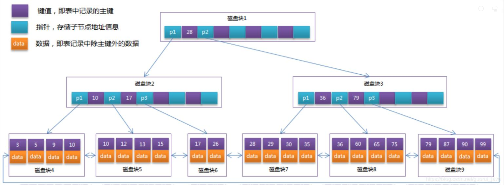

# DCL

DLC: 数据库控制语言, 通常由DBA用于管理数据库权限

> Data Controller Language

作用: 管理数据库的权限

> 管理用户访问和操作特定数据库或表的权限

面试题:

在公司内不能用数据库root账号进行开发

> 按照团队分: 开发 测试 运维
>
> 也会按照项目分

**一般不能将数据库访问权限提供给第三方使用**

需要提供数据给第三方时可以通过api

**表权限有四种: 增删查改 insert delete select update**

**增删查改的英文为CRUD: create read update delete

> DCL语句

```sql
#将woniuxy数据库的所有表的所有权限授权给用户user@任何IP地址
#注意数据库的权限需要通过用户名和登陆的IP地址进行双重认证
grant all on woniuxy.* to 'user'@'%';
#注意mysql8不允许在grant命令中新建用户, 所以下行sql命令会报错
grant all on woniuxy.* to 'new_user'@'%' identified by '123456';
#刷新权限
flush privileges;
```

> 移除权限

```sql
#移除增改删权限
revoke insert,update,delete on woniuxy.* from 'user'@'%';
#刷新权限
flush privileges;
```

> SQL命令创建用户

```sql
#查询系统表中的密码限制的环境变量
show variables like 'validate_password%';
#创建一个test用户,设置密码12345678aA!
create user test identified by '12345678aA!';
```

# 视图

视图 view被称为虚拟表, 视图本身不存储数据, 仅仅存储查询语句从数据库中读取数据并展示

> 所以当数据库中的数据发生变化时, 表展示的数据也会变化

> 创建一个表

```sql
#创建一张v_test表, 存储woniuxy数据库中test表的id字段数据
create view v_test as select id from woniuxy.test;
#跟子查询一样, 视图也可以作为查询语句的数据源
select * from v_test;
#删除视图
drop view v_test;
```

**查询语句的返回结果本质就是一个临时视图(行内视图)**

# 函数

常见的函数: **注意函数的操作对象一般为单个字段**

| 函数名       | 作用                                           |
| ------------ | ---------------------------------------------- |
| count        | 计数                                           |
| sum          | 求和                                           |
| avg          | 求平均值                                       |
| max          | 求最大值                                       |
| min          | 求最小值                                       |
| ifnull       | 筛选并保留空值                                 |
| group_concat | 将某个字段的多行记录合并为一行记录, 用逗号分割 |

## 字符串函数

**字符串函数的操作对象可以为字段或字符串**

**字符串函数不会操作数据源本身, 仅仅是将操作结果打印出来**

字符串函数有

| 函数名                        | 功能                                                         |
| ----------------------------- | ------------------------------------------------------------ |
| concat(a,b)                   | 拼接a和b                                                     |
| substr( ... from ... for ...) | 截取                                                         |
| trim( a from b)               | 从b中删除a(删除位置是开头和结尾,可以匹配多个, 不会删除中间被其他字符包围的a) |
| trim(a)                       | 删除a中的空格                                                |
| uuid()                        | 没有操作对象, 直接返回一个36位的随机码(字符串)               |

```sql
#将id字段和stu_name字段合并为一列新记录, 并且插入字符串
select concat('id:',id,'  姓名:',stu_name) from stu_info;
#删除stu_name的空格并输出
select trim(stu_name) from stu_info;
#删除学生姓名开头或结尾的'张'
select TRIM('张' from stu_name) from stu_info;
```

常用日期函数

> 下列三个函数都没有操作对象, 直接返回一个表示当前时间的字符串

| 函数      | 格式                |
| --------- | ------------------- |
| now()     | yyyy-MM-dd hh:mm:ss |
| curdate() | yyyy-MM-dd          |
| curtime() | hh:mm:ss            |

year() month() day() 分别读取对象中的年份 月份 日

**dual表是一个虚拟表, 不包含任何数据 仅仅用于使sql命令符合语法要求**

```sql
#获取当前的年份
select year(now()) from dual;
#获取当前的月份
select month(now()) from dual;
#获取当前的天数
select day(now()) from dual;
```

一个完整的软件系统应该包含程序(计算逻辑)和数据

DBMS通过提供函数提供了计算能力, 而不仅仅是存储数据

**数据库自定义函数仅仅需要了解, 不需要深究**

调用自定义函数必须使用select语句

```sql
select test_max(id) from test;
```

# 存储过程

一般的函数都只能通过select语句调用, 意味着其返回结果只能打印出来而不能存储到数据库中

存储过程是一个特殊的函数,不需要通过select语句执行

可以使用存储过程来修改数据库

> delimiter语句用于声明函数或存储过程的开始和结束

delimiter $$ ... $$ delimiter;

```sql
delimiter $$
#声明存储过程
#in表示输入参数 out表示输出参数 inout表示该参数可以输入也可以输出
create procedure test(in id int,in name varchar(20),out res int)
begin 
... #sql命令
end$$
delimiter;
```

> 调用存储过程

```sql
#@res表示全局参数
call test(1,'小白',@res);
select @res;
```

# 约束

mysql中常用的约束有4种

| 关键字      | 限制 |
| ----------- | ---- |
| not null    | 非空 |
| unique      | 唯一 |
| primary key | 主键 |
| foreign key | 外键 |

> auto_increment和default并非约束, 而是添加新数据的逻辑, 不会对字段数据进行完整性检查

主键约束 primary key

主键约束包含了非空约束和唯一约束, 意味着主键必须是非空且唯一的

一个表只允许有一个主键

主键可以是一个字段或者多个字段组成(复合主键)

约束分为列级(字段)约束和表级约束

```sql
create table test(
    #列级约束
	id int not null;
    #创建表级约束并设置约束名test
    constraint test not null;
    #创建表级约束, 多个字段作为复合主键
    primary key(id,name)
);
#用alter ... modify ... 语句修改列定义来添加列级约束
alter table test modify id int primary key;
#添加新的主键约束前必须先删除旧主键约束
alter table test drop primary key;
#删除约束名
alter table test drop index test;
#用alter ... add ... 语句来添加表级约束
alter table test add primary key(id);
```

# 事务

事务(Transaction)

事务是数据库操作的执行基本单位, 事务可以包含一个或多个sql语句

早期的mysql存储引擎不支持事务, 现在mysql默认使用的InnoDB引擎提供了良好的事务支持

面试题: myisam和innodb的区别

| 特性                 | innodb         | myisam           |
| -------------------- | -------------- | ---------------- |
| 存储限制             | 64TB           | 256TB            |
| 事务支持             | 支持           | 不支持           |
| 外键支持             | 支持           | 不支持           |
| 数据缓存支持         | 支持           | 不支持           |
| 默认储存引擎版本     | mysql5.5及之后 | mysql5.5之前     |
| 事务多线程安全       | 支持表锁       | 支持行锁         |
| 每个表对应的文件数目 | 2个(frm,ibd)   | 3个(frm,myd,myi) |
| 默认索引结构         | 树形(B+树)     | hash             |

| 特性     | 树形索引 | hash索引 |
| -------- | -------- | -------- |
| 聚簇     | 支持     | 不支持   |
| 范围查找 | 支持     | 不支持   |


> myisam其实支持树结构索引, 但是没有用树作为默认索引结构
>
> innodb不支持hash索引

**mysql作为DBMS有三层架构**

1. 连接层 处理客户端连接和鉴权认证
2. 服务层 负责查询语句(select语句)的解析 优化 缓存, 还有内置函数和存储过程的实现
3. 存储引擎  负责数据库中数据的存储 提取(write read)


**存储引擎是DBMS架构的最底层并且最核心的组成部分, 直接负责事务的实现**

> 执行sql命令时会自动生成事务,自动提交

> mysql手动声明事务

```sql
#声明事务开始
start transaction;
#start transaction等同于begin语句
#rollback;语句会上面的所有语句注释掉, 必须进行新的声明(begin)
#一条或多条sql语句
... 
#提交事务, 将sql命令的执行结构写入数据库
commit;
```

事务必须满足四特性: ACID

| 特性   | 要求                                                         | 英文        |
| ------ | ------------------------------------------------------------ | ----------- |
| 原子性 | 事务不可再分                                                 | atomicity   |
| 一致性 | 同一事务的数据准确无误, 不能有差异                           | consistency |
| 隔离性 | 不同事务间相互独立, 互不干扰                                 | isolation   |
| 持久性 | 一条事务被commit后存储到磁盘中, 在执行新事务前数据不能被修改 | durability  |

> 事务要保证正确可靠必须具备ACID四特性

# 索引

索引: index

可以通过索引快速查找到数据库中的数据

**索引可以提高数据库的查询效率**

> hash索引结构


hash索引结构不支持范围查找和聚簇索引

innoDB是用B+树结构作为索引结构

> B+树索引结构



> B+树索引(并且主键作为索引)可以将其余数据都聚合到索引叶子节点上, 这被称为聚簇索引
>
> B+树索引支持范围查询, 搜索效率高

聚簇: 索引和数据放在同一个区域中

非聚簇: 索引和数据放在不同的区域

# B树

b树: b-tree

b树是一种特殊的自平衡搜索树

> 注意b树不是二叉树, 可以有多个子节点

**二叉树适合将数据存储到内存中**

而B树的数据一般保存到磁盘中

B树的设计思想是尽量减少树的高度(减少磁盘的访问次数)

> 内存的数据访问时间非常快,适合进行多次访问
>
> 而磁盘的数据访问时间非常慢, 需要尽量减少访问次数

树状数据的操作(搜索 插入 删除 求最大值或最小值)所需磁盘时间为O(h)

> h为树的高度

B树的节点数目需要尽可能接近或等同于磁盘块大小(block)

> block是磁盘读写的基本单位

自平衡二叉搜索树(如红黑树, AVL树), 由于其节点最多只能有两个子节点, 导致其高度很高, 需要频繁进行数据访问

而B树的高度尽可能的降低, 所以其数据访问次数会比二叉树低很多

**B树的操作(搜索 插入 删除)时间复杂度为O(log n)**

B树特性:

1. 所有

# B+树

B+树是一种特殊的B树, B+树只能用叶子来存储数据指针