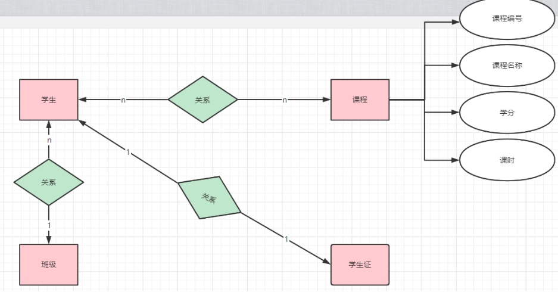

# SQL

SQL: 结构化查询语言(Structured Query Language)

SQL数据库: 关系型数据库, 关注于数据间的关系

NO-SQL数据库: 非关系型数据库, 关注于存储数据本身

SQL语言分为: DDL	DML	DQL	DCL 事务控制语句

DDL:  数据库定义语言(Data Definition Language)	

> 用于建库建表

DML:  数据库操作语言(Data Manipulation language)

> 用于对表进行增删查改

DQL:  数据库查询语言(Data Query Language)

> 在表中查询数据[重点学习]

DCL:  数据库控制语言(Data Control language)

> 用于设定权限(数据库 表 数据)

| 分类         | 关键字                                     |
| ------------ | ------------------------------------------ |
| DDL          | create  update  delete                     |
| DML          | create  alter  drop  truncate              |
| DQL          | select                                     |
| DCL          | grant  revoke                              |
| 事务控制语句 | commit  rollback  savepoint add constraint |

查询语句是最复杂功能最丰富的SQL语句(面试重点)

**SQL语句的关键字不区分大小写**

> 注意标识符是区分大小写的

标识符命名规则:

1. 以字母开头
2. 由字母 数字和三个特殊符号组成 #_$
3. 多个单词用_分割开组成

# DDL

DDL是数据库定义语言, 用于对数据库进行增删查改

| DDL命令  | 功能                                 |
| -------- | ------------------------------------ |
| create   | 创建数据库或者数据库对象             |
| drop     | 删除数据库或者数据库对象             |
| alter    | 更改数据库结构或属性                 |
| truncate | 删除表的所有记录, 包括分配的内存空间 |
| comment  | 添加注释                             |
| rename   | 重命名数据库对象                     |

数据库对象: 

| 名称     | 英文            |
| -------- | --------------- |
| 表       | table           |
| 索引     | index           |
| 函数     | function        |
| 视图     | view            |
| 存储过程 | store procedure |
| 触发器   | trigger         |

**MYSQL不支持重命名数据库, 但是可以将数据库复制到新命名的数据库**

>Data Definition Language 

```sql
//创建一个test数据库, 设置其字符集为utf8mb4
//utf8mb4等同于java中的utf-8, 四个字节存储空间
CREATE DATABASE test CHARACTER SET 'utf8mb4';
```

> utf8在数据库只有3个字节, 尽量使用utf8mb4

```sql
//修改数据库的字符集
alter database test character set 'utf8mb4';
//删除数据库
drop database test;
```

> 在test数据库中创建stu_info表

```sql
//进入test数据库进行操作
use test;
//创建空的stu_info表
create table stu_info();
//创建有数据的teacher_info表
create table teacher_info(
    //列名 数据类型(size) [约束],
    //size=20代表有20个字符
	teacher_name varchar(20) NOT NULL,
    //数据类型不需要添加size
	age int,
    //小数点数
    test_price decimal,
    //default设置默认值约束, 不设置默认值会为空(null)
    test_name varchar(20) default '小白',
    //大文本类型
    test_text text,
    //图片文件(二进制文件)
    test_img blob,
	gender char(2),
	work_no varchar(20)
);
```

> 修改表

```sql
//修改表名teacher_info为new_teacher_info
alter table teacher_info rename to new_teacher_info;
//向表中添加列
alter table teacher_info add birthday date;
//修改列
alter table teacher_info change birthday teacher_birthday int;
//删除列
alter table teacher_info drop birthday;
//删除表
drop table teacher_info;
```

# MYSQL数据类型

mysql中的数据类型主要有3种数值类型 字符串类型  日期类型

| 类型       | 具体类型                                                |
| ---------- | ------------------------------------------------------- |
| 数值类型   | 严格数值类型 近似数值类型                               |
| 字符串类型 | char, varchar, binary, varbinary, blob, text, enum, set |
| 日期类型   | datetime, timestamp, date, time, year                   |

**mysql支持所有标准sql数值类型**

严格数值类型:	integer(int) smallint decimal(dec) numeric

近似数值类型:	float real double precision

字符串类型:

> varchar:  变长字符串	char:  定长字符串
>
> blob:  二进制长文本数据	text:  长文本数据
>
> char(30)代表其可以存储30个字符, 并非代表字节个数

# DML

DML用于表操作

> Data Manipulation Language

# ER图

ER图: 实体关系图(Entity Relationship图)

ER图是需求分析的结果

用于描述实体间的关系, 通过ER图可以设计对应的数据库

ER图的组成部分: 矩形	椭圆	菱形

> 矩形表示实体
>
> 椭圆表示属性(实体的属性)
>
> 菱形表示关系(实体间的关系)



> ER图一般由产品经理在需求分析阶段提供, 用于设计对应的数据库

# 约束

约束(constraint)是对数据库数据做的限制

可以用于限制一列的数据或者一行的数据

主键约束: primary key

**主键必须是唯一的, 不能为空, 尽量避免修改主键**

> 注意多个列可以组合构成主键, 被称为复合主键

> 创建带约束的表

外键可以有重复值, 可以为空(即使主键是非空的),

外键必须对应另外一个表的主键

```sql
create table user_info(
    //设置自增
	id int auto_increment,
    //设置非空
	user_name varchar(20) not null,
    //设置唯一
	login_name varchar(20) unique,
	telephone varchar(20) unique,
    //设置默认
	edu_school varchar(20) DEFAULT('蜗牛学苑'),
	fk_role_id int,
    //设置主键
	primary key(id),
    //设置外键
	foreign key(fk_role_id) references role_info(id)
);
```

> 在表中增加约束

```sql
//主键约束
create table test5(
	pk_id int,
    //约束是一个独立语句应该用逗号分隔开
	primary key(pk_id)
);
//将id设置为主键
alter table test8 add primary key(id);
//删除表的主键约束
alter table test8 drop primary key;
//在表里增加列
alter table test9 add ok2 int;
//将ok列设置为唯一的, 不允许有重复值
alter table test9 add unique(ok);
//将ok2列的默认值设置为default
alter table test9 alter ok2 set default 1;
//将ok列重新定义(重命名并设置属性和注释)
//注释一般在定义表的时候给列添加, 并非设计成可以用语句单独修改
alter table test9 change `ok` `ok3` int comment "id of test";
```

# 数据库范式(Normalization)

数据库范式有 1NF 2NF 3NF BCNF 4NF 5NF 6NF

**范式中1NF 2NF 3NF是最重要的**

第一范式: 原子性, 每一列都不能再被拆分

第二范式: 1NF的基础上, 所有列必须与主键有关系(依赖于)

> 要求一个表中必须有主键(必须是单列主键, 不能是复合主键), 所有的列都必须与主键有关系

> 主键必须是每行信息的唯一标识
>
> 所有的列都必须与主键有关系

第三范式: 1NF 2NF的基础上要求, 所有列必须跟主键有直接关系, 不能是间接关系

> 间接关系: 属性A依赖于属性B再依赖于主键

