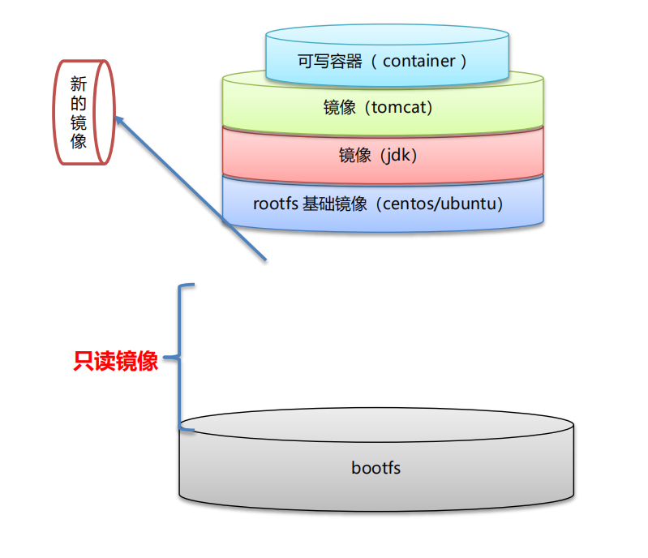

# Docker

docker是基于Go语言开发的虚拟容器引擎, 实现了对cgroup，namespeace，rootfs三个内核资源的虚拟化(隔离和控制)

> 由于cgroup和namespage这两个内核特性是基于Linux的, 因此docker的虚拟化也是基于linux的

虚拟机和容器的区别

| 虚拟机                                   | 容器                        |
| ---------------------------------------- | --------------------------- |
| 安全性高, 与宿主机相互独立               | 安全性低, 会影响到宿主机    |
| 整个计算机虚拟化(包括内存 网络 硬盘 cpu) | namespace(用户空间)的虚拟化 |
| 开销高                                   | 开销低                      |
| 包含模拟层和管理层                       | 直接调用操作系统的接口      |

> 早期docker的底层是linux系统提供的LXC(内核容器虚拟化) ,现代的docker已经不需要使用lxc, 而是使用go从底层重新实现

docker是一个高级容器引擎, 将容器的复杂操作进行封装, 使容器的创建和管理简单化

docker优点: 简单, 高性能, 组装化, 实现了运行环境的移植性缩短了应用开发上线的周期时间(一次封装，到处运行)

docker推荐一个容器只运行一个

docker的镜像代表一个应用环境, 通过镜像可以创建容器并运行, 通过同一个镜像产生的容器的运行环境完全相同, 容器的特点是可读可写

docker常用命令:

| 命令                                             | 作用                       |
| ------------------------------------------------ | -------------------------- |
| v                                                | 显示docker的版本           |
| container list -a                                | 列出所有的容器             |
| start 容器名                                     | 启动容器                   |
| stop 容器                                        | 停止容器运行               |
| rm 容器名                                        | 删除容器                   |
| rmi 镜像名                                       | 删除镜像                   |
| exec -it 容器名 /bin/bash                        | 进去容器中(进入bash)       |
| run  镜像:版本                                   | 根据镜像启动一个容器       |
| search 镜像名                                    | 搜索对应名称的镜像         |
| pull 镜像:版本                                   | 远程拉取镜像               |
| images                                           | 列出本地仓库中的所有镜像   |
| build -f 指定的dockerfile路径 -t 自定义镜像:版本 | 根据dockerfile生成一个镜像 |
| commit 容器id 镜像名称:版本号                    | 根据容器生成镜像           |
| save -o ab.tar 镜像名称:版本号                   | 将镜像导出为压缩文件       |
| load -i ab.tar                                   | 根据压缩文件导入镜像       |

docker run参数:

| 参数                 | 作用                   |
| -------------------- | ---------------------- |
| -i                   | 保留交互界面           |
| -d                   | 启动守护进程           |
| -t /bin/bash         | 在容器启动后进入命令行 |
| -p host端口:容器端口 | 端口映射               |
| -v 主机目录:容器目录 | 文件目录映射           |
| --name 容器名称      | 设置容器名称           |
| -e                   | 设置环境               |

docker镜像:

linux的文件系统有两部分: bootfs和rootfs

> bootfs: boot文件系统, 包含bootloader和kernel, 在系统启动时被加载
>
> rootfs: root文件系统, 根文件目录, 包含系统启动后才运行的标准文件

linux不同发行版本的bootfs基本相同, 但是rootfs(配套软件)的区别很大

docker镜像的底层是自定义的rootfs文件, 被称为base image, 同时镜像也依赖于host的bootfs

> tomcat容器的分层架构



使用一个镜像创建并启动容器时, docker会在镜像的文件系统顶层加载一个可读写文件系统, 这个文件系统就是容器 

> 多个相同镜像的容器会共用同一个镜像作为底层文件系统,只有顶层的可读写文件系统是不同的

**镜像的文件系统对于容器来说是只读的**

**dockerfile**用于根据配置的参数创建自定义的镜像

dockerfile可以分为4部分: 基础镜像 维护者信息 镜像创建时的操作指令 容器启动时的操作指令 

dockerfile内容:

| 命令                       | 作用                                                         |
| -------------------------- | ------------------------------------------------------------ |
| FROM                       | 指定基础镜像                                                 |
| MAINTAINER 作者名          | 设置作者信息                                                 |
| ENV 键 值                  | 设置环境变量                                                 |
| RUN command                | 构建镜像时运行指定的bash命令                                 |
| ADD source_path dest_path  | 将指定路径的文件或目录拷贝到镜像中的路径, 会自动解压, 或者下载url |
| COPY source_path dest_path | 跟add类似, 但没有自动解压功能                                |
| WORKDIR path_dir           | 指定dockerfile运行命令的工作目录                             |
| CMD command                | 设置容器运行时会自动执行的bash命令                           |

**docker-compose**

docker-compose用于根据配置的参数创建容器

> docker-compose.yaml

````yaml
version: '3.9'
services:
  my-nginx-service:
    container_name: my-website
    image: my-nginx-image:latest
    cpus: 1.5
    mem_limit: 2048m
    ports:
      - "8080:80"
````

