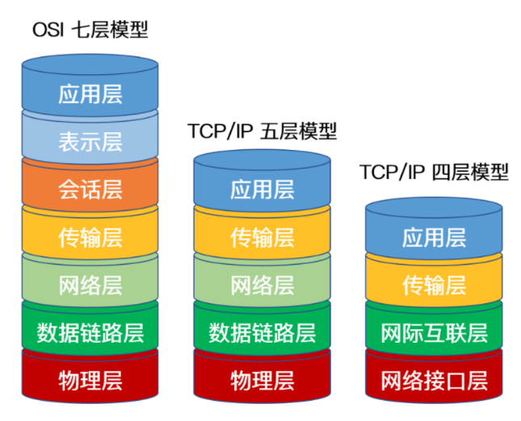
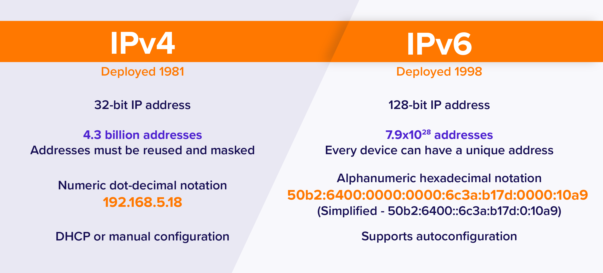
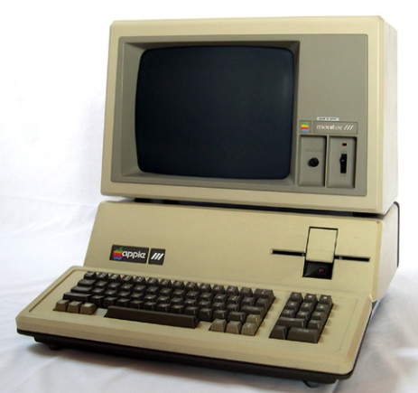
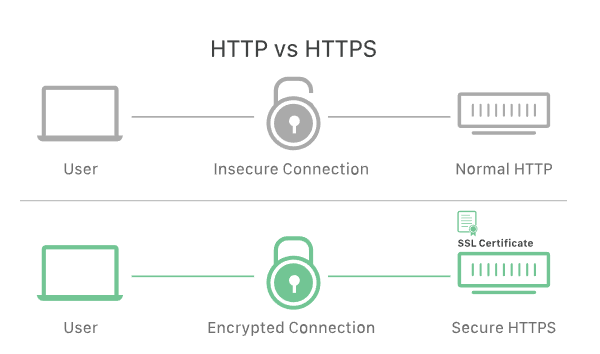

# HTTP详解

计算机网络的应用层协议

我们通常用各种模型将复杂的计算机网络进行分层

每一层都会有不同的协议

> 最顶层的协议封装越好, 最方便编程
>
> 最底层

越底层协议对整个网络的影响越大

翻墙时或公司内网会用到的VPN通常是处于网络层或数链层

TCP UDP这种协议是属于传输层

IPv4 IPv6协议属于网络层

而HTTP就是处于最顶层的应用层协议

应用层协议意味着我们进行软件编程时一般都是直接使用http协议

## IPv4 IPv6

IPv4是一个32位的地址, 意味着它总共可以提供2^32, 大约是43亿个地址

实质上并不是所有地址都作为公网地址, 也就是互联网上面使用的地址, 因为还要将地址分为内网地址和公网地址

那个年代的手机

2斤重 半小时电话就没电

那个年代的计算机

## HTTPS

https的全称是带加密的http(http with encrypted)

它跟http协议的区别是https在http的基础上使用SSL安全协议来加密请求和响应

