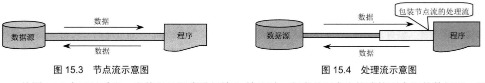
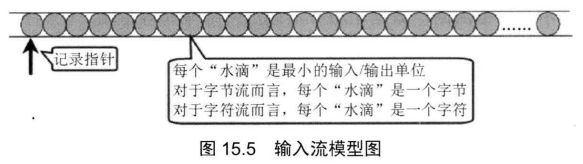
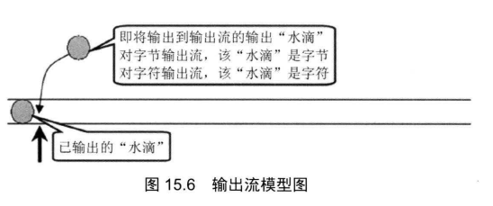
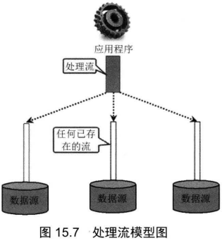
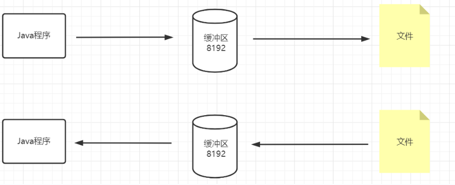

# IO

输出是指将程序内部的数据输出到外部(磁盘 U盘), 使程序生成的数据可以存储起来

输入是指将外部的数据读取(输入)到程序内, 使程序可以处理数据

IO(Input/Output)输入/输出

在java.io包下的提供了各种类和接口来提供IO支持

IO流有两种, 输入流和输出流

输入和输出流中也分为字节流和字符流两大类

字节流以字节为单位处理输出和输出

字符流以字符为单位处理输入和输出

java还使用了装饰器设计模式将IO流分为底层节点流和上层处理流

底层节点流: 与底层的物理存储节点直接关联

java7中在java.nio下提供了全新的API(NIO2) ,是对原来的NIO(新IO)的升级

通过NIO2的API, 可以进行更高效的输入输出操作

**序列化可以将内存中的对象转换为二进制字节流, 使得java对象通过IO流传输**

> 序列化是分布式编程的重要基础

# File类

java.io.File类有各种对文件目录的操作API, 并且是平台无关的

File类中的API可以操作文件或者目录, 进行新建 删除 重命名操作, 但是无法对已经存在的文件本身进行修改或读取操作, 必须使用IO流才能访问文件本身

File类使用的文件路径可以是相对路径或者绝对路径

> 相对路径默认情况下是用户的工作路径, 即jvm运行的路径

File对象创建后, 就可以调用其实例方法对其对应的文件或目录进行操作

常用实例方法:

> (下列方法的文件都可以为目录)目录实质上是一种特殊的文件

| 实例方法                              | 作用                                                         | 返回    |
| ------------------------------------- | ------------------------------------------------------------ | ------- |
| ------获取信息------                  |                                                              |         |
| getName                               | 返回文件名或最后一级子路径名的字符串                         | String  |
| getPath                               | 返回路径名的字符串(包含文件名)                               | String  |
| getAbsoluteName                       | 返回绝对路径(包含文件名)对应的对象                           | File    |
| getAbsolutePath                       | 返回绝对路径(不包含文件名)                                   | String  |
| getParent                             | 返回父目录名                                                 | String  |
| renameTo                              | 重命名文件, 成功返回true, 否则返回false                      | boolean |
| lastModified                          | 返回文件最后修改时间                                         | long    |
| length                                | 返回文件长度                                                 | long    |
| ---操作文件----                       |                                                              |         |
| createNewFile                         | 创建文件                                                     |         |
| delete                                | 删除文件(如果当前对象为文件夹, 不会做任何操作) 并且将引用变量赋值为null |         |
| deleteOnExit                          | 将引用变量置为null,注册一个删除hook, 当JVM结束运行时将file对象 |         |
| ----操作目录-----                     |                                                              |         |
| mkdir                                 | 创建文件夹                                                   | boolean |
| list                                  | 列出文件夹下面的所有文件和文件路径                           | String  |
| listFiles                             | 列出文件夹下面所有的文件和目录, 返回它们的对象               | File    |
| -----检测方法-----都为boolean返回类型 |                                                              |         |
| exists                                | 判断文件是否存在                                             |         |
| canWrite                              | 判断文件是否可写                                             |         |
| canRead                               | 判断文件是否可读                                             |         |
| isFile                                | 判断对象是否为文件, 不是目录                                 |         |
| isDirectory                           | 判断是否是目录                                               |         |
| isAbsolute                            | 判断对象的路径是否是绝对路径                                 |         |

还有两个static方法

createTempFile(String prefix, String suffix)

在默认的临时文件目录创建一个随机文件名的文件

> 随机文件名为 prefix+随机数+suffix
>
> 如果suffix为null, 将使用默认的后缀".tmp"

createTempFile(String prefix, String suffix, File Directory)

在指定的目录创建临时文件

listRoots

列出当前系统的所有根目录

> 在linux中,以/开头一定是绝对路径 (双向一定)
>
> 在Windows中, 以盘符开头一定是绝对路径

```java
File file=new File("C:\\Users\\libolon\\Downloads\\New folder2");
//必须使用双反斜杠, 因为java中反斜杠默认为转义字符
if(!file.exists()){
    file.mkdir();
    //不存在则创建
}
file.isDirectory();
file.isAbsolute();
file.isHidden();
File[] files=file.listFiles();
for (File file1 : files) {
    file.getPath();
    file.getName();
}
String[] names=file.list(((dir, name) ->{
    return name.endsWith("java");
}));
//用lambda表达式实现FilenameFilter的accept方法
for (String name : names) {
    System.out.println(name);
}
```

## 文件过滤器

list方法可以接收FilenameFilter参数, 只列出被筛选后的文件

FilenameFilter为函数接口, 可以用lambda表达式创建

> 遍历子目录下面的文件

```java
File[] files = file1.listFiles();
for (File file : files) {
    if (file.isDirectory()) {
        showAllFiles(file);
    } else {
        System.out.println(file.getPath());
        System.out.println(file.getName());
    }
}
```

# IO流

java通过IO流来实现IO操作, 在java中 输入/输入源(source)被抽象为流(stream)

> java中的流(stream) 是指从源头(source)接收到(sink)的有序数据(格式化数据)

java.io包中有所有传统的流类型, 可以用来实现IO

> java将不同类型的输入输出源都抽象为流(stream)的形式, 可以使用相同的api来处理流, 而无须考虑复杂的底层, 大大提高了编程效率

按照方向可以将流分为输入流和输出流

输入流: 只能读取数据, 不能写入数据

输出流: 只能写入数据, 不能读取数据

> 这里的输入和输出都是站在程序的角度说的

| 流类型 | 抽象基类                  |
| ------ | ------------------------- |
| 输入流 | InputStream和Reader       |
| 输出流 | OutputStream和Writer      |
| 字节流 | InputStream和OutputStream |
| 字符流 | Reader和Writer            |

字节流和字符流的使用api几乎完全相同, 但是它们处理的基本单位不同

字节流处理8位的字节

字符流操作16位的字符

按照流的角色又分为: 节点流和功能(处理)流

节点流: 直接处理数据源流入的数据

功能流: 将数据源数据进行一些功能封装的流

> 功能流的现实实例位蓄水池, 变压器



节点流又被称为低级流(Low Level Stream)

处理流被称为高级流(High Level Stream)

处理流实际是经过包装后的节点流, 这也是java中经典装饰器设计模式的体现, 因此处理流也被称为包装流

**一般程序员都是在程序中使用处理流(高级流), 因为处理流提供了便捷的API可以

# 流

java中IO流一共有40多个类, 并且都是由以下4个抽象基类派生的

**InputStream	Reader	OutputStream	Writer**

> 输入流



> 输出流



java中IO流的设计具有良好的灵活性：

1. 使用缓冲区来提高输入/输出效率
2. 提供API来一次处理大量数量的数据

不同数据源都转换为同一的处理流， 用相同的代码进行处理



# 字节流

字节流操作生命周期

三步: 创建流	操作流	关闭流

> 输入流代码示例

```java
//创建流
FileInputStream fileInputStream=new FileInputStream("C:\\Users\\libolon\\Downloads\\New folder2\\4.java");
byte[] datas=new byte[1024];
//读取\操作流 一次读取1024字节
while(fileInputStream.read(datas)!=-1){
    System.out.println(Arrays.toString(datas));
}
System.out.println("Second");
//由于字节流已经读取完了, 所以下面的代码不会被执行
while(fileInputStream.read(datas,0,datas.length)!=-1){
    System.out.println(Arrays.toString(datas));
}
//关闭流
fileInputStream.close();
```

> 输出流代码示例

```java
FileOutputStream fos= new FileOutputStream(
        "C:\\Users\\libolon\\Downloads\\New folder2\\1.txt");
System.out.println("请输入");
Scanner sc=new Scanner(System.in);
String input =sc.nextLine();
byte[] datas=input.getBytes(StandardCharsets.UTF_8);
fos.write(datas);
fos.close();
```

> 使用输入输出流复制一个文件到另一个文件

```java
FileOutputStream fos=new FileOutputStream("C:\\Users\\libolon\\Downloads\\New folder2\\1-cpoy.txt");
FileInputStream fis=new FileInputStream("C:\\Users\\libolon\\Downloads\\New folder2\\1.txt");
byte[] datas=new byte[10];
while(fis.read(datas)!=-1){
    fos.write(datas);
}
fos.close();
fis.close();
```

# 字符流

字节流和字符流的API非常相似

但是字节流可以操作任何文件（二进制文件和文本文件）

字符流只能识别文本文件，无法正确识别处理二进制文件

> 因为二进制文件以字节为单位存储数组， 并非使用字符存储数据

> 字符流读取

```java
FileReader r= new FileReader("C:\\Users\\libolon\\Downloads\\New folder2\\1.txt");
char[] datas=new char[1024];
while(r.read(datas)!=-1){
//            String s=Arrays.toString(datas);
//            String s=String.valueOf(datas);
    String s=new String(datas);
    System.out.println(s);
}
```

> 字符流写入

```java
FileWriter fileWriter=new FileWriter("C:\\Users\\libolon\\Downloads\\New folder2\\4.txt");
Scanner sc=new Scanner(System.in);
System.out.println("请输入");
String s=sc.nextLine();
fileWriter.write(s);
fileWriter.close();
```

> 文件复制

```java
FileReader fr=new FileReader("C:\\Users\\libolon\\Downloads\\New folder2\\4.txt");
FileWriter fw=new FileWriter("C:\\Users\\libolon\\Downloads\\New folder2\\4-copy.txt");
char[] chars=new char[10];
while(fr.read(chars)!=-1){
    fw.write(chars);
}
System.out.println("复制完成");
fr.close();
fw.close();
//输出流如果没有写close语句， 不会对文件进行修改操作（数据实际上还在内存中未写入磁盘）
//只有待写入数据达到1024个字节才会执行磁盘写入
```

# 字节流和字符流

## 输入流

InpuStream和Reader是所有输入流的抽象基类

InputStream是字节输入流， Reader是字符输入流

它们都有处理文件读取的实现类：

FileInputStream	FileReader

| 方法名                          | 字节流                                                      | 字符流     | 返回值               |
| ------------------------------- | ----------------------------------------------------------- | ---------- | -------------------- |
| read()                          | 读取一个字节                                                | 单位为字符 | 返回读取到的数据     |
| read(byte[] b)                  | 读取b.length长度的数据                                      | 字符数组   | 返回读取到的数据长度 |
| read(byte[] b,int off, int len) | 读取len个字节， 存储到字节数组中(从数组的第off个元素开始存) | 单位为字符 | 返回读取到的数据长度 |

**打开的IO流不属于内存中的资源， 因此GC不会回收IO资源， 当一个IO资源不再使用时应该显式关闭该资源**

> jdbc编程中的数据库资源也是类似， 无法被GC自动回收

> 在java7中将IO类都实现了AutoCloseable接口， 可以通过try语句来实现自动关闭IO资源

```java
//只要将IO资源的使用代码放入try语句中即可实现自动关闭IO资源
try {
    BufferedInputStream bis = new BufferedInputStream(
            new FileInputStream(
                    "C:\\Users\\libolon\\Downloads\\New folder2\\4.txt"));
    BufferedOutputStream bos = new BufferedOutputStream(
            new FileOutputStream(
                    "C:\\Users\\libolon\\Downloads\\New folder2\\4_2.txt"));
    byte[] datas = new byte[1024];
    while (bis.read(datas) != -1) {
        bos.write(datas);
    }
}catch (Exception e){
    e.printStackTrace();
}
//下行代码会产生编译错误， 因为该IO只能在try语句内使用， 离开try语句会导致该资源被自动关闭
bis.read();
```

输入流类实例方法：

| 记录指针方法  | 形参               | 返回值  | 功能                           |
| ------------- | ------------------ | ------- | ------------------------------ |
| mark          | int readAheadLimit | void    | 在当前指针位置记录mark         |
| markSupproted | 无                 | boolean | 判断该输入流是否支持记录标记   |
| reset         | 无                 | void    | 将指针重置到上次的记录（mark） |
| skip          | long n             | long    | 将指针向前移动n个字节、字符    |

## 输出流

OutputStream	  Writer

| 实例方法 | 参数                    | 功能                                          | 返回值 |
| -------- | ----------------------- | --------------------------------------------- | ------ |
| write    | int                     | 将传入字节输出到字节流(int可以与字节相互转换) | void   |
| write    | byte[]                  | 将字节数组输出                                | void   |
| write    | byte[], int off,int len | 从数组的off位置开始输出len长度的字节          | void   |

# 缓存流

缓存流是一种提供了缓存功能的高级流

特性：

1. 不会直接处理文件
2. 提供了缓冲区， 提高了输入/输出效率

**高级流创建时必须指定底层的低级流, 体现了装饰器设计模式**

| 缓存流(高级流)       | 低级流       |
| -------------------- | ------------ |
| BufferedInputStream  | InputStream  |
| BufferedOutputStream | OutputStream |
| BufferedReader       | Reader       |
| BufferedWriter       | Writer       |

> 缓冲流的使用




```java
BufferedInputStream bis =new BufferedInputStream(
        new FileInputStream(
                "C:\\Users\\libolon\\Downloads\\New folder2\\4.txt"));
BufferedOutputStream bos =new BufferedOutputStream(
        new FileOutputStream(
                "C:\\Users\\libolon\\Downloads\\New folder2\\4_2.txt"));
byte[] datas=new byte[1024];
while(bis.read(datas)!=-1){
    bos.write(datas);
}
bis.close();
bos.close();
```

