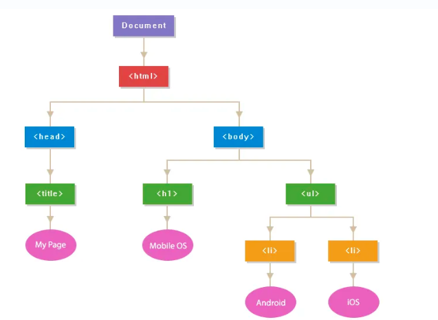

# JavaScript

js是一种面向对象的解释性编程语言, 但是与java不同在于js程序以原型(prototype)为单位, 而java以类为单位, 并且java是一种半编译半解释的编程语言

特点:

1. 脚本语言, 支持嵌入网页中执行
2. 弱类型, 变量声明时不需要指定类型, 变量类型由赋予的值决定
3. 语法简单, 不严格
4. 用于实现网页的动态效果以及服务器通信

js的版本对应ES标准的版本

前端常用的ES版本为ES5和ES6

**数据类型**

js的数据类型有三种: 简单数据类型 复合数据类型 特殊数据类型

1. 简单数据类型: 数值 布尔 字符串
2. 复合数据类型: 数组 函数 对象
3. 特殊数据类型: NaN null undefined(特殊情况下的数据)

**声明变量**

可以用var或let来声明变量, const声明常量

var可以重复声明同名的变量

而用let声明的变量无法被重复声明

```JavaScript
var a;
//不会报错
var a;
let b;
//报错
let b;
```

**流程控制**

**js中的循环 选择语句与java完全相同**

js中默认执行顺序: 从上到小 从左到右(与java相同)

可以通过三种方法改变默认的顺序:

1. 选择结构: 单分支 双分支 多分支
2. 循环
3. 调用其他方法

> 基本和java相同

选择结构: if 	if else 	if else if 	switch case

> 语法和java相同

循环结构:

while()	for(;;)	do{}while()

>语法和java相同

**数组**

js中数组没有类型和长度的限制, 可以视为java中的集合

```js
//声明两个数组
let arrs=[1,2,3,4];
let arrs2=new Array(1,2,3,4,5);
//返回数组长度
arrs.length;
//数组排序
arrs.sort();
//用lambda表达式实现数组的遍历
arrs.forEach(e=>console.info(e))
//for循环遍历数组
for (var i = 0; i < arrs.length; i++) {
    console.info(arrs[i]);
} 
//增强for循环遍历数组
for(i in arrs){
    console.info(arrs[i]);
}
```

## 函数

js中的函数(function)与java中的方法(method)相同

> 声明自定义函数

```js
function 函数名(参数列表){}
```

js中函数的语法和java非常接近, 但是要注意函数名前要用function关键字, 并且返回类型不需要声明, 直接用return返回即可

三元判断符

```js
(条件语句)?真返回值:假返回值
```

lambda表达式

```js
(形参列表)=>{}
```

**内置函数**

| 函数名                                | 作用                                                       |
| ------------------------------------- | ---------------------------------------------------------- |
| 调试                                  | 打印信息到浏览器的调试console                              |
| console.log()                         | debug级别                                                  |
| console.info()                        | info级别                                                   |
| console.warn()                        | 警告级别                                                   |
| consolde.error()                      | 错误级别                                                   |
|                                       |                                                            |
| 运算                                  |                                                            |
| isNaN()                               | 判断变量是否为NaN                                          |
| Number()                              | 将字符串转换为数值                                         |
| eval()                                | 对字符串变量进行计算                                       |
|                                       |                                                            |
| 定时运行                              |                                                            |
| setTimeout()                          | 延迟执行任务(只执行一次)                                   |
| setInterval()                         | 定时执行任务(循环)                                         |
|                                       |                                                            |
| document                              |                                                            |
| document.getElementById("id")         | 获取对应id的元素, 可以通过该方法返回的对象来继续操作该元素 |
| document.getElementById().value       | 获取value属性值                                            |
| document.getElementById().textContent | 获取元素包含的文字对象                                     |
|                                       |                                                            |
| 弹窗                                  |                                                            |
| alert()                               | 警告弹窗                                                   |
| prompt()                              | 对话弹窗                                                   |
| confirm()                             | 确认弹窗                                                   |
|                                       |                                                            |
| 日期                                  |                                                            |
| getTime()                             | 获取时间(1970年)                                           |
| getFullYear()                         | 获取年份                                                   |
| getMonth()                            | 获取月                                                     |
| getDay()                              | 周                                                         |
| getDate()                             | 日                                                         |
| getMinutes()                          | 分支                                                       |
| getSeconds()                          | 秒                                                         |
| getMilliseconds()                     | 毫秒                                                       |

> 日期函数使用示例

```js
let date = new Date();
date.getFullYear();
date.getMonth());
date.getDate());
console.log(dateFormat("yyyy-MM-dd hh:mm:ss",date));
```

> 内嵌js示例

```html
<!DOCTYPE html>
<html>

<head>
    <meta charset="utf-8">
    <title></title>
    <style type="text/css">
        .container {
            border: 5px solid black;
            width: 500px;
            height: 500px;
        }
    </style>
    <script>
        function myFunction() {
            let var1 = 
               // document.getElementById("var1").value;
            let var2 = document.getElementById("var2").value;
            let result = var1 + var2;
            let resultE = document.getElementById("result");
            resultE.textContent = var1 + var2;
            console.info(result);
        }
    </script>
</head>

<body>
    <div class="container">
        <h1>计算器</h1>
        <input type="text" name="var1" id="var1">
        <p></p>
        <input type="text" name="var2" id="var2">
        <button onclick="myFunction()">加</button>
        <p></p>
        <span>结果是:</span>
        <span style="color: red;" id="result"></span>
    </div>
</body>

</html>
```

# 对象

js对象用{}定义, 由变量和函数组成, 并且是一行代码

```js
//注意对象体内的代码都是参数, 应该用逗号分隔, 不能用;分隔(视为一行代码)
var girl={
    Name:"孙尚香",
    age:1,
    hello:function(message){
        console.info(message);
    },
    type:1
};
girl.Name;
girl.hello("hello");
```

## BOM

BOM: 浏览器对象模型(Browser Object Model)

BOM提供了变量和函数来读取或操作当前浏览器的信息

BOM有5种类型: Window	Screen	Location	History	Storage

Storage分为LocalStorage(永久缓存)  SessionStorage(会话缓存, 关闭窗口会自动被删除)

**调用Window对象的属性或函数时可以省略window.前缀**

> BOM属性

| 属性                                       | 解释                 |
| ------------------------------------------ | -------------------- |
|                                            |                      |
| screen.width                               | 屏幕宽度             |
| screen.height                              | 屏幕高度             |
| screen.availWidth                          | 有效宽度(去掉滚动条) |
| screen.availHeight                         | 有效高度(去掉滚动条) |
| screen.colorDepth                          | 颜色深度             |
| screen.pixelDepth                          | 像素深度             |
|                                            |                      |
| history.back()                             | 返回上一页           |
| history.forward()                          | 前往下一页           |
| history.go()                               | 跳转到指定的页数     |
|                                            |                      |
| localStorage和sessionStorage的方法完全相同 |                      |
| localStorage.setItem(key,value)            | 设置key和value       |
| localStorage.getItem(key)                  | 根据key返回value     |

> BOM方法

| 方法      | 作用           |
| --------- | -------------- |
| window.   |                |
| alert()   | 弹窗           |
| confirm() | 确认窗口       |
| prompt()  | 对话窗口       |
| open()    | 打开一个window |
| close()   | 关闭一个window |

## json

JSON: js对象表示方法(JavaScript object notation)

json可以替代xml, 用于前后端交换信息

> json在js中的本质是一个有具体格式的字符串, 并且json字符串保存了单个或多个对象的信息

```js
let user={
    userName:"张三",
    age:18
};
//将对象转换为json字符串
let json=JSON.stringify(user);
let userList=[{},{}];
//将对象的集合转换为json字符串
let json2=JSON.stringify(userList);
//手动创建json字符串
let json3='[{"userName":"张三","age":18},{}]';
//将json字符串解析为集合
let datas=JSON.parse(json3);
//遍历集合
datas.forEach(e=>{
    e.userName;
    e.age;
});
```

## 事件

js中的函数都是事件驱动模式

>js函数绑定对应的标签元素上的事件, 通过事件去触发运行

事件有: 点击事件 键盘事件 表单事件 初始化事件

**event对象**

event对象可以获取到触发事件的信息

event.keyCode: 获取键盘触发事件的keyCode(被按下的键)

| 事件           | 触发条件                                 |
| -------------- | ---------------------------------------- |
| 点击事件       |                                          |
| onclick        | 单击                                     |
| ondblclick     | 双击                                     |
| onmousedown    | 鼠标按下                                 |
| onmouseup      | 鼠标放开                                 |
| onmouseseenter | 指针移动到元素上                         |
| onmouseleave   | 移出元素                                 |
| onmouseover    | 指针移动到元素或子元素上                 |
| onmouseout     | 移出元素或子元素                         |
| 键盘事件       |                                          |
| onkeypress     | 点击了某个键                             |
| onkeydown      | 按下某个键                               |
| onkeyup        | 松开某个键                               |
| 初始化事件     |                                          |
| onload         | 页面初始化完成后执行(一般与body元素绑定) |
| 表单事件       |                                          |
| oninput        | 用户输入时触发                           |
| onchange       | 内容改变时触发                           |
| onsubmit       | 表单提交前触发                           |
| onreset        | 表单重置前触发                           |
| onsearch       | 搜索框输入内容时触发                     |
| 表单焦点事件   |                                          |
| onfocus        | 获取焦点时触发(点击输入框)               |
| onblur         | 失去焦点时触发(离开输入框)               |

```js
//在表单提交前进行校验, 只有返回true才会执行submit, false则不会submit
<form action="https://www.baidu.com" onsubmit="return checkForm()">
```


## document对象

document提供了三种方法来获取html中的元素

| 方法                  | 作用                     |
| --------------------- | ------------------------ |
| getElementById()      | 获取对应id的第一个元素   |
| getElementByName()    | 获取对应name的元素的集合 |
| getElementByTagName() | 获取对应tag的元素集合    |

获取到元素后可以读取或修改元素的属性

```js
var input = document.getElementById("input");
//通过style属性可以修改对应的css样式
input.style.width = "200px";
//通过input元素的value属性可以获取用户的输入值
let value=input.value;
```

## DOM

DOM: 文档对象模型(Document Object Model)

DOM会将整个网页从根节点开始解析为一个节点树



js可以通过DOM访问网页元素:

1. 修改元素文本内容(e.textContent)
2. 修改元素属性(e.value)
3. 修改元素的css样式(e.style.width)
4. 动态绑定元素(根据元素的状态去绑定)
5. 修改元素的父元素(parentNode)

**动态绑定**

```html
<head>
    <script>
        function myClick() {
            alert("点击1");
        }
        <!--动态绑定需要在页面初始化之后-->
        function onloadM() {
            let btn01 = document.getElementById("btn01");
            btn01.onclick = () => {
                alert("点击2");
            };
        }
    </script>
</head>
<body onload="onloadM()">

    <!--行内事件绑定-->
    <button onclick="myClick()">1</button>
    <!--动态绑定-->
    <input id=btn01 type="button" value="2">
    <!--行内嵌js-->
    <input type="button" onclick="alert('hello');" value="3">
</body>
```

**变量**

js中的变量分为全局变量和局部变量

全局变量定义在函数外, 生命周期为整个页面的生命周期, 作用域为整个页面

局部变量定义在函数内, 生命周期为函数的生命周期, 作用域为函数内

# CSS内联元素

html中的元素分为三类: 块状元素 内联元素 内敛块状元素

1. 块状元素: div p h1-h6
2. 内联元素: a span br i em strong
3. 内联块状元素: img input

块状元素特点: 

1. 独占一行(自动换行)
2. 可以设置 width height line-height margin-top margin-bottom
3. 默认宽度为父元素的100%

内联元素特点:

1. 不换行
2. 无法设置width height line-height margin-top margin-bottom
3. 默认宽度会随包含的内容变化

**可以通过css将标签改为块状元素或内联元素或内联块状元素**

```css
//改为块状元素
display:block
//改为内联元素
display:inline
//改为块状内联元素
display:inline-block
```

**注意如果代码块不写在任何函数中, 将会在页面初始化之前就执行该代码**

**希望在页面初始化后执行代码需要绑定onload**

# regex(正则)

正则表达式用于匹配字符串

正则表达式有7种组成部分

1. 普通字符: 数字 字母 下划线 汉字以及非特殊含义符号
2. 转义字符: \n \t \r (在正则表达式中需要用\\\表达(\\))
3. 标准字符集合: \d \w \s . \D \W \S
4. 自定义字符集合: []
5. 量词: {}
6. 字符边界: ^ $
7. 选择符: |(或者)

| 符号 | 范围           |
| ---- | -------------- |
| ^    | 匹配一行的开头 |
| $    | 匹配一行的结尾 |
| \b   | 匹配单词结尾   |
| \B   | \b取反         |
| \d   | [0-9]          |
| \w   | [a-zA-Z0-9]    |
| \s   | 空白字符       |
| *    | 任意数量       |

> js用正则

```js
var pattern = /(^.*$)/;
if(pattern.test(tel.value))return true;
else return false;
```

> java用正则

```java
var pattern = "(^.*$)";
//返回true或false
Pattern.compile(pattern).matcher(str).matches();
```

