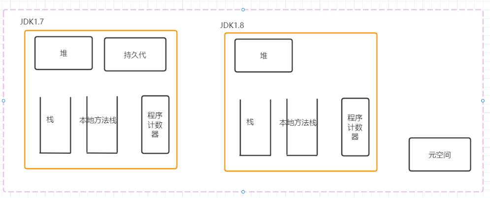
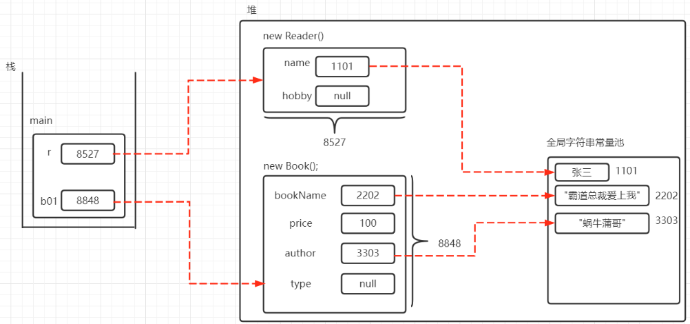

Java对象内存模型

JVM启动后会向操作系统申请内存空间 CPU时间片

JVM内部内存空间分为5个部分

> 栈(stack) 堆(heap) 本地方法栈 程序计数器 元空间

栈: Java程序中运行方法的内存空间 

堆(**运行时内存**): 存储对象

> 字符串常量池属于一种对象缓存池
>
> 也会存储在堆内存中

本地方法栈: 存储与操作系统相关的底层方法,

与程序中的自定义方法空间不相关

程序计数器: 存放代码的执行顺序

元空间: 存储类



>在Java1.8之前元空间叫做持久代或方法区, 存储在JVM内部
>
>在Java1.8后, 元空间取代了持久代, 存储在JVM外部



方法中的引用变量存储在栈内存中

引用变量会指向堆内存中的对象

数组中的引用变量本身存储在堆内存中, 可以指向堆内存中的其它对象

# static修饰符

static修饰的成员代表它属于类本身, 不属于单个实例.

所以static修饰的方法和成员变量也称为类方法 类变量

没有static修饰的方法 成员变量只能在类的单个实例里面调用(对象), 也叫做实例方法 实例变量

> 在大部分中文资料里面将static修饰的成员称为静态成员 (静态方法 静态变量), 但实际上特性跟动态没有相反的意思

静态成员无法直接访问非静态成员

修饰的成员不能访问非static成员, 只能访问其他用static修饰的成员

> 虽然可以通过实例/对象来访问类成员(static),
>
> 但是这种做法会影响程序的可读性, 建议直接通过类来调用类成员

**类成员将在类被调用时保存在内存空间中, 后面调用类不再重复创建, 具有唯一性**

>static成员在类加载期间创建并保存在元空间(独立于JVM)

**对象成员必须通过对象来调用访问, 每次创建新的对象时都会创建并保存到所属对象的内存空间中**

> 非static成员在运行时创建并保存在堆内存

所以不同对象的成员变量是不同的,

类成员变量是唯一的

# 封装

Java提供了三种访问控制修饰符来实现封装

private protected public

> 面向对象三大特征: 封装 继承 多态
>
> 抽象也是重要特征

Java中的类和实例的成员变量可以进行封装来向外界隐藏对象的内部信息

面向对象三大基本特征: 封装(Encapsulation) 继承(implement) 多态(polymorphism)

封装:

隐藏--将对象的内部进行隐藏

包装--不允许外部程序直接访问成员变量, 在类的内部提供对应的方法来实现对成员变量的操作

封装可以实现:

1. 对类外面隐藏类的实现细节

   > 通常使用private修饰符实现

2. 提供方法来操作成员变量, 在方法里面可以加入安全限制逻辑

3. 保证成员变量的完整性

4. 提高代码的可维护性

封装在Java里面通过访问控制修饰符来实现

Java里面有3种访问控制符: private protected public

还有一种情况是不加任何访问控制符的默认级别

访问控制级别从小到大

private -> default -> protected -> public

访问控制级别表

| 范围       | private | default | protected | public |
| ---------- | ------- | ------- | --------- | ------ |
| 同一个类   | 1       | 1       | 1         | 1      |
| 同一个包   |         | 1       | 1         | 1      |
| 子类中     |         |         | 1         | 1      |
| 全局范围内 |         |         |           | 1      |

```java
class Outer{
    class Inner{}
}
```

上述代码定义了一个Outer外部类和Inner内部类

访问控制符中, private和protected不能用于修饰外部类

> 访问控制符可以用于控制类的成员能否被其他类访问

> 访问控制符可以用于修饰类成员和类本身

> 对于外部类, 只有一种访问修饰符可以用public
>
> 两种状态: 默认 public

一份Java源代码文件中, 如果所有类都没有用public修饰, 则源代码文件名可以取任意的.

一个Java源代码中只能有一个public修饰的类, 且文件名必须与public修饰的类名相同

JavaBean规范: Java类的每个成员变量都用private修饰符修饰, 并且每个成员变量都需要提供对应的setter getter方法(必须是用public修饰的)

模块化程序设计特点:

1. 高内聚 (尽量将模块的内部数据, 功能实现向外界隐藏, 避免受到外界干扰)
2. 低耦合 (提供封装好的方法给外部使用)

访问控制符使用建议:

1. 大部分的成员变量都用private修饰, 仅当成员变量被static修饰时或者作为全局变量使用时才考虑用public修饰
2. 如果一个类中的方法是提供给其子类重写用的, 应该用protected修饰
3. 类的构造器应该用public修饰, 来运行其他类创建该类的实例, 大部分外部类也应该用public修饰

# this关键字


**this**关键字总是指向调用该方法的对象

在构造器中this会引用该构造器正在初始化的对象

在方法中this会引用调用该方法的对象

this关键字主要用于在类中的一个方法里面访问该类的其他方法或类变量(避免需要重复创建对象来调用其他方法)

在Java中一个类的类成员可以直接调用其他成员, 相当于省略了this前缀(和加上this的效果是完全一样的)

**注意在static修饰的方法中是不允许使用this关键字的**

> 遵循了类成员(static 静态)无法访问非类成员(非static 非静态)的语法规定(静态成员无法访问非静态成员)

> 本质上是因为类成员变量是在类加载时就创建, 而对象成员变量只在运行时创建. 两者的运行时间和内存空间都完全不同, 所以只允许运行时间在后面的实例方法调用类成员(类成员的作用域比实例成员更大)

当一个类中的方法里有局部变量和全局变量同名, 会导致全局变量被覆盖掉, 这时必须使用this关键字才能访问全局变量