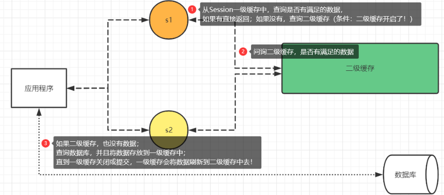
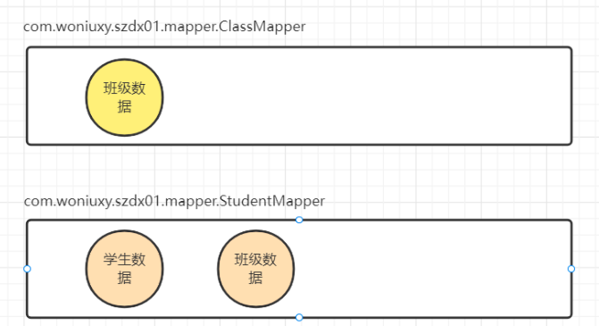

**mybatis SQL**

> 下面两个sql语句相同

```sq
select * from test where name like '%${name}%';
select * from test where name like concat('%',#{name},'%');
```

# Mybatis 动态SQL

五种动态SQL

注意动态查询where和动态更新set标签都是为了if语句服务的, 否则加不加where或set标签没有区别

1. where if
2. set if
3. foreach
4. include
5. choose when otherwise

## 动态查询

动态查询由select where if 标签组成

where便签会自动将内容插入到select语句的where位置

if标签用于检查传入参数是否符合要求

> if标签内为传入参数的标识符, 并非sql中的字段

```xml
<select id="searchStudentByNameAndAge" resultType="com.lee.szdx03.bean.StudentBean">
        select * from student_info where stu_name=#{name} and age=#{age}
</select>
<select id="searchStudent" resultType="com.lee.szdx03.bean.StudentBean">
    select * from student_info
    <where>
        <if test="name!=null">
            stu_name like '%${name}%'
        </if>
        <if test="age!=null">
            age=#{age}
        </if>
    </where>
</select>
```

# 动态循环

通过foreach标签实现动态新增或动态删除

> 动态新增

```xml
<insert id="saveStu">
        insert into student_info(stu_no,stu_name,fk_class_id) values
    <foreach collection="stuList" item="stu" separator=",">
        (#{stu.stuNo},#{stu.stuName},#{stu.fkClassId})
    </foreach>
</insert>
```

> 动态删除

```xml
<delete id="deleteStuByIdList">
        delete from student_info where id in
    <foreach collection="ids" item="id" separator="," open="(" close=")">
        #{id}
    </foreach>
</delete>
<!--open和close属性可以手动添加开头结尾代替-->
<delete id="deleteStuByIdList">
        delete from student_info where id in (
    <foreach collection="ids" item="id" separator=",">
        #{id}
    </foreach>
    )
</delete>
```

# 动态重复sql

使用include和sql标签

include通过refid属性指定对应id的sql标签填充在include标签所在位置

sql里面包含重复的sql语句或者标签

```sql
<select id="findStuByCommonSql" resultType="com.lee.szdx03.bean.StudentBean">
        select * from student_info
    <include refid="commonSql"></include>
</select>
<sql id="commonSql">
    <where>
        <if test="name!=null">
            stu_name like '%${name}%'
        </if>
        <if test="age!=null">
            age=#{age}
        </if>
    </where>
</sql>
```

**动态选择了解即可**

# 关联查询

关联查询有三种方式: 预加载	即时加载 延时加载(懒加载)

按照数量关系也分为一对多查询	多对一查询	多对多查询

**多对多查询仅需要了解即可**

多表间映射关系:

一对一映射:	任意一方引入另一个方的主键作为外键

一对多映射:	多的一方

多对多映射:	创建中间关系表, 引入两张表的主键作为外键

## 一对多查询

> 以班级和学生作为一对多关系进行解释

预加载也被称为表连接查询

> 在进行条件查询前, 先将两个表用连表查询关联为一张表

```xml
<!--预加载查询-->
<resultMap id="classmap" type="com.lee.szdx03.bean.ClassBean">
    <id property="id" column="cid" javaType="long"></id>
    <result property="className" column="class_name" javaType="string"></result>
    <result property="classLeader" column="class_leader" javaType="string"></result>
    <collection property="stus" javaType="list" ofType="com.lee.szdx03.bean.StudentBean">
        <id property="id" column="sid" javaType="long"></id>
        <result property="stuNo" column="stu_no" javaType="string"></result>
        <result property="stuName" column="stu_name" javaType="string"></result>
    </collection>
</resultMap>
<select id="findClassByPreload" resultMap="classmap">
    select *,cl.id as cid,st.id as sid from class_info as cl inner join student_info as st on cl.id=st.fk_class_id where class_name like '%${className}%'
</select>
```

> ClassBean

```java
public class ClassBean {
    private long id;
    private String className;
    private String classLeader;
    //需要添加stus列表来接收连查表中的student记录
    private List<StudentBean> stus;
}
```

及时加载也被称为分布查询

> 将查询分为两步进行, 先查询班级对象, 然后通过外键在学生表中进行查询, 将查询到的学生对象集合封装到班级对象中

```xml
<!--即时加载查询-->
<resultMap id="classmap02" type="com.lee.szdx03.bean.ClassBean">
    <result property="className" column="class_name" javaType="string"></result>
    <result property="classLeader" column="class_leader" javaType="string"></result>
    <!--select属性指向第二步查询-->
    <collection property="stus" javaType="list" select="getStuByClassId" column="id"></collection>
</resultMap>
<select id="getStuByClassId" resultMap="stumap">
    select * from student_info where fk_class_id=#{id}
</select>
<select id="findClassInTimeLoad" resultMap="classmap02">
    select * from class_info where class_name like '%${className}%'
</select>
```

> 懒加载需要配置mybatis-config.xml文件

```xml
<settings>
    <!--开启延迟加载-->
	<setting name="lazyLoadingEnabled" values="true"/>
</settings>
```

开发中常用预加载和懒加载

> 即时加载有可能会跟子查询一样, 造成大量次数的查询, 消耗大量资源, 效率低下

## 多对1查询

预加载	延迟加载

> 多对一推荐使用预加载

```xml
<!--预加载多对一查询-->
<resultMap id="stumap" type="com.lee.szdx03.bean.StudentBean">
    <id property="id" column="sid" javaType="long"></id>
    <result property="stuNo" column="stu_no" javaType="string"></result>
    <result property="stuName" column="stu_name" javaType="string"></result>
    <association property="cls" javaType="com.lee.szdx03.bean.ClassBean">
        <id property="id" column="cid"></id>
        <result property="className" column="class_name"></result>
        <result property="classLeader" column="class_leader"></result>
    </association>
</resultMap>
<select id="findStudentPreload" resultMap="stumap">
    select *,st.id as sid, cl.id as cid from student_info as st inner join class_info as cl on st.fk_class_id=cl.id where stu_name like '%${stuName}%'
</select>
```

> 延迟加载

## mybatis缓存机制

面试知识:

1. 缓存存储在内存中, 读写速度快
2. 缓存分为本地缓存和分布式缓存
3. 本地缓存指本机的内存空间, 可以直接进行使用
4. 分布式缓存指多台机器上面的内存空间, 通过网络进行使用

mybatis中有两级缓存, 一级缓存 二级缓存

一级缓存: (默认开启)由SqlSession提供, 每个SqlSession对象对应一个一级缓存空间

二级缓存: (默认关闭)由SessionFactory提供

> 二级缓存架构图



二级缓存有缺陷

> 一级缓存会将相同的查询语句只执行一次, 将执行结果缓存起来直接返回给相同的查询语句

```java
hm.findHouseByNumbersPreload("1");
hm.findHouseByNumbersPreload("1");
//上述代码只会在数据库中进行一次查询
pm.selectAllParking();
pm.selectAllParking();
pm.selectAllParking();
//为什么全表查询会进行两次查询
```

> 二级缓存有缺陷, 虽然是由SessionFactory提供, 但是会按照Mapper(namespace)来划分缓存空间



> 开发中常用Redis作为缓存技术

需要缓存的数据有:

1. 高命中热点数据
2. 空间占用量较小
3. 修改频率低

