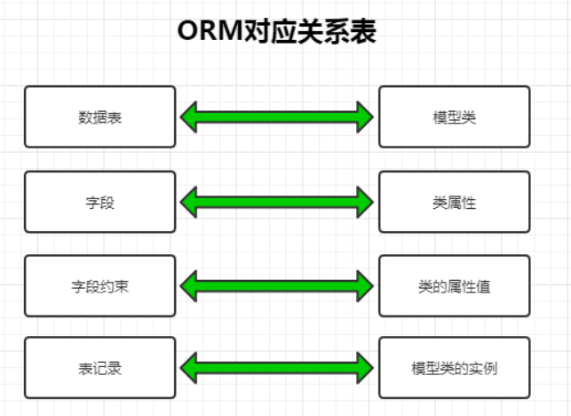

# Mybatis复习

JDBC编程的缺点:

1. 数据库连接无法自动管理, 必须由程序员手动建立和关闭, 浪费数据库性能
2. sql语句硬编码在java代码, 每次修改sql语句都需要重新编译java代码

所以需要一种将java代码和数据库sql语句分离的编程模式

ORM: 对象关系映射(Object Relational Mapping)

orm将数据库中的表数据映射为对应的对象,java代码操作orm对象, 然后将orm对象传递给数据库进行增删改查, 实现了业务逻辑代码和数据库sql语句的分离

 

为什么需要ORM:

1. ORM可以实现业务逻辑代码和数据库sql语句的分离
2. Java代码属于面向对象思想, 数据库sql属于纯粹数学理论, 两者并不兼容, 需要一个兼容层(映射)

ORM优点:

1. 将数据库访问的SQwL语句进行封装, 使业务代码在进行数据库增删改查时不需要考虑SQL语句实现
2. 在xml中编写sql语句, 增强了复用性, 可维护性, 可读性
3. 可以实现自动化数据类型转化

ORM缺点:

1. 自动化的映射和关联管理会导致性能下降, 只能通过延迟加载和缓存技术来降低性能损失
2. 增加了学习成本
3. 实现复杂查询会非常困难

java中常见的ORM框架: Hibernate, iBATIS, mybatis

## mybatis

mybatis是一个持久层ORM框架,支持自定义SQL, 储存过程, 高级映射, 可以完全替代JDBC代码

mybatis使用xml文件配置原生信息, 将Mapper接口和java中的对象(POJOs)映射为数据库中的记录

> 注意映射可以是双向的

mybatis-config.xml

| 标签               | 属性    | 值                | 解释                           |
| ------------------ | ------- | ----------------- | ------------------------------ |
| configuration      |         |                   | 根标签                         |
| environments       | default | 指定默认的环境id  | 可以配置多组环境并指定默认环境 |
| environment        | id      |                   | 配置单组环境                   |
| transactionManager | type    | JDBC              | 使用jdbc的事务处理方式         |
| dataSource         | type    | POOLED            | 配置数据库连接类型             |
|                    |         | UNPOOLED          |                                |
|                    |         | JNDI              |                                |
| property           | name    | 配置sql连接的属性 |                                |
|                    | value   | 配置对应的值      |                                |

> mybatis-config.xml需要通过mybatis提供的Resource.getResourcesAsStream方法读取, 并传给SqlSessionFactoryBuilder中的实例方法build()

mybatis框架在session包下提供了创建数据库连接池的类: 

SqlSession	SqlSessionFactory	SqlSessionFactoryBuilder

> mybatis读取mybatis-config.xml并创建数据库连接池示例

```java
class Test{
    void test(){
        try{
            //读取mybatis-config.xml,通过配置信息来创建连接池和映射Mapper
            InputStream is=Resources.getResourceAsStream("mybatis-config.xml");
            //创建Builder对象
            SqlSessionFactoryBuilder builder=new SqlSessionFactoryBuilder();
            //builder通过配置信息来创建连接池工厂
            SqlSessionFactory factory=builder.build(is);
        }
    }
}
```

1. SqlSessionFactoryBuilder: 用于读取配置创建工厂, 一般创建工厂后则不再需要builder, 所以应该将builder作为局部变量(方法内变量)使用
2. SqlSessionFactory: 连接池(工厂), 其生命周期应该等同于mybatis程序的生命周期
3. SqlSession: 一个数据库连接, 用于执行sql语句.   SqlSession应该作为局部变量使用, SqlSession关闭后会被连接池回收管理

> 可以用try...catch..finally...语句来确保SqlSession正确关闭

注意SqlSession类似于JDBC中Connection的功能, 但是SqlSession默认需要手动提交事务, Connection默认自动提交事务

> Mapper接口也可以被称为DAO接口

SqlSession提供了多种实例方法

| 方法      | 功能                   |
| --------- | ---------------------- |
| getMapper | 获取Mapper接口的实现类 |
| commit    | 提交事务               |
| rollback  | 回滚事务               |
| close     | 结束使用资源           |

> SqlSession使用示例

```java
InputStream is=Resources.getResourceAsStream("mybatis-config.xml");
SqlSessionFactory factory=new SqlSessionFactoryBuilder().build(is);
is.close;
//创建ThreadLocal对象
ThreadLocal<SqlSession> tl=new ThreadLocal<>();
//将会话绑定到threadLocal对象上
tl.set(factory.openSession());
//通过tl获取SqlSession对象
SqlSession session=tl.get();
//获取Mapper接口的实现类
session.getMapper(UserMapper.class);
//解除会话绑定
tl.remove();
```

>SqlSession线程不安全, 需要绑定ThreadLocal(线程绑定)

分页查询

```java
Page<BuildingBean> page= PageHelper.startPage(1,5).doSelectPage(()->cm.selectAllCarcharge());
```

> mybatis本身没有实现具体的日志, 但是可以将内置的日志工厂交给其他日志框架来实现日志功能如: 
>
> SLF4J	Log4j	JDK logging	Apache Commons Logging

Mapper.xml

注意resultMap	association	collection标签都需要手动开启automapping属性, 否则需要全部手动将字段和对象属性做映射

automapping="true"

> 默认是false关闭状态

automapping会自动将同名的(不区分大小写)字段和属性进行映射

SqlSession对象对于select语句提供了两种方法:

1. selectOne:	(默认方法)只能返回一条查询结果, 如果存在多条返回结果会报错
2. selectList:   返回一条或多条记录

**selectList需要在xml中配置select标签设置resultMap属性, 或者在接口类中指定为列表返回类型**

mybatis可以用#{}或${}作为sql语句的占位符来传递参数

区别:

1. #{}为预编译, 可以防止sql注入, 更加安全
2. ${}为字符串替换, 无法防止sql注入, 不安全

```sql
<!-- 传参#{}=11 -->
select * from test where id= #{}
<!-- 实际执行的sql语句 -->
select * from test where id= ?
<!--  ${} 传参11 -->
select * from test where id= ${}
<!-- 实际执行的sql语句 -->
select * from test where id=11
```

