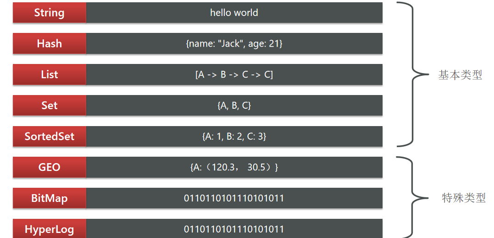
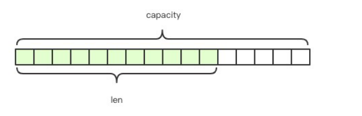
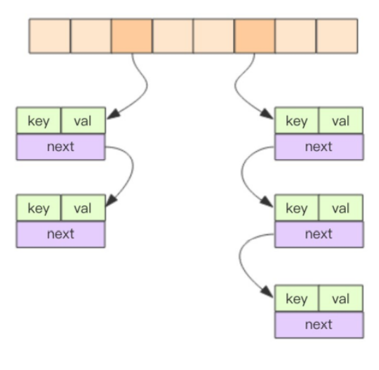
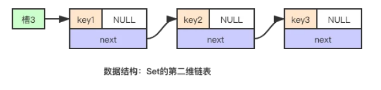
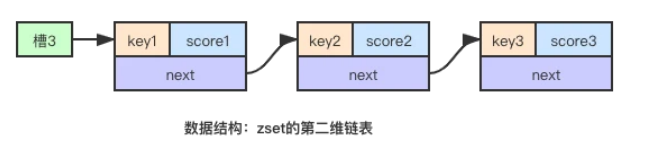
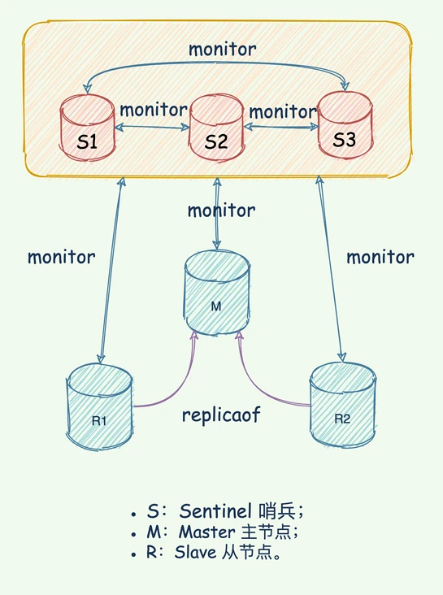
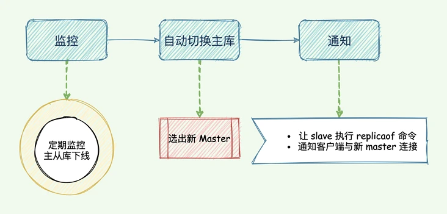

# Redis

**Redis**是一种**NoSql**数据库

NoSql是非关系型数据库, 仅仅保存数据本身,不会保存数据间的关系

非关系型数据库是为了适应现代互联网服务的高并发 大数据场景而设计, 一般都将数据存储在内存中提高数据读写速度(需要一直通电, 易丢失), 后续再通过持久化将需要长久保存的数据

> 一般NoSql保存的都是需要频繁使用(访问)的热点数据
>
> 持久化保存的是冷却的数据

常见的NoSql数据库： redis  mongoDB memcache HBase

Redis是典型的NoSql数据库, 使用数据以键值的形式保存在内存上

> redis应用场景： 作为分布式系统的公共内存

redis特点：

1. 单线程， 原子性操作。 保证在高并发场景下的事务性
2. 基于内存的存储设计， 性能高
3. 支持主从复制。 主服务器可以自动将数据同步到多个从服务器，需要进行读写分离(主服务器负责处理写入操作, 从服务器负责读取操作)
4. 非阻塞IO模型， 多个网络连接可以复用同一个线程
5. 支持持久化（AOF和RDB两种方式）， 使用写拷贝（copy on write）技术进行数据更新
6. key和value的大小最高可以到512M
7. 数据结构为键值对， 操作简单
8. 数据类型丰富

redis缺点:

1. 主从同步会导致数据延迟
2. 容量受内存大小限制, 一般需要搭配mysql使用才能支持大数据场景

redis和Memcached对比

| redis                  | Memcached |
| ---------------------- | --------- |
| 支持复杂数据类型       | 不支持    |
| 支持主从同步           | 不支持    |
| 支持持久化, 数据更安全 | 不支持    |

redis常用命令：

| 命令                 | 作用                                  |
| -------------------- | ------------------------------------- |
| dbsize               | 返回当前数据库key的数量               |
| info                 | 返回当前redis服务器的状态             |
| monitor              | 实时监听redis服务器收到的所有请求信息 |
| shutdown             | 将数据持久化， 并关闭服务器           |
| config get parameter | 获取对应redis配置信息                 |
| set                  | 存储键值对                            |
| get                  | 通过键获取对应的值                    |
| 根据键查询           |                                       |
| ttl                  | 查询过期时间                          |
| type                 | 查询数据类型                          |
| exists               | 查询数据是否存在                      |
| strlen               | 查询值的长度                          |

## 数据类型和数据结构

redis的五种常见数据类型：

1. 字符串： 字符串包括整数和浮点数， redis中的字符串为动态字符串， 支持修改， 并且通过预分配多余空间来减少重新分配内存空间的次数

   注意redis和一般的数据库都不支持存储二进制数据， 一般会通过使用base64编码将二进制文件转换为对应的字符串再存储到redis中

2. 字典(hash table)： 无序字典, 当字典的第一维数组位置碰撞时(冲突), 会将两个数组元素存储的第二维链表合并起来

3. list: list相当于java中的链表, 有序, 可重复, 根据元素进出顺序可以充当队列(FIFO)或栈(FILO)

   > 链表特性:修改(插入删除)操作快, 查找操作慢 

4. set: set是字典(hashTable)的特殊实现, 与hashTable的区别:list只存储key, value都是null, 并且list新增数据时会进行去重

5. zset: zsetsorted set, 基于set实现的有序集合, 并且支持设置权重

   > 通过zset可以实现实时排行榜

数据类型示例

redis字符串内存示例

 redis中的字符串为动态字符串

len表示实际存储的字符串长度，capacity表示当前字符串已经分配的内存空间

当字符串修改扩容时超过了capacity， 会先申请重新分配内存空间， 并且每次扩容最多扩容1M, 最大可以扩容到512M的容量

> 超过1M的扩容需要申请多次扩容直到满足内存要求

hash的存储结构是数组和链表组成的二维结构

set的链表数据结构

zset的链表数据结构

redis存储键值时不需要指定数r据类型， redis服务器会自动识别

如果值可以被识别为十进制整数或浮点数， 那么可以在redis中对该值进行加减操

## 持久化

## 面试题

> redis持久化的方式

redis支持两种持久化方式：RDB AOF

RDB (Redis DataBase): 定时将内存中数据快照写入磁盘， 以二进制文件的形式压缩存储

AOF (Append Only File): 使用日志将服务器的增删查改操作记录到文本文件中

>redis应用场景

redis应用场景:

1. 会话缓存 (session cache)
2. 排行榜 rank
3. 订阅发布系统 subscribe
4. 热点数据缓存 
5. 实时统计数据

> 常见的redis集群架构

> 三台服务器组成的redis集群
>
> 一主两从

主从

哨兵: (**Sentinel**)哨兵是redis提供的高可用方案, 用于处理redis主服务器宕机时选择一个slave切换为master

> 哨兵是一个进程, 一般运行在主从服务器中, 不会单独运行在一台服务器上

哨兵的作用:

1. 持续监控master slave的工作状态
2. 当master宕机时通过选举机制切换master
3. 通知其他的slave执行replicaof与新的master同步

哨兵工作步骤:

1. 哨兵集群只需要配置当前master的ip和端口, 不需要配置其他哨兵或者slave信息

2. 哨兵与master建立通信, 并通过redis的订阅发布机制与其他的哨兵建立通信
3. 哨兵通过发送info到master获取slave的列表, 与列表上每一个slave都建立连接, 进行持续监控

## 安全

**如何防止redis被黑：**

1. 设置好防火墙， 进行IP白名单管理， 或者只允许内网访问

2. 禁用掉危险命令（config）， 一般的黑客攻击会利用config命令修改redis配置来进一步植入木马攻击系统

   >rename-command FLUSHDB ""

3. 修改端口号， 将默认的6379改成其他的端口

4. 使用非 root 用户启动 redis进程

5. redis配置密码