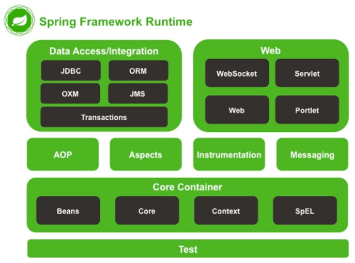
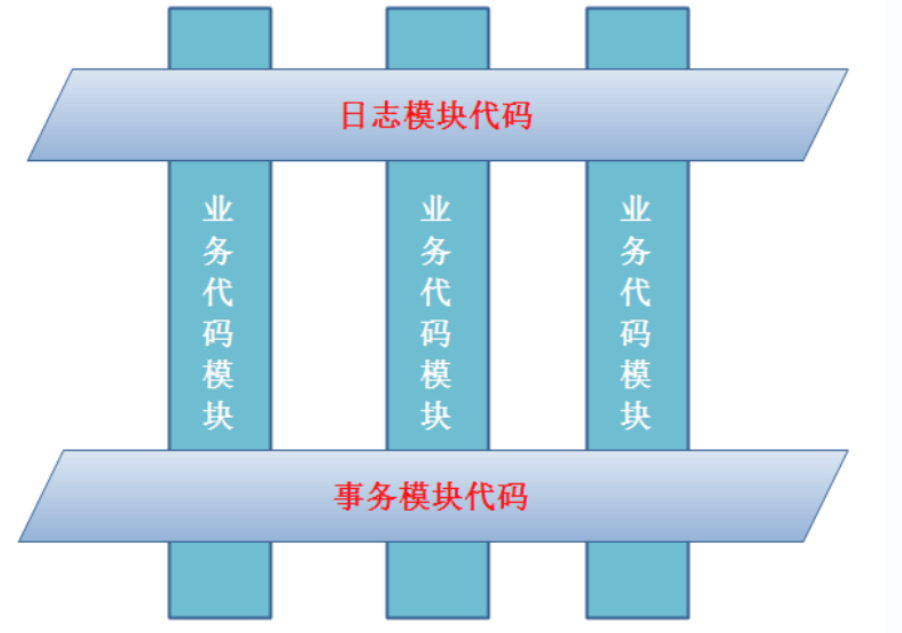
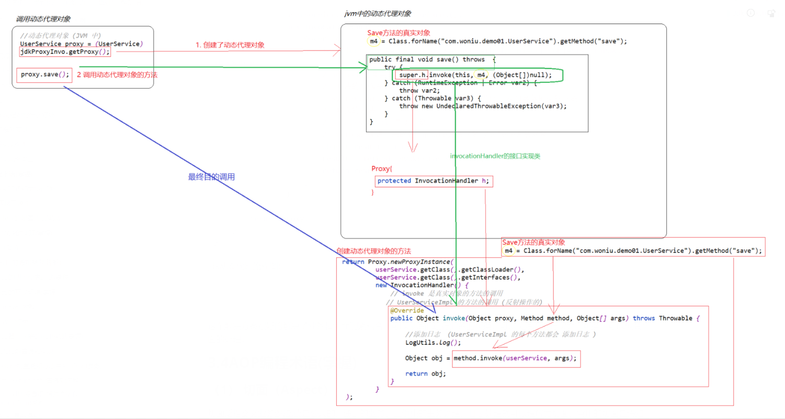
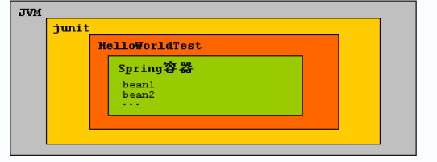
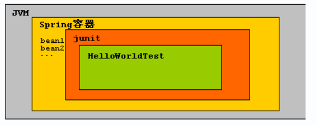

# Spring

Spring是一款JavaEE架构级的开源框架, Spring框架通过IoC和AOP(反向控制和面向切面)两项技术将各种框架和资源低耦合的集成到一个项目中

Spring是轻量级框架

> 轻量级框架是指其运行不依赖于特定的容器
>
> 重量级框架运行必须依赖特定的容器

使用Spring最重要的原因: 通过Spring容器统一管理项目中创建的对象, 通过Spring容器统一管理业务中的调用关系, 从而降低业务代码间的耦合度, 不再需要手动在业务代码中创建其他业务的对象

> 实现高内聚, 低耦合

Spring特点:

1. 轻量级: 大小和系统开支低, Spring框架开发的项目不依赖于特点容器, 不需要引入特定API(非侵入式)
2. IOC(反向控制): 反向控制实现了项目中各种组件的低耦合集成
3. AOP(面向切面编程): AOP与java的OOP(面向对象编程)不同, AOP可以将业务流程分为多个切片, 对每个切片进行独立开发
4. 容器化: Spring容器可以管理项目的生命周期和配置

> 如果一个分层架构的项目中, 上层调用下层时直接创建下层的实例, 会造成上下层耦合性高的问题
>
> 使用Spring框架可以将代码分为不同的模块, 将代码的关联用配置说明, 从而实现多层代码间的解耦

**IOC**

IOC反向控制是一种编程思想, 指将程序中的对象由传统的手动创建管理转换为用容器进行自动化管理

Spring容器的作用: 1. 管理对象的创建和赋值 2.管理依赖

在Spring中IOC通过DI(依赖注入, Dependecy Injection)来实现

依赖: 当A类的代码中创建了B类的对象, 并且调用了B类的方法来实现功能, 则被称为A依赖于B

依赖注入: 在程序运行时如果需要调用外部类对象, 不需要在代码中手动创建, 可以通过依赖注入直接从外部容器引入对应的对象

Spring的依赖注入具有通用性(调用者和被调用者可以是任意类), 并且支持依赖关系管理

Spring容器也被称为工厂, 在容器中的对象被称为Bean, Spring容器使用依赖注入来管理Bean对象间的依赖关系, 通过IOC实现对象间的解耦

> 项目中所有的类都在容器中管理, Bean类间的依赖(相互调用)都通过依赖注入管理

Spring架构图



Spring包含7个核心模块:

1. Core: 核心容器, 提供了Spring框架的基础功能, 该模块包括了BeanFactory类, 这个类是Spring框架系统的核心
2. **Application Context**: Spring的重要模块之一, 通过配置文件提供信息在Spring框架中实现Bean资源共享. 提供了大量的企业级服务: JNDI, EJB, 电子邮件
3. AOP: 通过动态代理技术(Dynamic Proxy)实现了面向切面的编程支持, 可以将一个业务按照流程分为多个切面, 每个切面相互独立, 多个切面组装成一个完整的业务流程
4. ORM: Spring对主流的ORM框架都提供了模板, 可以使用Spring一致的编程风格进行编程
5. DAO: 提供数据库支持, 将持久层独立为一个模块, 将JDBC封装为API提供调用
6. Web: 在context模块的基础上进一步为Web程序提供了上下文, 并且可以对内置或外部的Web框架进行整合
7. MVC(Spring MVC): Spring内置的Web框架, 通过MVC思想实现, 支持多角色划分和多视图技术

> AOP的动态代理模式有两种: 
>
> 1. ProxyFactoryBean(代理工厂对象): 通过引入中间层来实现任何形式的AOP
> 2. TransactionProxyFactoryBean(事务代理工厂对象): 通常用于数据库编程, 对数据库的事务进行管理

AOP可以作为OOP的一种补充, 减少重复代码, 更容易实现项目工程化

AOP架构示例



**MVC**

MVC三层架构:

1. Model: 数据模型, 包括了数据以及业务
2. View: 用户界面展示
3. Controller: 充当View和Model的双向调度员 

> 与vue的MVVM架构类似, ViewModel相当于Controller的角色

**创建一个简单的Spring项目**

1. 导入Spring的依赖包

2. 定义实体类, 需要定义无参构造器和setXX方法

3. 创建Spring配置文件(推荐路径为resources目录下的applicationContext.xml)

   > 配置文件中需要引入约束文件, 约束文件的后缀为.xsd

4. 在配置文件中的Bean对象中绑定对应的实体类

5. 在其他类中调用Bean对象

配置文件Bean对象绑定实体类实例

```xml
<!--id属性是Bean对象的id, class是绑定的对应实体类-->
<bean id="stu" class="com.wn.bean.Student"></bean>
```

获取Bean对象

```java
//通过配置文件获取spring容器
ApplicationContext applicationContext = new ClassPathXmlApplicationContext("applicationContext.xml");
//通过context容器获取bean对象
Student stu=(Student) applicationContext.getBean("stu");
```

**ApplicationContext接口**

ApplicationContext接口是一个容器, 有两个实现类

> ClassPathXmlApplicationContext和FileSystemXmlApplication

一般通过ClassPathXmlApplicationContext的构造器来加载Spring配置文件创建对应的spring容器

容器对象初始化时, 会将容器中的所有Bean对象都进行装配, 代码中使用Bean对象时会直接从内存中调用. 这样的设计提高了代码的执行效率, 但是由于对象全部保存在容器中, 会导致内存占用较高

> spring容器创建Bean对象时会默认调用无参构造器, 要求对应的实体类必须提供无参构造器

**注入**

Spring容器对bean对象进行初始化的过程被称为注入

注入分为set注入和构造注入

1.set注入通过调用实例的setter方法进行赋值, 由于简单直观所以是Spring依赖注入中常用的方法

## 动态代理

**常用的java代理模式有5种**

1. 静态代理: 手动创建代理类, 在编译
2. 基于JDK: 通过JDK提供的Proxy.newProxyInstance方法动态生成代理类
3. 基于CGlib: 
4. 基于Aspectj:
5. 基于instrumentation:

> 其中2到5都是动态代理模式

Spring一般使用的是2或3代理模式: 基于JDK或CGlib

动态代理和静态代理的区别:

静态代理需要在程序运行前手动创建代理类, 并生成class文件

动态代理是在程序运行中创建的代理模型

jdk动态代理实现步骤

1. 创建被代理类, 被代理的类需要有实现的自定义接口

2. 创建代理对象获取类

   代理对象获取类通过调用Proxy.newProxyInstance方法, 获取真正的代理对象

   > Proxy.newProxyInstance方法需要传入三个参数, 类加载器, 代理类对象的接口参数列表

jdk动态代理缺点:

1. 由于jdk动态代理是基于接口的代理, 所以代理对象必须有实现的接口
2. 动态代理的基本单位是类

> 创建代理获取类

```java
public class GetProxy {
    UserInterface userInterface;
    public void setUserInterface(UserInterface userInterface){
        this.userInterface=userInterface;
    }
    public Object getJdkProxy(){
        Object proxy= Proxy.newProxyInstance(
                userInterface.getClass().getClassLoader(),
                userInterface.getClass().getInterfaces(),
                new InvocationHandler() {
                    @Override
                    //method是被代理的方法
                    public Object invoke(Object proxy, Method method, Object[] args) throws Throwable {
                        Object result=null;
                        //注入代码到方法中
                        System.out.println("注入代码");
                        result=method.invoke(userInterface);
                        return result;
                    }
                }
        );
        return proxy;
    }
}
```

> 通过代理获取类对象调用注入后的方法

```java
public class Test {
    public static void main(String[] args) {
        UserInterface userInterface=new User();
        GetProxy getProxy=new GetProxy();
        getProxy.setUserInterface(userInterface);
        UserInterface proxy=(UserInterface) getProxy.getJdkProxy();
        proxy.hello();
    }
}
```

> 动态代理运行流程图



面试题:

AOP术语, 需要掌握

1. Aspect 切面
2. JoinPoint 连接点
3. Pointcut 切入点
4. Target 目标对象
5. Advice 通知/增强
6. Weaving 植入

# Spring测试

Spring测试和传统测试的区别

> 传统测试是运行Juint框架然后在测试程序中运行Spring容器
>
> 每个测试都会重新启动Spring容器, 开销较大



> Spring测试是在Spring容器中运行Junit框架 测试程序



**创建spring测试的步骤**

1. 添加spring-test依赖
2. 添加@RunWith注解
3. 添加@ContextConfigration注解

> 测试类示例

```java
@RunWidth(SpringJUnit4ClassRunner.class)
@ContextConfiguration("classpath:applicationContext.xml")
public class Test{
    
    @Autowired
    ApplicationContext context;
    
    @Test
    public void testSpring() throws Exception{
        //获取context容器
        AnnotationConfigApplicationContext context =new AnnotationConfigContext("applicationContext.xml");
        //测试代码
    }
}
```

