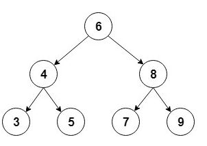
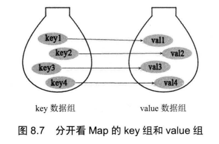
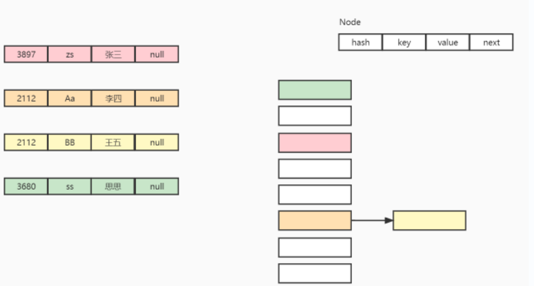
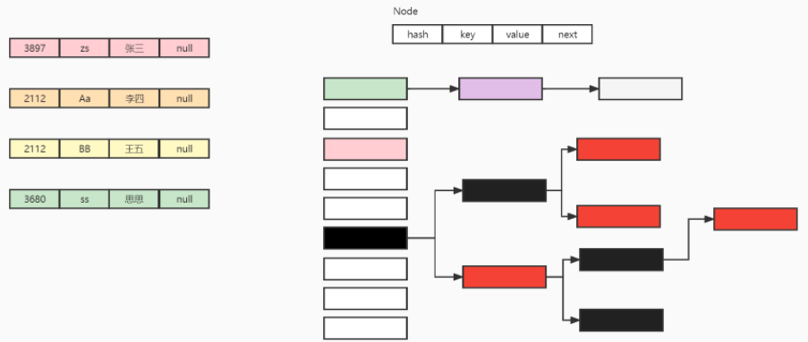
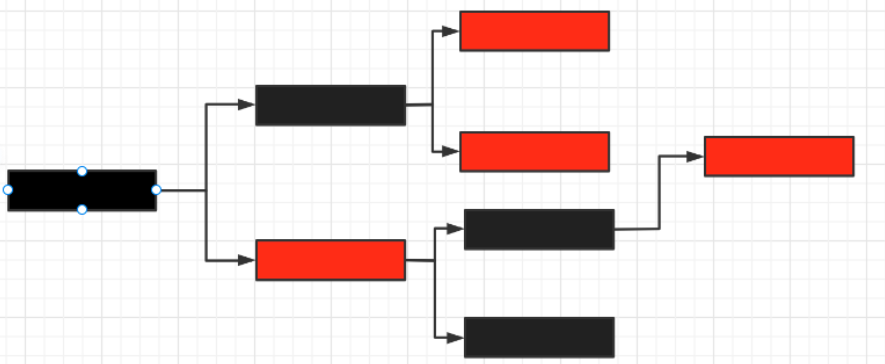

# 树

树是一种分层结构, 不是线性结构

树中的每个节点(node)会包含三部分: 

1. 当前节点的数据
2. 指向左子节点的指针(null表示不存在左子节点)
3. 指向右子节点的指针(null表示不存在右子节点)

> (?正确性存疑)	注意这里并没有指向父节点的指针, 也就是说无法从叶子节点向根节点进行遍历

> 常见线性数据结构: 数组(Arrays) 链表(Linked List) 栈(Stack) 队列(Queue)

根节点(root): 没有父节点的节点(node)(每个树结构只能有一个根节点)(处于二叉树的最顶端)

叶子节点(leave): 没有子节点的节点(处于二叉树的最末端)

```md
      tree
      ----
       j    <-- root
     /   \
    f      k  
  /   \      \
 a     h      z    <-- leaves
```

树结构的特点:

1. 可以存储层次结构信息

2. 访问/搜索元素的速度适中(比链表快, 比数组慢)

3. 插入/删除速度适中(比数组快,无序链表慢)

4. 节点数量可变(无上限)

   > 因为节点使用指针链接到不同节点

树的常见应用场景:

1. 操作层次结构的数据
2. 树遍历可以用于信息的搜索
3. 路由算法
4. 多阶段决策

# 二叉搜索树

二叉树(Binary Tree)属于一种递归结构, 并且每个节点最多有两个子节点

二叉搜索树(Binary Search Tree)属于一种特殊的二叉树, 要求每个节点都大于或等于左子节点值, 小于等于右子节点

左子节点<=当前节点<=右子节点

> 下图是二叉搜索树示例



BST(Binary Search Tree)常用操作:

搜索 寻找最大值 寻找最小值 插入 删除

这些操作的时间复杂度为O(h) 

> h为BST的高度, 对于偏斜的二叉树, 时间成本可能会变为O(n)	n:树的节点数

**红黑树的高度可以始终保持在log n, 因此红黑树在进行BST操作时可以将时间复杂度保持在O(log n)**

> 红黑树可以保证进行BST操作后,将树高度保持在log n(自平衡特性)

# 红黑树

红黑树是一种自平衡的二叉搜索树, 并且每个节点都会有一个额外的位(被解释为红, 黑颜色的状态)

红黑是用于确保树在进行插入删除操作时可以保存平衡

红黑树不是一个prefet balanced的树, 但是已经可以将树搜索的时间复杂度降低到0 (log n)

> 其中n代表树的元素总数

**红黑树是一种特殊的二叉搜索树, 它通过给每个节点加入额外颜色位, 并遵循红黑树原则实现了自平衡**

**由于红黑树每个节点仅多出一位额外颜色位, 因此红黑树的内存占用量其实与(无色)二叉搜索树相等**

红黑树原则:

1. 每个节点都必须有一个额外位来保存红黑的颜色信息

2. 黑红树的根节点必须是黑色节点

3. 红黑树的叶子节点必须是黑色节点

4. 红色节点不能是另一个红色节点的父节点或子节点

   > 两个红色节点可以是兄弟节点(sinlings)

5. 对于同一个起始节点来说, 从该节点到该节点的叶子节点的所有路径上经过的黑色节点数目总是相同的

   > 这里的起始节点包括根节点

红黑树的特点:

1. 只有两种节点: 红节点 黑节点
2. 根节点一定为黑节点
3. 红节点的子节点一定为黑节点
4. (正确性存疑) 从任何一个节点到根节点的路程中, 必定经过相同的黑节点

# TreeSet

TreeSet是具有树形结构的集合

TreeSet的底层通过红黑树实现

TreeSet的元素也是不重复的,但是去重原理与HashSet不同

> TreeSet是有序的, HashSet是无序的

> TreeSet通过调用元素本身实现的Comparable接口(自然排序)或者实现Comparator类的去重器(compare方法)(自定义排序)来实现去重

```java
TreeSet<User> userTreeSet = new TreeSet<>(((o1, o2) -> {
    return o1.name.compareTo(o2.name);
}));
//实现Comparator函数接口中的compare方法
userTreeSet.add(new User("ll", 12));
userTreeSet.add(new User("l2", 12));
userTreeSet.add(new User("l3", 12));
userTreeSet.add(new User("l2", 12));
userTreeSet.add(new User("ll", 12));
```

# Map

**java里面需要重点掌握两种Map实现类, ConcurrentHashMap(线程安全)和HashMap(非线程安全)**

> 面试重点掌握内容

Map里面通过两组值来保存数组: 键值(Key和value)

Map特点:

1. 键值是一对一的关系, 也就是说一个key只有唯一对应的value
2. 不允许有重复的key, 允许有重复的value
3. 1



注意Set与Map这两种集合间的关系非常密切

Map里面的key可以组成一个Set集合(key元素无序不重复), 并且Map有keySet()方法可以返回所有key组成的Set集合

| Set实现类     | Map实现类     |
| ------------- | ------------- |
| HashSet       | HashMap       |
| LinkedHashSet | LinkedHashMap |
| SortedSet     | SortedMap     |
| TreeSet       | TreeMap       |
| EnumSet       | EnumMap       |

这些Map实现类的key集储存方式与对应的Set实现类完全相同

> Map里面如果添加了重复key值的元素会导致之前放入的重复元素被替换为新的元素
>
> Set里面如果试图添加重复的元素, 不会进行操作

# HashMap

常用实例方法:

| 方法名   | 功能                                                         |
| -------- | ------------------------------------------------------------ |
| put      | 将一对键值加入map中, 如果存在重复的键会将替换成新的元素      |
| toString | 按照{key1=value1,key2=value2...}格式输出                     |
| get      | 传入键, 返回对应的值                                         |
| replace  | 将map中重复的键替换成新元素, 但是如果不存在将不做任何操作    |
| clear    | 清除map中所有的元素                                          |
| remove   | 传入key,进行键匹配, 删除对应的元素   也可以传入配对的键值, 进行键值匹配 |
| keySet   | 返回map中所有key组成的Set                                    |
| values   | 返回map中所有值组成的Collection                              |

```java
Map<String,String> hashMap=new HashMap<>();
hashMap.put("123","ll");
hashMap.put("223","ll");
hashMap.put("323","ll");
hashMap.put("423","ll");
hashMap.put("123","lp");
hashMap.put("123","lj");
System.out.println(hashMap);
System.out.println(hashMap.get("123"));
hashMap.put(null,"123");
hashMap.put(null,"124");
//可以添加null作为键
System.out.println(hashMap.get(null));
hashMap.replace("999","lj");
hashMap.clear();
hashMap.remove("123");
hashMap.keySet();
//实际返回类型为HashMap的内部类
//java.util.HashMap$KeySet
//Set接口的实现类
hashMap.values();
//实际返回类型为HashMap的内部类
//java.util.HashMap$Values
//Collection接口的实现类
Collection<String> c= hashMap.values();
for (String s : hashMap.keySet()) {
    hashMap.get(s);
    //通过键来遍历hashMap的值
}
girlCatHashMap.forEach(new BiConsumer<Girl, Cat>() {
    @Override
    public void accept(Girl girl, Cat cat) {
        System.out.println(girl);
        System.out.println(cat);
    }
});
//匿名内部类实现BiConsumer函数接口的accept方法
hashMap.forEach((str1,str2)->{
    System.out.println(str1);
    System.out.println(str2);
});
//lambda表达式
```

HashMap的key实质上就是HashSet的底层, 因此其去重原理就是HashSet的去重原理

1. 使用hashcode()将要添加的元素与集合中的其他元素一一对比, 如果不相等则进入第二步

2. 使用equals()将要添加的元素与集合中的其他元素一一对比, 如果还是不相等则加入集合中

HashMap在JDK1.7底层是数组+链表



HashMap在JDK1.8的底层是数组+链表+红黑二叉树



# TreeMap

TreeSet用了TreeMap的key底层原理, 所以两者的去重原理相同

> TreeMap的去重是用key对象本身的实现的Comparable比较器(自然比较)或Comparator(自定义比较)



TreeMap特点:

1. key是有序并且不重复的
2. 值可以重复
3. key不能为null(底层去重需要用到对象本身的比较器, null没法去重)

```java
TreeMap<String,String> stringStringTreeMap=new TreeMap<>();
stringStringTreeMap.put("123","123");
stringStringTreeMap.put(null,"123");
//编译不会检查出问题, 但是运行时会抛出异常(java.lang.NullPointerException)
stringStringTreeMap.remove("123");
System.out.println(stringStringTreeMap);
```

# Hashtable

> 注意table不用大写
>
> 因为Hashtable就是java中类的名称

Hashtable与HashMap相似,但是

Hashtable是线程安全的, HashMap不是线程安全的

| 线程不安全    | 线程安全     |
| ------------- | ------------ |
| StringBuilder | StringBuffer |
| ArrayList     | Vector       |
| HashMap       | Hashtable    |

> 一般线程不安全的类是最常用的, 因为性能较高

# 集合的交集 并集 差集

交集是两个集合的重复部分

并集是将两个集合合并为一个集合

差集是A集合中有, B集合中没有的元素的集合(相当于A集合减去AB并集的部分)

```java
List<String> stringList=new ArrayList<>();
Collections.addAll(stringList,"张飞","关羽","黄忠","赵云");
List<String> stringList2=new ArrayList<>();
Collections.addAll(stringList2,"张飞","关羽","马超","黄忠");
stringList2.retainAll(stringList);
//求两个列表的交集 保留重复的元素
stringList2.removeAll(stringList);
stringList2.addAll(stringList);
//两个步骤的结果 求两个列表并集
stringList2.removeAll(stringList);
//求两个列表的差集
```

