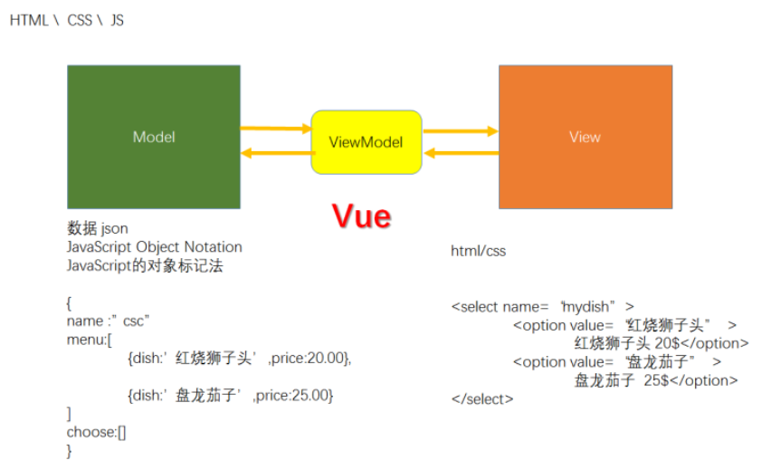
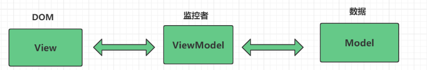

# Vue.js

Vue是一个开源的前端框架

特点:

1. 大量的语法糖简化开发流程
2. 语法与js区别非常大
3. 更新迭代非常快
4. 遵循MVVM架构模式
5. 支持单页面(应用)开发
6. 支持渐进式开发
7. 支持视图组件式开发
8. 支持虚拟DOM(将DOM节点树创建内存中的副本)

**MVVM**

MVVM: Model View ViewModel三部分

(模型-视图-视图模型)



各部分的作用:

1. Model代表数据, 数据来自后端或者用户输入
2. View代表网页, 通过网页展示数据
3. ViewModel: 用于绑定网页和数据(双向绑定)



如何使用Vue开发网页:

1. 直接在网页中导入Vue.js
2. 使用Vue-cli脚手架开发

```html
<script>
/* 完成：视图  和   数据之间的绑定 */
let app = new Vue({
el: '#app',
data : {msg:"Hello World!"}
});
</script>
<html>
    <body>
        <div id="app">
            {{msg}}
        </div>
    </body>
</html>
```

{{}} : 动态渲染视图,类似于jsp中的占位符

Vue提供了大量的预定义元素属性, 可以实现在html中进行动态编程

重要元素属性:

| 属性               | 作用                                |
| ------------------ | ----------------------------------- |
| v-for=""           |                                     |
| v-bind:属性="变量" | 用于在标签属性中引入动态的变量      |
| :属性="变量"       | v-bind:属性的简写                   |
| v-model="变量"     | 用于将元素的value和变量进行双向绑定 |
| v-on:事件="函数"   | 将函数绑定事件                      |
| @事件="函数"       | v-on的简写                          |
| v-if="条件表达式"  | 用于进行条件判断                    |
| v-else             | 多分支条件语句                      |
| v-else-if          | 多分支条件语句                      |

