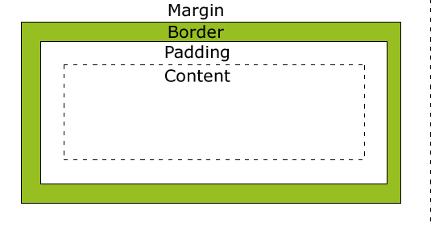

# Web

互联网被称为www(world wide web)

大部分网站系统都是C/S架构(Client Service)

其中Client分为浏览器(瘦客户端) 手机APP 电脑程序

Client是前端 Serivce是后端

# 前端

前端三件套

HTML	CSS	JavaScript

HTML和CSS负责页面布局的展示

JavaScript负责业务逻辑的编程

> 注意常见的前端框架如Vue React都是JS底层的后端框架, 它们使用自定义的JavaScript作为动态功能, 编写的代码会在服务端解析为html和css返回给用户(响应式布局)

最新的HTML版本为HTML5.0简称H5

HTML: 超文本标记语言 Hyper Text Markup Language

# 标签

HTML的标签由W3C机构严格定义, 无法自定义扩展

标签特点:

1. 有开始标签和结束标签组成
2. 标签都是放在<>里的

| 标签      | 作用                                                         |
| --------- | ------------------------------------------------------------ |
| 头标签    |                                                              |
| \<head>   | 存放元信息 子标签:title link meta script style base          |
| \<title>  | 网页标题(不会显示在网页主体body中, 显示在浏览器的标签标题中) |
| \<link>   | 引入外部资源(JS脚本, css文件)                                |
| \<script> | 内嵌JS脚本                                                   |
| \<style>  | 内嵌样式表                                                   |
| \<meta>   | 元信息                                                       |
| 文本标签  |                                                              |
| \<h1>     | 标题标签,  有6级:h1 h2 h3 h4 h5 h6                           |
| \<p>      | 文章的一段                                                   |
| \<b>      | 加粗                                                         |
| \<strong> | 加粗, 语义强调/重要(被程序解析时会加上语言, 在视觉上与b没有区别) |
| \<i>      | 斜体                                                         |
| \<em>     | 斜体, 语义强调/重要(被程序解析时会加上语言, 在视觉上与em没有区别) |
| 其他      |                                                              |
| \    | 图片标签, 有三个属性: src(图片路径或链接) alt(加载失败时显示的信息) title(加载成功时显示的信息) |
| \<a>      | 超链接标签, 可以跳转到指定的网页或者当前网页的某个位置 有href属性和targer属性 target属性可以赋_blank self |
| \<div>    | 分块标签                                                     |
| 列表标签  |                                                              |
| \<ol>     | 有序列表                                                     |
| \<ul>     | 无序列表                                                     |
| \<li>     | 列表项                                                       |
| \<dl>     | 定义列表                                                     |
| \<dt>     | 定义项目                                                     |
| \<dd>     | 定义描述                                                     |
| 媒体标签  |                                                              |
| \<audio>  | 音频                                                         |
| \<video>  | 视频                                                         |
| 表单标签  |                                                              |
| form      | 表单主体 action指定url作为提交数据的链接, method有GET和POST两种 |
| input     | type属性有很多类型: text password hidden file date radio checkbox button submit(提交按钮) reset(重置按钮) name属性作为提交的key和value作为提交的值(一个name会有多个value可选) |
| textarea  | 可以输入多行文本的框                                         |
| select    | 下拉框                                                       |
| option    | select的选项                                                 |
| 表格标签  |                                                              |
| table     | 整个表格                                                     |
| thead     | 表头                                                         |
| th        | 表头的每个单元格                                             |
| tr        | 表格的每行                                                   |
| td        | 表格的每个单元格, 属性: colspan合并列 rowspan 合并行         |
|           |                                                              |

> 实体符号

实体标签是html中的特殊符号, 直接输入这些符号不会被浏览器解析并显示, 只有输入实体符号才能在浏览器中显示对应的符号

| 名称   | 显示     | 实体符号  |
| ------ | -------- | --------- |
| 空格   |          | \&nbsp;   |
| 小于号 | <        | \&lt;     |
| 大于号 | >        | \&gt;     |
| 引号   | "        | \&quot;   |
| 和号   | &        | \&amp;    |
| 撤号   | `        | \&apos    |
| 乘     | &times;  | \&times;  |
| 除     | &divide; | \&divide; |

## 块级标签和行级标签

html中的标签都可以分为块级标签和行级标签

块级标签: 单独占一整行空间, 可以设置高度

行级标签(也可以称为行内标签, 一般放在块级标签的内部): 只占一行的部分空间, 无法设置高度, 根据内部填充的内容自动调整高度

常见块级标签: div	p	h1-h6	ul	ol	dl	li	dd	dt	hr	br	table	thead	tbody	tfoot	tr	h5	header

常见行级标签: span a img select strong b eem i small sup sub form label button


框架集标签: frameset frame

> 框架集标签已经是Deprecated废弃状态, 不推荐使用

**Deprecated状态处以待淘汰状态, 目前还是被浏览器支持但是会在未来被淘汰**

# CSS

css: 层叠样式表 (Cascading style sheet)

css有三种: 行内样式表  内嵌样式表	外联样式表

```html
<!DOCTYPE html>
<html>

<head>
    <meta charset="utf-8">
    <title>helloCss</title>
    <style>
        <!-内嵌样式表-->
        h1 {
            color: red;
            font-size: 13px;
        }
    </style>
    <!-引入外联样式表-->
    <link rel="stylesheet" href="hello.css">
</head>

<body>
    <!-行内样式表-->
    <h1 class="title" id="title01">蜗牛学苑</h1>
    <h2>hello</h2>
</body>

</html>
```

外联样式表的语法跟内嵌样式表相同

(但是注释是用//, 内嵌样式表由于还在html文件中需要用<!--->来注释)

> 注意内嵌js脚本可以用//注释

生效优先级(范围小的优先级最高,范围大的优先级最低):

行内样式表>内嵌样式表>外联样式表

## 元素选择器

CSS中的元素选择器有4类:

| 选择器     | 示例     |
| ---------- | -------- |
| 通配选择器 | *{}      |
| 标签选择器 | div{}    |
| 类选择器   | .class{} |
| ID选择器   | #id{}    |

生效优先级(范围小的优先级最高,范围大的优先级最低):

ID>类>标签>通配

## 背景样式(background-style)

> 背景样式的前面都要加上background-前缀

| 样式名                | 值                                                           | 作用                               |
| --------------------- | ------------------------------------------------------------ | ---------------------------------- |
| background-color      | 16进制或rgb颜色值                                            | 背景颜色                           |
| background-image      | url或路径                                                    | 设置背景照片                       |
| background-size       | 像素或百分比                                                 | 设置背景大小                       |
| background-repeat     | no-repeat, repeat-x, repeat-y, repeat                        | 设置背景图是否重复平铺             |
| background-position   | top center bottom left center  right或x% y%或x,y             | 设置背景图片的起始位置(左上角位置) |
| background-attachment | scroll(默认, 随着页面一起滚动), fixed(固定, 不滚动), inherit(继承父元素的attachment属性) | 设置背景是否滚动                   |

## 字体样式(font-style)

> 字体样式会绑定属性内显示的文本内容

| 样式名      | 值                       | 作用           |
| ----------- | ------------------------ | -------------- |
| font-family | 仿宋(字体名, 中文或英文) | 设置字体的种类 |
| font-size   | px(像素)                 | 设置字体大小   |
| font-style  | italic(斜体)bold(粗体)   | 设置字体的风格 |
| font-weight | 100-900                  | 加粗           |
| color       | 16进制或rgb颜色值        | 设置字体颜色   |
| opacity     | 0.0-1.0                  | 透明度         |

## 文本样式(text-style)

文本样式设定整个文本的样式

> 文本样式都要加上text-前缀, 除了line-height和letter-spacing

| 样式名          | 值                              | 作用                                    |
| --------------- | ------------------------------- | --------------------------------------- |
| text-align      | center left right               | 设置文字对齐的方向                      |
| text-decoration | underline overline line-through | 添加下划线 上划线 删除线                |
| text-transform  | uppercase lowercase capitalize  | 全部大写 全部小写 首字母大写            |
| text-shadow     | px px px color                  | 横向距离 纵向距离 阴影模糊程度 阴影颜色 |
| letter-spacing  |                                 | 字间距                                  |
| line-height     |                                 | 行高                                    |

## 列表样式(lists-style)

列表样式可以应用于li

| 样式名           | 值                      | 作用                         |
| ---------------- | ----------------------- | ---------------------------- |
| list-style-type  | square upper-roman none | 设置列表左边的1. 2. 3.的样式 |
| list-style-image | url                     | 设置列表左边为图标           |

> 不同的选择器可以叠加为后代选择器

```css
//选择类为classd的父元素下面对应id的子元素
.class #id{}
```

## 边框样式(border-style)

边框样式可以用于表格元素

| 样式名          | 值             | 作用                     |
| --------------- | -------------- | ------------------------ |
| border          | px solid color | 设置边框的宽度 样式 颜色 |
| border-spacing  | px             | 边框间距                 |
| border-collapse | collapse       | 合并边框                 |
| border-radius   | px             | 设置边框圆角             |

## 状态(伪类)选择器

> 一般的类选择器在元素上设置class

伪类选择器不需要手动设置class, 会将元素的状态作为类名来选择, 从而实现同一元素在不同状态下样式的更新

伪类选择器一般应用场景: a标签(链接标签的样式变化), 鼠标选择元素的样式变化

状态选择器的语法

```css
便签名:状态选择器
a:visited{}
```

> 状态选择器种类

| 状态选择器 | 状态                               |
| ---------- | ---------------------------------- |
| link       | 未点击过的链接                     |
| visited    | 已点击过的链接                     |
| hover      | 正在被鼠标指向(悬停)的链接         |
| active     | 正准备访问的链接(鼠标按下还没放开) |
| 鼠标焦点   |                                    |
| enabled    |                                    |
| focus      |                                    |
| disabled   |                                    |

## 盒子模型

html中每个标签都是一个盒子: 由外边距(margin) 边框(border) 内边距(padding) 内容(content)  组成

> 盒子模型



同时margin border padding也分为四个方向

> 如margin-top marigin-right marigin-bottom marigin-left

| 样式    | 值             | 作用                                                         |
| ------- | -------------- | ------------------------------------------------------------ |
| mairgin | px             | 可以按照上右下左的顺时针方向设置内边距大小(一个px只能对应一个方向) |
| border  | px style color | px会同时对应四个方向                                         |
| padding | px             | 可以按照上右下左的顺时针方向设置内边距大小(一个px只能对应一个方向) |

> css中的样式赋多个值时用空格隔开

**一般css中为顺时针方向, 上右下左**

## float

浮动(float)属性可以让标签浮动

块级元素: 独占一行的标签(自带换行)

行级元素: 占一行的一部分(不会自动换行)

| 样式  | 值                          | 作用                 |
| ----- | --------------------------- | -------------------- |
| float | 方向(left right top bottom) | 使标签向某个方向浮动 |
| clear | both                        | 清除浮动             |

> float可以使块级标签无法独占一行(行级标签的特性), 但是同时会有可能影响到父元素(如造成父元素边框塌陷)

## CSS元素常用样式

| 样式名          | 值   | 作用           |
| --------------- | ---- | -------------- |
| width           | px   | 设置元素的宽度 |
| height          | px   | 设置元素的长度 |
|                 |      |                |
|                 |      |                |
| text-decoration |      |                |

## 定位移动样式

定位移动样式有4种:top bottom right left

**定位移动样式只会影响已定位的元素, 对未定位元素没有任何影响**

定位: position, 如果position是static, 那么定位移动样式没有任何作用

css中有四种position:

| 值         | 定位技术 | 作用                                                         |                  |
| ---------- | -------- | ------------------------------------------------------------ | ---------------- |
| absolution | 绝对定位 | 相对于父元素/浏览器的左上角进行定位, 并且移动后会释放原有空间 | 会导致元素重叠   |
| relative   | 相对定位 | 相对于原有位置进行定位, 并且不会释放原有空间                 | 不会导致元素重叠 |
| fixed      | 固定定位 | 相对于浏览器的左上角进行定位, 并且移动后会释放原有空间       | 会导致元素重叠   |
| static     | 静态定位 |                                                              |                  |

**定位移动**

> 定位移动是根据position的定位进行移动, 与margin的作用不同

| 样式     | 值                                      | 作用                   |
| -------- | --------------------------------------- | ---------------------- |
| position | absolution fixed relative static sticky | 定位                   |
| top      | px                                      | 将元素的位置向下移动px |
| bottom   | px                                      |                        |
| right    | px                                      |                        |
| left     | px                                      |                        |
