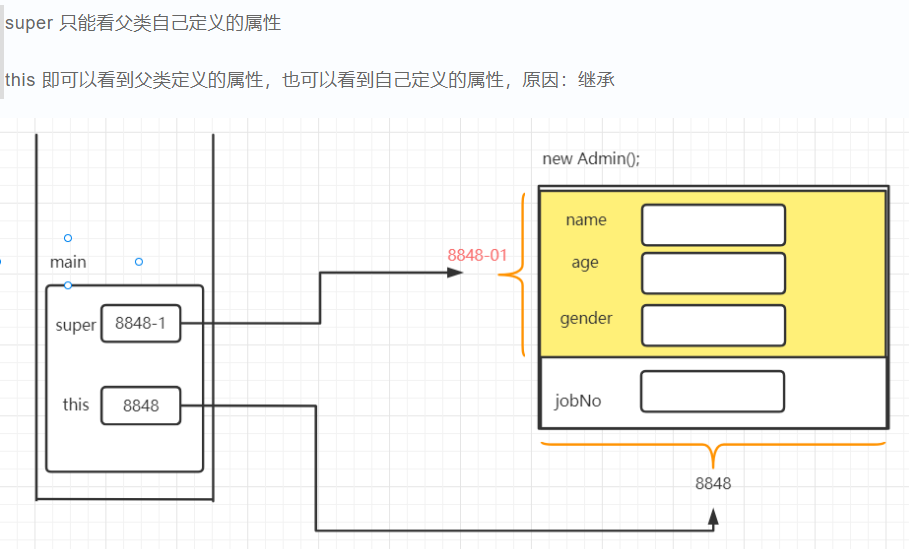

# super关键字

关键字用于在子类中调用被覆盖的父类方法

> super关键字不能出现在static修饰的方法中
>
> 但是可以调用被static修饰的方法

super关键字也可以用于在子类中调用被隐藏的父类变量

> 当子类中定义了与父类重名的变量时会导致父类变量被隐藏, 子类可以通过super关键字调用被隐藏的父类变量

程序查找变量的顺序(优先级)为:

1. 找该方法中的局部变量
2. 找该类中的成员变量
3. 找父类中的成员变量
4. 按结构遍历所有间接父类的成员变量直至最终的java.lang.Object
5. 最终仍无法找到变量将出现编译错误

找到同名变量后不会再执行后续步骤


```java
Son s=new Son();
//int num=s.tag;
int num =((Parent)s).tag
```

上述代码显示了在创建子类对象后, 用(Parent)来调用父类中被隐藏的变量

**子类可以用super关键字来调用父类的构造器**

> 使用this或super关键字调用构造器必须出现在构造器执行体第一行, 因此不能同时出现

**子类构造器一定会调用父类构造器一次**

三种情况:

1. 用super关键字调用父类构造器
2. 用this关键字调用本类中另一个构造器, 另一个构造器调用父类构造器
3. 以上两种情况都没有发生时, 系统默认调用父类无参数构造器

**创建一个对象时, 一定是从对应类所在的继承树最顶层类的构造器开始依次向下执行, 因此最开始一定会执行java.lang.Object类的构造体, 最后才会执行本类的构造器**

**this()和super()都只能放在构造器方法体的第一行**

> 所以this()和super()不能同时存在于同一个构造器里

# final

final关键字可用于修饰类 变量 方法

当变量用final修饰时, 该变量一旦被赋予了初始值, 则不能再被重新赋值

成员变量被final修饰时, 该变量不会被系统自动初始化赋值, 必须在特定位置进行显式指定初始值

```java
class TestClass{
    final static int num1=1;
    //类变量可以在声明时赋值
    final static int num2;
    static{
        num2=1;
    }
    //类变量可以在静态初始化块赋值
    final int num5=1;
    //实例变量可以在声明时赋值
    final int num3;
    {
        num3=1;
    }
    //实例变量可以在非静态初始化块赋值
    final int num4;
    TestClass(){
        num4=1;
    }
    //实例变量还可以在构造器中进行初始化赋值
}
```

上述代码展示了final类变量的两个赋值地点, final实例变量的三个赋值地点

```java
class TestClass{
    final int num5;
    {
//    System.out.println(num5);
        test();
        num5=6;
    }

    private void test(){
        System.out.println(num5);
    }
    public static void main(String[] args){
        new TestClass();
        //将输出0
    }
}
```

上述代码显示了final成员变量可以在初始化被方法访问, 并且输出0, 这是Java的设计缺陷

**final局部变量**

final局部变量只能进行一次赋值

final局部变量作为形参时, 会在值传递时被系统赋值, 不能再次赋值

**final基本类型变量和final引用变量的区别**

final基本类型变量只能进行一次赋值

final修饰引用变量时, 该引用变量所指向的对象地址无法再次改变, 也就是说无法重新指向其他的对象. 

但是注意引用变量指向的对象本身是不受final修饰符影响, 可以正常修改

当一个变量满足三个条件时, 其相当于一个直接量, 成为宏变量

1. 被final修饰
2. 声明时指定了初始值
3. 初始值在编译时就被确定

宏变量在代码中出现的地方会被编译器直接替换成对应的值

```java
class Test37{
    public static void main(String[] args) {
        final String book1="1"+1;
        final String book2="1"+String.valueOf(1);
        final String book3="11";
        String book5="1"+1;
        System.out.println(book1==book2);
        //输出false, 因为宏变量是在常量池中
        System.out.println(book1==book3);
        //输出ture, 因为两个都是宏变量
        System.out.println(book1==book5);
        //也是true, 代表不需要final修饰也是可以在常量池中
    }
}
```

**final方法**

当父类中的方法用final修饰时, 子类不能重写该方法

与private的隐藏不同, final修饰的方法如果被子类重写将造成编译错误

但是如果方法同时被final 和 private修饰时, 方法对于子类来说将是隐藏状态, 不再是方法重写而是定义了新的方法, 可以正常运行

final不会影响方法重载

**final类**

final修饰的类将不可被继承

用final修饰符修饰的类无法被其他类继承

>也可以通过用private修饰类中所有的构造器, 保证无法被继承

**final关键字类似于C++中的const, 被final修饰符修饰的变量 方法 类 将不允许再发生修改**

通过final关键字可以实现不可变类, 使系统安全性加强

> this的常量范围包括super的常量



# 抽象类

为什么需要设计抽象类：因为多态实现的父类类型 引用变量虽然是指向子类对象， 但是无法通过该引用变量调用父类中没有， 但是子类中有的方法。 抽象类可以设计出无方法体， 仅有方法名的类模板可以解决该方法

抽象类提供了子类的通用方法，并将方法执行体留给子类实现 

抽象类是模板模式的一种实现

抽象方法和抽象类必须使用abstract修饰

一个类中含有抽象方法, 则该类必须为抽象类

但是用abstract修饰的抽象类可以不含抽象方法

**抽象类不能实例化，只能被子类继承**

抽象方法和抽象类的规则:

1. 抽象方法和抽象类必须使用abstract修饰, 抽象方法不能有方法体(具体代码块)

2. 抽象类不能被实例化, 意味着它的构造器无法被new 关键字调用来创建实例

3. 抽象类可以包含普通类中的五种成分: 成员变量 方法 构造器 初始化块 内部类(接口, 枚举)

   > 抽象类的构造器不能创建实例, 但是可以被子类调用(在子类创建实例时, 会按照继承树的顺序调用父类和间接父类中的构造器和初始化块)

4. **含有抽象方法的类必须是抽象类或者接口,不能是普通类**

```java
abstract class Shape{
    public abstract getType();
}
```

> abstract和static不能修饰同一个方法， 但是可以修饰同一个内部类
>
> abstract和private也不能修饰同一个方法

# 接口和抽象类的区别

接口和抽象类的相同特征:

1. 都不能被实例化, 只能被实现或继承
2. 都可以包含抽象方法, 普通类不能含有抽象方法, 必须将继承的抽象方法实现

接口和抽象类的设计目的差别巨大:

1. 接口体现规范标准, 接口的改变将可能导致实现该接口的类都需要重写
2. 抽象类体现模板式设计, 抽象类只是一个中间产品, 需要进一步完善实现

接口和抽象类的用法有差异:

1. 抽象类可以有普通方法(包含方法体), 但是接口不能有

2. 接口只能有static final变量 (类常量), 抽象类可以定义普通成员变量

3. 接口不能有构造器和初始化块, 抽象类可以有构造器和初始化块 

   > 抽象类中的构造器和初始化块是提供给子类调用的

4. 普通类继承抽象类为单继承, 但是可以实现implement多个接口(模拟多继承)

>抽象方法不能被static修饰

vehicle: 车辆, 泛指陆地上的一切运输工具

**默认方法的default是作为关键字使用, 和权限访问修饰符中的默认(default)权限不一样**

> default不能作为访问修饰符使用


抽象方法不能有方法体

抽象类不能创建实例, 只能被继承

接口特点:

1. 接口不能被实例化(抽象类特点)
2. 接口中的方法默认被public abstract修饰
3. 非抽象类implements接口时,必须实现接口中的所有抽象方法
4. 一个接口可以继承多个接口(模拟多继承)
5. 一个类可以实现多个接口

接口属于类的一种, 所以接口是引用数据类型

在Java中除了8种数据类型之外的类型都是引用数据类型

接口的成员有: 抽象方法 静态常量(abstract static)

jdk1.8中新增的 default默认方法和static静态方法