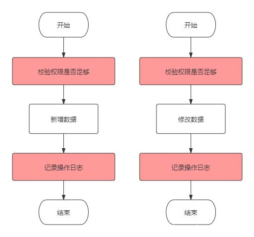
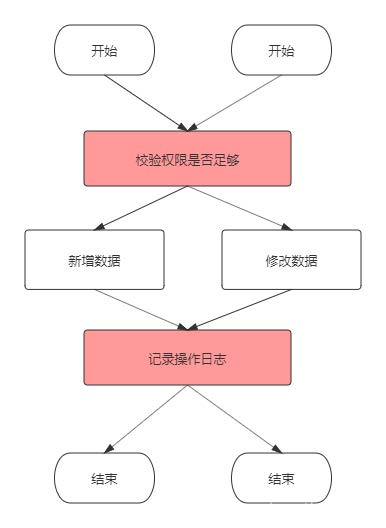
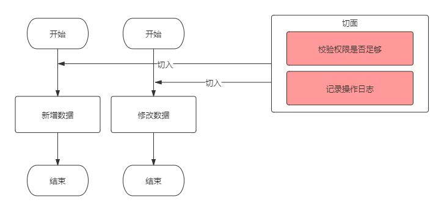
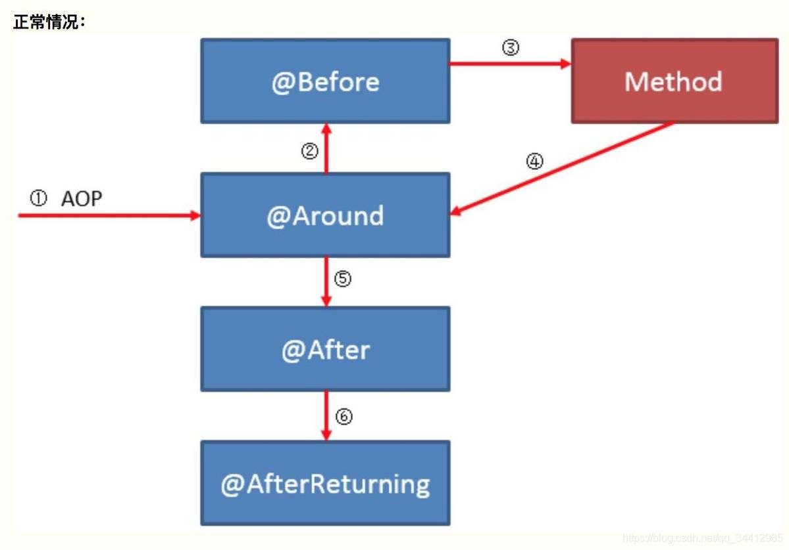
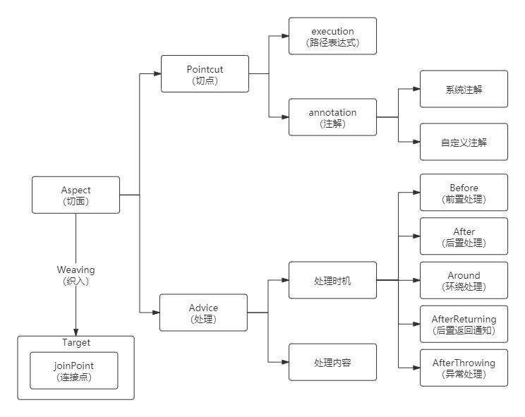
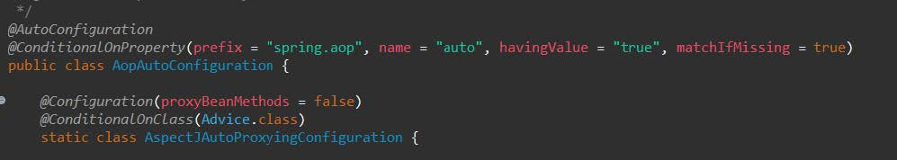
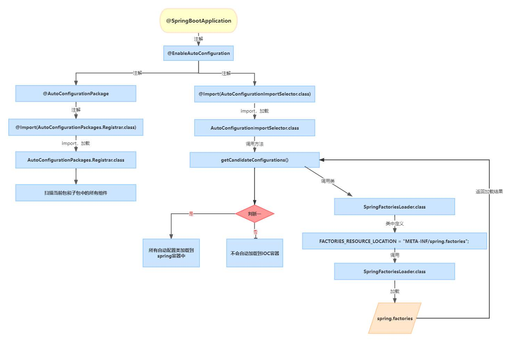

1讲下springAOP，项目中你是如何应用的？
1.1 什么是AOP
AOP Aspect Oriented Programming 面向切面编程
Spring三大核心思想之一（另外两个是：IOC-控制反转，DI-依赖注入）
AOP利用一种称为“横切”的技术，剖解开封装的对象内部，并将那些影响了 多个类的公共行为封装到一个可重用模块，并将其名为“Aspect”，即方面。所谓“方面”，简单地说，就是将那些与业务无关，却为业务模块所共同调用的 逻辑或责任封装起来，比如日志记录，便于减少系统的重复代码，降低模块间的耦合度，并有利于未来的可操作性和可维护性。
如果我们为Spring的某个bean配置了切面，那么Spring在创建这个bean的时候实际上创建的是这个bean 的一个代理对象，我们后续对bean中方法的调用实际上条用的是代理类重写的代理方法
下面一系列图可以帮我们更好的理解AOP：
我们实现功能代码时，每个不同的功能方法之前或之后都需要执行一些相同的代码，比如校验权限，记录日志等

如果有很多个方法，那么校验权限和记录日志的代码会有大量重复
于是我们可以将这些重复代码抽出来，写成公共方法，这样我们可以在每个需要执行权限校验和日志记录的方法前后调用这些公共方法

这里已经简化了大量代码，但是每次在写功能代码时都要手动调用这些公共方法，也略显繁琐，而通过AOP动态代理我们的业务方法，我们可以在不影响业务代码的前提下完全将非业务代码提取出来，与业务代码分离，并通过切入点切入到业务代码中：

AOP的优点
1.降低模块之间的耦合度
2.使系统容易扩展
3.更好的代码复用
AOP的使用
Around：环绕通知，最强大的通知，可以在目标方法前后切入，项目中用的最多的也是这个
Before：前置通知，在目标方法执行前执行
After：绝对后置通知，在目标方法执行后通知，源码中是放在finally代码块中，如果遇到异常，也一定会执行
AfterReturning：后置通知：在目标方法执行后执行，遇到异常时不会执行到。
AfterThrowing：异常通知：在目标方法发生异常时执行，源码中是放在catch代码块中
五大通知执行顺序

异常情况

1.2 项目中的应用
1.日志处理
2.权限处理
3.性能优化
4.事务
5.记录跟踪
6.错误处理
7.同步
8.延迟加载
2说一下@requestMapping的作用？
用来标识 http 请求地址与 Controller 类的方法之间的映射
一言概之：处理请求地址映射
可作用于类和方法上，方法匹配的完整路径是 Controller 类上 @RequestMapping 注解的 value 值加上方法上的 @RequestMapping 注解的 value 值。
放在类上，就是窄化请求映射，必须以请求前缀开头，可以对url进行模块化分类管理
这个注解有六个参数

1. Value：
用于映射url和方法
@RequestMapping(“/login”) //省略写法
@RequestMapping(value = “/login”) //完整写法
@RequestMapping(value = {“/login”,”/register”}) //可以映射多个value
2. Method：
指定请求的method类型， GET、POST、PUT、DELETE等；
@RequestMapping(method = RequestMethod.GET)
3. Params：
params="myParam=myValue"仅处理请求中包含了名为“myParam”，值为“myValue”的请求；
@RequestMapping(params="myParam=myValue")
4. Consumes
比如：@RequestMapping(consumes="application/json")
仅处理request Content-Type为“application/json”类型的请求。
5. Produces：
@RequestMapping(produces="application/json")
仅处理request请求中Accept头中包含了"application/json"的请求，同时暗示了返回的内容类型为application/json;
6. Headers
@RequestMapping(headers="Referer=http://www.ifeng.com/")
仅处理request的header中包含了指定“Refer”请求头和对应值为“http://www.ifeng.com/”的请求；
用的最多的两个参数是value和method
如果是restful风格，method可以通过@GetMapping@PostMapping等注解替代
3SpringBoot如何实现自动配置？原理是什么？
SpringBoot的自动配置，指的是SpringBoot会自动将一些配置类的bean注册进ioc容器，我们可以需要的地方使用@autowired或者@resource等注解来使用它。
自动配置是以依赖以下几个注解来实现：
@EnableAutoConfiguration
@Conditional
@Import
@AutoConfigurationPackage
@EnableAutoConfiguration开启自动配置，通过@AutoConfigurationPackage将 添加该注解的类所在的package 作为 自动配置package 进行管理。也就是说当SpringBoot应用启动时默认会将启动类所在的package作为自动配置的package。然后使用@Import注解将其注入到ioc容器中，同时通过依赖@Conditional来使得自动配置生效
自动配置类并不是都生效的，每一个xxxAutoConfiguration自动配置类都是在某些特定的条件之下才会生效。这些条件限制是通过@ConditionOnxxx注解实现的。

> 1

