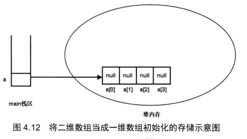
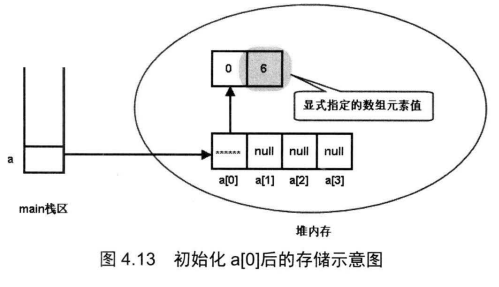
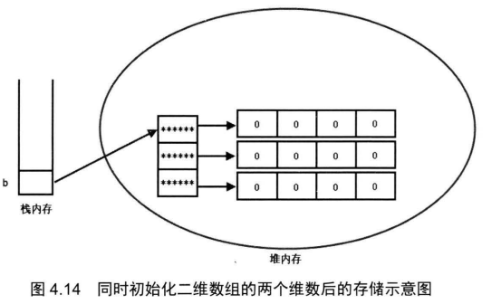
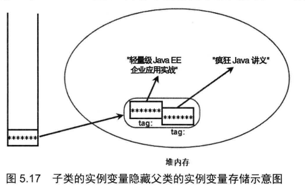

# 多维数组

Java中没有从底层实现真正的多维数组, 

例如:在Java里面的二维数组本质还是一维数组, 其数组元素储存引用变量, 引用变量指向另外的一维数组

如何定义多维数组: 

```java
type[][] arrName;
```

初始化

```java
arrName = new type[length][]
```

上述语句实际上相当于初始化了一个一维数组, 该一维数组的长度为length, 其数组元素为引用类型, 被系统自动初始化赋值为null


> 注意上图中定义了一个元素为对象的数组, 其数值在内存的存储方式如图所示

```java
a = new int[4][];
```



> 上图中该二维数组进行了(一维)初始化, 其堆内存存储方式跟一维数组非常类似



> 上图显示了二维数组对其数组元素进行了(二维)初始化

```java
b = new int[3][4];
```



> Java里面的三维数组也是一维数组, 其数组元素是二维数组, 二维数组里面的数组元素是一维数组, 所以Java多维数组的本质都是一维数组


二维数组

```java
int[][] nums=new int[2][2];
for(int[] list:nums){
    for(int item:list){
        System.out.println(item);
    }
}
```

上述代码用增强for循环遍历了一个二维数组


一维数组: ArrayList集合的底层

# 构造器

Java中通过new 关键字来调用对应类的构造器, 构造器会返回该类的一个实例

构造器是类创建对象的默认途径

没有构造器的类通常无法创建实例

如果没有自定义的构造器, 系统会自动为类生成一个构造器

构造器是一个特殊的方法(构造方法)

构造器不能声明返回值的类型, 也不能用void关键字来修饰

因为一旦用类型关键字来声明后, Java不会将其当作构造方法来执行, 而是作为普通方法来执行

构造方法的语法结构包括: 修饰符 构造方法名 形参列表

> 系统默认提供的构造方法是不带形参的

```java
class Student1{
    public Student1(){
        this("nih",18);
    }

    public Student1(String name,int age){
        this.name=name;
        this.age=age;
    }
}
```

上述代码中的无参构造器通过this关键字来调用了另一个有参构造器

> 当一个类被创建时候, 未显式赋值的类成员一定会进行自动初始化

> 使用new关键字创建对象时, 一定会对未显式赋值的实例变量进行自动初始化

> 构造器又称为构造方法

# 继承

extends关键字来实现继承

通过继承, 子类可以继承父类中的成员变量(类中方法外的变量)和方法

访问控制允许的情况下, 子类实例(对象)可以直接调用父类中方法

> 继承是实现类复用的重要手段, 类的复用也可以通过组合关系来实现 

```java
Father ft = new Child();
```

上述代码将子类的对象赋值给了父类变量, 使得该变量具有了多态性

> 如果是用组合关系来实现复用, 无法这样子来实现多态
>
> 灵活性差

**程序设计应该遵循高内聚， 低耦合原则**

高内聚： 每个类的功能性应该全面、完善， 尽量不需要依赖于其他类

低耦合： 类和类之间的关系尽量简单化， 减少关联性

> 面向对象三大特征: 继承 封装 多态

继承是实现代码复用的重要手段

Java中的继承为单继承, 一个子类只能有一个父类

> Java舍弃了C++中复杂的多继承特性

> 但是也可以通过父类继承间接父类, 来使得子类间接继承多个(间接)父类

**在Java中如果一个类没有显示指定一个类作为直接父类, 则会默认指定java.lang.Object类为其直接父类**

**java.lang.Object是Java中所有类的直接/间接父类**

```java
public class SubClass extends SuperClass{}
```

上述代码中通过extends关键字, SubClass类继承了父类SuperClass

> extends原意为扩展, 所以也可以说子类是对父类的扩展

> 注意Java中子类无法继承父类的构造器

derive(派生) 父类派生了子类

extends(继承) 子类继承了父类

derive extends都是描述同一动作, 但是角度/方向不同

子类大部分情况下都是在父类的基础上增加新的成员变量和方法

但是存在例外情况: 方法重写(覆盖) (Override)

方法重写(override)与方法重载(overload)是完全不同的概念

方法重写:

子类中存在于父类同名的方法称为方法重写

方法重写规则: 两同两小一大

两同: 方法名 形参列表必须相同 (是否被static修饰符修饰也需要保持一致)

两小: 子类中的方法返回值**类型**必须小于或等于父类方法的返回值类型

子类方法抛出的异常类也应该比父类方法更小或相等

一大: 子类方法的访问权限应该比父类方法的更大或相等

> 注意父类中用private修饰的方法对于子类来说是不存在的(隐藏) 这时候在子类中定义同名的方法不是方法重写

super关键字用于在子类中调用被覆盖的父类方法

> super关键字不能出现在static修饰的方法中
>
> 但是可以调用被static修饰的方法

super关键字也可以用于在子类中调用被隐藏的父类变量

> 当子类中定义了与父类重名的变量时会导致父类变量被隐藏, 子类可以通过super关键字调用被隐藏的父类变量

程序查找变量的顺序(优先级)为:

1. 找该方法中的局部变量
2. 找该类中的成员变量
3. 找父类中的成员变量
4. 按结构遍历所有间接父类的成员变量直至最终的java.lang.Object
5. 最终仍无法找到变量将出现编译错误

找到同名变量后不会再执行后续步骤



```java
Son s=new Son();
//int num=s.tag;
int num =((Parent)s).tag
```

上述代码显示了在创建子类对象后, 用(Parent)来调用父类中被隐藏的变量

**子类可以用super关键字来调用父类的构造器**

> 使用this或super关键字调用构造器必须出现在构造器执行体第一行, 因此不能同时出现

**子类构造器一定会调用父类构造器一次**

三种情况:

1. 用super关键字调用父类构造器
2. 用this关键字调用本类中另一个构造器, 另一个构造器调用父类构造器
3. 以上两种情况都没有发生时, 系统默认调用父类无参数构造器

**创建一个对象时, 一定是从对应类所在的继承树最顶层类的构造器开始依次向下执行, 因此最开始一定会执行java.lang.Object类的构造体, 最后才会执行本类的构造体**

方法重写原则：

1. **子类的修饰符必须大于或等于父类中的修饰符**
2. 子类中的返回值范围必须小于或者等于父类的返回类型范围， 并且两者需要为继承关系


**父类也被称为超类**

**在子类中打算重写父类方法时，应该写@Override注释， 但是不写也不会出问题**

# 注解（Annotation)

JDK5增加了Annotation功能

Java用@来声明注解语句

注解（Annotation)与注释(Commit)相似， 都不会改变程序的逻辑

但是Commit是写给人看的

Annotation是写给开发工具、代码分析器、 部署工具看的， 用于补充代码信息进行验证或者部署

> Annotation的本质是一种接口， 用于给代码元素设置元数据（MetaData)

> 例如Java类库中不推荐使用的方式是使用@Deprecated进行注解， IDE会读取该注解，并在代码使用该方法时进行提示

```java
User u=new User();
System.out.println(""+u);
```

将字符串与一个对象拼接时, 将调用对象的toString方法