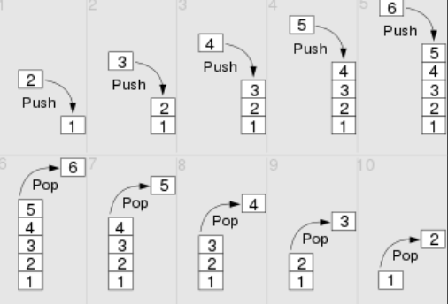

内存空间

JVM的内存可以划分为: 线程栈stack, 堆heap, 程序计数器, 本地方法栈, 元空间

栈: 先进后出 LIFO(last in first out)

队列: 先进先出 FIFO(First in first out)

线性数据结构 高速访问

内存空间高效利用, 但是导致变量的大小固定不可变

低成本

栈内存里面的变量一般不需要GC进行内存回收, 因为它的内存空间会随着方法或代码块的运行结束而销毁