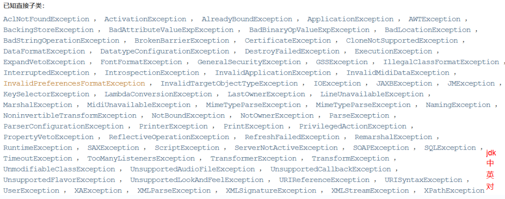
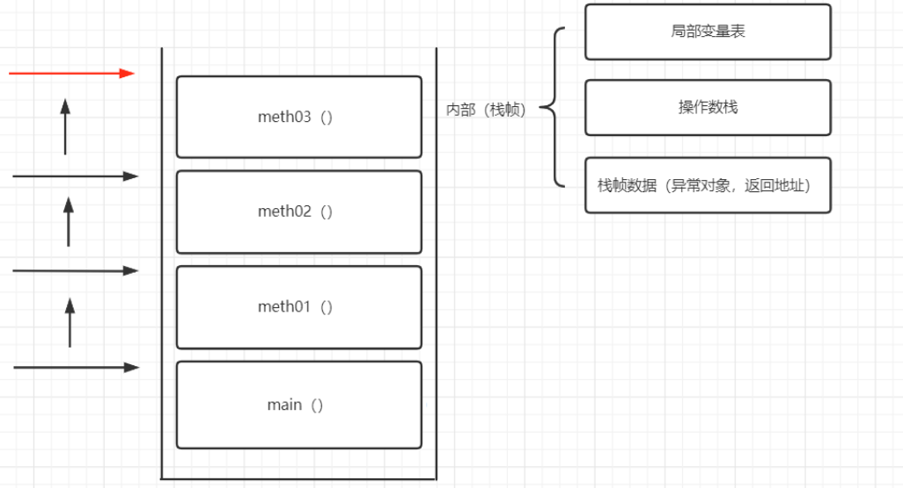

# 包装类

Java中的8个基本类型都有对应的包装类

> 8种基本数据类型: byte short char int long float double boolean

包装类可以将基本数据类型的值转换成对象使用

并且JDK1.5提供了自动装箱和自动拆箱的功能

允许同类型的包装类对象和基本类型变量间可以直接赋值

| 基本数据类型 | 包装类    |
| ------------ | --------- |
| byte         | Byte      |
| short        | Short     |
| char         | Character |
| int          | Integer   |
| long         | Long      |
| float        | Float     |
| double       | Double    |
| boolean      | Boolean   |

除了int和char的对应包装类为其单词全写外, 其他包装类都是首字母大小即可

在Java1.5提供自动装箱(Autoboxing)和自动拆箱(AutoUnboxing)之前必须使用包装类中的valueOf()和xxxValue()方法来实现基本数据类型和包装类对象的相互转换

```java
Integer integer1=Integer.valueOf(2);
//手动装箱
int i2=integer1.intValue();
//手动拆箱
integer1=i2;
//自动装箱
i2=integer1;
//自动拆箱
String str2="2.2";
//str2无法转换为Integer对象, 因为该字符串并非整数格式
String str2="2";
integer1 =Integer.parseInt(str2);
//通过Integer.parseInt方法将字符串转为Integer对象
Double d=Double.parseDouble(str2);
//但是Double.parseDouble可以接受整数格式的字符串
```

如图:


在包装类中, 还提供了将字符串和其他基本类型进行相互转换的方法

1. parseXxx(String s) :除了Character类的所有包装类都提供该方法
2. valueOf(String s)

将基本类型变量与""空字符串进行拼接操作, 会自动将基本类型变量转换为字符串, 更方便

> 包装类作为引用变量可以直接与基本类型变量进行比较(发生了自动拆箱)
>
> 两个包装类对象引用变量进行比较时, 只有两个引用变量是指向同一个对象时才会返回true

JDK1.5后的自动装箱有缓存机制, -128~127之间的整数装箱成Integer实例后将存储到一个cache数组中, 第二次使用时将直接从cache数组中取出不再重复创建

所以-128~127自动装箱创建的实例进行相等比较将返回true

> byte范围-128~127

**为什么byte的范围是-128~127**

0000 0000

byte

00000000

符号位占一位 存储数值的位有7位

2^(8-1)-1

128-1=127

> Java使用二进制补码来存储负数


正数和负数在计算机底层均以补码的形式存储

2*(9-1)-1=255

255=128+127

> -128以8位2进制表示: 1000 0000
>
> 1000 0000补码
>
> 0111 1111 +1
>
> 1000 0000
>
> 负数补码计算方式
>
> 正数的补码是其本身

Java7中提供了包装类对象的比较方法

```java
Integer.compare(Integer val1, Integer vla2)

Integer.compare(2,1);
//输出1
Integer.compare(1,2);
//输出-1
Integer.compare(1,1);
//输出0
```

Java7中还为Character包装类增加了大量工具方法, 用于对字符进行判断

Java8为整数包装类提供了无符号运算方法

如:

static String toUnsignedString(int/long i):

将int/long整数转换为无符号整数对应的字符串

>这些方法好像有字符串拼接, 强制转换等替代方法可以实现相同的功能

> 注意将负数转换成无符号整数时, 不会是直接取其绝对值, 而是将其补码的符号位1作为数值位, 作为原码计算出对应的无符号整数 

如8位byte存储的-3

原码: 1000 0011

补码: 1111 1100+1

1111 1101

其无符号整数为253

**自动装箱时, 如果数值在-128到 127之间的范围，Integer会有缓存机制**

**所有的包装类都被final修饰, 不能被继承**

常见API:

1. 两个类常量

   ```java
   Integer.MIN_VALUE;
   //int类型的最小取值
   Integer.MAX_VALUE; 
   //int类型的最大取值
   ```

2. 将字符串转换为int

   ```java
   Integer.parseInt(String str);
   ```

3. 将十进制转换为其他进制

   ```java
   int i=15;
   Integer.toBinaryString(i);
   //转换成2进制字符串
   Integer.toOctalString(i);
   //转换成8进制字符串
   Integer.toHexString(i);
   //转换成16进制字符串
   ```

# Date类

> Date中的大部分方法已经被废弃, 因为Date显示的时间为当前系统的所在时区的当地时间, 不支持国际化
>
> 可以使用Calender类来代替Date类

```java
Date d=new Date(System.currentTimeMillis());
//以1970-1-1到某个时间的时间差(毫秒为单位)创建Date对象
Date d2=new Date();
Date d3=new Date();
//创建一个当前时间的Date对象
System.out.println(d);
System.out.println(d2);
//d和d2的输出相同
d.equals(d2);
//true
d3.equals(d2);
//true
```

# Calendar类

需要先创建对象再通过对象调用实例方法

getTime()

> 将Calendar对象转换为Date对象

get()	set()	add()	

> 获取时间 修改时间 在存储的时间基础上加减时间

```java
Calendar cal = Calendar.getInstance();
//注意Calendar对象储存的是创建的时间, 创建后不会变化
Date d1= cal.getTime();
//转换成Date对象
cal.get(Calendar.DAY_OF_YEAR);
//今年的第几天
cal.get(Calendar.DAY_OF_MONTH);
//这个月的第几天
cal.get(Calendar.DAY_OF_WEEK);
//这周的第几天
cal.get(Calendar.YEAR);
//公元第几年
cal.get(Calendar.MONTH);
//今年第几个月
cal.get(Calendar.DATE);
//和Calendar.DAY_OF_MONTH相同
cal.get(Calendar.HOUR_OF_DAY);
//今天的第几个小时
cal.get(Calendar.MINUTE);
//当前小时的第几分钟
cal.get(Calendar.SECOND);
//当前分钟的第几秒
cal.set(1997,6,1);
//将时间修改为1997年6月1日,修改对象本身
cal.add(Calender.YEAR,60);
//将时间修改为60年后, 会修改对象本身
cal.add(Calender.YEAR,-60);
//将时间修改为60年前, 会修改对象本身
```

# SimpleDateFormat

用于将字符串和Date对象按照一定格式进行相互转换

```java
public static void main(String[] args) throws ParseException {
String str="2022-05-16 12:00:12";
SimpleDateFormat sdf=
        new SimpleDateFormat("yyyy-MM-dd hh:mm:ss");
//注意月份和分钟分别用大小写的M和m表示
Date date=sdf.parse(str);
//将格式的字符串转换成对应时间的Date对象
System.out.println(date);
Date date1=new Date();
sdf.format(date1);
//将Date对象转换成格式化的字符串
}
```

必须加上throws ParseException捕获异常, 否则编译会报错

> 完整格式参考表格


# LocalDate

**LocalDate按照系统所在语言的格式来输出时区对应的日期**

**注意LocalDate对象储存的是年月日, 不包含小时 分钟 秒**

```java
LocalDate ld=LocalDate.now();
//创建LocalDate对象存储当前时间
System.out.println(ld);
//输出2022-05-16格式的年	月	日
ld.getYear();
//输出年份
ld.getMonth().getValue();
//输出第几个月
//使用ld.getMonth()会输出月份的英文单词
ld.getDayOfMonth();
//输出一个月中的第几天
ld.getDayOfYear();
//输出一年中的第几天
ld.getDayOfWeek();
//输出一周的第几天
LocalDate ld2=LocalDate.of(2022,3,15);
//修改时间
ld2.isLeapYear();
//判断是否是闰年
//输出假
ld2.isAfter(ld);
//判断ld2的时间是否在ld之后
//输出假
String str=ld.format(DateTimeFormatter.ofPattern("yyyy年MM月dd日 HH时-mm分钟-ss秒"));
//上行代码会报16错, 因为LocalDate对象中不存储小时 分钟 秒
String str=ld.format(DateTimeFormatter.ofPattern("yyyy年MM月dd日"));
//将LocalDate对象转换为格式化字符串
String str2= "2022年05月16日";
LocalDate ld3=LocalDate.parse(str2,DateTimeFormatter.ofPattern("yyyy年MM月dd日"));
//将字符串转换为LocalDate对象
LocalDate ld4=ld3.plusDays(10);
//将时间加10天, 返回修改后的时间, 不会修改对象本身
ld4=ld4.plusDays(-10);
//减10天, 不修改原对象
ld4=ld4.plusMonths(5);
//加5个月,不修改原对象
ld4=ld4.plusYears(1);
//加一年, 不修改原对象
```

# LocalTime

跟LocalDate类似, 但是存储的是时分秒

```java
LocalTime lt= LocalTime.now();
lt.getHour();
lt.getMinute();
lt.getSecond();
lt=LocalTime.of(23,12,11);
//修改时间
String str=lt.format(DateTimeFormatter.ofPattern("HH:mm:ss"));
//不能使用hh,这里只能使用HH
//将LocalTime对象转换为字符串
lt=LocalTime.parse("11点45分30秒",DateTimeFormatter.ofPattern("HH点mm分ss秒"));
//不能使用hh,这里只能使用HH
```

# LocalDateTime

存储年月日 时分秒

```java
LocalDateTime ldt=LocalDateTime.now();
ldt.getDayOfYear();
ldt.getDayOfMonth();
ldt.getHour();
ldt=LocalDateTime.of(2022,3,
        4,11,12,13);
String str=ldt.format(DateTimeFormatter
        .ofPattern("yyyy-MM-dd hh:mm:ss"));
//注意HH为24小时制
//hh为12小时制
ldt=LocalDateTime.parse(str,DateTimeFormatter
        .ofPattern("yyyy-MM-dd hh:mm:ss"));
```

# 异常

错误(error): 对程序来说不可预测, 不可避免

> 例如OOM(out of memory) 内存不足导致程序被关闭

异常(exception)分为编译时异常和运行时异常, 都可以通过修改代码处理

编译时异常:	编译器编译时检查出的问题

运行时异常:	程序运行时在JVM抛出的异常


> 异常继承树

**exception可以通过代码来解决, 体现了Java的健壮性**

> 编译时异常的父类是Exception
>
> 运行时异常的父类是RuntimeException

编译时异常有:



运行时异常有:


方法栈中的调用关系

```java
public class MainEnter {
    public static void main(String[] args){
        meth01();
    }
    private static void meth01() {
        meth02();
    }
    private static void meth02() {
        meth03();
    }
    private static void meth03() {
        System.out.println("猜猜我是谁！");
    }
}
```

上述代码中运行的方法栈如图所示



> 当一个方法主动抛出异常时, 将导致该方法被弹出方法栈, 并导致方法栈中在该方法上的方法也被弹出

编译时异常的解决方案:

1. 不捕获异常, 直接向外抛出

   > 异常未被内部处理, 并且会异常方法会被弹出方法栈

   ```java
   public static void main(String[] args) throws ParseException {
       SimpleDateFormat sdf = new SimpleDateFormat("yyyy-MM-dd hh:mm:ss");
       Date date = sdf.parse("wrong input");
   }
   ```

2. 捕获异常, 但不抛出

   > 异常会被内部消化, 方法不会被弹出栈
   >
   > 方法会全部执行完

   ```java
   public static void main(String[] args){
       SimpleDateFormat sdf = new SimpleDateFormat("yyyy-MM-dd hh:mm:ss");
       try {
           Date date = sdf.parse("wrong input");
       } catch (ParseException e) {
           e.printStackTrace();
       }
   }
   ```

3. 捕获异常并向外抛出

   > 异常被内部消化, 并告知调用的方法
   >
   > 导致产生异常的方法被弹出方法栈

   ```java
   public static void main(String[] args) throws ParseException {
       //指定抛出异常的类型
       SimpleDateFormat sdf = new SimpleDateFormat("yyyy-MM-dd hh:mm:ss");
       try {
           Date date = sdf.parse("wrong input");
       } catch (ParseException e) {
           e.printStackTrace();
           throw e;
           //将捕获到的异常抛出给外部
       }
   }
   ```

>总结: 1,3会导致方法被弹出栈结构, 剩余代码不会被执行
>
>2不会弹出, 完整执行完方法的代码
>
>通常编程中使用1,2方案
>
>使用原则: 在栈结构允许的最高处捕获并处理异常, 其他层直接将异常外抛
