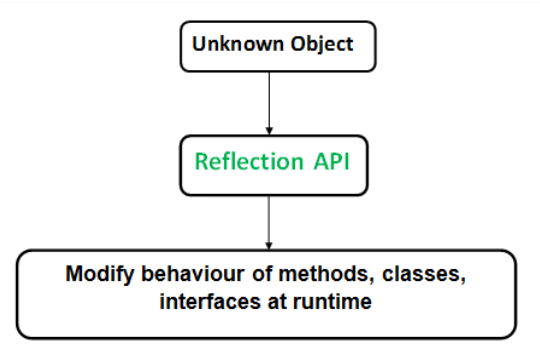
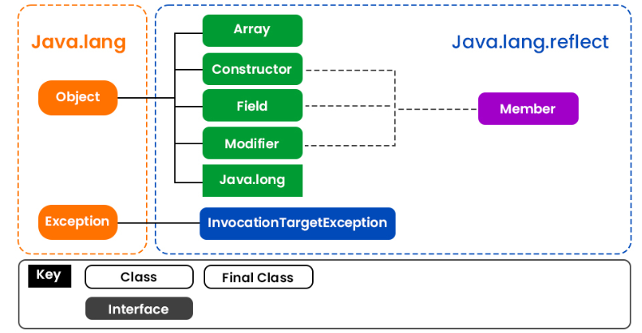
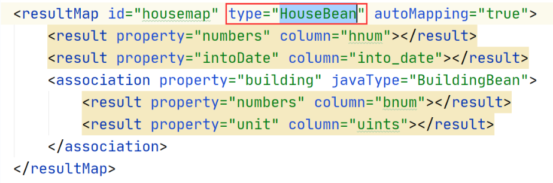
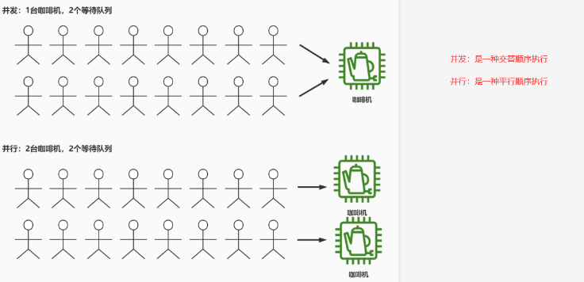
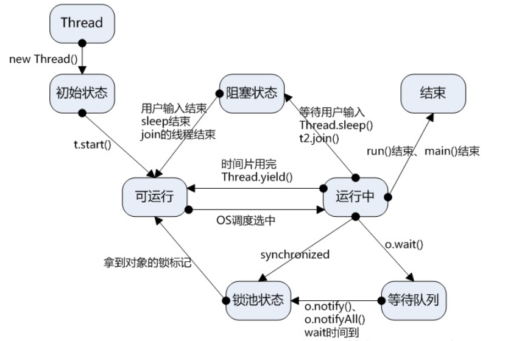

# 反射

反射用于在程序运行时获取类或接口的内部信息, 并直接操作对象的内部属性或方法

java.lang.Classs是java反射机制的核心类

java反射API由java.lang.Classs和java.lang.reflect组成

这两个类库包含了Field Method	Constructor等类, 用于表示未知类的成员

> 通过反射可以获取未知对象或者未知类中的方法 属性,并在程序运行时对这些未知方法 类 接口进行修改

> 意味着反射可以用于在运行时对未知对象进行临时性的修改, 该修改仅仅在程序运行时生效, 不会对类的字节码文件进行修改






> 使用反射调用方法时, 不受访问修饰符限制

获取Class对象的方式

```java
//通过类的实例获取
Person person=new Person();
Class<Person> class01=person.getClass();
//通过调用类的class属性获取
Class<Person> class02=Person.calss;
//通过调用Class.forName()方法获取, 注意要输入包名加类名
Class<Person> class03=Class.forName("com.lee.project.Person");
//通过类加载器获取
ClassLoader classLoader=this.getClass().getClassLoader();
Class<Person> class04=classLoader.loadClass("com.lee.project.Person")
```

常用的反射API(实例方法)有:

> java.lang.Class

>反射通过方法名和形参列表来调用方法, 形参列表为空时需要null作为参数

| API                      | 功能                         |
| ------------------------ | ---------------------------- |
| 获取类的内部信息         |                              |
| getClass()               | 获取对象所属类的类名         |
| getConstructors()        | 获取类的构造器               |
| getDeclaredConstructor() | 获取私有构造器               |
| getMethods()             | 获取类的公有方法             |
| getDeclareMethod()       | 获取类的私有方法             |
| getField()               | 获取类的公有属性             |
| getDeclareField()        | 获取类的私有属性             |
| invoke()                 | 获取方法后用方法对象调用方法 |

```java
//获取私有成员后, 在操作前需要将访问权限设置为可访问
setAccessible(true);
```

利用反射可以操作类的元素: 构造器  属性  方法  注解

反射API的特性:

1. 可扩展性
2. 可以作为调试测试工具: 检查类的私有成员
3. 性能效率偏低: 反射操作的性能比非反射操作要慢, 效率较低
4. 内部暴露: 反射允许代码执行非正常操作, 会导致代码的可移植性降低, 使抽象性被破坏
5. 安全限制: 反射要求程序的运行环境没有安全限制

反射属于Java的动态特性之一

> 注解	动态代理	类加载器都属于java的动态特性

动态特性经常被框架用来增强灵活性

例如:

1. Spring MVC框架利用反射和注解将用户的请求转换为对应的Java对象, 也能将Java对象转变为响应式内容
2. 单元测试库JUnit用到了反射
3. AOP编程利用java的动态特性将业务逻辑代码和通用代码(例如安全检查)分离, 减少代码冗余, 增强可维护性

> AOP编程: 面向切面编程

**类的生命周期**

1. 加载:    使用类加载器将class文件用IO流读入JVM, 生成Class对象(每个类都有一个对应的Class对象)
2. 连接

>连接包括验证 准备 解析三步
>
>1. 验证:    验证字节码信息是否符合当前JVM的版本
>2. 准备:    给类变量(static变量)分配内存空间并赋初值
>3. 解析: 将常量池变量修改为内存地址

3. 初始化: 调用类身上的init()方法来执行static{}静态代码块, 并对static变量进行赋值
4. 运行
5. 卸载

类的加载阶段分为 加载 连接 初始化三步

面试题

```java
class A{
    static {
        System.out.println("A");
    }
    {
        System.out.println("a");
    }
    A(){
        System.out.println("aa");
    }
}
class B extends A{
    static {
        System.out.println("B");
    }
    {
        System.out.println("b");
    }
    B(){
        System.out.println("bb");
    }
}
class MainEnter{
    public static void main(String[] args){
        B b = new B();
    }
}
```

> 上述代码输出A B a aa b bb

## 双亲委派机制

使用类之前需要使用加载器加载类的信息

> java有三种类加载器

1. 引导类加载器: 加载核心代码, java.*
2. 扩展类加载器: 加载扩展代码, javax.*
3. 应用类加载器: 加载当前程序的代码

> 加载器分类执行可以使java的核心类更安全

> 2继承了1, 3继承了2


> 反射示例

```java
//使用反射加载JDBC驱动
Class.forName("com.mysql.cj.jdbc.Driver");
```

> xml用反射加载类文件



反射的作用:

反向加载外部类

# 线程

线程 Thread

进程 Process

一个进程可以有多个线程

一个process对应多个thread

线程的生命周期: 创建	就绪	运行	阻塞	死亡

# 并行 

并行 Parallel

并发 concurrent

并行指多个任务在同一时刻运行(多核)

并发是指多个任务在同一时间段内有执行(单核, 时分复用)



# 多线程

多线程优势: 可以充分利用多核CPU的计算能力, 提高程序的运行速度

>  单线程:只能利用单核CPU的计算能力java中通过继承Thread或 实现Runnable或Callable接口来使类获取多线程能力

Java的多线程调度算法有两种: 分时调度	优先级调度

> Java的多线程都是依靠C语言所写的底层算法, 等同于依靠CPU来控制线程调度(调度算法也是CPU本身用的调度算法)

分时调度: 按照时间分配CPU运行的线程, 给每个线程分配CPU的运行时间片

优先级调度: 线程优先级越高, 分配到时间片的概率越高

> java设定的线程优先级默认是5, 范围是0-10

## Thread

Thread实现多线程步骤:

1. 子类继承Thread类, 并重写run()方法, run()方法被称为线程执行体
2. new Thread子类的实例作为线程对象
3. 调用创建实例的start()方法

> Thread多线程生命周期图



> Thread实现多线程

```java
public class Test{
    Thread test=new Thread("test线程");
    //获取线程状态 此时是NEW状态
    test.getState();
    //设置线程优先级为10
    test.setPriority(10)
    //启动线程
    test.start();
    //此时线程状态为RUNNABLE状态
    //就绪, 已经通过start方法启动, 但是由于CPU有线程调度算法, 所以不会一直是运行中状态
    test.getState();
    //让运行这行代码的线程休眠1秒
    Thread.sleep(1000);
}
```

## Runnable

Runnable实现多线程的步骤

1. 实现类实现Runnable接口, 重写run()方法
2. 创建实现类的实例, 并用该实例作为Thread的构造器参数创建Thread实例作为真正的线程对象
3. 调用线程对象的start()方法

可以认为Runnable的多线程是依赖于Thread类实现的

> Runnable实现多线程

```java
class Main{
    public static void main(String[] args) {
        System.out.println("主线程启动");
        Thread mt=new MsgThread();
        mt.start();
        System.out.println("主线程结束");
        Thread mt2=new MsgThread();
        mt2.start();

        EmailTask et=new EmailTask();
        Thread td=new Thread(et);
        td.start();
        Thread td2=new Thread(et);
        td2.start();
    }
}

class MsgThread extends  Thread{
    @Override
    public void run(){
        System.out.println("发短信");
    }
}

class EmailTask implements Runnable{
    @Override
    public void run() {
        System.out.println("发邮件");
    }
}
```

注意Thread或Runnable实现的多线程run方法被void修饰, 不能有返回值

但是Callable实现的call方法可以有返回值

## Callable

Callable实现多线程步骤:

1. 实现类实现Callable接口, 重写call()方法, call方法是线程执行体
2. 创建Callable的实现类的实例, 传入FutureTask或ExecutorService的构造器创建线程对象
3. 调用线程对象的run或submit方法
4. 可以用get方法获取返回值

> FutureTask和ExecutorService都在java.util.concurrent包下面

**Thread和Runnable的区别**

1. Thread是类, Runnable是接口
2. Thread是线程对象, Runnable要依靠Thread类创建线程对象
3. 实现Thread不能再继承其他的父类, 但是Runnable接口不影响实现类继承其他父类

**Runnable和Callable的区别**

1. Runnable没有返回值, Callable可以获取返回值
2. Runnable不能抛出异常, Callable可以抛出异常
3. Runnable是异步多线程, 一个线程完成会立刻开启新线程, 无阻塞状态
4. Callable是同步多线程, 一个线程完全要等其他多线程完成再一起创建新的多线程, 阻塞状态

## 线程池(ExecutorService)

> 线程池实现Callable接口

```java
//ThreadTask是具有多线程能力的类
ThreadTask tt=new ThreadTask;
//创建一个容量为5的线程池
ExecutorService es = Executors.newFixedThreadPool(5);
Future<Integer> res = es.submit(rt);
//获取运行结果
res.get();
//结束线程池的运行
es.shutdown();
```
