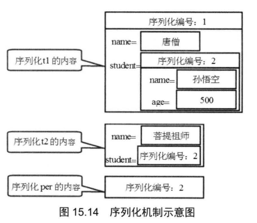
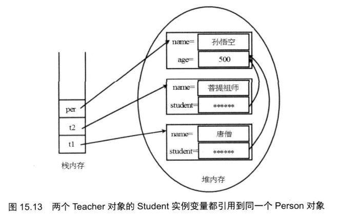

# 序列化

**序列化是指将内存中的对象转换为二进制信息写入IO流中, 也就是二进制流**

> 通过对象序列化机制可以将对象转换为二进制流, 二进制流可以保存到硬盘中或者通过网络传输

**反序列化是指程序通过硬盘或者网络接收到二进制流后在内存中将其恢复为原来的java对象**

> 注意类的信息的是在编译时内存中, 也就是类文件中, 但是对象只有当程序运行时才能在内存中创建

java中的序列化机制允许将对象转换为字节序列, 字节序列信息可以脱离内存和程序, 通过硬盘或网络进行传输和储存

> 要求对象的类实现序列化接口

java9中对序列化机制进行增强, 增加了数据校验机制, 提高了安全性和健壮性

将对象进行序列化时要求其对应的类必须实现序列化接口

java中有两种序列化接口 Serializable	Externalizable

> 如果类不实现序列化接口, 会在试图序列化其对象时抛出NotSerializableException

**Serializable是一个标记接口, 实现该接口不需要实现任何方法**

> java中大部分系统提供的类已经实现了Serializable接口

在网络编程中会有大量场景必须用到序列化

通常在编程中自定义的类可以实现Serializable接口来实现序列化

> 不需要实现任何方法

序列化步骤:

1. 创建ObjectOutputStream流(高级流)(对象序列化流)

   >高级流的创建必须使用到低级流

2. 调用writeObject实例方法

反序列化步骤

1. 创建ObjectInputStream流
2. 调用readObject实例方法

**序列化时只保存对象信息, 不会保存类信息**

**因此反序列化时必须确保类信息已经在当前程序中, 否则无法恢复对象**

> 没有类信息时, 强行调用readObject方法会抛出ClassNotFoundException

**序列化对象时, 其对应的类如果有父类或间接父类, 父类必须有无参构造器或者实现序列化接口, 否则会抛出InvalidClassException异常**

如果父类没有实现序列化接口,但是有无参构造器, 那么父类中的成员变量(实例变量)的值不会保存到对象中

而是调用无参构造器对父类的成员变量进行自动初始化

> 序列化和反序列化代码示例

```java
class Father{
    int gender;
}
class Cat extends Father implements Serializable{
    String name;
    int age;

    public Cat(String name, int age) {
        this.name = name;
        this.age = age;
    }

    @Override
    public String toString() {
        return "Cat{" +
                "gender=" + gender +
                ", name='" + name + '\'' +
                ", age=" + age +
                '}';
    }
}
class Test41{
    public static void main(String[] args) throws IOException {
        try{
            Cat cat=new Cat("小白",123);
            cat.gender=99;
            System.out.println(cat);
            //创建输出流
            ObjectOutputStream oos=new ObjectOutputStream(new FileOutputStream("1.txt"));
            //将对象序列化后写入文件
            oos.writeObject(cat);
            //创建输入流
            ObjectInputStream ois=new ObjectInputStream(new FileInputStream("1.txt"));
            Object object=null;
            //读取文件中的序列化对象信息
            //在if语句中嵌套赋值语句
            if((object=ois.readObject())!=null){
                //反序列化恢复对象
                Cat copyCat=(Cat)object;
                System.out.println(copyCat);
            }
        }catch (Exception e){
            e.printStackTrace();
        }
    }
}
```

> 上述代码的输出是

```java
//序列化前的对象信息
Cat{gender=99, name='小白', age=123}
//反序列化后恢复的对象信息
Cat{gender=0, name='小白', age=123}
```

注意这里恢复的对象信息中丢失了父类成员变量gender的值,变成了无参构造器自动初始化的值

> 如果一个文件写入了多个序列化的对象, 反序列化时必须按顺序读取

进行序列化时, 如果类中的成员变量是引用变量, 那么其引用的类也必须是可序列化的

```java
ObjectOutputStream oos=new ObjectOutputStream(new FileOutputStream("1.txt"));
Person per=new Person("孙悟空",500);
Teacher t1=new Teacher("唐僧",per);
Teacher t2=new Teacher("菩提祖师",per);
oos.writeObject(t1);
oos.writeObject(t2);
oos.writeObject(per);
```

上面的代码只会产生一个"小白"的Person对象不会产生三个Person类型对象

Java采用一种特殊的序列化算法, 确保在其他对象中引用类型变量对应的对象不会产生重复

算法原则如下:

1. 所有保存到磁盘的对象都有一个对应的序列化编号
2. 当对一个对象执行序列化时, 会先检查该对象已经被序列化过, 只有从未(在JVM的生命周期内)被序列化的对象才会执行序列化
3. 如果是已经序列化过的对象, 将直接使用其对应的序列化编号, 而不会重新执行序列化

> 序列化编号机制



> 如果是重新序列化实质上将产生一个新的对象, 与java中的对象引用思想冲突



**如果多次序列化同一个对象, 只有第一次序列化会被执行, 后面会直接返回该对象的序列化编号, 不会执行序列化**

```java
Cat cat=new Cat("小白");
//第一次序列化将会正常执行
oss.writeObject(cat);
//更改该对象已经序列化
cat.name="小黑";
//第二次序列化直接返回"小白"对应的序列化编号, 不会重复将对象转换成二进制流
oss.writeObject(cat);
```

**由于java的序列化机制不允许重复序列化, 将导致

# PrintStream

PrintStream是一种输出流, 可以输出字节信息或字符信息

> 输出字符信息的时候使用的是当前系统的编码器

System.out.println就是用PrintStream作为系统输出流

```java
PrintStream ps=new PrintStream("2.txt");
ps.println("123");
ps.close();
```

PrintWriter是字符输出流, 不能输出字节信息

```java
PrintWriter pw=new PrintWriter("22.txt");
pw.println("1234");
pw.close();
```


