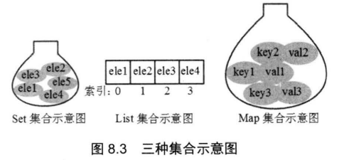

# 异常捕获

异常捕获是编译时异常的解决方案之一

关键字 try catch finally

```java
public static void main(String[] args) {
    SimpleDateFormat sdf=new SimpleDateFormat("yyy-MM-dd");
    if(true){
        return;
        //如果return在上层代码, 下层代码不会执行
    }
    try{
        Date d=sdf.parse("1234");
        System.out.println("调用成功");
        return;
        //try代码块中的return不会影响到finally的执行
        //finally在return之前执行
    }catch (ParseException e){
        e.printStackTrace();
        System.out.println("异常捕获");
    }finally {
        System.out.println("始终执行");
    }
}
```

**try代码块中的return不会影响到finally的执行**
**finally在return之前执行**

异常捕获语句可能会产生多个异常, 可以有多个catch块, 但是try块和finally块只能有一个

有多个catch块时, 从上到下执行, 并且当一个catch块满足时不会再判断后面的catch块

因此为了使每个catch块都有效, 应该按照异常范围从小到大排序

# 异常抛出

throw是异常抛出, 用于声明异常, 告诉方法的调用者该方法可能抛出的异常

1. 不捕获异常, 直接向外抛出

   > 异常未被内部处理, 并且会异常方法会被弹出方法栈

   ```java
   public static void main(String[] args) throws ParseException {
       SimpleDateFormat sdf = new SimpleDateFormat("yyyy-MM-dd hh:mm:ss");
       Date date = sdf.parse("wrong input");
   }
   ```

2. 捕获异常并向外抛出

   > 异常被内部消化, 并告知调用的方法
   >
   > 导致产生异常的方法被弹出方法栈

   ```java
   public static void main(String[] args) throws ParseException {
       //指定抛出异常的类型
       SimpleDateFormat sdf = new SimpleDateFormat("yyyy-MM-dd hh:mm:ss");
       try {
           Date date = sdf.parse("wrong input");
       } catch (ParseException e) {
           e.printStackTrace();
           throw e;
           //将捕获到的异常抛出给外部
       }
   }
   ```


> 抛出异常会导致方法被弹出栈结构, 剩余代码不会被执行

# 运行时异常

运行时异常无法被编译器检测出, 会在程序运行时动态抛出

运行时异常无法捕获(catch), 可以用条件判断语句进行预防

> 捕获只能捕获编译时异常

# 自定义异常

可以通过继承Exception或RuntimeException类来实现自定义异常

**异常的本质是特殊的类**

1. 自定义编译时异常

   > 继承Exception类

   ```java
   public class CustomException extends Exception{}
   ```

   

2. 自定义运行时异常

   > 继承RuntimeException类

   ```java
   public class CustomRumtimeException extends RuntimException{}
   ```

# 集合

**java中的数组不属于集合**

**数组特点**

1.  数组的长度不可变
2. 数组的元素类型是相同且不可变的
3. 数组不能保存映射关系的数据
4. 数组的元素可以存储基本数据类型和引用数据类型
5. 数组是线性连续结构的存储空间

**集合特点:**

1. 集合是长度是可变的容器
2. 集合的元素类型可以是不同的, 也是可变的
3. 集合可以保存映射关系的数据(关联数组)
4. 集合的元素只能存储引用数据类型

Collection和Map接口是Java集合框架中的根接口

java中的集合类主要由这两个接口派生出

集合中的集合分为四种结构: Set List Queue Map

set: 无序, 元素值不可重复

list: 有序,可以重复, 通过index来访问值

Map: 保存映射关系的集合

Queue: 队列集合

**java中的集合实质为一种特殊的容器, 用于存储多个对象引用**

在Java5中增加了泛型, 使集合具有了存储容器中对象数据类型的能力

> 在java5之前, 集合将容器中所有的对象都视为Object类型



需要访问一种集合中的元素时:

1. Set集合只能通过元素值本身来访问(Set集合不能有重复元素值)
2. List集合可以通过索引(index)来访问
3. Map通过key来访问元素值(value)

> Collection集合体系


> Map集合体系


**其中ArrayList	HashSet和HashMap是重点掌握内容**

注意List, Set和Queue都是Collection的子接口

而Map不属于Collection, 是和Collection相同地位的根接口

List特点: 有序 元素值可以重复 每个元素都有对应的下标来访问[0到length-1]

## ArrayList

ArrayList是List接口的实现类

ArrayList是一个基于数组结构的列表

```java
ArrayList al = new ArrayList();
//无参构造
ArrayList al2=new ArrayList(al);
//可以传入一个Collection集合, 创建一个包含该集合元素的list
ArrayList al3=new ArrayList(1);
//指定初始容量
```

> 三种构造器

与下列代码的数组类似

```java
Object[] objects;
```

实例方法:

| 方法名   | 方法功能                             |
| -------- | ------------------------------------ |
| add      | 添加数据                             |
| get      | 获取对应索引的数据                   |
| contains | 判断list中是否包含对应的元素值       |
| indexOf  | 查找元素值对应的索引(-1代表无法找到) |
| isEmpty  | 判断集合元素是否全部为空, 空返回true |
| clear    | 删除list中全部元素                   |
| remove   | 删除索引位置上的元素                 |
| size     | 获取列表包含的元素个数               |
| set      | 修改对应索引的元素                   |

```java
ArrayList al=new ArrayList();
al.add("1");
//在0索引位置加入数据
al.add(3);
al.add(1,4);
//在索引位置插入数据
al.set(1,5)
Collections.addAll(al,1,2,3,4);
//向集合中添加大量元素
for (int i = 0; i < al.size(); i++) {
    System.out.println(al.get(i));
    //遍历list
}
```

Collections类方法

| 方法名 | 功能                                                         |
| ------ | ------------------------------------------------------------ |
| addAll | 将大量元素添加到对应集合对象中                               |
| sort   | 将集合中的元素进行排序, 字符串也可以排序, 但是如果集合中同时包含字符串和数组类型, 会发生类型转换异常 |

集合有三种遍历方式: for循环, 增强for循环, 迭代器(iterator)

```java
ArrayList al = new ArrayList();
//for循环遍历
for (int i = 0; i < al.size(); i++) {
    System.out.println(al.get(i));
}
//增强for循环遍历
for (Object o :al) {
    System.out.println(o);
}
//迭代器遍历
Iterator it=al.iterator();
//注意迭代器初始位置未指向任何元素
while(it.hasNext()){
    Object oj=it.next();
    //迭代器指向集合中的下一个对象, 并返回下一个对象的地址
    //第一次运行会使迭代器指向集合中的第一个对象
    System.out.println(oj);
    it.remove();
    //删除当前迭代器指向的元素
}
```

**一个类可以通过实现Comparable这个函数接口中的compareTo方法(实例方法), 使Collections.sort可以排序该类的对象元素**

>自然排序: 在被比较对象的类里实现了Comparable函数接口里的compareTo方法

```java
class Cat implements Comparable<Cat>{
    int age;

    public Cat(int age) {
        this.age = age;
    }

    public int compareTo(Cat c){
        return this.age-c.age;
    }

    @Override
    public String toString() {
        return "Cat{" +
                "age=" + age +
                '}';
    }
}

class Test15{
    public static void main(String[] args) {
        Cat c1=new Cat(3);
        Cat c2=new Cat(2);
        ArrayList al=new ArrayList();
        Collections.addAll(al,c1,c2);
        System.out.println(al);
        Collections.sort(al);
        System.out.println(al);
        System.out.println(c1.compareTo(c2));
    }
}
```

> 自定义排序:
>
> 创建了一个CarComparator类实现Comparator函数接口里面的compare方法(实例方法), 可以在Collection.sort方法从传入该比较类对象来进行比较

```java
class CatComparator implements Comparator<Cat>{
    @Override
    public int compare(Cat o1, Cat o2) {
        return o1.age-o2.age;
    }
}
class Test15{
    public static void main(String[] args) {
        Cat c1=new Cat(3);
        Cat c2=new Cat(2);
        ArrayList al=new ArrayList();
        Collections.addAll(al,c1,c2);
        System.out.println(al);
        Collections.sort(al,new CatComparator());
        //自定义
        System.out.println(al);
    }
}
```

**ArrayList的底层是通过数组实现**

> **引用数据类型变量的大小为4个字节**


> ArrayList的初始容量为0
>
> 当添加第一个元素时,容量变成10
>
> 添加第11个元素时, 容量变成15 10+(10>>1)=10*1.5=15
>
> 添加16个元素时, 容量变为15+(15>>1)=15*1.5=22
>
> 当添加元素而ArrayList容量不足时, 容量会自动扩容为原来的1.5倍

# 泛型

为了实现集合的通用性:可以保存不同类型的对象元素, 集合中的元素都以Object类型来保存(编译类型)

> 防止编译器检查报错

> 注意运行时类型没有变, 依旧为原类型

```java
ArrayList al=new ArrayList();
Collections.addAll(al,"1","2",3);
for (Object o : al) {
    String str =(String)o;
    str.indexOf(0);
    //上述代码运行会报错, 因为列表中包含Integer类型
    //ine类型字面量被自动装箱生成的Integer类型
}
```

泛型可以规范集合的元素类型

> 本质是在编译时进行检查集合中的元素是否为泛型规定的类型

```java
ArrayList<String> al = new ArrayList();
Collections.addAll(al, "1", "2", 3);
//编译时会报错, 因为向String泛型的列表中添加了Integer类型的变量
for (Object o : al) {
    System.out.println((o instanceof Integer));
}
```

> 了解泛型接口和泛型类

```java
//泛型接口
interface MyList<String>{
}
//泛型类
class MyArrayList<String> implements MyList<String>{
}
//调用测试
class TestMain{
    public static void main(String[] args) {
        MyList<String> datas=new MyArrayList<>();
    }
}
```

**泛型通配符**

```java
//匹配任意类型
void addAll(ArrayList<?> datas){}
```

**泛型擦除**

**泛型擦除指泛型只会在编译时进行检查, 并且所有泛型参数在编译后都会被清除, 不会保留到运行时**

> 泛型的本质是在编译时对代码进行检查, 因此运行时是可以对泛型集合添加任意类型的对象

```java
void Test(ArrayList<String> al){}
void Test(ArrayList<Integer> al){}
//上面两个方法不是方法重载, 由于泛型擦除的特性,所以它们的参数列表是相同的
void Test(){}
```

