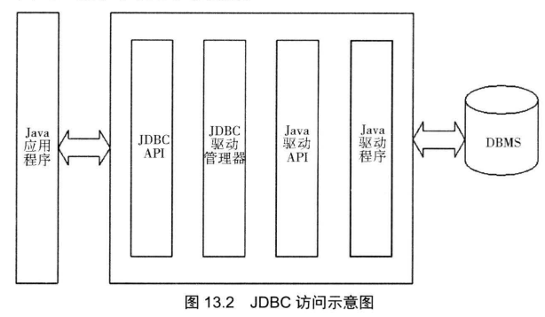
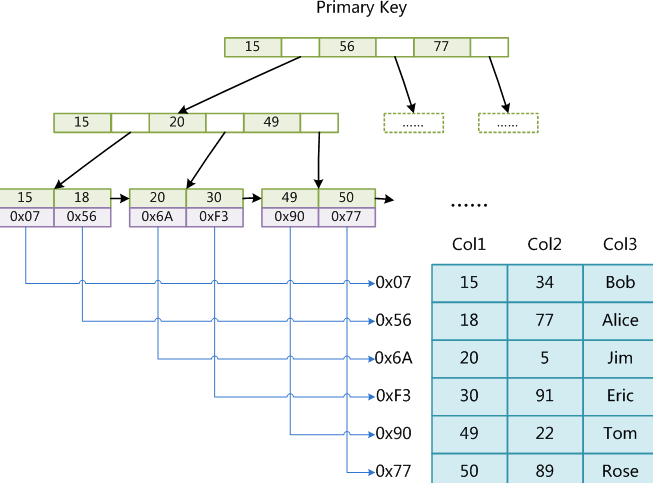
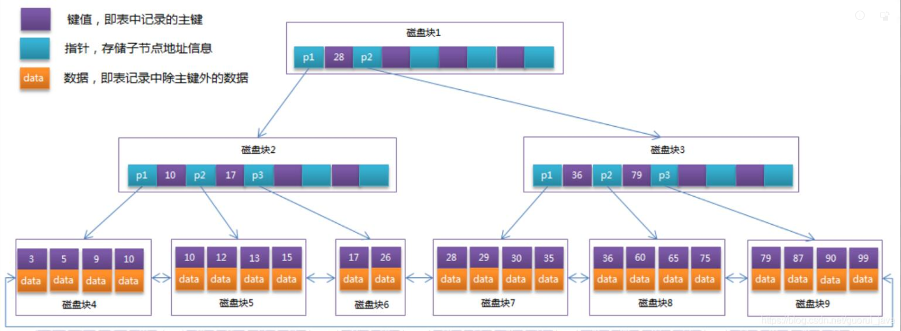

[toc]

# 数据库

## 数据库基本概念

### 数据库类型

数据库按照历史发展顺序有如下4种

1. 网状型数据库
2. 层次型数据库
3. 关系数据库 (SQL数据库)
4. 非关系型数据库 (NO-SQL)

### SQL和NO-SQL的区别

关系型数据库和非关系型数据库也被称为SQL数据库和NO-SQL数据库

两者的区别在于关系型数据库存储数据以及数据间的关系,而非关系型数据库只存储数据

> sql数据库代表: mysql sqlserver oracle db
>
> no-sql数据库代表: redis memcache hbase

no-sql数据库是为了高并发的场景而设计, 将数据存储在内存中, 尽可能提高数据的读写速度

### ER图

ER图也被称为实体关系图, 一般由产品经理在需求分析阶段提供, 用于设计对应的数据库

ER图的组成部分: 矩形	椭圆	菱形

> 矩形表示实体
>
> 椭圆表示属性(实体的属性)
>
> 菱形表示关系(实体间的关系)

### 关系型数据库

SQL是关系型数据库的基础, 用于处理数据间的关系

数据库中的数据存储在表中, 而表的数据也可以分为行和列

| 概念 | 描述                                    |
| ---- | --------------------------------------- |
| 表   | 存储数据以及数据间的关系                |
| 记录 | 表的行被称为记录                        |
| 字段 | 表的列被称为字段,字段是记录中的某个特性 |

## JDBC

jdbc是java数据库编程的基础, 提供了一套API用于在数据库中执行sql语句

JDBC工作步骤:

1. 连接数据库
2. 在数据库中执行sql语句
3. 将sql语句的执行结果返回



## MySQL

### mysql概念

**mysq是一种DBMS, 属于关系型数据库**

mysql的一个实例(server instance)可以包含多个数据库, 通过use命令切换数据库

```sql
#显示当前mysql服务器实例下的所有数据库
show databases;
```

### mysql数据类型

mysql中的数据类型主要有3种: 数值类型 字符串类型  日期类型

| 类型       | 具体类型                                                |
| ---------- | ------------------------------------------------------- |
| 数值类型   | 严格数值类型 近似数值类型                               |
| 字符串类型 | char, varchar, binary, varbinary, blob, text, enum, set |
| 日期类型   | datetime, timestamp, date, time, year                   |

**mysql支持所有标准sql数值类型**

严格数值类型:	integer(int) smallint decimal(dec) numeric

近似数值类型:	float real double precision

### mysql架构

**mysql作为DBMS有三层架构**

1. 连接层 处理客户端连接和鉴权认证
2. 服务层 负责查询语句(select语句)的解析 优化 缓存, 还有内置函数和存储过程的实现
3. 存储引擎  负责数据库中数据的存储 提取(write read)


### 事务

事务是数据库操作的执行基本单位, 事务可以包含一个或多个sql语句

事务四特性: ACID

| 特性   | 要求                                                         | 英文        |
| ------ | ------------------------------------------------------------ | ----------- |
| 原子性 | 事务不可再分                                                 | atomicity   |
| 一致性 | 同一事务的数据准确无误, 不能有差异                           | consistency |
| 隔离性 | 不同事务间相互独立, 互不干扰                                 | isolation   |
| 持久性 | 一条事务被commit后存储到磁盘中, 在执行新事务前数据不能被修改 | durability  |

### 存储引擎

存储引擎负责执行事务

**存储引擎是DBMS架构的最底层并且最核心的组成部分, 直接负责事务的实现**

面试题: myisam和innodb的区别

| 特性                 | innodb         | myisam           |
| -------------------- | -------------- | ---------------- |
| 存储限制             | 64TB           | 256TB            |
| 事务支持             | 支持           | 不支持           |
| 外键支持             | 支持           | 不支持           |
| 数据缓存支持         | 支持           | 不支持           |
| 默认储存引擎版本     | mysql5.5及之后 | mysql5.5之前     |
| 事务多线程安全       | 支持表锁       | 支持行锁         |
| 每个表对应的文件数目 | 2个(frm,ibd)   | 3个(frm,myd,myi) |
| 默认索引结构         | 树形(B+树)     | B+树             |
| 聚簇                 | 支持           | 不支持           |
| 范围查找             | 支持           | 不支持           |

### 索引结构

索引用于快速查找数据库中的数据, 提高查询效率

innodb和myisam都是用B+树作为索引结构, 但是在实现上有所区别

> myisam的索引树的叶子节点保存数据的内存地址
>
> innodb的叶子节点直接保存数据本身

myisam索引结构实现:



Innodb索引结构实现:



> B+树索引支持聚簇, 范围查询, 搜索效率高

聚簇: 索引和数据放在同一个区域中

非聚簇: 索引和数据放在不同的区域

聚簇要求数据必须有主键, 然后按照主键进行聚簇

> 如果表没有显示指定的主键, mysql会自动选择一个满足条件的字段作为主键, 如果不存在满足条件的字段, mysql会生成隐含字段作为聚簇的主键
>
> 隐含字段的类型为长整型, 6个字节大小

### 视图

视图 view被称为虚拟表, 视图本身不存储数据, 仅仅存储查询语句, 从数据库中读取数据并展示

## SQL

### 概念

SQL语言有五种: DDL	DML	DQL	DCL 还有事务控制语句

**重点学习DQL, 数据库查询语句**

DDL用于建库建表

DML用于对表进行增删查改

DQL用于在表中查询数据[重点学习]

DCL用于设定权限(数据库 表 数据)

### 约束

约束(constraint)是对SQL数据库数据做的限制

mysql中的约束有四种

| 约束名      | 作用 |
| ----------- | ---- |
| not null    | 非空 |
| unique      | 唯一 |
| primary key | 主键 |
| foreign key | 外键 |

### 语句

| 分类         | 关键字                                     |
| ------------ | ------------------------------------------ |
| DDL          | create  update  delete                     |
| DML          | create  alter  drop  truncate              |
| DQL          | select                                     |
| DCL          | grant  revoke                              |
| 事务控制语句 | commit  rollback  savepoint add constraint |

**SQL语句的关键字不区分大小写**

> 注意标识符是区分大小写的

| SQL命令     | 功能                       |
| ----------- | -------------------------- |
| create      | 创建数据库或者数据库对象   |
| drop        | 删除数据库或者数据库对象   |
| alter       | 更改数据库结构或属性       |
| comment     | 添加注释                   |
| rename      | 重命名数据库对象           |
| delete from | 逐行删除表的记录, 可以恢复 |
| truncate    | 删除表的所有记录, 不可恢复 |

**delete from是逐行将整个表的数据删除, 有日志可以恢复**

**truncate table是直接将整个表重置, 速度最快, 但是操作不可恢复**

### DQL

**DQL也被称为查询语句, 是功能最复杂的SQL语句(面试重点)**

最简单的DQL语句:

```sql
select 字段或(函数加字段) from 表名; 
```

完整DQL语句

```sql
select 字段或(函数加字段) from 表名 where 查询条件 group by 字段 having 过滤条件 order by 字段 limit (a,b)
```

**执行顺序从左向右**

>除了select字段语句是在where后执行, 但是实际上并不影响最终结果

#### 函数

DQL语句的函数不会修改数据源本身, 仅仅是将结果打印出来

##### 字段函数

> 字段函数操作对象为字段

| 函数名       | 作用                                           |
| ------------ | ---------------------------------------------- |
| count        | 计数                                           |
| sum          | 求和                                           |
| avg          | 求平均值                                       |
| max          | 求最大值                                       |
| min          | 求最小值                                       |
| ifnull       | 筛选并保留空值                                 |
| group_concat | 将某个字段的多行记录合并为一行记录, 用逗号分割 |

##### 字符串函数

> 字符串函数操作对象可以是字符串类型字段或字符串直接量

| 函数名                        | 功能                                                         |
| ----------------------------- | ------------------------------------------------------------ |
| concat(a,b)                   | 拼接a和b                                                     |
| substr( ... from ... for ...) | 截取                                                         |
| trim( a from b)               | 从b中删除a(删除位置是开头和结尾,可以匹配多个, 不会删除中间被其他字符包围的a) |
| trim(a)                       | 删除a中的空格                                                |
| uuid()                        | 没有操作对象, 直接返回一个36位的随机码(字符串)               |

##### 日期函数

> 下列三个函数都没有操作对象, 直接返回一个表示当前时间的字符串

| 函数      | 格式                |
| --------- | ------------------- |
| now()     | yyyy-MM-dd hh:mm:ss |
| curdate() | yyyy-MM-dd          |
| curtime() | hh:mm:ss            |

year() month() day() 分别读取日期对象中的年份 月份 日

#### 存储过程

一般的函数都只能通过select语句调用, 意味着其返回结果只能打印出来而不能存储到数据库中

存储过程是一个特殊的函数,不需要通过select语句执行

#### dual表

**dual表是一个虚拟表, 不包含任何数据 仅仅用于使sql命令符合语法要求**

```sql
#获取当前的年份
select year(now()) from dual;
#获取当前的月份
select month(now()) from dual;
#获取当前的天数
select day(now()) from dual;
```

#### 子查询

查询语句中可以嵌套子查询, 子查询返回的结果实质为行内视图

子查询语句可以放在三个地方 select后 from后 where in 后

1. select ... from ... where ... in (子查询)
2. select 字段,(子查询) from ...
3. select ... from (子查询)

#### union(连查表)

连查表使用union或union all语句, 将多个select语句返回的视图进行合并展示

**union要求两个view的字段数相同,字段类型不需要相同**

#### 分组查询

分组查询的语句有:

1. .. group by ...
2. ... group by ... having ...
3. group_concat()函数

#### 多表查询(连查)

多表查询用于同时对多个表的数据进行查询

>  笛卡尔乘积

```sql
#直接将两个表的数据一条对应m条
#得到的组合表的记录数将是n*m
select * from student,score;
```

mysql可以使用三种联查

>mysql支持左外联查和右外联查, 但是不支持全外联查

| 联查     | 区别                           |
| -------- | ------------------------------ |
| 内联查   | 只显示满足连接条件的数据       |
| 左外联查 | 将右表不满足连接条件的数据丢弃 |
| 右外联查 | 将左表不满足连接条件的数据丢弃 |

**联查语句都是使用on作为连接条件**

##### 内联查

... inner join ... on ...

内联查仅仅将两个表间有关联的记录拼接起来, 没有关联的记录会被丢弃

##### 外联查

mysql中外联查分为左外联查和右外联查

> 用外联查会导致另一个表中不符合筛选的数据被填充为null

左外联查以左表为基础, 右外联查以右表为基础

> 左联查

... left join ... on ...

> 右联查

... right join ... on ...