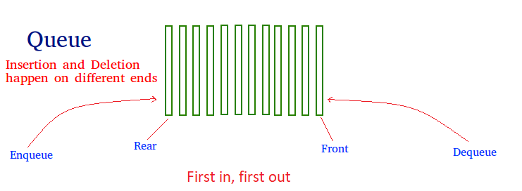
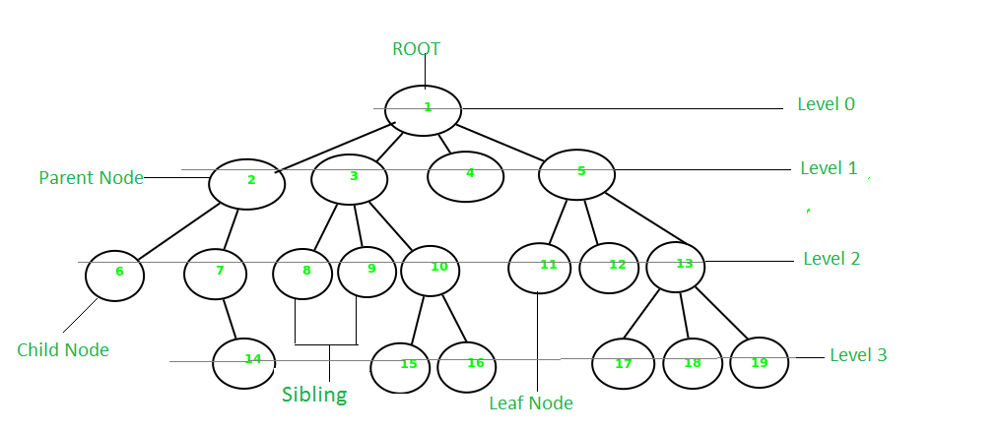
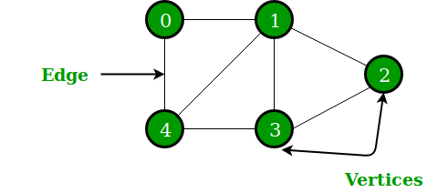

# 数据结构入门

数据结构是计算机中数据存储的一种特殊结构, 良好的数据结构可以减少占用的空间和缩短数据操作时间

数据结构分为线性数据结构和非线性数据结构

> 在java中每种集合都有对应的数据结构

线性数据结构: list queue stack array

> 线性结构中的元素都是在同一个维度上, 只有一对一的关系, 不存在同等的元素

非线性数据结构: tree graph table

> 非线性结构允许元素可以在多个维度上面排列, 有一对多 多对一 多对多的关系

## 常见数据结构概述

**线性数据结构**

1. array: 数组是指存储在连续内存位置中的数据集合, 一个数组中的元素具有相同的数据类型, 可以通过下标来快速访问不同的元素位置

   > 数组元素位置是通过向基值(第一个元素的值)添加偏移量(根据下标决定)来计算

2. 链表(linklist): 链表与数组相似, 但是链表的元素不是连续存储的, 需要依靠指针将元素连接起来, 不能使用下标进行快速查找

3. 栈(stack): 栈是遵循LIFO(后进先出)操作顺序的线性结构, 并且只能在指定的一端进行push(添加元素)操作(无法在另一端也进行添加操作)(从一端进去, 并且从同一端出去)

4. queue(队列): 与栈类似, 但是是遵循FIFO的顺序(从一端进从另外一端出来)

栈的基本操作有:

1. 初始化: 将stack的元素都设为空
2. push: 将一个新元素添加到stack中, 如果栈满了将发生溢出现象
3. pop: 按照push的相反方向将元素从栈中删除
4. peek(或者top): 返回栈顶部的元素
5. isEmpty: 如果整个堆栈都是空的将返回true, 否则返回false

队列的基本操作:

1. enqueue: 将一个新元素加到队列中, 队列满会发生溢出现象
2. dequeue: 将一个元素从队列的最前端中删除
3. font: 获取队列最前端的元素
4. rear: 获取队列最后端的元素

常见非线性结构:

1. binary tree(二叉树)
2. heap(堆)
3. Hashing(散列)
4. Matrix(矩阵)
5. Trie(键树)

其中 二叉树 堆 键树都属于树状结构

二叉树: 每个节点最多只能有两个节点(左节点, 右节点), 使用link

堆: 堆是一种特殊的二叉树, 通常分为大顶堆(max-heap)和小顶堆(min heap), 大顶堆要求父节点必须大于或等于子节点, 小顶堆要求父节点必须小于或等于子节点

散列: Hashing使用hash函数来将值映射为键, 映射效率(查询效率)取决于hash函数的效率

数据结构也分为静态数据结构和动态数据结构

静态数据结构: 声明后内存空间固定不变

动态数据结构: 声明后内存空间可以动态变化

**数组**

数组是一种连续存储且大小固定的数据结构, 是一种关键的底层数据结构

由于数组的连续储存和大小固定特性, 使得数组的操作效率非常高, 并且提供了非常丰富的操作功能

数组特性:

1. 提供了每个元素的索引, 可以根据索引快速查找元素

2. 数组中的元素都是相同数据类型, 并且元素个数固定

3. 数组可以通过多维数组实现其他复杂的数据结构

   > 如stack 队列 堆 哈希表

4. 数组元素的遍历非常快

数组的应用:

1. 数组库的记录由数组存储
2. 图像处理
3. 数学计算

链表:

链表的元素存储是不连续的, 元素间通过指针进行链接

链表类型: 单链表 双重链表 循环链表 双重循环链表

单链表表示一个元素只有一个链接

双链表表示一个元素有两个链接

链表特点:

1. 链表的每个节点除了存储元素值外还需要额外内存存储链接
2. 链表中的元素是可变的, 不需要固定
3. 链表的第一个节点为头节点(Head)
4. 最后一个节点的指针一定是指向NULL
5. 链表中插入和删除操作非常快

链表的应用:

1. 实现堆栈 队列 graph
2. 用于内存管理

二叉搜索树:

二叉搜索树是一种特殊的二叉树, 左子节点必须小于或等于父节点, 右子节点必须大于或等于父节点

堆:

堆是一种特殊的二叉树

stack:

栈是一种只能从同一端进行添加和删除操作的数据结构(后进先出)

栈一般使用一维数组或链表实现, 也被称为顺序栈或链式栈

栈的底层通过数组和链表实现

> 栈的内存是固定的, 添加的元素超过栈空间时会导致栈溢出

栈的应用: 反转字符串(将数据顺序颠倒) , 内存管理

**队列(queue)**

队列是线性结构, 遵循FIFO(先进先出)的顺序

队列的添加和删除操作是发生在不同端

队列的基本操作: enqueue(添加) rear(队尾) front(队头) dequeue(删除)

**Tree(树)**

树是非线性分层结构, 也被称为递归结构

树的属性:

高度: 树的高度为

深度: 根节点的深度为0, 从根节点开始每层节点加深一层深度

> 使用树结构存储数据可以实现快速访问数据(树遍历)

树结构示例

树的应用场景:

1. 在数据库作为索引结构: B+树
2. 路由器使用生成树协议(Spanning Tree Protocol)预防环路产生提高可靠性

**Graph(图)**

图是由边和顶点组成的非线性数据结构, 通常用于解释非常复杂的编程问题(图论Graph Theory)

> 图结构示例

图的应用场景:

1. 地图
2. 社交网络的关系图

