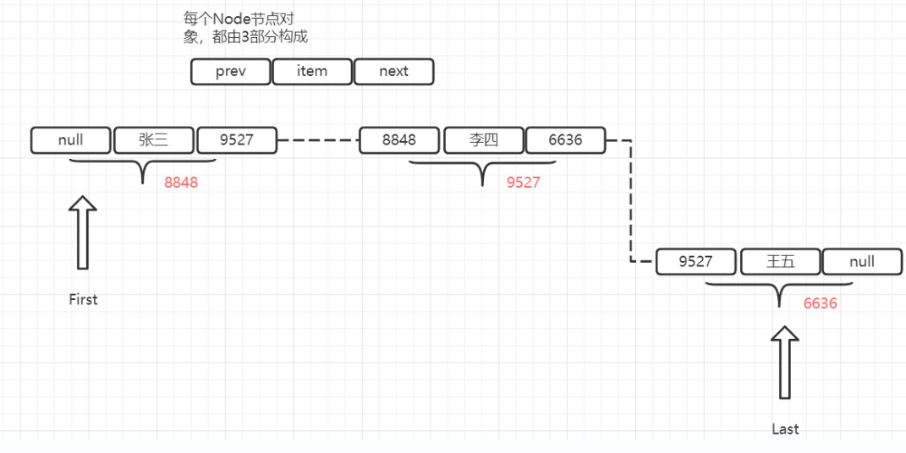

# 泛型

**java5中引入参数化类型(parameterized type)的概念,也就是泛型(Generic)**

**泛型允许在创建集合时指定元素的类型**

```java
//声明了一个String泛型的集合al
ArrayList<String> al = new ArrayList<String>();
//java7后可以省略菱形语法
ArrayList<String> al2 = new ArrayList<>();
ArrayList<String> al2 = new ArrayList();f
```

为了实现集合的通用性:可以保存不同类型的对象元素, 集合中的元素都以Object类型来保存(编译类型)

> 防止编译器检查报错

> 注意运行时类型没有变, 依旧为原类型

```java
ArrayList al=new ArrayList();
Collections.addAll(al,"1","2",3);
for (Object o : al) {
    String str =(String)o;
    str.indexOf(0);
    //上述代码运行会报错, 因为列表中包含Integer类型
    //ine类型字面量被自动装箱生成的Integer类型
}
```

泛型可以规范集合的元素类型

> 本质是在编译时进行检查集合中的元素是否为泛型规定的类型

```java
ArrayList<String> al = new ArrayList();
Collections.addAll(al, "1", "2", 3);
//编译时会报错, 因为向String泛型的列表中添加了Integer类型的变量
for (Object o : al) {
    System.out.println((o instanceof Integer));
}
```

> 了解泛型接口和泛型类

```java
//泛型接口
interface MyList<String>{
}
//泛型类
class MyArrayList<String> implements MyList<String>{
}
//调用测试
class TestMain{
    public static void main(String[] args) {
        MyList<String> datas=new MyArrayList<>();
    }
}
```

**泛型通配符**

java只有一个泛型通配符

?  代表不确定的类型

```java
class Test{
    void show(ArrayList<?> dates){}
    //匹配任何类型
    void show1(ArrayList<? extends Number> dates){}
    //设定通配符上限
    //必须是继承自Number类
    void show2(ArrayList<? super  Integer> dates){}
    //设定通配符下限
    //必须是Integer的父类
}
```

**泛型形参**

通常有以下常用的字母用于泛型形参

1. T  代表确定的类型
2. K V分别代表键(Key)值(Value)
3. E  代表Element

> 这里意义是习惯默认的, 并非是强制的

```java
//匹配任意类型
class Test1{
    void show(ArrayList<?> datas){}
//注意在这里只有?是可以使用的
}
//在泛型接口中, 可以用泛型形参
class Test<E>{
    void show(ArrayList<E> datas){}
    //并且泛型形参只能用于实例方法, 不能用于类方法
    //因为需要在创建对象时将类型传给通配符才有实际意义
}
class Son extends Test<String>{}
//将String类型传入形参E
class Son2 extends Test{}
//省略泛型将导致使用原始类型(raw type), T将被编译器视为Object类型处理
```

**泛型擦除**

**泛型擦除指泛型只会在编译时进行检查, 并且所有泛型参数在编译后都会被清除, 不会保留到运行时**

> 泛型的本质是在编译时对代码进行检查, 因此运行时是可以对泛型集合添加任意类型的对象

```java
void Test(ArrayList<String> al){}
void Test(ArrayList<Integer> al){}
//上面两个方法不是方法重载, 由于泛型擦除的特性,所以它们的参数列表是相同的
void Test(){}
```

> ArrayList<String>并非一个新的类, 它与ArrayList是同一个类(实质上等同于ArrayList<Object>)

```java
ArrayList<String> l1=new ArrayList<>();
List<Integer> l2=new ArrayList<>();
System.out.println(l1.getClass());
//l1的类型为ArrayList
System.out.println(l2.getClass());
//l2的类型为ArrayList
//所以l1跟l2的类型相同
```

**泛型形参不能用于类(static)成员**

```java
Integer[] intList =new Integer[5];
Number[] doublesList=intList;
doublesList[0]=1;
doublesList[1]=0.5;
//这行代码不会被编译器检查出错误, 但是在运行时会抛出ArrayStoreException, 因为0.5无法被存储为Integer类型
//这里是java早期的设计缺陷
```

> 优秀的编程语言不仅需要提供强大的功能, 更需要在编译时能提供错误提示, 做到在程序运行前就检查出错误

在泛型设计时, java增强了编译检查的设计,不允许将引用变量指向不同类型的泛型对象

```java
List<Integer> iList=new ArrayList();
List<Number> nList=iList;
//上述代码将导致编译错误, 避免了程序运行时出现ClassCastException
```

# 内部类

内部类也被称为嵌套类, 它放在另一个类内部

```java
class Outer{
    class Inner{}
    //定义了一个非static内部类Inner
    static class StaticInner{}
    //定义了一个static内部类
}
```

内部类特点:

1. 内部类可以提供更好的封装
2. 内部类可以访问外部类私有(private)成员, 因为内部类本身被视为private成员的一部分, 但是外部类无法访问内部类的成员
3. 特殊内部类: 匿名内部类适合用于仅需要创建一次类的用途
4. 外部类不能用的修饰符private protected static可以用于内部类
5. 只有static修饰的内部类才能有static成员

> 注意在一个源文件里可以定义多个外部类, 它们都是相互独立的

外部类的上级单元是包

**外部类只有两个不同的作用域: 同一个包内, 任何位置 分别对应default(包权限)和public(任何位置)权限**

> 同一个包内的不同源文件属于同一个作用域

内部类有4个作用域, public(任何位置) protected (父子类) default(同一个包) private(同一个类)


static内部类可以包含非static成员, 但是static成员不能访问非static成员

> 外部类不能被static修饰

> 接口也可以定义内部接口, 但是一般开发中不需要用到内部接口

```java
class Outer {
    class Inner {
    }
    static class Inner2 {
    }
}

class Test43 {
    public static void main(String[] args) {
        Outer out = new Outer();
        Outer.Inner inner= new Outer().new Inner() ;
        //创建外部类对象来创建非static内部类对象
        Outer.Inner inner0= out.new Inner() ;
        //调用已存在外部类对象来创建非static内部类对象
        Outer.Inner2 inner2 =new Outer.Inner2();
        //直接通过外部类来创建static内部类对象
    }
}
```

**内部类的调用必须在前面加上其外部类的前缀**

**创建内部类对象前必须先创建外部类对象**

**非static内部类的构造器必须由外部类对象来调用**

> 意味着
>
> 1. 非static内部类创建对象需要先创建/存在有外部类对象
> 2. 非static内部类被继承的子类创建对象时也需要由外部类对象来调用

> 在方法中定义的类为局部(方法)内部类, 实际开发中很少用到

> 扩展: 局部(方法内)变量

> 由于同一个类中的多个局部内部类可以同名,所以javac会将局部内部类的class文件命名时加上数值
>
> OuterClass$NInnerClass.class

**多态就是指调用相同名字的方法会表现出不同的行为**

Java中有两种类型的多态: 编译时多态(static)(静态和运行时多态(no-static)(动态)

编译时多态: 方法重载

运行时多态: 方法重写

> ? 运算符多态不确定

> Polymorphism is the ability to process objects differently on the basis of their class and data types

面向对象编程(OOP) :Object-oriented programming 

在Java中多态有三种类型的实现方式:

1. 方法重写(override) 子类重写超类的同名方法

2. 方法重载(overload) 同名不同参数列表的方法 

3. 运算符重载 同一种运算符会因为操作数类型不同导致运算方式不同

   > 例如+运算符不仅用于加法运算, 还可以用于字符串拼接 
   >
   > 运算符 & | !可以用于逻辑运算和按位运算

**面向对象的四个基本概念: 封装 继承 多态 抽象**

面向对象的三个基本特征: 封装 继承 多态

encapsulation inheritance polymorphism

继承(inherit)与派生(derive)是同一现象的不同方向

抽象 abstract

# 匿名内部类

匿名内部类没有类名, 直接用花括号声明

```java
abstract class Outer{
    //内部类Inner
    class Inner{}
    {
        //初始化块
    }
    static{
        //静态初始化块
    }
    abstract void hello();
}

class Test01{
    void test(){
        //创建匿名内部类实例
        Outer out=new Outer() {
            //匿名内部类的类体
            @Override
            void hello() {
                System.out.println("hello");
            }
        };
    }
}
```

> 注意不要将初始化块跟匿名内部类弄混

> 抽象类中可以没有抽象方法, 但是有抽象方法的类一定是抽象类

1. 匿名内部类一定是非抽象类
2. 匿名内部类只能用系统默认提供的构造器或者从父类中继承的自定义构造器, 但是可以自定义初始化块

匿名内部类必须在定义时实现一个接口或者继承父类, 而且只能实现或继承一次

**匿名内部类特点**

1. 匿名内部类没有类名, 意味着它无法被外部使用名字调用,只能在创建时使用一次
2. 匿名内部类的定义与实例的构造同时进行
3. 匿名内部类属于一种特殊的方法内部类

**匿名内部类通常用于定义一个一次性使用的类**

匿名内部类只能创建一个对象

> 类似于单例类(Singleton)
>
> 但是单例类可以重复使用, 匿名内部类只能使用一次, 由于没有类名所以无法再次调用匿名内部类

**匿名内部类会继承父类中的有参构造器**

**普通的子类只会调用父类中的无参构造器

**匿名内部类必须实现继承的所有的抽象方法, 也可以重写普通方法**

匿名内部类访问的局部变量必须被final修饰

Java8提供了effectively final功能, 会自动将匿名内部类访问的局部变量用final修饰

> 意味着匿名内部类可以访问没有被显式final修饰的局部变量, 但是一旦访问该局部变量会被系统自动用final修饰

匿名内部类无法访问已经被指定初始值的局部变量, 因为该变量已无法被自动用final修饰

# LinkedList

**LinkedList既是List也是双向队列也是栈**

> 而ArrayList不属于双向队列和栈

在java中, LinkedList属于List集合的一种, 可以根据索引进行随机访问元素

> 随机访问指随机访问集合中的元素, 相对于有序访问
>
> 有序访问指按顺序遍历元素的形式去访问元素

LinkedList属于数据结构中的双向链表结构

> LinkedList是List和Deque的实现类
>
> 因此LinkedList也可以作为双向队列使用
>
> List既可以作为栈, 也可以作为队列



>双向链表的每个元素会存储:
>
>上个元素的索引	下一个元素的索引	当前元素值

> 展示了LinkedList各种API的使用, 大部分API与ArrayList相同

```java
LinkedList<String> ll=new LinkedList();
Collections.addAll(ll,"bdd","abc","bcd","小李");
ll.get(0);
ll.size();
ll.set(1,"ll");
ll.contains("小李");
ll.remove(1);
ll.clear();
Collections.addAll(ll,"bdd","abc","bcd","小李");

ll.forEach(new Consumer<String>() {
    @Override
    public void accept(String s) {
        System.out.println("s");
    }
});
Collections.sort(ll);
System.out.println(ll);
```

LinkedList和ArrayList的区别

| LinkedList             | ArrayList              |
| ---------------------- | ---------------------- |
| 底层是链表结构         | 底层是数组结构         |
| 新增, 删除元素的效率高 | 新增, 删除元素的效率低 |
| 查询元素的效率低       | 查询元素的效率高       |

> LinkedList在插入或删除只需要改变前后元素指针指向的地址即可, 不需要对集合的每个元素都进行操作, 因此性能出色
>
> 但是随机访问性能较差
>
> ArrayList由于是用数组进行存储, 所以随机访问的性能高

# Vector

Vector属于List集合的一种

> Vector是一种非常古老的集合实现, 

Vector的底层原理和API都与ArrayList相同

区别在于Vector是线程安全的, ArrayList不是

```java
List<String> lv=new Vector<>();
lv.add("123");
//注意Vector中实例方法的源码是被synchronized修饰的线程安全方法
lv.add("113");
Collections.sort(lv);
```

# Set

Set的特点:

1. Set的实现类可以有序也可以无序

2. Set的元素值不允许有重复(相同)的

3. Set没有下标, 不能通过下标去访问元素

   > 通过下标访问元素是List集合的重要特征

# HashSet

HashSet是Set的实现类, 底层使用HashMap的Key键作为元素值

HashSet特点:

1. 元素是无序的
2. 不允许有重复元素
3. 没有下标

```java
List<String> stringList=new ArrayList<>();
Set<String> stringSet1=new HashSet<>();
Collections.addAll(stringList,"zs", "ls", "ww", "tq", "ls", "zl", "ls");
Collections.addAll(stringSet1,"zs", "ls", "ww", "tq", "ls", "zl", "ls");
Set<String> stringSet2=new HashSet<>(stringList);
System.out.println(stringList);
System.out.println(stringSet1);
System.out.println(stringSet2);
//stringSet1和stringSet2的元素内容和顺序是完全相同的
//说明HashSet虽然是无序存储的, 但是如果两个Set的元素内容相同的,则它们的元素存储也是按相同的顺序
```

HashSet实例方法:

| 方法名   | 功能                                         |
| -------- | -------------------------------------------- |
| add      | 添加元素(无序)                               |
| size     | 显示元素个数                                 |
| contains | 是否包含某元素值                             |
| remove   | 删除某个元素值                               |
| forEach  | 迭代方法, 需要实现一个函数接口的元素展示方法 |

```java
Set<String> stringSet1=new HashSet<>();
Collections.addAll(stringSet1,"zs", "ls", "ww", "tq", "ls", "zl", "ls");
stringSet1.add("123");
stringSet1.size();
stringSet1.contains("123");
stringSet1.remove("123");
//通过匿名内部类实现了Consumer函数接口的accept方法
stringSet1.forEach(new Consumer<String>() {
    @Override
    public void accept(String s) {
        System.out.println(s);
    }
});
//通过lambda表达式实现
stringSet1.forEach((str)->{
    System.out.println(str);
});
//for循环遍历set
for (String s : stringSet1) {
    System.out.println(s);
}
//通过迭代器实现遍历
Iterator it=stringSet1.iterator();
while(it.hasNext()){
    System.out.println(it.next());
}
```

