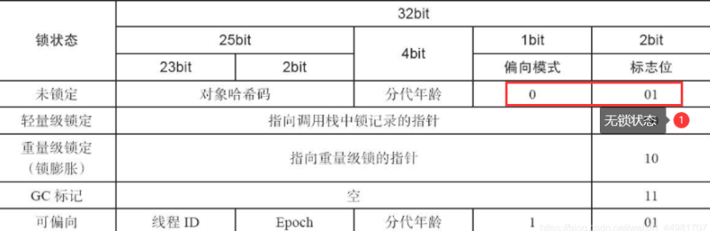
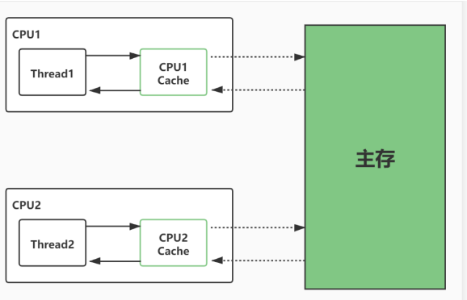
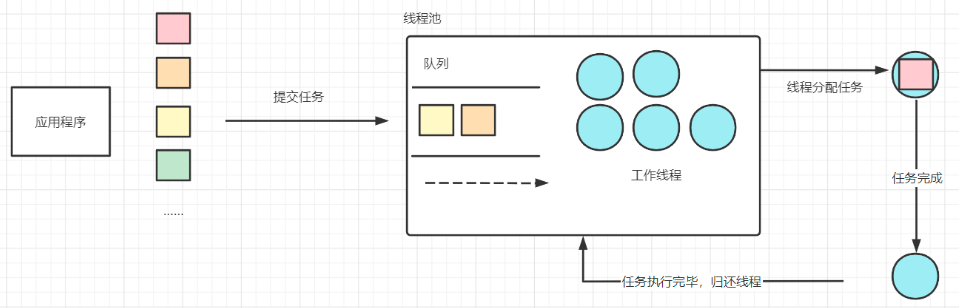
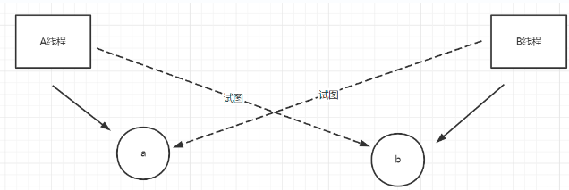

## 线程安全

线程安全的本质是对资源访问是否具有独占性问题

多个线程同时对资源进行写入和读取操作时会发生线程不安全

如何保证线程安全:

确保资源的独占性: 同一时刻只能有一个线程在访问临界资源

> 也被称为序列化访问临界资源方案或者称为同步互斥访问

java中有两种线程锁机制来实现同步互斥访问的方法: synchronized	Lock

## Synchronized(互斥锁)

synchronized被称为互斥锁, 是Java中的一个关键字

synchronized可以用于标记方法或代码块

synchronized特性:

1. 互斥: 对象锁只能被一个线程获得, 不能被其他线程抢占
2. 重入: 一个线程获得对象锁后, 该线程的不同方法可以抢占这个对象锁

java中每个对象都有monitor属性, 也被称为锁标记或监视器

当多线程执行体试图访问某个对象时, 需要先获取该对象的monitor才能访问

当synchronized标记的代码块或者方法执行时需要先获取指定对象的monitor, 其他需要获取monitor的线程会被锁定直到monitor被释放才能继续执行

> 只有整个代码块或方法结束才会释放锁定的monitor

通常使用synchronized代码块, 更加灵活

> 同步锁的代码量越少, 多线程效率越高

**面试题**

```java
//获取当前对象的锁
synchronized(this){}
//获取当前对象的锁
synchronized void test(){}
//获取Object类的class类对象的锁
synchronized(Object class){}
//获取当前类的class类对象的锁
static synchronized void test(){}
//获取user对象的锁
synchronized(this){user}
```

**锁升级是面试时需要掌握的知识**

synchronized会根据线程数量决定加锁的方式(等级)

有4种锁等级:	无锁(无线程)	偏向锁(1线程)	轻量级锁(双线程)	重量级锁(三个线程以上)

> 下面的线程必须被synchronized修饰

无锁:	对象刚创建没有被线程使用时处于无锁状态(偏向位0, 标志01)

偏向锁:	对象被一个线程操作时, 处于偏向锁状态(偏向位1, 标志01)

轻量锁:	两个线程需要操作同一对象时, 升级于轻量锁状态, 偏向位空,标志00	并且使用CAS算法进行两个线程间的锁交换

重量锁:	三个以上的线程都需要操作同一对象时升级为重量锁状态, 偏向位为空, 标志10, 并且不再使用CAS算法而是使用底层CPU的进程同步算法进行锁交换 

> 同步锁只能升级, 一旦升级不会再降级



## 线程执行顺序控制

Object类提供了实例方法用于控制使用该对象的monitor锁的进程: wait	notify	notifyAll

**复习:	Object类提供的常用方法有:**

| 方法               | 功能                                                         |
| ------------------ | ------------------------------------------------------------ |
| static方法         |                                                              |
| clone              | 复制指定的对象, 返回副本                                     |
| equals             | 比较两个对象是否相等                                         |
| 非static方法       |                                                              |
| finalize           | 被GC调用, 回收该对象                                         |
| getClass           | 获取该对象的运行时类类型(指向的实际类)                       |
| hashCode           | 获取对象的hash值                                             |
| toString           | 将该对象打印为字符串                                         |
| 线程控制           |                                                              |
| notify             | 随机唤醒该对象上一个处于等待状态的线程                       |
| notifyAll          | 唤醒该对象上所有的处于等待状态的线程                         |
| wait               | 使当前线程进入等待(阻塞)状态, 并释放其占用的monitor, 需要被手动唤醒 |
| wait(long timeout) | 与wait类似, 但是超过timeout时间后会自动唤醒                  |

**Thread.sleep和Object.wait()的区别**:

1. sleep会暂停当前线程的执行, sleep期间该不能被手动唤醒, 并且不会释放monitor资源
2. wait()也会暂停当前线程的执行, 可以被notify手动唤醒, 并且会将占用的monitor资源释放

相似之处:

1. 都会线程进入Not Runnable状态
2. 都是底层由C语言写的native方法

> sleep状态的线程如果被中断会引发InterruptedException异常

**java中还有一个线程安全关键字volatile**

volatile用于修饰变量, 作用有:

1. 保证内存可见性
2. 防止指令重排序

当一个变量被volatile修饰时, 线程对变量的操作将写入缓存, 并同步到主存中, 然后基于CPU缓存一致性(MESI)协议来更新其他线程的变量值

> volatile不能严格保证线程安全, 只能减少一部分的同步问题



## Lock框架

Java.util.concurrent.lock是java中的独占锁框架, 有多个实现类

ReentrantLocak	可重入锁, 采用递归无阻塞同步机制 底层是CAS原理实现, 与synchronized的行为类似, 但是比syn更灵活更强大, 增加了轮询 超时 中断等高级功能, 支持取锁的公平选择和非公平选择

ReadWriteLock	读写锁

**ThreadLocal直接负责管理资源, 线程通过调用ThreadLocal的api来读写资源**

synchronized和Lock的区别

1. synchronized是关键字, Lock是接口
2. synchronized通过对象身上的monitor机制来实现同步锁
3. Lock属于一种自定义的锁, 与monitor无关
4. synchronized无法手动判断锁的状态, Lock可以通过tryLock判断锁状态
5. synchronized有自动释放锁的机制, 而Lock只能手动调用unlock()来释放锁, 否则将称为死锁
6. synchronized的线程需要等待锁的释放, Lock不一定
7. synchronized可重入 不可中断 非公平锁
8. Lock可重入 可中断 有公平锁和非公平锁
9. synchronized由于只能自动释放锁导致灵活性较低, 适合用于少量代码, Lock适合用于复杂大量代码的情况

总结

1. synchronized支持同步块和同步方法
2. 不同monitor对象的区别需要重点掌握
3. Lock框架采用CAS原理, 提供公平选择和非公平选择取锁
4. ThreadLocal负责管理资源副本, 不直接控制线程, 会为每个线程都产生一个独立的关联资源对象

# 线程池

线程池用于进行多个线程的管理和复用

> 线程池图解



线程池的组成:

1. 任务队列: 使进程按照FIFO(先进先出)的队列模式进行排队
2. 工作线程: 执行任务(多线程对象)的线程
3. 任务对接接口: 线程池接收任务的接口
4. 线程管理器: 管理线程池中每个线程的生命周期

> FIFO是队列结构的特性

线程池分为简单线程池和复杂线程池

Executors	ThreadPoolExecutors

> 创建简单线程池

```java
//创建单线程线程池
Executors.newSingleThreadExecutor();
//创建具有缓存线程能力的线程池
Executors.newCachedThreadPool();
//创建线程数量固定的线程池
Executors.newFixedThreadPool(10);
//创建指定线程数量的定时任务线程池
Executors.newScheduledThreadPool(10);
```

> 复杂线程池ThreadPoolExecutor的构造器

```java
public ThreadPoolExecutor(int corePoolSize,
                              int maximumPoolSize,
                              long keepAliveTime,
                              TimeUnit unit,
                              BlockingQueue<Runnable> workQueue,
                              ThreadFactory threadFactory,
                              RejectedExecutionHandler handler)
```

> 参数解释:

int corePoolSize: 指定线程池的初始化线程数量

int maximumPoolSize: 线程池的最大线程容量

long keepAliveTime: 线程允许的最大空闲时间, 超出该时间将该空闲线程结束掉

TimeUnit unit: keepAliveTime的时间单位

ThreadFactory threadFactory:	Executors下面的线程工厂

RejectedExecutionHandler hanlder 任务(Execution)拒绝策略

复杂线程池可以针对线上生产环境进行调优

1. Tomcat服务器调优
2. RebbitMQ服务器, 提高消费者消费能力

任务拒绝策略(RejectedExecutionHandler)有4种

| 策略                | 特性                                                 |
| ------------------- | ---------------------------------------------------- |
| AbortPolicy         | 拒绝新任务, 并抛出异常                               |
| DiscardPolicy       | 拒绝新任务, 不抛异常                                 |
| CallerRunsPolicy    | 拒绝新任务, 交给提交者处理                           |
| DiscardOldestPolicy | 将任务队列中等待最久的任务抛弃, 将新任务加入任务队列 |

> 这些策略都是ThreadPoolExecutor包下的类

线程池在不同任务量下的状态:

1. 线程池初始化指定数量的线程
2. 线程池中有空闲线程时, 直接分配任务给线程处理
3. 线程都在处理任务的状态下, 将后续的任务进入任务队列
4. 当线程都在工作状态, 并且任务队列也满了时, 扩增线程池的线程数量
5. 当线程池的线程数量已经达到最大值, 当线程都在工作状态, 并且任务队列也满了时,开启任务拒绝策略


线程池有execute和submit实例方法用于执行线程对象

> execute对应Runnable实现类的对象	submit对应Callable实现类的对象
>
> 使用线程池时可以直接运行Runnable或Callable的实现类, 不需要再实现Thread类调用start方法

```java
//声明一个复杂线程池
ThreadPoolExecutor pools=
                new ThreadPoolExecutor(10,200,
                        5,TimeUnit.MINUTES,
                        new LinkedBlockingDeque<>(),
                        Executors.defaultThreadFactory(),
                        new ThreadPoolExecutor.DiscardOldestPolicy()
                        );
//声明一个简单线程池
ExecutorService es=Executors.newFixedThreadPool(5);
```

**生产者消费者模式**

producer consumer

生产者消费者模式基于队列模型实现, 可以用于实现多线程的线程间通信

好处:

1. 生产者和消费者间为松散耦合关系
2. 可以实现多线程数据的统一处理

队列 Queue 

java中的队列提供了add和poll用于向队列加入元素和取出元素

> 用队列实现生产者消费者模式

```java
class Test{
    void test(){
        Queue<String> queque=new LinkedBlockingQueue<>(200);
        ExecutorService es=Executors.newFixedThreadPool(5);
        es.execute(()->{
            queue.add("A");
        });
        es.execute(()->{
            queue.add("B");
        });
        es.execute(()->{
            queue.add("B");
        });
        es.execute(()->{
            queue.add("B");
        });
    }
}
```

## 定时线程池

ScheduledThreadPoolExecutor可以实现线程的定时执行

其属于ScheduledExecutorService的子类

该线程池类有实例方法schedule和scheduleAtFixedRate用于执行线程对象

```java
ScheduledExecutorService ses=new ScheduledThreadPoolExecutor(10);
//5秒后执行一次ps1线程对象(定时执行一次)
ses.schedule(ps1,5,TimeUnit.SECONDS);
//7秒后开始每隔1s执行一次ps1线程对象(定时周期性执行)
ses.scheduleAtFixedRate(ps2,7,1,TimeUnit.SECONDS);
```

# 死锁

死锁是指多线程运作时发生了锁无法被自动解开, 无限期锁死的情况



死锁发生的条件:

1. 一定是互斥锁被使用
2. 锁的占用是无限期, 没有时效
3. 锁无法被其他线程抢占, 只能被一个线程主动释放
4. 多个线程保持死锁状态

死锁发生的根本原因是业务逻辑有问题

如何解决死锁:

1. 选用时效锁,如redis
2. 统一加锁顺序

# Daemon thread(守护线程)

java中的daemon thread(守护线程)是运行在后台, 负责管理或者辅助其他线程运行的线程

java中的GC(垃圾回收器)也是一个守护线程

特点:

1. 守护线程是极低优先级线程, 当所有用户线程都运行结束时, JVM会自动关闭而不会考虑守护线程的运行状态
2. JVM会强制关闭守护进程, 不会考虑其运行状态

> 当JVM中最后一个非守护进程运行结束时, 所有守护进程会被强制结束

Thread类中提供了实例方法setDaemon(boolean flag)用于将该线程对象设为守护进程或非守护进程
