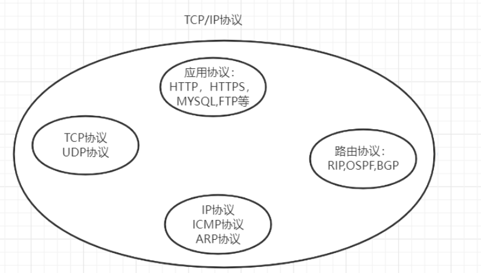
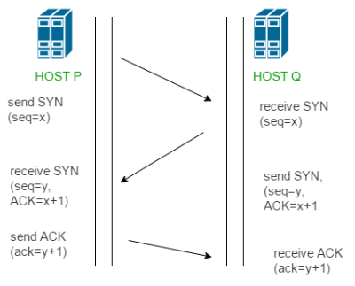
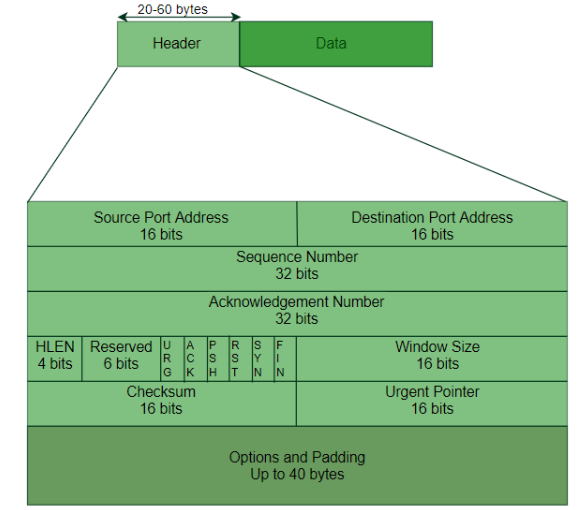

# 网络编程

**网络编程三要素: IP地址	端口号	通信协议**

1. IP地址

IP地址分为内网IP和公网IP两种

```bash
//windows查看本机IP地址命令
ipconfig ipconfig -all
//Linux查看本机IP地址命令
ifconfig
//使用ICMP协议来测试目标IP是否可以访问
ping 8.8.8.8
```

2. 端口

计算机的每个端口都对应一个进程

同一个端口不能被两个进程同时占用, 会产生端口冲突

**端口号取值范围 0-65535(16位)**

端口号通常被分为三类:

| 分类               | 端口范围    | 解释                                   |
| ------------------ | ----------- | -------------------------------------- |
| 公认端口           | 0~1023      | 绑定系统服务                           |
| 注册端口           | 1024~49151  | 程序可以自定义使用端口                 |
| 动态端口(私有端口) | 49152~65535 | 应用程序动态使用的端口(自动分配的端口) |

> 一般系统的默认端口为0~1024
>
> 常见程序端口: 22(SSH) 8080(Tomcat) 80(Nginx) 3306(Mysql)

3. 通信协议

常见通信协议: TCP/IP协议 UDP协议

**网络模型**

> OSI 7层模型

| 分层       | 示例 |
| ---------- | ---- |
| 应用层     |      |
| 表示层     |      |
| 会话层     |      |
| 传输层     |      |
| 网络层     |      |
| 数据链路层 |      |
| 物理层     |      |

> TCP/IP经典模型

| 分层            | 示例 |
| --------------- | ---- |
| 应用层          |      |
| 传输层          |      |
| 网络层          |      |
| 物理+数据链路层 |      |

IP地址用于标识网络中的通信实体(主机)

IPv4的IP地址有32位(4个字节), 为了方便记忆, 通常会将其转为10进制

> 例如: 127.0.0.1
>
> IP地址范围:	0.0.0.0~255.255.255.255

IP地址由NIC负责规划和管理

分为五类

> 注意ABC类地址还分为公有地址和私有地址
>
> 但是D类和E类都是私有地址

| 分类 | 公有地址                | 掩码          |
| ---- | ----------------------- | ------------- |
| A类  | 1.0.0.0~127.0.0.0       | 255.0.0.0     |
| B类  | 128.0.0.0~191.255.0.0   | 255.255.0.0   |
| C类  | 192.0.0.0~233.255.255.0 | 255.255.255.0 |

| 分类 | 私有地址范围                    |
| ---- | ------------------------------- |
| A类  | 10.0.0.0  ~  10.255.255.255     |
| B类  | 172.16.0.0  ~  172.31.255.255   |
| C类  | 192.168.0.0  ~  192.168.255.255 |
| D类  | 224.0.0.0~239.255.255.255       |
| E类  | 240.0.0.0~255.255.255.255       |

# TCP/IP

> TCP全称Transmission Control Protocal(传输控制协议)
>
> UDP全称User Datagram Protocol(用户数据报文协议)

TCP的应用非常普遍(因为TCP提供了可靠性)

UDP的应用比较少(因为UDP无法提供可靠性)

TCP/IP协议本身是一个协议栈(protocol stack)



TCP协议是应用层服务, IP协议是网络层服务

| TCP特性                   | 解释                                                         |
| ------------------------- | ------------------------------------------------------------ |
| TCP可以用来完成进程间通信 | 通过端口号绑定进程, TCP可以进行进程与进程间的通信            |
| TCP是面向流的             | TCP将数据转换为字节流进行发送和接收(UDP是将数据直接按位切割成数据包(datagrams or packets), 并非字节流) |
| TCP是双全工通信           | 双方向通信m                                                  |
| TCP是面向连接的           | 面向连接三阶段:建立连接  传输数据  结束连接  (UDP是无连接的) |
| TCP是可靠的               | TCP有数据校验机制来确保数据包是完整并且正确传输的, 并且可以通过确认策略和计时器来恢复损坏数据包.  发现错误时会重新传输出错位置的数据段 |
| TCP可以实现多路复用       | 通过端口号建立多个逻辑链路(端口号只是一个软件逻辑, 并非物理链路) 一个物理链路的发送方和接收方会分别执行多路复用和解复用 |

> TCP将许多字节组成一个数据段, 每个数据包都有

> 数据校验机制: 字节号 序列号 确认号

> TCP使用拥塞控制机制来确保传输

TCP协议特点:

1. 面向连接, 依赖连接
2. 三次握手建立连接, 四次挥手断开连接
3. 连接建立后可以进行双向通信(全双工通信)

**TCP协议建立连接需要经历三次握手,四次挥手**

三次握手:

1. 客户端发送请求给服务器, 请求建立连接
2. 服务端发送响应给客户端, 同意建立连接
3. 客户端发送响应, 正式建立连接

三次握手(记忆):

| 简略    | 详细                                                         | 方向             |
| ------- | ------------------------------------------------------------ | ---------------- |
| SYN     | SYN=1(用于同步)  Seq=x(当前报文第一个字节的字节号)           | 客户端发给服务端 |
| SYN+ACK | SYN=1(用于同步)Seq=y(新的字节号) ACK=x+1(确认已经收到了之前的Seq=x信息) | 服务端发给客户端 |
| ACK     | ACK=y+1(表示收到了之前的Seq=y信息)两次ACK代表连接已经被双方都确认了, 成功建立TCP连接 | 客户端发给服务端 |



详细步骤:

| 步骤    | 详细                                                         |
| ------- | ------------------------------------------------------------ |
| SYN     | 客户端发送了包含SYN的报文段, 告知服务器 通信时间和报文中开头的序列号 |
| SYN+ACK | 服务端发送SYN+ACK信号位响应, ACK确认了上次接收的报文段, SYN表示报文开头的序列号 |
| ACK     | 客户端发送ACK确认服务器的响应, 表示连接已经建立好            |

四次挥手:

1. 客户端发送请求给服务端, 请求端口连接(注意客户端和服务器都是相对而言, 仅代表发送角色和接收角色)
2. 服务端发送响应给客户端, 说明在处理中
3. 服务器再次发送响应给客户端, 说明已经处理好, 可以断开连接
4. 客户端断开连接

UDP协议是无连接, 可以点对多(广播)的协议

不可靠, 适合用于实时性要求高的服务

> DNS服务(域名解析服务)属于UDP协议

TCP/IP协议是面向连接的, 只能点对点,

可靠性高, 适合对传输的可靠性要求高的服务

**TCP头(header)**

> TCP数据段(Segment)结构



TCP数据段包括header和要发送的数据字节信息

TCP的header有20到60个字节, 默认为20个字节, 最多可以有60个字节大小

| Header字段                       | 作用                                                         | 大小    |
| -------------------------------- | ------------------------------------------------------------ | ------- |
| 源端口地址                       | 发送端进程的端口地址                                         | 2个字节 |
| 目标端口地址                     | 接收端进程的端口地址                                         | 2个字节 |
| 序列编号(Sequence Number)        | 保存第一个字节的字节号                                       | 4个字节 |
| 确认编号(Acknowledgement Number) | 代表接收方希望接收到的接下来信息, 代表了对已接受到的信息的确认 | 4个字节 |
| 报头长度(Header Length)          | 表示header的长度, (5~15代表20 ~60长度)                       | 4位     |
| 控制标志(Control flags)          | 有6个控制位, 用于控制TCP连接的建立和结束                     | 6位     |
| Windows Size                     | 缓冲容量                                                     |         |
| 校验和                           |                                                              |         |
| 紧急指针                         |                                                              |         |

# 套接字

套接字(Socket)是对网络通信的端点的抽象

> 接收端和发送端分别是一个套接字

两个Socker可以建立点对点的数据传输

> 通常编程中不会要求手写套接字编程, 会有框架来提供已经写好的方法

# 数据库

数据库分为SQL数据库和NO-SQL数据库两种

| SQL数据库 | NO-SQL数据库 |
| --------- | ------------ |
|           |              |

