苹果M1芯片

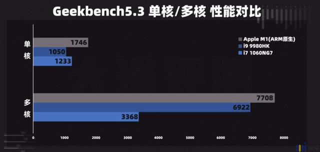

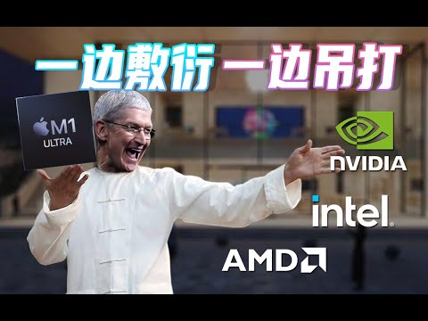

为什么M1能这么强:

1. 苹果的CPU设计团队很强
2. 苹果的钱很多
3. 苹果

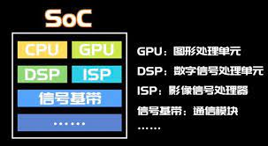

soc首先用在手机上

> 常见的soc: 
>
> 高通晓龙系列(垄断地位)(因为高通在手机领域有非常多的专利)
>
> 联发科天玑系列
>
> 苹果A系列
>
> 华为麒麟

5G基带: 高通、联发科、三星、华为

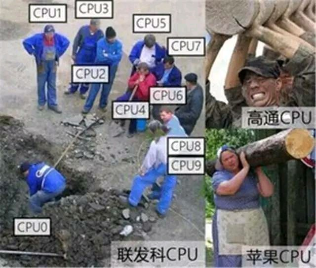

其实M1这款芯片就是苹果在iPhone13上面用的A14

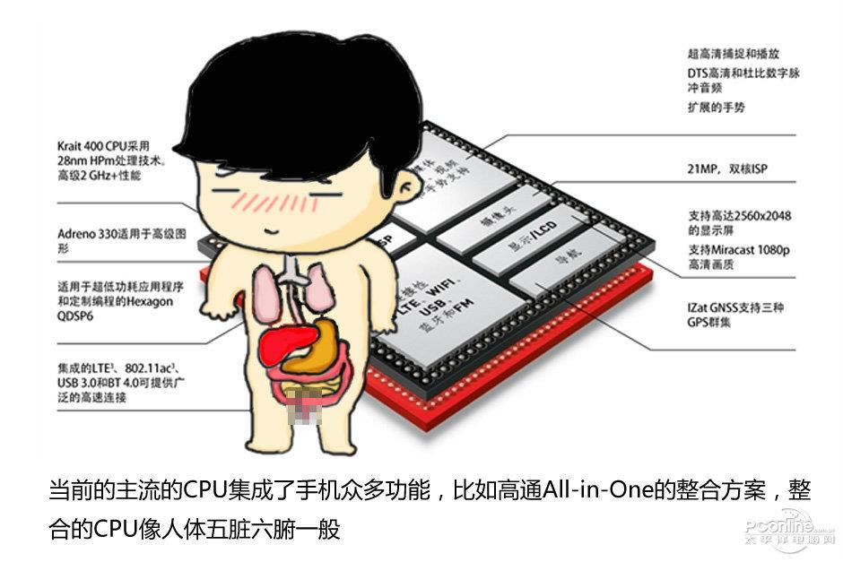

苹果市值

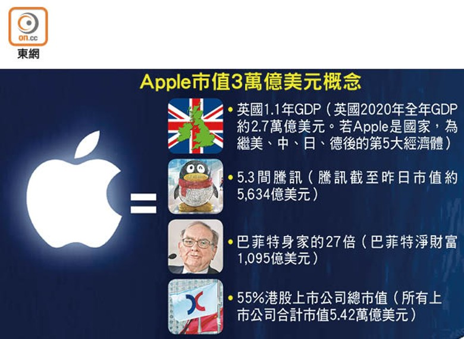

苹果收入来源

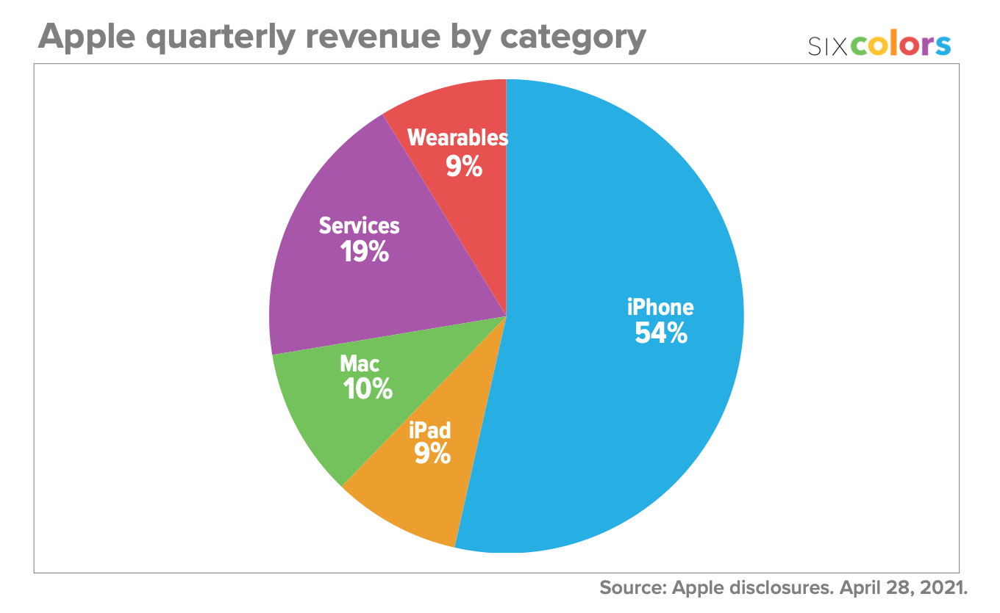

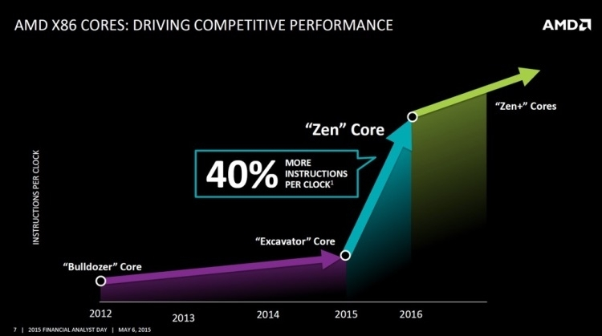

M1芯片实际上是在A14芯片(iphone12)的基础上进行

CPU生产:

1. 指令集( ARM)

> 通过统一指令集可以实现CPU的兼容性
>
> Windows系统为什么这么普遍, 显卡厂商, 声卡, 网卡厂商都提供了windows的驱动程序, 并封装到了Windows系统的iso镜像中
>
> window系统可以装在amd的cpu上也能装在英特尔的cpu上

> 自己装电脑可能会有的问题, 网卡没有驱动

1. CPU图纸 
2. 生产 (4nm 5nm)

全球有名的CPU厂商

电脑: Intel AMD

手机: 高通  苹果 华为

> 高通 苹果 华为的cpu都是基于ARM架构
>
> 华为因为美国打压无法用ARM指令集, 也无法生成

ARM是怎么赚钱的

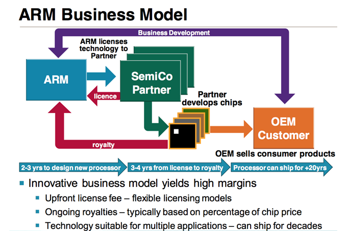

A14 晶体管 150亿

晓龙888 100亿

> 为什么 高通必须要压低成本来满足手机厂商的要求
>
> 苹果在CPU上面投入的高成本可以通过自己销售手机的利润来弥补(闭环)

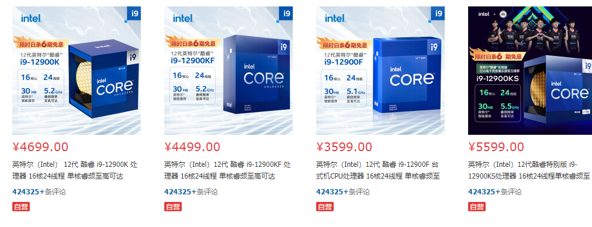

CISC: x86 x86-64(x64)

> 复杂指令集

RISC: ARM

> 精简指令集

> CISC一条指令可以执行非常复杂的操作, RISC指令比较简单, 需要多条指令来达到相同的复杂操作

CISC强调程序跑起来占用更小的内存(因为在计算机初期, 内存非常昂贵)

RISC强调用最少的指令来编写效率最高的程序(指令越简单越省电)

指令越复杂越耗电, 所以CISC留给程序的优化空间很少

> 编译器生成的机器码就是按照指令集生成

区别:RISC需要更多的内存(ARM), 这也是为什么现在的手机很容易卡的原因, 

电脑上面卡一般等一会就行, 因为是CPU繁忙

手机上面卡了一般整个app都会闪退, 因为内存占用过高(OOM)

全球手机市场

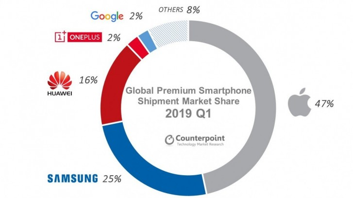

为什么华为会被美国打压

华为是全球销量排名第三的手机牌子

> 华为能自己设计CPU和基带

全球能生产5G基带的厂商只有五家

高通、三星、联发科、华为、紫光展锐

M1的核显

> 核显和独显

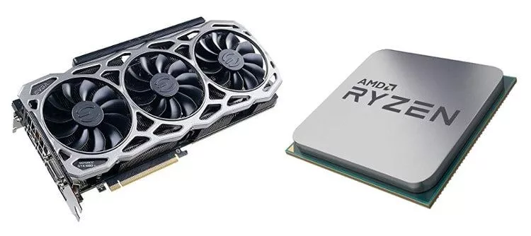

>M1 核显和独显RTX 3090的对比图

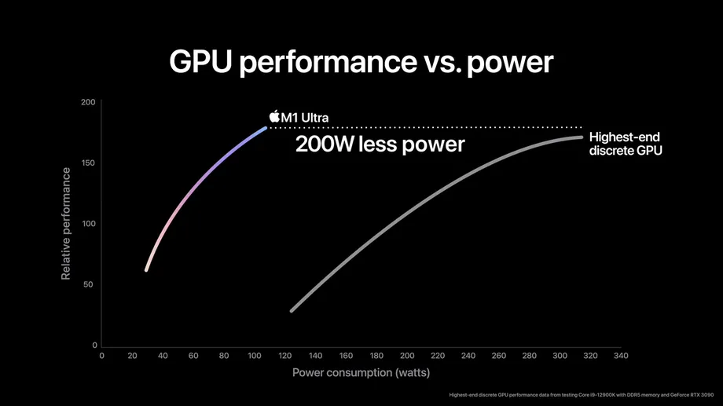

> 实际在不省电的情况下对比

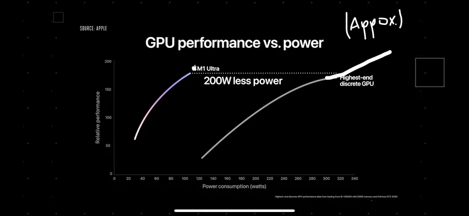

> 跑单机游戏古墓丽影的帧数对比

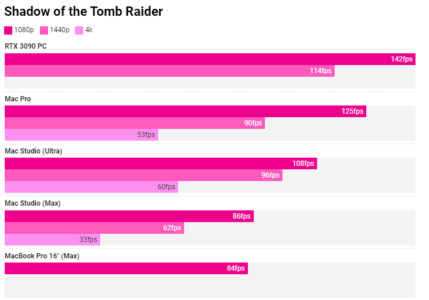

手机壳 电池 屏幕