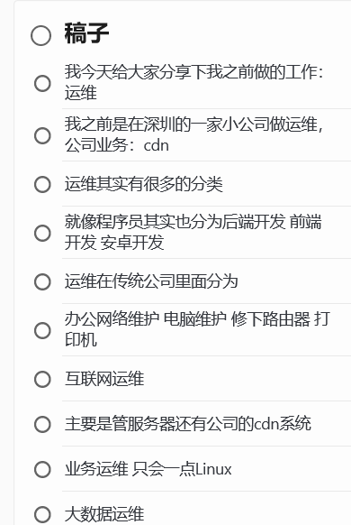
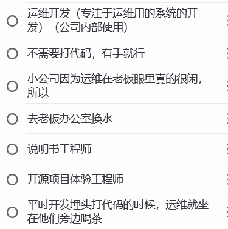
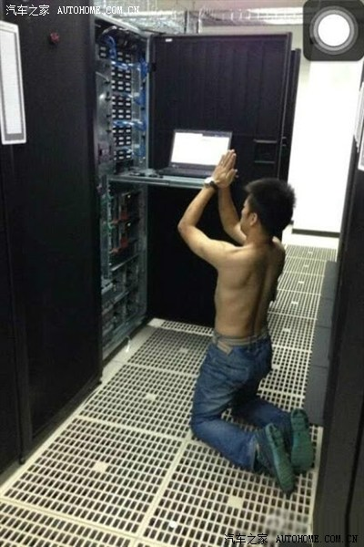
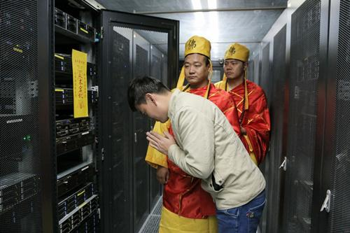

1. 运维是什么
   1. 运维就是负责维护服务器和系统的工
   2. 分类
      1. 桌面运维, 网络运维(网络规划)
      2. , 系统运维统称修电脑的
      3. 传统公司运维
         1. 网管(桌面运维)
            1. 职责: 管理电脑设备, 装软件, 电脑升级系统, 修网络
      4. 互联网运维
         1. 我的公司里面(CDN公司)
            1. 业务运维(SRE)
               1. 负责业务系统质量, 调优
            2. 运维开发(Dev OPS)
               1. 
            3. 大数据运维
               1. 管理大数据系统和集群
      5. 区别
   3. 工作技能
      1. 了解linux系统
         1. 工作职责就是保证系统稳定运行
      2. 
   4. 日常工作内容
   5. 运维的优点
      1. 很闲, 运维是自己给自己找活干(开发要对接产品经理)
      2. 朝10晚9, 双休
   6. 运维的缺点
      1. 技能很杂, 没有业务输出
      2. 背锅
         1. 只有系统出问题, 运维得第一个处理
         2. 消防员, 甩锅

2. 为什么不做运维了

   1. 24小时待命, 之前待得那家公司, 运维出门必须带着电脑(不管你是在洗澡 在睡觉 还是在约会)负责的那块业务出现了严重级别的问题,都需要立刻远程连上服务器去解决

      在大公司的运维

   2. 被裁员
      1. 开发岗位作为公司的核心一般是最后裁的

   3. 大部分的运维工作被云服务取代, 很卷
      1. 阿里云: 数据库的安装，部署。还有数据的恢复，监控，高可用，数据迁移，部分优化

深圳

# 运维

背锅侠 服务器重启工程师

运维轻松: 运维没有业务和产品经理的压力

不会被催进度

每天要做的事情就是看下公司的监控平台有没有问题, 看下邮箱有没有机房的网络割接要做

传统公司: 

运维分为SM(System Manager)系统管理员:

机器上下架

值夜班

监控显示: 整个机房大概有一百多台服务器都离线了

去到机房那里看服务器是没有问题的

路由器关机了, 按开机键

ups电源: 紧急电源

DBA:数据库 优化和备份

互联网CDN运维:

SRE(业务运维): to B 客户

403 404 499 打不开网站或者网站很卡

大数据平台查日志

故障工单, 甩锅

工作内容

1、日常巡检服务器,保证线上业务系统的稳定运行;

2、负责公司服务器告警信息的响应处理, 定位基础业务问题，优化处理效率

4、及时响应并处理线上系统运行过程中的异常情况 

5、对接机房运维, 负责服务器性能测试以及故障排查

6、编写脚本实现运维工作自动化(清理磁盘, 修复网络)

包括以上但不限于: 手机刷机，office教学，帮开发换鼠标键盘, 开会帮忙给PPT翻页，帮前台小姐姐搬月饼, 饮水机换水桶

> 晚上会被电话叫醒, 网站的延迟很高 某个运维系统挂了

网络运维:

高级云运维: 

大数据运维:

开发运维:

实施运维

公司裁员:

前台 运营 行政 hr 运维 产品

前端开发和后端开发一个都没有裁员

互联网公司裁员, 其实程序员比例很小, 大部分都是(运营 hr)非技术岗位

开发

> 有个前同事是在数据中心做机房运维, 经常要搬上百斤的服务器

