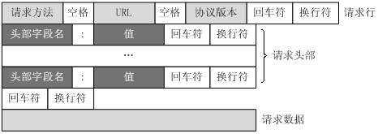
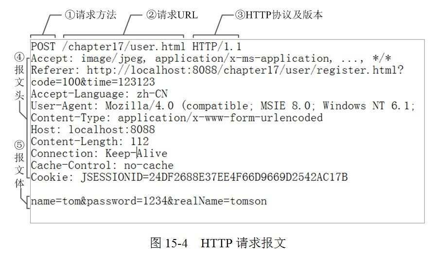
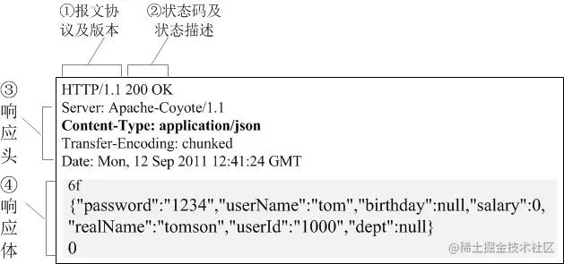
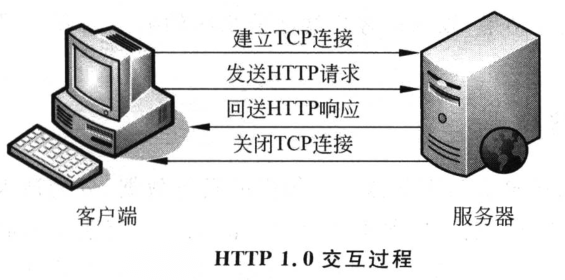
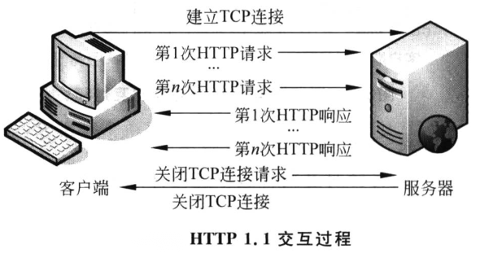
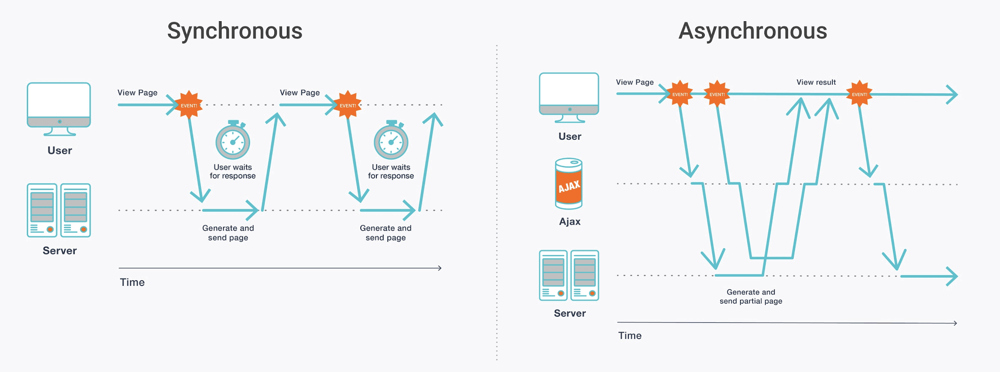

# 面试题_8_2

## HTTP通讯协议分为几个部分？请求协议的组成？

HTTP协议分为http请求和http响应

请求报文有四个部分

1. 请求行（request line）：包含 请求方法类型, 请求的资源地址, http协议版本
2. 请求头：包含多个标头(header)字段
3. 空行
4. 请求体：正文/主体（GET方法没有body, 但是可以利用url参数传递数据）

> 请求报文结构



> 请求报文示例



> 响应报文示例



> 请求行信息

**请求方法**(http method)有九种:GET POST PUT HEAD DELETE PATCH OPTIONS CONNECT TRACE

常用请求方式

| 请求方式 | 作用                                    |
| -------- | --------------------------------------- |
| GET      | 获取uri对应的资源                       |
| POST     | 向uri对应的接口提交数据, 交给服务器处理 |
| PUT      | 修改对应路径的资源                      |
| DELETE   | 请求删除uri对应的资源                   |
| TRACE    | 常用于前端调试                          |

**http版本** 目前的主流版本是1.1

1.0和1.1的区别:

1.0一个连接只能进行一次http通信

1.1一个连接可以进行多次http通信(持久连接)



> 1.1



> GET和POST的区别

| GET                                                          | POST                            |
| ------------------------------------------------------------ | ------------------------------- |
| reload不影响服务器                                           | reload会导致数据被重复发送      |
| 可以被浏览器缓存                                             | 从不缓存                        |
| 用户在地址栏输入url会默认使用GET方法                         |                                 |
| 会保存到浏览器历史记录                                       | 不会被历史记录保存              |
| 数据有长度限制(因为get请求的数据是直接加到url上, url长度限制为2048) | 数据无长度限制                  |
| 用于请求数据返回                                             | 用于发送数据到服务器            |
| 数据必须是使用ASCII编码的字符                                | 可以发送二进制文件              |
| 明文使用url发送, 不安全                                      | 发送数据不会显示在url中, 较安全 |

> header(标头)类型

header分为四种: 常规标头	 请求标头	响应标头	实体标头

每个header都由字段和值组成, 类似于键值对的结构

| 字段           | 作用                                                     |
| -------------- | -------------------------------------------------------- |
| Accept         | 浏览器支持的数据类型                                     |
| Accept-Charset | 浏览器支持的编码                                         |
| Host           | 客户端想要访问的服务器IP和端口(未指定端口会使用默认端口) |
| Referer        | 浏览器从哪个页面跳转过来                                 |
| User-Agent     | 用户的标识信息(浏览器版本 操作系统版本)                  |
| Cookie         | 一般缓存在浏览器中, 用于身份验证                         |
| Cache-Control  | 浏览器的缓存控制机制                                     |
| Connection     | 是否需要在请求完成后关闭连接                             |

## Ajax怎么实现同步？

ajax同步是指向服务器发送请求后一直等待接收到响应后处理完再继续往下执行代码

异步是指向服务器发送请求后继续向下执行代码, 直到接收到服务器的响应再处理



Ajax默认是以异步的形式执行请求

> js实现同步ajax

```js
var req = new XMLHttpRequest();  
//使用false参数指定ajax以同步方式处理响应
req.open("POST", "example.php”, false); 
req.send();
```

> jquery实现同步ajax

```js
var sync_request = $.ajax({
      url: "example.php",
    //async:false指定以同步方式处理响应
      async: false,
      success: function(data){
           //response script here
     }
});
```

> vue实现同步ajax

```js
new Vue({
		methods:{
            //async修饰对应的函数
			async listData(){
                //配置await关键字, 可以确保只有等到被修饰的函数执行完毕才会执行下一步
				var res = await axios.post(xxxx)
				let data = res.data
				console.log(res)
			}
		}
	})
```

## XML与JSON之间的区别？

Json是一种源自于JavaScript的数据交换格式

XML是一种标记语言, 通常会定义一组规则来对xml文档解码(类似于HTML)

> 两者的区别

| JSON               | XML                                |
| ------------------ | ---------------------------------- |
| 一种数据格式       | 一种标记语言                       |
| 源自于JavaScript   | 源自于 SGML(通用标记语言)          |
| js支持             | js不支持                           |
| 用于展示数据(对象) | 用于传输数据                       |
| 支持数组           | 不支持数组                         |
| 不支持命名空间     | 支持命名空间(namespace)            |
| 不支持注释         | 支持注释   <!--注释-->             |
| 不需要结束标记     | 需要有开始和结束标签               |
| 可读性高           | 可读性低, 因为是设计给机器读取的   |
| 不安全             | 更安全(需要有对应的规则来解读文档) |
| 只支持UTF-8编码    | 支持多种编码                       |

